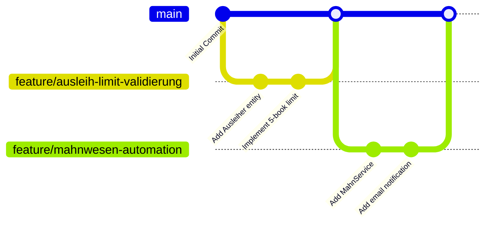
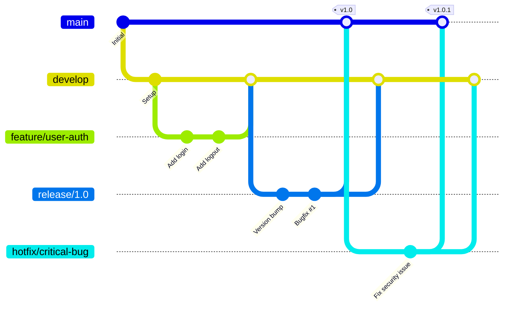
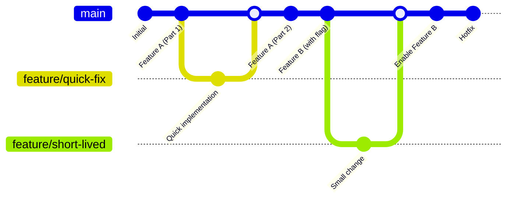
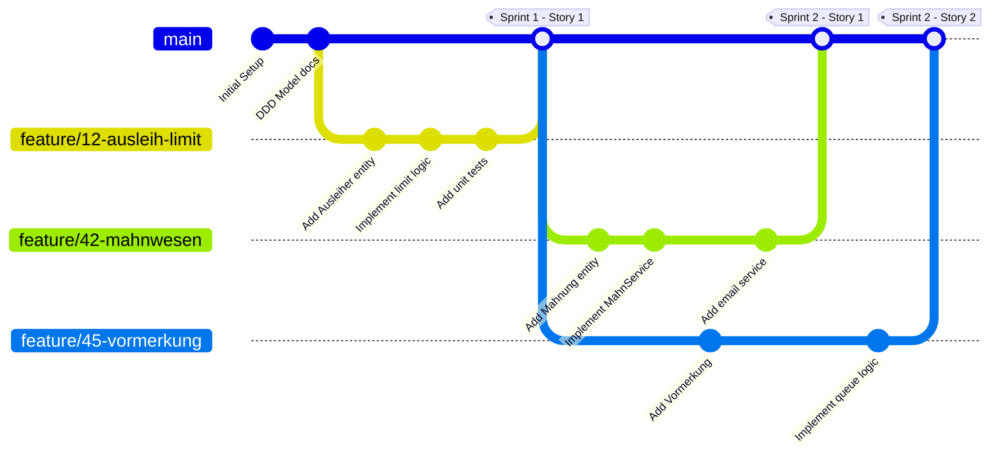
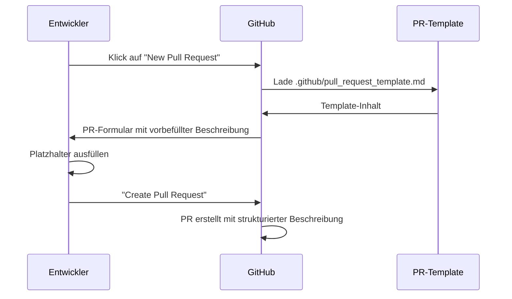
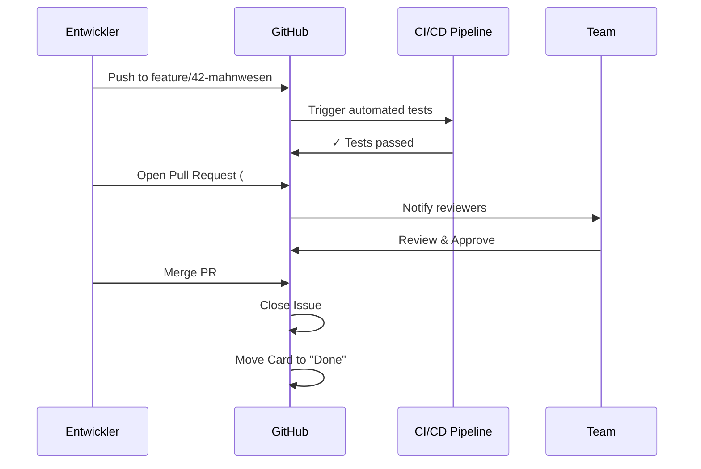

# 7 GitHub im agilen Projekt — Setup und Workflow mit Scrumban

In modernen Softwareentwicklungsprojekten wie unserem Schulbibliotheks-System stehen Agilität, kontinuierliche Integration und kollaboratives Arbeiten im Mittelpunkt. GitHub bietet mit seinen Funktionen wie Repositories, Branching, Issues, Pull Requests, Projects (Boards) und Automatisierungen ein integriertes Ökosystem, das agile Methoden wirkungsvoll unterstützen kann. Dieses Kapitel zeigt, wie GitHub bei einem agilen oder hybriden Vorgehen wie Scrumban eingerichtet und praktisch eingesetzt werden kann — von Projektstart über den täglichen Workflow bis zur kontinuierlichen Lieferung und Qualitätssicherung.

> <span style="font-size: 1.5em">:bulb:</span> **Merksatz:** GitHub ist mehr als nur ein Versionskontrollsystem – es ist eine integrierte Plattform für agile Zusammenarbeit, die Issues, Boards, Code Reviews, Automatisierung und Dokumentation unter einem Dach vereint.

## 7.1 Projektstart und Setup

Bevor wir mit der Entwicklung des Schulbibliotheks-Systems beginnen, müssen wir die Grundlagen für eine effiziente Zusammenarbeit schaffen. Der Projektstart auf GitHub umfasst mehrere wichtige Schritte, die wir im Folgenden detailliert betrachten.

### 7.1.1 Repository-Erstellung und Struktur

Zu Projektbeginn legen wir auf GitHub ein neues Repository für unser Schulbibliotheks-System an. Die Wahl einer durchdachten Ordnerstruktur ist entscheidend für die langfristige Wartbarkeit des Projekts.

**Beispiel Schulbibliothek:**
Für unser Projekt mit Clean Architecture könnten wir folgende Verzeichnisstruktur wählen:

```
schulbibliothek/
├── docs/                           # Dokumentation
│   ├── architecture/               # Architekturdiagramme und -beschreibungen
│   ├── api/                        # API-Spezifikationen (OpenAPI/Swagger)
│   └── user-stories/               # User Stories und Anforderungen
├── src/
│   ├── main/
│   │   ├── java/
│   │   │   └── com/schule/bibliothek/
│   │   │       ├── domain/         # Core Domain (Ausleih-Kontext)
│   │   │       │   ├── entities/   # Ausleiher, AusleihExemplar
│   │   │       │   ├── valueobjects/ # ISBN, Signatur, Rückgabedatum
│   │   │       │   └── services/   # MahnService
│   │   │       ├── application/    # Application Services / Use Cases
│   │   │       ├── infrastructure/ # Repositories, Datenbank, JPA
│   │   │       └── presentation/   # REST Controller, DTOs
│   │   └── resources/
│   │       ├── application.yml     # Spring Boot Konfiguration
│   │       └── db/migration/       # Flyway/Liquibase Migrations
│   └── test/
│       ├── java/                   # Tests
│       │   └── com/schule/bibliothek/
│       │       ├── unit/           # Unit Tests
│       │       ├── integration/    # Integration Tests
│       │       └── e2e/            # End-to-End Tests
│       └── resources/
│           └── application-test.yml
├── pom.xml                         # Maven Build-Konfiguration
└── .github/
    └── workflows/                  # GitHub Actions für CI/CD
```

> <span style="font-size: 1.5em">🔧</span> **Praxis-Tipp:** Die Ordnerstruktur sollte die gewählte Software-Architektur widerspiegeln. Bei Clean Architecture trennen wir klar zwischen `domain`, `application`, `infrastructure` und `presentation`, was die Bounded Contexts aus unserem DDD-Modell (siehe Kapitel 4.1) direkt im Code sichtbar macht. Die Standard-Maven-Struktur mit `src/main/java` und `src/test/java` wird dabei beibehalten.

Git bzw. GitHub basiert auf verteilten Versionskontrollsystemen (DVCS). Jeder Entwickler hat eine vollständige Historie lokal, was Unabhängigkeit und Backup gleichzeitig gewährleistet.


## 7.2 Nutzung von Projects, Issues und Milestones in GitHub

### 7.2.1 Einrichtung des GitHub Project Boards (Schritt-für-Schritt)

Um unser Scrumban-Board in GitHub einzurichten, nutzen wir die modernen **GitHub Projects** (Projects V2).

1.  **Projekt erstellen:**
    *   Navigieren Sie in Ihrem Repository zum Reiter **"Projects"**.
    *   Klicken Sie auf **"New project"** (oder "Link a project" → "New project").
    *   Wählen Sie das Template **"Board"** aus.
    *   Geben Sie dem Projekt einen Namen, z.B. "Schulbibliothek Entwicklung".

2.  **Spalten (Status) konfigurieren:**
    *   Standardmäßig erhalten Sie oft "Todo", "In Progress", "Done".
    *   Wir passen diese an unseren Workflow an:
        *   Klicken Sie auf die Spaltenüberschriften oder gehen Sie in die **Settings** (Zahnrad-Icon) → **Fields** → **Status**.
        *   Ergänzen/Bearbeiten Sie die Optionen:
            *   **Backlog** (ganz links, Farbe: Grau)
            *   **To Do** (Farbe: Rot)
            *   **In Progress** (Farbe: Gelb)
            *   **Code Review** (Farbe: Blau)
            *   **Testing** (Farbe: Lila)
            *   **Done** (Farbe: Grün)

3.  **Custom Fields hinzufügen:**
    *   Für unsere Planung benötigen wir mehr als nur den Status.
    *   Klicken Sie in der Tabellenansicht (oder in Settings) auf das **"+"** (New Field).
    *   Erstellen Sie folgende Felder:
        *   **Priority:** (Single select) Optionen: `High` 🔴, `Medium` 🟡, `Low` 🟢.
        *   **Story Points:** (Single Select) Für die Aufwandsschätzung (Fibonacci: 1, 2, 3, 5, 8, 13).
        *   **Bounded Context:** (Single select) Optionen: `Ausleih`, `Anschaffung`, `Nutzerprofil`.

### 7.2.2 Automatisierung der Workflows (Built-in Workflows)

Damit wir Karten nicht ständig manuell verschieben müssen, konfigurieren wir die integrierten Workflows.

1.  **Workflow-Menü öffnen:**
    *   Klicken Sie im Projekt oben rechts auf das Icon **"Workflows"** (sieht aus wie ein Prozess-Diagramm <span style="font-size: 1.2em">⚡</span>).

2.  **Standard-Workflows aktivieren:**
    *   **Item added to project:** Stellen Sie sicher, dass neue Items automatisch in **"Backlog"** oder **"To Do"** landen.
    *   **Code Review:**
        *   Wählen Sie den Workflow **"Auto-move to Code Review"** (oder erstellen Sie einen neuen).
        *   *When:* **Pull Request** is **opened** or **reopened**.
        *   *Set Status to:* **Code Review**.
    *   **Done:**
        *   Wählen Sie den Workflow **"Auto-close issue"** oder **"Auto-move to Done"**.
        *   *When:* **Pull Request** is **merged**.
        *   *Set Status to:* **Done**.

3.  **Verknüpfung Repository ↔ Projekt:**
    *   Damit Issues automatisch auf dem Board landen, können Sie den "Auto-add to project" Workflow nutzen.
    *   *When:* **Issue** is **opened** in repository `schule/bibliothek`.
    *   *Filter:* (Optional, z.B. nur mit Label `bug` oder `feature`).
    *   *Action:* Add to project.

> <span style="font-size: 1.5em">🔧</span> **Praxis-Tipp:** Nutzen Sie die **"Roadmap"**-Ansicht (Gantt-Chart) im gleichen Projekt, um Issues basierend auf Start- und Enddatum zu visualisieren. Dies ist perfekt für die langfristige Planung von Milestones.

### 7.2.3 GitHub `Issues` als zentrale ToDos

Issues dienen als zentrale Aufgabenverwaltung. Für die Schulbibliothek verwenden wir Issues für:
- **User Stories:** Direkt aus Workshop-Ergebnissen (Kapitel 3.3.3)
- **Technische Tasks:** Z.B. "Implement AusleihExemplarRepository interface"
- **Bugs:** Fehler im Code
- **Refactoring:** Verbesserung der Codestruktur/Architektur
- **Enhancements:** Erweiterung/Ergänung/Verbesserung bestehender Features
- **Dokumentation:** Fehlende oder zu aktualisierende Dokumentation

#### **Praktische Anleitung: Issues in GitHub erstellen**

Ein Issue in GitHub zu erstellen ist einfach und strukturiert:

**Schritt-für-Schritt Anleitung:**

1. **Navigation zum Repository:** 
   - Öffnen Sie Ihr Repository auf GitHub
   - Klicken Sie auf den Tab **"Issues"** in der oberen Navigationsleiste

2. **Neues Issue erstellen:**
   - Klicken Sie auf den grünen Button **"New issue"**
   - Falls Issue-Templates definiert sind, erscheint eine Auswahl (siehe nächster Abschnitt)
   - Ohne Templates gelangen Sie direkt zum Issue-Formular

3. **Issue-Formular ausfüllen:**
   - **Titel:** Kurz und prägnant (z.B. "Ausleihlimit-Validierung implementieren")
   - **Beschreibung:** Detaillierte Erklärung mit Markdown-Formatierung
   - **Labels zuweisen:** Kategorisierung (bug, feature, priority-high, etc.)
   - **Milestone zuordnen:** Optional einem Release oder Sprint zuordnen
   - **Assignees:** Personen zuweisen, die verantwortlich sind
   - **Projects:** Issue einem GitHub Project Board hinzufügen

4. **Issue erstellen:**
   - Klicken Sie auf **"Submit new issue"**
   - Das Issue erhält automatisch eine Nummer (z.B. #23)

**Beispiel-Issue für User Story:**
```markdown
Titel: [User Story] Buchsuche mit Verfügbarkeitsprüfung

Labels: user-story, ausleih-kontext, frontend

## User Story
Als **Schüler** möchte ich online die Verfügbarkeit eines Buches prüfen können, 
um zu wissen, ob es sich lohnt, zur Bibliothek zu gehen.

## Akzeptanzkriterien
- [ ] Suche nach Titel möglich
- [ ] Suche nach Autor möglich
- [ ] Anzeige des Verfügbarkeitsstatus (verfügbar/ausgeliehen/vorgemerkt)
- [ ] Anzeige des Standorts (Signatur)
- [ ] Bei ausgeliehenen Büchern: Anzeige des voraussichtlichen Rückgabedatums

## Technische Hinweise
- Betrifft `Ausleih-Kontext` und `Anschaffungs-Kontext`
- `AusleihExemplar` für Verfügbarkeit
- `BuchkatalogEintrag` für Titel/Autor-Suche
- Siehe DDD-Modell: Kapitel 4.1.5.4

## Aufwandsschätzung
Story Points: 5
```

### 7.2.4 Issue-Templates definieren

Issue-Templates standardisieren die Erstellung von Issues und stellen sicher, dass alle wichtigen Informationen erfasst werden. Sie sparen Zeit und verbessern die Qualität der Dokumentation.

#### **Einrichtung von Issue-Templates:**

**Methode 1: Über die GitHub-Oberfläche (empfohlen für Einsteiger)**

1. Navigieren Sie zu Ihrem Repository
2. Klicken Sie auf **"Settings"** → **"Features"** → **"Issues"**
3. Klicken Sie auf **"Set up templates"**
4. Wählen Sie ein vordefiniertes Template (Bug Report, Feature Request) oder erstellen Sie ein eigenes
5. Passen Sie das Template im Editor an
6. Klicken Sie auf **"Propose changes"** und committen Sie die Änderungen

**Methode 2: Manuelle Erstellung im Repository**

Templates werden im Verzeichnis `.github/ISSUE_TEMPLATE/` gespeichert. 

#### **Unterstützte Formate für Issue-Templates in GitHub**

GitHub unterstützt zwei Template-Formate:

**Format 1: Markdown-Templates mit YAML-Frontmatter**

Jedes Template ist eine Markdown-Datei mit YAML-Frontmatter zur Konfiguration.

**Struktur eines Markdown-Templates:**

```yaml
---
name: Template-Name
about: Kurzbeschreibung des Templates
title: "[Präfix] "
labels: label1, label2
assignees: username
---

# Template-Inhalt in Markdown

Hier können Sie Platzhalter, Checkboxen und Beschreibungen einfügen.
```

**Beispiel Markdown-Template für User Stories** (`.github/ISSUE_TEMPLATE/user-story.md`):

```markdown
---
name: 📖 User Story
about: Neue User Story für Feature-Entwicklung
title: "[User Story] "
labels: user-story, needs-refinement
assignees: ''
---

## User Story

Als **[Rolle]** möchte ich **[Ziel/Wunsch]**, um **[Nutzen]**.

## Akzeptanzkriterien

- [ ] Kriterium 1
- [ ] Kriterium 2
- [ ] Kriterium 3

## Betroffener Bounded Context

- [ ] Ausleih-Kontext (Core Domain)
- [ ] Anschaffungs-Kontext (Supporting)
- [ ] Nutzerprofil-Kontext (Generic)
- [ ] Infrastruktur

## Technische Hinweise

<!-- Technische Details, betroffene Komponenten, Architekturschichten -->

## Aufwandsschätzung

Story Points: <!-- 1, 2, 3, 5, 8, 13 -->

## Abhängigkeiten

<!-- Optional: Verweise auf andere Issues mit #Nummer -->
```

**Format 2: YAML-basierte Issue-Forms**

GitHub unterstützt auch **Issue-Forms** für eine strukturiertere Eingabe mit Dropdown-Menüs, Checkboxen und Pflichtfeldern.

**Beispiel Issue-Form** (`.github/ISSUE_TEMPLATE/user-story.yml`):

```yaml
name: 📖 User Story
description: Neue User Story für Feature-Entwicklung
title: "[User Story] "
labels: ["user-story", "needs-refinement"]
body:
  - type: markdown
    attributes:
      value: |
        Vielen Dank für das Einreichen einer User Story!
        
  - type: textarea
    id: user-story
    attributes:
      label: User Story
      description: Beschreiben Sie die User Story im Format "Als [Rolle] möchte ich [Ziel], um [Nutzen]"
      placeholder: Als Schüler möchte ich Bücher online suchen können, um verfügbare Bücher zu finden ohne zur Bibliothek zu gehen.
    validations:
      required: true
      
  - type: textarea
    id: acceptance-criteria
    attributes:
      label: Akzeptanzkriterien
      description: Listen Sie die Akzeptanzkriterien auf
      placeholder: |
        - Suche nach Titel möglich
        - Suche nach Autor möglich
        - Anzeige der Verfügbarkeit
    validations:
      required: true
      
  - type: dropdown
    id: bounded-context
    attributes:
      label: Betroffener Bounded Context
      options:
        - Ausleih-Kontext (Core Domain)
        - Anschaffungs-Kontext (Supporting)
        - Nutzerprofil-Kontext (Generic)
        - Infrastruktur
    validations:
      required: true
      
  - type: dropdown
    id: story-points
    attributes:
      label: Story Points
      description: Geschätzter Aufwand
      options:
        - "1"
        - "2"
        - "3"
        - "5"
        - "8"
        - "13"
        - "21"
    validations:
      required: false
      
  - type: textarea
    id: technical-notes
    attributes:
      label: Technische Hinweise
      description: Optional - technische Details oder Implementierungshinweise
      placeholder: Betrifft AusleihExemplar-Aggregat und BuchkatalogEintrag
    validations:
      required: false
```

**Vergleich: Markdown-Templates vs. YAML-basierte Issue-Forms**

| Kriterium | Markdown-Templates (.md) | YAML-basierte Issue-Forms (.yml) |
|-----------|-------------------------|----------------------------------|
| **Flexibilität** | Sehr hoch - freies Markdown | Strukturiert durch vordefinierte Feldtypen |
| **Validierung** | Keine - Nutzer kann alles ändern/löschen | Pflichtfelder und Dropdown-Validierung möglich |
| **Benutzerfreundlichkeit** | Einfach für erfahrene Nutzer | Geführte Eingabe für alle Nutzer |
| **Feldtypen** | Nur Freitext | Textarea, Dropdown, Checkboxen, Input |
| **Konsistenz** | Abhängig von Nutzer-Disziplin | Erzwungen durch Formular-Struktur |
| **Komplexität** | Einfache YAML-Frontmatter + Markdown | Komplexere YAML-Syntax erforderlich |
| **Anwendungsfall** | Teams mit hoher Eigenverantwortung | Teams, die strikte Eingabeformate benötigen |
| **Migration** | Einfach zu erstellen und bearbeiten | Erfordert YAML-Kenntnisse |

> <span style="font-size: 1.5em">💡</span> **Best Practice:** Beginnen Sie mit Markdown-Templates für schnelle Einführung und wechseln Sie zu YAML-basierten Issue-Forms, wenn Sie strengere Validierung und konsistentere Eingaben benötigen. Beide Formate können parallel im selben Repository verwendet werden.

### 7.2.5 Verwalten der Template-Konfiguration und Verwendung der Templates

Sie können auch eine zentrale Konfigurations-Datei erstellen, um das Verhalten der Issue-Templates anzupassen:

`.github/ISSUE_TEMPLATE/config.yml`:

```yaml
blank_issues_enabled: false  # Deaktiviert Issues ohne Template
contact_links:
  - name: 📚 Dokumentation
    url: https://github.com/schule/bibliothek/wiki
    about: Bitte prüfen Sie zuerst unsere Dokumentation
  - name: 💬 Diskussionen
    url: https://github.com/schule/bibliothek/discussions
    about: Für Fragen nutzen Sie bitte die Discussions
```

#### **Verwendung von Issue-Templates im Team:**

Nach der Einrichtung funktioniert die Nutzung wie folgt:

1. **Issue erstellen:** Team-Mitglied klickt auf "New issue"
2. **Template auswählen:** Übersicht aller verfügbaren Templates erscheint
3. **Template nutzen:** Gewähltes Template öffnet sich mit vorgefertigter Struktur
4. **Ausfüllen:** Platzhalter durch konkrete Informationen ersetzen
5. **Anpassen:** Bei Bedarf Struktur modifizieren (nicht alle Felder sind Pflicht)
6. **Einreichen:** Issue mit ausgefülltem Template erstellen

#### Milestones für Release-Planung

Über Milestones lassen sich große Ziele oder Releases planen — ideal für Release-Zyklen:
- **Milestone 1.0:** Basis-Ausleihfunktionen
  - Buch ausleihen
  - Buch zurückgeben
  - Ausleihlimit-Validierung
- **Milestone 1.1:** Erweiterte Funktionen
  - Vormerkungssystem
  - Mahnwesen
- **Milestone 2.0:** Anschaffungs-Integration
  - Bestellsystem
  - Lieferantenverwaltung

## 7.3 Agiler Arbeitsfluss im Projekt

Nachdem die Grundstruktur steht, etablieren wir einen kontinuierlichen, agilen Workflow, der GitHub optimal nutzt.

### Branching-Strategie festlegen

Die Wahl der richtigen Branching-Strategie ist entscheidend für den Projekterfolg. Sie beeinflusst, wie das Team zusammenarbeitet, wie schnell Features integriert werden und wie komplex die Verwaltung des Codes ist. Im Folgenden stellen wir drei etablierte Branching-Strategien vor und erläutern, wann welche Strategie am besten geeignet ist.

#### Übersicht: Drei etablierte Branching-Strategien

**1. GitHub Flow**

GitHub Flow ist eine schlanke, einfache Branching-Strategie, die sich ideal für kontinuierliche Deployment-Prozesse eignet. Sie basiert auf einem einzigen Haupt-Branch und kurzlebigen Feature-Branches.

**Branch-Struktur:**
- **`main`**: Enthält immer den stabilen, deploybaren Code
- **`feature/*`**: Für jede neue Funktion wird ein eigener Branch erstellt
- **Keine** zusätzlichen Branches für Releases oder Hotfixes



**Workflow:**
1. Neuer Feature-Branch von `main` erstellen
2. Entwicklung im Feature-Branch
3. Pull Request öffnen für Code-Review
4. Nach Approval: Merge in `main`
5. Automatisches Deployment von `main`

**Wann GitHub Flow verwenden:**
- ✓ **Kontinuierliche Deployments** (mehrmals pro Woche/Tag)
- ✓ **Web-Anwendungen und SaaS-Produkte**
- ✓ **Kleine bis mittlere Teams** (2-10 Entwickler)
- ✓ **Einfache Prozesse** bevorzugt
- ✓ **Schnelles Feedback** gewünscht

**Wann NICHT GitHub Flow verwenden:**
- ✗ **Mehrere parallele Versionen** müssen gepflegt werden
- ✗ **Geplante Release-Termine** (z.B. quartalsweise)
- ✗ **App-Store-Releases** mit langen Review-Prozessen

> <span style="font-size: 1.5em">:warning:</span> **Achtung bei GitHub Flow:** Vermeiden Sie lange existierende Feature-Branches! Je länger ein Branch von `main` getrennt ist, desto schwieriger wird das spätere Mergen. Features sollten klein gehalten und regelmäßig (mindestens wöchentlich) integriert werden.

**2. Git Flow**

Git Flow ist eine umfangreichere Branching-Strategie, die für Projekte mit geplanten Release-Zyklen konzipiert wurde. Sie definiert verschiedene Branch-Typen mit klaren Rollen und einer festen Hierarchie.

**Branch-Struktur:**
- **`main`**: Produktions-Code, immer stabil und deployed
- **`develop`**: Integrations-Branch für Features, Basis für nächsten Release
- **`feature/*`**: Feature-Entwicklung, wird in `develop` gemerged
- **`release/*`**: Release-Vorbereitung (Bugfixes, Versionierung, Dokumentation)
- **`hotfix/*`**: Dringende Production-Fixes, direkt von `main` abgezweigt



**Wann Git Flow verwenden:**
- ✓ **Geplante Release-Zyklen** (z.B. monatliche/quartalsweise Releases)
- ✓ **Mehrere Versionen parallel** (Support für v1.x und v2.x gleichzeitig)
- ✓ **Strikte Qualitätskontrolle** vor Production-Deployment
- ✓ **Größere Teams** mit klarer Rollenverteilung
- ✓ **Software mit klassischer Auslieferung** (keine kontinuierliche Deployment)

**Wann NICHT Git Flow verwenden:**
- ✗ **Continuous Deployment**: Zu komplex für häufige Deployments
- ✗ **Kleine Teams**: Overhead durch viele Branches
- ✗ **Web-Apps mit rollenden Releases**: GitHub Flow ist besser geeignet

> <span style="font-size: 1.5em">💡</span> **Praxis-Tipp:** Git Flow eignet sich hervorragend für Desktop-Software oder Mobile Apps mit App-Store-Releases, wo die Veröffentlichung geplant und kontrolliert erfolgen muss. Die klare Trennung zwischen `develop` und `main` ermöglicht parallele Arbeit an neuen Features während Release-Vorbereitungen laufen.

**3. Trunk-Based Development**

Trunk-Based Development ist eine minimalistische Strategie, die auf schnelle Integration und kontinuierliches Deployment setzt. Sie reduziert Branch-Komplexität auf ein Minimum und fördert häufige Commits auf den Haupt-Branch.

**Kernprinzipien:**
- **Ein Haupt-Branch**: `main` (oder `trunk`) ist der zentrale Entwicklungsstrang
- **Sehr kurze Feature-Branches**: Maximal 1-2 Tage Lebensdauer (optional)
- **Direkte Commits auf `main`**: Erfahrene Teams committen direkt auf `main`
- **Häufige Integration**: Mindestens täglich Commits auf `main`
- **Feature Flags**: Unfertige Features werden per Flag im Code deaktiviert
- **Umfangreiche Automatisierung**: CI/CD mit schnellen, umfassenden Tests



**Wann Trunk-Based Development verwenden:**
- ✓ **Continuous Deployment**: Mehrmals täglich in Production deployen
- ✓ **Kleine, erfahrene Teams**: Hohe Disziplin und Code-Qualität erforderlich
- ✓ **Microservices**: Jeder Service kann unabhängig deployed werden
- ✓ **Hohe Test-Automatisierung**: Schnelle Feedback-Loops essentiell
- ✓ **Experimentelle Features**: Feature Flags ermöglichen schrittweisen Rollout

**Wann NICHT Trunk-Based Development verwenden:**
- ✗ **Unerfahrene Teams**: Risiko von broken builds ist hoch
- ✗ **Langsame CI/CD-Pipeline**: Ohne schnelles Feedback zu riskant
- ✗ **Komplexe, langfristige Features**: Schwierig mit Feature Flags zu managen
- ✗ **Strikte Compliance-Anforderungen**: Weniger Review-Kontrolle

> <span style="font-size: 1.5em">⚡</span> **Best Practice:** Trunk-Based Development erfordert exzellente Test-Abdeckung (>90%), automatisierte Qualitätschecks und hohe Team-Disziplin. Feature Flags sind essentiell, um unfertige Features zu verstecken. Diese Strategie wird von High-Performance-Teams wie Google, Facebook und Netflix eingesetzt.

#### **Vergleich der Branching-Strategien**

Die folgende Tabelle fasst die wichtigsten Unterschiede zusammen und hilft bei der Entscheidungsfindung:

| Kriterium | GitHub Flow | Git Flow | Trunk-Based Development |
|-----------|-------------|----------|------------------------|
| **Komplexität** | Niedrig | Hoch | Sehr niedrig |
| **Branch-Anzahl** | Mittel (2-5 aktive) | Hoch (5-15 aktive) | Minimal (0-3 aktive) |
| **Release-Zyklus** | Kontinuierlich | Geplant (Wochen/Monate) | Kontinuierlich (mehrmals täglich) |
| **Team-Größe** | Klein-Mittel (2-10) | Mittel-Groß (5-20+) | Klein (2-8, erfahren) |
| **Integration-Frequenz** | Wöchentlich | Bei Release-Vorbereitung | Täglich/Stündlich |
| **Deployment-Geschwindigkeit** | Schnell (Stunden-Tage) | Langsam (Wochen) | Sehr schnell (Minuten-Stunden) |
| **Lernkurve** | Flach | Steil | Mittel (Disziplin erforderlich) |
| **Code-Review-Pflicht** | Ja (Pull Requests) | Ja (Pull Requests) | Optional (Pair Programming) |
| **Hotfix-Handling** | Direkt in `main` | Eigener `hotfix/*`-Branch | Direkt in `main` |
| **Geeignet für** | Web-Apps, SaaS, APIs | Enterprise, Mobile Apps, Desktop | Microservices, Cloud-native, Startups |
| **Risiko bei Fehler** | Mittel | Niedrig (Isolation) | Hoch (direkt in Production) |
| **Overhead** | Niedrig | Hoch | Sehr niedrig |

#### Entscheidung für die Schulbibliothek: GitHub Flow

Nach Betrachtung aller drei Strategien wählen wir für unser Schulbibliotheks-Projekt **GitHub Flow** als Branching-Strategie. Diese Entscheidung basiert auf mehreren projektspezifischen Faktoren:

**Warum GitHub Flow für die Schulbibliothek optimal ist:**

**1. Team-Zusammensetzung (Schüler-Team):**
- ✓ Einfach zu erlernen und zu verstehen
- ✓ Keine komplexen Branch-Hierarchien wie bei Git Flow
- ✓ Klare Regeln: Feature-Branch → Pull Request → Review → Merge
- ✓ Schneller Onboarding-Prozess für neue Team-Mitglieder

**2. Projektgröße und -typ:**
- ✓ Web-Anwendung mit kontinuierlicher Weiterentwicklung
- ✓ Keine parallelen Versionen notwendig (v1, v2 gleichzeitig)
- ✓ Schulprojekt mit flexiblen Release-Terminen
- ✓ Klein- bis mittelgroßes Projekt (3-5 Entwickler)

**3. Entwicklungsgeschwindigkeit:**
- ✓ Scrumban-Ansatz mit 2-wöchigen Sprints passt zu wöchentlicher Integration
- ✓ Schnelles Feedback durch Code-Reviews wichtiger als Release-Planung
- ✓ Agile Anpassungen möglich ohne Branch-Umstellung

**4. Qualitätssicherung:**
- ✓ Pull Requests erzwingen Code-Reviews (pädagogisch wertvoll!)
- ✓ Automatisierte Tests in CI/CD-Pipeline vor jedem Merge
- ✓ `main`-Branch bleibt stabil und demonstrierbar

**5. Praktische Umsetzung:**
- ✓ GitHub-Features (Projects, Actions) optimal für GitHub Flow ausgelegt
- ✓ Keine zusätzlichen Tools oder Prozesse notwendig
- ✓ Deployment aus `main` direkt auf Test-/Demo-Server möglich

**Warum NICHT Git Flow:**
- ✗ Zu komplex für Schüler-Team ohne Enterprise-Erfahrung
- ✗ `develop`-Branch bringt keinen Mehrwert bei flexiblen Releases
- ✗ Release-Branches bedeuten Overhead für 2-wöchige Sprints
- ✗ Hotfix-Prozess zu umständlich für kleineres Projekt

**Warum NICHT Trunk-Based Development:**
- ✗ Erfordert sehr hohe Disziplin und Erfahrung
- ✗ Feature Flags zu komplex für Lernprojekt
- ✗ Risiko von "broken builds" zu hoch für unerfahrenes Team
- ✗ Code-Reviews sind pädagogisch wichtig (würden bei TBD weitgehend entfallen)

**Konkrete Umsetzung für die Schulbibliothek:**



**Branch-Regeln für das Schulbibliotheks-Projekt:**

1. **`main`-Branch:**
   - Ist immer stabil und lauffähig
   - Automatische Tests müssen grün sein
   - Nur via Pull Request änderbar (Branch Protection)
   - Wird automatisch auf Demo-Server deployed

2. **Feature-Branches:**
   - Namenskonvention: `feature/[issue-nr]-[kurzbeschreibung]`
   - Beispiele: `feature/23-ausleihlimit`, `feature/42-mahnwesen`
   - Maximale Lebensdauer: 1-2 Wochen (innerhalb eines Sprints)
   - Regelmäßige Synchronisation mit `main` (Rebase/Merge)

3. **Pull-Request-Prozess:**
   - Mindestens 1 Approval erforderlich
   - Alle CI-Tests müssen grün sein
   - Code-Coverage-Check (min. 80% im Domain-Layer)
   - Architektur-Tests validieren Clean Architecture
   - Nach Merge: Automatisches Löschen des Feature-Branches

**Zukünftige Anpassungen:**

Sollte das Projekt wachsen und sich die Anforderungen ändern, können wir die Strategie anpassen:

- **Szenario 1: Mehrere Schulen mit unterschiedlichen Versionen**  
  → Wechsel zu **Git Flow** für parallele Version-Pflege (`v1.x` für Grundschulen, `v2.x` für Gymnasien)

- **Szenario 2: Team wird sehr erfahren, tägliche Deployments gewünscht**  
  → Migration zu **Trunk-Based Development** mit Feature Flags

- **Szenario 3: App-Store-Release für Mobile App**  
  → Wechsel zu **Git Flow** für kontrollierte Release-Planung

> <span style="font-size: 1.5em">:bulb:</span> **Merksatz:** Die Branching-Strategie ist kein Dogma, sondern ein Werkzeug. GitHub Flow bietet für unser Schulprojekt die beste Balance zwischen Einfachheit, Qualitätssicherung und Lerneffekt. Die Strategie kann später angepasst werden, wenn sich Projekt-Anforderungen oder Team-Reife ändern.

#### **Best Practices für Branch-Namen**

Konsistente und aussagekräftige Branch-Namen sind entscheidend für eine effiziente Zusammenarbeit im Team. Sie helfen dabei, den Zweck eines Branches auf einen Blick zu erfassen und erleichtern die Navigation in größeren Projekten.

**1. Präfixe zur Kennzeichnung des Zwecks verwenden**

Durch die Verwendung von Präfixen können Branches schnell kategorisiert und identifiziert werden:

| Präfix | Verwendung | Beispiel |
|--------|------------|----------|
| `feature/` | Neue Funktionen oder Features | `feature/buchsuche-api` |
| `bugfix/` | Fehlerbehebungen im Code | `bugfix/ausleihdatum-anzeige` |
| `hotfix/` | Dringende Patches für Production | `hotfix/login-absturz` |
| `refactor/` | Code-Verbesserungen ohne Funktionsänderung | `refactor/repository-cleanup` |
| `test/` | Hinzufügen oder Verbessern von Tests | `test/mahnservice-unit-tests` |
| `doc/` | Dokumentations-Updates | `doc/api-anleitung-aktualisieren` |

**2. Namen kurz und beschreibend halten**

Branch-Namen sollten prägnant, aber aussagekräftig sein:

- ✓ Bindestriche (`-`) zur Worttrennung für bessere Lesbarkeit verwenden
- ✗ Generische Begriffe wie `update`, `changes` oder `stuff` vermeiden
- ✓ Auf die Hauptaufgabe fokussieren, die der Branch adressiert

**Beispiele für klare Branch-Namen:**

```plaintext
# 8 Feature-Branches
feature/ausleih-limit-validierung
feature/mahnwesen-automation
feature/buchsuche-mit-filter

# 9 Bugfixes
bugfix/rueckgabedatum-berechnung
bugfix/404-fehler-katalog

# 10 Refactoring
refactor/domain-services-optimieren
refactor/api-routen-vereinfachen

# 11 Hotfixes
hotfix/sicherheits-patch
hotfix/login-fehler-beheben

# 12 Dokumentation
doc/readme-aktualisieren
doc/api-dokumentation-erweitern
```

**3. Issue-Nummern in Branch-Namen integrieren**

Bei der Verwendung von GitHub Issues empfiehlt es sich, die Issue-Nummer in den Branch-Namen aufzunehmen. Dies verknüpft den Branch direkt mit der entsprechenden Aufgabe:

```plaintext
feature/42-mahnwesen-automation
bugfix/57-ausleihdatum-fehler
hotfix/89-api-absturz-beheben
```

> <span style="font-size: 1.5em">:bulb:</span> **Merksatz:** GitHub erkennt Issue-Nummern in Branch-Namen automatisch und zeigt sie in der Issue-Ansicht an. Dies erleichtert die Nachverfolgung erheblich.

**4. Vorteile konsistenter Branch-Namensgebung**

| Vorteil | Beschreibung |
|---------|--------------|
| **Verbesserte Zusammenarbeit** | Team-Mitglieder verstehen den Zweck eines Branches sofort |
| **Einfachere Navigation** | Die Suche nach spezifischen Branches wird unkompliziert |
| **Bessere Automatisierung** | CI/CD-Tools können strukturierte Branch-Namen für Workflows nutzen (z.B. automatisches Deployment von `hotfix/`-Branches) |

**Namenskonvention für die Schulbibliothek dokumentieren:**

Dokumentieren Sie die gewählte Namenskonvention in der README oder den Contribution Guidelines, damit neue Team-Mitglieder sie leicht befolgen können:

```markdown
## 12.1 Branch-Namenskonvention

Wir verwenden folgende Präfixe für unsere Branches:
- `feature/[issue-nr]-[beschreibung]` - Neue Funktionen
- `bugfix/[issue-nr]-[beschreibung]` - Fehlerbehebungen
- `hotfix/[beschreibung]` - Dringende Production-Fixes
- `refactor/[beschreibung]` - Code-Verbesserungen
- `doc/[beschreibung]` - Dokumentation

**Beispiele:**
- `feature/42-mahnwesen-automation`
- `bugfix/57-rueckgabedatum-berechnung`
```

***
Quellen

- [GitHub Branching Name Best Practices (dev.to)](https://dev.to/jps27cse/github-branching-name-best-practices-49ei)
***

### Zusammenarbeit: Pull Requests und Code Reviews

Änderungen werden nicht, wie bereits erwähnt, direkt auf dem `main`-Branch gemacht, sondern in separaten Feature-Branches. Nach Fertigstellung wird via **Pull Request** (PR) eine Integration vorgeschlagen.

**Workflow-Beispiel: Implementierung des Ausleihlimits**

  1. **Issue erstellen:** Ein Team-Mitglied erstellt ein Issue (*mit der automatisch vergebenen Nummer `12`*): *"Als System soll ich sicherstellen, dass ein Schüler maximal 5 Bücher ausleihen kann"* (User Story aus Kapitel 3.3.3)

1. **Branch erstellen:** Ein Entwickler erstellt den Branch `feature/12-ausleih-limit-validierung`

2. **Implementierung:**
   ```java
   // In domain/entities/Ausleiher.java
   // Domain-Entity ohne Infrastruktur-Annotationen (Clean Architecture)
   package com.schule.bibliothek.domain.aggregates;
   
   import com.schule.bibliothek.domain.valueobjects.AusleiherId;
   import com.schule.bibliothek.domain.valueobjects.Rolle;
   import java.time.LocalDate;
   import java.util.ArrayList;
   import java.util.Collections;
   import java.util.List;
   
   /**
    * Aggregate Root: Ausleiher
    * Kapselt alle Geschäftsregeln rund um das Ausleihen.
    */
   public class Ausleiher {
       private static final int MAX_AUSLEIHEN_SCHUELER = 5;
       
       private final AusleiherId id;
       private final Rolle rolle;
       private final List<Ausleihe> ausleihen;
       
       public Ausleiher(AusleiherId id, Rolle rolle) {
           this.id = id;
           this.rolle = rolle;
           this.ausleihen = new ArrayList<>();
       }
       
       public void leiheBuchAus(AusleihExemplar exemplar) {
           if (rolle == Rolle.SCHUELER && ausleihen.size() >= MAX_AUSLEIHEN_SCHUELER) {
               throw new AusleihLimitErreichtException(
                   String.format("Schüler dürfen maximal %d Bücher ausleihen", 
                       MAX_AUSLEIHEN_SCHUELER)
               );
           }
           
           Ausleihe ausleihe = new Ausleihe(exemplar, berechneRueckgabedatum());
           ausleihen.add(ausleihe);
       }
       
       public AusleiherId getId() { return id; }
       public Rolle getRolle() { return rolle; }
       public List<Ausleihe> getAusleihen() { 
           return Collections.unmodifiableList(ausleihen); 
       }
       
       private LocalDate berechneRueckgabedatum() {
           return LocalDate.now().plusWeeks(2);
       }
   }
   ```
   
3. **Pull Request öffnen:** Der PR wird mit einer klaren Beschreibung versehen:
   - **Titel:** `feat: Implement 5-book limit for students`
   - **Beschreibung:** 
   - Ist die Exception-Nachricht benutzerfreundlich? → Verbesserungsvorschlag

4. **Diskussion und Anpassung:** Feedback wird direkt im Diff kommentiert und umgesetzt

5. **Merge:** Nach erfolgreichem Review wird der PR in `main` gemerged

> <span style="font-size: 1.5em">💡</span> **Best Practice:** Nutzen Sie **PR-Templates**, um sicherzustellen, dass alle wichtigen Informationen (Beschreibung, Tests, Breaking Changes) immer angegeben werden.

#### **Pull-Request-Templates definieren und verwenden**

Ähnlich wie Issue-Templates helfen **Pull-Request-Templates** dabei, konsistente und vollständige Informationen bei jedem Pull Request zu erfassen. Wenn ein Team-Mitglied einen neuen PR erstellt, wird das Template automatisch in das Beschreibungsfeld eingefügt.

**Speicherorte für Pull-Request-Templates:**

GitHub sucht das Pull-Request-Template an folgenden Orten (in dieser Priorität):

| Speicherort | Dateiname | Sichtbarkeit |
|-------------|-----------|--------------|
| Repository-Root | `pull_request_template.md` | Direkt sichtbar im Repository |
| `docs/` Verzeichnis | `docs/pull_request_template.md` | Im Dokumentationsordner |
| `.github/` Verzeichnis | `.github/pull_request_template.md` | Versteckter Ordner (empfohlen) |

> <span style="font-size: 1.5em">🔧</span> **Praxis-Tipp:** Wir empfehlen die Platzierung im `.github/`-Verzeichnis. So bleiben alle GitHub-spezifischen Konfigurationen (Workflows, Templates, Issue-Formulare) an einem zentralen Ort gesammelt und das Repository-Root bleibt übersichtlich.

**Schritt-für-Schritt Anleitung: Pull-Request-Template erstellen**

**Methode 1: Über die GitHub-Weboberfläche**

1. Navigieren Sie zu Ihrem Repository auf GitHub
2. Klicken Sie auf **"Add file"** → **"Create new file"**
3. Geben Sie als Dateiname ein: `.github/pull_request_template.md`
4. Fügen Sie den Template-Inhalt im Editor ein (siehe Beispiel unten)
5. Klicken Sie auf **"Commit changes..."**
6. Committen Sie direkt in `main` oder erstellen Sie einen Branch mit Pull Request

**Methode 2: Lokale Erstellung**

```bash
# 13 Im Repository-Verzeichnis
mkdir -p .github
touch .github/pull_request_template.md
```

Dann bearbeiten Sie die Datei mit Ihrem bevorzugten Editor.

**PR-Template für die Schulbibliothek:**

Erstellen Sie die Datei `.github/pull_request_template.md`:

```markdown
## 13.1 Beschreibung
<!-- Kurze Zusammenfassung der Änderungen. Was wurde implementiert/geändert und warum? -->

## 13.2 Verknüpftes Issue
<!-- Verlinken Sie das zugehörige Issue mit "Closes #123" oder "Fixes #123" -->
Closes #

## 13.3 Typ der Änderung
<!-- Setzen Sie ein "x" in die zutreffenden Kästchen -->
- [ ] 🐛 Bug-Fix (behebt einen Fehler ohne funktionale Änderungen)
- [ ] ✨ Neues Feature (fügt neue Funktionalität hinzu)
- [ ] 💥 Breaking Change (ändert bestehende Funktionalität inkompatibel)
- [ ] 📚 Dokumentation (nur Dokumentations-Änderungen)
- [ ] ♻️ Refactoring (Code-Verbesserung ohne funktionale Änderung)
- [ ] 🧪 Tests (nur Test-Änderungen oder -Ergänzungen)

## 13.4 Betroffener Bounded Context
<!-- Welcher Teil der Domain ist betroffen? -->
- [ ] Ausleih-Kontext (Core Domain)
- [ ] Anschaffungs-Kontext (Supporting)
- [ ] Nutzerprofil-Kontext (Generic)
- [ ] Infrastruktur / Technische Komponenten

## 13.5 Architektur-Schicht
<!-- In welchen Schichten wurden Änderungen vorgenommen? -->
- [ ] Domain (Entities, Value Objects, Domain Services)
- [ ] Application (Use Cases, Application Services)
- [ ] Infrastructure (Repositories, External Services)
- [ ] Presentation (Controllers, DTOs, Views)

## 13.6 Implementierungsdetails
<!-- Optional: Technische Details zur Umsetzung, wichtige Design-Entscheidungen -->

## 13.7 Screenshots / Diagramme
<!-- Optional: Fügen Sie bei UI-Änderungen Screenshots oder bei Architektur-Änderungen Diagramme ein -->

## 13.8 Checkliste vor dem Review
<!-- Stellen Sie sicher, dass alle Punkte erfüllt sind -->
- [ ] ✅ Code kompiliert fehlerfrei (`mvn clean compile`)
- [ ] 🧪 Unit-Tests geschrieben/aktualisiert und grün
- [ ] 🔍 Integration-Tests bei Bedarf ergänzt
- [ ] 🏛️ Clean-Architecture-Prinzipien eingehalten
- [ ] 📋 Domain-Modell korrekt umgesetzt (DDD)
- [ ] 📖 Dokumentation aktualisiert (README, Javadoc, Wiki)
- [ ] 🔀 Branch ist up-to-date mit `main`

## 13.9 Hinweise für Reviewer
<!-- Optional: Worauf sollten Reviewer besonders achten? -->
```

**Mehrere Pull-Request-Templates verwenden:**

Für größere Projekte mit unterschiedlichen PR-Typen (Features, Bugfixes, Releases) können Sie mehrere Templates bereitstellen:

1. **Ordnerstruktur erstellen:**
   ```
   .github/
   └── PULL_REQUEST_TEMPLATE/
       ├── feature.md
       ├── bugfix.md
       ├── hotfix.md
       └── release.md
   ```

2. **Templates per Query-Parameter auswählen:**
   Beim Erstellen eines PRs kann das gewünschte Template über die URL spezifiziert werden:
   ```
   https://github.com/schule/bibliothek/compare/main...feature/42-mahnwesen?template=feature.md
   ```

3. **Beispiel Feature-Template** (`.github/PULL_REQUEST_TEMPLATE/feature.md`):
   ```markdown
   ## ✨ Neues Feature

   ### User Story
   <!-- Welche User Story wird implementiert? -->
   Als **[Rolle]** möchte ich **[Funktion]**, um **[Nutzen]**.

   ### Implementierung
   <!-- Beschreiben Sie die technische Umsetzung -->

   ### Akzeptanzkriterien
   - [ ] Kriterium 1
   - [ ] Kriterium 2

   Closes #
   ```

4. **Beispiel Bugfix-Template** (`.github/PULL_REQUEST_TEMPLATE/bugfix.md`):
   ```markdown
   ## 🐛 Bugfix

   ### Fehlerbeschreibung
   <!-- Was war das Problem? -->

   ### Ursache
   <!-- Was hat den Fehler verursacht? -->

   ### Lösung
   <!-- Wie wurde der Fehler behoben? -->

   ### Reproduktion
   <!-- Wie konnte der Fehler reproduziert werden? -->

   Fixes #
   ```

> <span style="font-size: 1.5em">💡</span> **Best Practice:** Beginnen Sie mit einem einzelnen, universellen Template und fügen Sie erst dann spezifische Templates hinzu, wenn das Team dies als notwendig erachtet. Zu viele Templates können die Nutzung komplizieren.

**Automatische Befüllung durch Template:**

Nach der Einrichtung funktioniert die Nutzung automatisch:

1. Entwickler erstellt einen neuen Pull Request
2. Das Template erscheint automatisch im Beschreibungsfeld
3. Entwickler füllt die Platzhalter aus und entfernt nicht benötigte Abschnitte
4. Der PR wird mit strukturierter, vollständiger Beschreibung erstellt



**Vorteile von PR-Templates im Überblick:**

| Vorteil | Beschreibung |
|---------|--------------|
| **Konsistenz** | Jeder PR folgt derselben Struktur |
| **Vollständigkeit** | Wichtige Informationen werden nicht vergessen |
| **Effizienz** | Reviewer finden Informationen schneller |
| **Onboarding** | Neue Team-Mitglieder wissen sofort, was erwartet wird |
| **Dokumentation** | PRs dienen als nachvollziehbare Änderungshistorie |
| **Qualität** | Checklisten erinnern an Best Practices |

***
Quellen

- [Creating a pull request template for your repository - GitHub Docs](https://docs.github.com/en/communities/using-templates-to-encourage-useful-issues-and-pull-requests/creating-a-pull-request-template-for-your-repository)
***

#### Verbindung zwischen Issues, Branches, Commits und Pull Requests

Eine sinnvolle Vorgehensweise für jede Aufgabe:

1. **Issue anlegen** → 
2. **Branch vom Issue aus erstellen** → 
3. **Entwicklungsarbeit mit sinnvollen Commits** → 
4. **Pull Request mit Issue-Verknüpfung** → 
5. **Review und Merge** → 
6. **Issue schließt automatisch**

**Konkrete Implementierung für Feature "Mahnwesen":**

**Schritt 1: Issue erstellen**
```markdown
#42 - [Feature] Automatisches Mahnwesen für überfällige Ausleihen

Labels: feature, ausleih-kontext, core-domain
Milestone: 1.1 - Erweiterte Funktionen
```

**Schritt 2: Branch erstellen**
Direkt aus dem Issue mit GitHub-UI → erstellt automatisch: `42-feature-automatisches-mahnwesen`

**Schritt 3: Entwicklung mit aussagekräftigen Commits**
```bash
git commit -m "feat(domain): Add Mahnung entity to Ausleiher aggregate"
git commit -m "feat(domain): Implement MahnService with overdue detection"
git commit -m "test(domain): Add unit tests for Mahnstufen logic"
git commit -m "feat(infra): Add email notification for Mahnungen"
```

> <span style="font-size: 1.5em">:mag:</span> **Vertiefung: Conventional Commits**
>
> Die Verwendung von **Conventional Commits** (z.B. `feat:`, `fix:`, `test:`) hat mehrere Vorteile:
> - **Automatische Changelog-Generierung:** Tools können automatisch Release-Notes erstellen
> - **Semantic Versioning:** Automatische Bestimmung, ob Minor- oder Patch-Version
> - **Bessere Nachvollziehbarkeit:** Auf einen Blick erkennbar, welche Art von Änderung gemacht wurde
>
> Format: `<type>(<scope>): <description>`
> - `type`: feat, fix, docs, style, refactor, test, chore
> - `scope`: domain, application, infrastructure, presentation
> - `description`: Kurze Beschreibung in Präsens

**Schritt 4: Pull Request mit Verknüpfung**
```markdown
Titel: feat(domain): Implement automatic Mahnwesen

## 13.10 Beschreibung
Implementiert das Mahnwesen aus dem DDD-Modell (Kapitel 4.1.4.3).
Der `MahnService` findet täglich überfällige Ausleihen und versendet Mahnungen.

## 13.11 Implementierungsdetails
- `Mahnung` als Entity im `Ausleiher`-Aggregat
- `MahnService` als Domain Service
- 3 Mahnstufen mit steigenden Gebühren
- E-Mail-Versand über Infrastructure-Layer

Closes #42
```

Die Verknüpfung `Closes #42` bewirkt, dass beim Merge des Pull Requests das Issue automatisch geschlossen wird.

**Schritt 5: Automatischer Workflow**


#### Scrumban-gerechte Flow-Organisation

In unserem **Scrumban-Ansatz** kombinieren wir Scrum-Elemente (Sprints, Planning) mit Kanban-Prinzipien (kontinuierlicher Flow, WIP-Limits):

**Sprintplanung mit GitHub Projects:**

**Sprint 1 (2 Wochen):** Basis-Ausleihfunktionen
- **Sprint-Ziel:** Ein Schüler kann ein Buch ausleihen und zurückgeben

**Planning-Meeting:**
1. **Backlog-Refinement:** Issues aus Backlog bewerten
2. **Capacity-Planung:** Team hat 40 Story Points Kapazität
3. **Issues auswählen und in "To Do" verschieben:**
   - #23 Ausleihlimit-Validierung (5 SP)
   - #27 Rückgabedatum-Berechnung (3 SP)
   - #31 ISBN-ValueObject (2 SP)
   - #35 Ausleiher-Repository (8 SP)
   - #38 AusleihExemplar-Aggregat (8 SP)
   - #40 Leihvorgang-ApplicationService (13 SP)
   - **Gesamt:** 39 Story Points

**WIP-Limits festlegen:**
- **In Progress:** Max. 3 Issues gleichzeitig
- **Code Review:** Max. 4 PRs gleichzeitig
- **Testing:** Max. 2 Features gleichzeitig

> <span style="font-size: 1.5em">:bulb:</span> **Merksatz:** WIP-Limits (Work In Progress) verhindern, dass zu viele Aufgaben gleichzeitig begonnen werden. Sie forcieren das Team, Aufgaben zu Ende zu bringen, bevor neue begonnen werden – das erhöht die Gesamtgeschwindigkeit.

**Daily-Standup mit GitHub-Board:**
Das Team trifft sich täglich und nutzt das GitHub-Board als zentrale Informationsquelle:
- Was bewegt sich in "Testing"?
- Welche PRs warten auf Review?
- Gibt es Blocker in "In Progress"?

**Sprint-Review und -Retrospektive:**
- **Review:** Demonstriere fertige Features aus "Done"
- **Retrospektive:** Was lief gut? Was kann verbessert werden?
- **Velocity:** Wie viele Story Points wurden geschafft? → Anpassung für nächsten Sprint

---

## 7.4 Laufender Projektbetrieb — Automatisierung, Dokumentation und Qualitätssicherung

Nachdem der agile Flow etabliert ist, automatisieren wir repetitive Aufgaben und sichern kontinuierlich die Qualität.

#### Automatisierung mit GitHub Actions (CI/CD)

**GitHub Actions** erlaubt es, Workflows zu definieren, die bei bestimmten Ereignissen automatisch ausgeführt werden — etwa bei jedem Push, Pull Request oder Merge.

**CI-Pipeline für die Schulbibliothek:**

```yaml
# 14 .github/workflows/ci.yml
name: Continuous Integration

on:
  push:
    branches: [ main ]
  pull_request:
    branches: [ main ]

jobs:
  build-and-test:
    runs-on: ubuntu-latest
    
    steps:
    - name: Checkout code
      uses: actions/checkout@v3
    
    - name: Setup JDK 17
      uses: actions/setup-java@v3
      with:
        java-version: '17'
        distribution: 'temurin'
        cache: 'maven'
    
    - name: Build with Maven
      run: mvn clean install -DskipTests
    
    - name: Run Unit Tests
      run: mvn test -Dtest="**/unit/**/*Test"
    
    - name: Run Integration Tests
      run: mvn test -Dtest="**/integration/**/*Test"
    
    - name: Check Code Coverage
      run: |
        mvn jacoco:report
        mvn jacoco:check -Djacoco.coverage.minimum=0.80
    
    - name: Upload Coverage Reports
      uses: codecov/codecov-action@v3
      with:
        files: ./target/site/jacoco/jacoco.xml
        fail_ci_if_error: true

  architecture-validation:
    runs-on: ubuntu-latest
    
    steps:
    - name: Checkout code
      uses: actions/checkout@v3
    
    - name: Setup JDK 17
      uses: actions/setup-java@v3
      with:
        java-version: '17'
        distribution: 'temurin'
        cache: 'maven'
    
    - name: Validate Clean Architecture
      run: |
        # ArchUnit für Architektur-Tests
        mvn test -Dtest="**/architecture/**/*Test"
```

**Was wird automatisch geprüft:**
1. **Build:** Kompiliert der Code fehlerfrei?
2. **Unit-Tests:** Funktionieren alle Domain-Aggregat-Methoden korrekt?
3. **Integration-Tests:** Funktionieren Repositories mit echter Datenbank?
4. **Code-Coverage:** Mindestens 80% des Domain-Codes getestet?
5. **Architektur-Tests:** Hält sich der Code an Clean-Architecture-Regeln?
   - `domain`-Layer darf keine Abhängigkeit zu `infrastructure` haben ✓
   - `application`-Layer darf nicht direkt auf Datenbank zugreifen ✓

**Beispiel Architektur-Test:**
```java
// src/test/java/com/schule/bibliothek/architecture/CleanArchitectureTest.java
package com.schule.bibliothek.architecture;

import com.tngtech.archunit.core.domain.JavaClasses;
import com.tngtech.archunit.core.importer.ClassFileImporter;
import com.tngtech.archunit.lang.ArchRule;
import org.junit.jupiter.api.Test;

import static com.tngtech.archunit.lang.syntax.ArchRuleDefinition.noClasses;

public class CleanArchitectureTest {
    
    private final JavaClasses classes = new ClassFileImporter()
        .importPackages("com.schule.bibliothek");
    
    @Test
    public void domainShouldNotDependOnInfrastructure() {
        ArchRule rule = noClasses()
            .that().resideInAPackage("..domain..")
            .should().dependOnClassesThat()
            .resideInAPackage("..infrastructure..");
        
        rule.check(classes);
    }
    
    @Test
    public void applicationShouldNotDependOnPresentation() {
        ArchRule rule = noClasses()
            .that().resideInAPackage("..application..")
            .should().dependOnClassesThat()
            .resideInAPackage("..presentation..");
        
        rule.check(classes);
    }
}
```

> <span style="font-size: 1.5em">🎯</span> **Ziel:** Jeder Pull Request wird automatisch auf Korrektheit geprüft. Nur wenn alle Tests grün sind, darf gemerged werden.

**Branch-Protection-Rules:**
Um die Qualität zu garantieren, konfigurieren wir **Branch Protection** für `main`:
- ✓ Pull Request erforderlich vor Merge
- ✓ Mindestens 1 Approval von Code-Review
- ✓ Alle CI-Checks müssen grün sein
- ✓ Branch muss up-to-date mit `main` sein

#### Dokumentation und Kommunikation

**README als zentrale Anlaufstelle:**

```markdown
# 15 Schulbibliotheks-Verwaltungssystem

## 15.1 Projektübersicht
Digitales Verwaltungssystem für die Schulbibliothek mit Fokus auf Ausleihe, 
Vormerkung und Mahnwesen.

## 15.2 Architektur
- **Clean Architecture** mit DDD-Patterns
- **Bounded Contexts:** Ausleih (Core), Anschaffung (Support), Nutzerprofil (Generic)
- Siehe: [Architektur-Dokumentation](docs/architecture/README.md)

## 15.3 Domain-Modell
Vollständiges DDD-Modell siehe: [DDD-Diagramm](docs/architecture/ddd-model.md)
- **Aggregate Roots:** `Ausleiher`, `AusleihExemplar`, `BuchkatalogEintrag`
- **Domain Services:** `MahnService`

## 15.4 Schnellstart

# 16 Repository klonen
git clone https://github.com/schule/bibliothek.git
cd bibliothek

# 17 Dependencies installieren und Projekt bauen
mvn clean install

# 18 Tests ausführen
mvn test

# 19 Anwendung starten (Spring Boot)
mvn spring-boot:run

# 20 Oder mit JAR-Datei
java -jar target/schulbibliothek-0.0.1-SNAPSHOT.jar


## 20.1 Branching-Strategie
- `main`: Stabiler, deploybarer Code
- `feature/*`: Feature-Entwicklung
- PRs erforderlich für Merge in `main`

## 20.2 Konventionen
- **Commits:** Conventional Commits (`feat:`, `fix:`)
- **Code-Style:** Java Code Conventions, Spring Boot Best Practices
- **Tests:** Mindestens 80% Coverage im Domain-Layer

## 20.3 Team
- Max Mustermann (Lead Developer)
- Anna Schmidt (Backend)
- Tom Müller (Frontend)
  
```


**Wiki für ausführliche Dokumentation:**

GitHub Wiki eignet sich für:
- **Onboarding:** Wie startet ein neues Team-Mitglied?
- **Architekturentscheidungen:** Architecture Decision Records (ADRs)
- **Domain-Wissen:** Geschäftsregeln im Detail
- **Deployment-Guide:** Wie wird die Anwendung deployed?

**Beispiel ADR (Architecture Decision Record):**
```markdown
# 21 ADR-001: Wahl von Clean Architecture mit DDD

## 21.1 Status
Akzeptiert

## 21.2 Kontext
Für die Schulbibliothek brauchen wir eine wartbare, testbare Architektur, 
die komplexe Geschäftslogik (Ausleihlimits, Mahnwesen) sauber abbildet.

## 21.3 Entscheidung
Wir nutzen Clean Architecture in Kombination mit Domain-Driven Design (DDD).
Die Core Domain (Ausleih-Kontext) erhält höchste Qualität und Testabdeckung.

## 21.4 Konsequenzen
**Positiv:**
- Geschäftslogik unabhängig von Framework und Datenbank
- Hohe Testbarkeit durch klare Schichten-Trennung
- Domain-Modell spiegelt Ubiquitous Language wider

**Negativ:**
- Höherer initialer Aufwand
- Mehr Boilerplate (Interfaces, DTOs)
- Lernkurve für Team

## 21.5 Alternativen
- MVC-Monolith: Zu wenig Trennung für komplexe Domain
- Microservices: Überdimensioniert für Schulprojekt
```

**Pull Requests und Issues als Wissens-Datenbank:**

Jeder PR und jedes Issue dokumentiert:
- **Warum** eine Änderung gemacht wurde (Anforderung, Bug)
- **Wie** sie implementiert wurde (Code, Tests)
- **Diskussionen** und Design-Entscheidungen

> <span style="font-size: 1.5em">:mag:</span> **Vertiefung:** Nutzen Sie **Templates** für Issues und PRs, um sicherzustellen, dass wichtige Informationen immer dokumentiert werden. Dies schafft eine wertvolle Wissensbasis für das gesamte Projekt.

#### Qualitätssicherung & Transparenz mit Best Practices

**Code Review Best Practices:**

1. **Kleine Pull Requests:** 
   - ✓ Ein PR sollte eine logische Einheit sein (ein Feature, ein Bug-Fix)
   - ✗ Vermeiden Sie "Monster-PRs" mit 1000+ Zeilen

2. **Selbst-Review vor PR:**
   - Durchgehen Sie den Diff selbst
   - Kommentieren Sie komplexe Stellen

3. **Review-Checkliste:**
   ```markdown
   ## Code Review Checklist
   - [ ] Entspricht der Code dem DDD-Modell?
   - [ ] Ist die Geschäftslogik im richtigen Aggregat?
   - [ ] Sind Abhängigkeiten korrekt (Domain → Application → Infrastructure)?
   - [ ] Sind Unit-Tests vorhanden und aussagekräftig?
   - [ ] Ist der Code selbsterklärend oder gut kommentiert?
   - [ ] Gibt es potenzielle Performance-Probleme?
   - [ ] Sind Exceptions sinnvoll behandelt?
   ```

4. **Konstruktives Feedback:**
   - 👍 "Gute Idee, die Validierung im Value Object zu kapseln!"
   - 💡 "Könnten wir hier ein Repository-Pattern nutzen statt direktem DB-Zugriff?"
   - 🔍 "Diese Methode ist schwer verständlich - könnten wir sie in kleinere Teile aufteilen?"

**Commit-Hygiene:**

- **Atomare Commits:** Jeder Commit ist eine in sich abgeschlossene Änderung
- **Aussagekräftige Messages:** 
  ```
  ✓ "feat(domain): Add ISBN validation in ValueObject"
  ✗ "fixed stuff"
  ```
- **Logische Reihenfolge:** Commits erzählen die Geschichte der Implementierung

**Kontinuierliche Verbesserung:**

- **Retrospektiven dokumentieren:** Erstellen Sie Issues für Verbesserungsideen
- **Metrics tracken:** 
  - Durchschnittliche PR-Review-Zeit
  - Code-Coverage-Trend
  - Anzahl Bugs pro Release
- **Labels für Kategorisierung:**
  - `technical-debt`: Refactorings
  - `quality`: Code-Qualitätsverbesserungen
  - `documentation`: Dokumentations-Updates

---

## 7.5 Praxisbeispiel: Ein Sprint der Schulbibliothek

Um die Konzepte zu konkretisieren, durchlaufen wir einen kompletten Sprint-Zyklus:

**Sprint 2: Vormerkungssystem und Mahnwesen**

**Sprint-Ziel:** Schüler können Bücher vormerken, und das System versendet automatisch Mahnungen.

#### Woche 1: Sprint Planning und Entwicklung

**Tag 1: Sprint Planning**
- Team wählt aus Backlog:
  - #42 Mahnwesen (13 SP)
  - #45 Vormerkungssystem (8 SP)
  - #48 E-Mail-Benachrichtigungen (5 SP)
  - #51 Admin-Dashboard für Mahnungen (8 SP)
- **Total:** 34 SP (innerhalb Velocity)

**Tag 2-3: Start Entwicklung**
- Anna beginnt Issue #42 (Mahnwesen)
  - Branch erstellt: `42-feature-automatisches-mahnwesen`
  - Commits:
    ```
    feat(domain): Add Mahnung entity with Mahnstufe
    feat(domain): Implement MahnService.FindeUeberfaelligeMahnungen()
    test(domain): Add tests for Mahnstufen-Logik
    ```
  - Push → CI-Pipeline läuft ✓

- Tom beginnt Issue #45 (Vormerkung)
  - Branch: `45-feature-vormerkungssystem`
  - Commits:
    ```
    feat(domain): Add Vormerkung entity to AusleihExemplar
    feat(domain): Implement VormerkePlatz() method
    ```

**Tag 4: Erste Pull Requests**
- Anna öffnet PR #52 für Mahnwesen
- Automatisch:
  - CI-Tests laufen ✓
  - Code-Coverage-Report: 87% ✓
  - Architektur-Tests: ✓
  - Karte verschiebt sich zu "Code Review"

**Tag 5: Code Review**
- Max reviewed PR #52:
  ```markdown
  ## Allgemeiner Eindruck
  Super saubere Implementierung! Die Mahnstufen-Logik ist klar im Domain-Modell.
  
  ## Kommentare
  📝 src/Domain/Services/MahnService.cs:42
  > Könnten wir die Mahnstufen-Berechnung in die `Mahnung`-Entity verschieben?
  > Dann wäre die Logik direkt bei den Daten.
  
  ✓ src/Domain/Entities/Mahnung.cs:15
  > Perfekt, dass `Mahnung` als Entity im `Ausleiher`-Aggregat lebt!
  
  🔍 tests/unit/Domain/MahnServiceTests.cs:28
  > Kannst du noch einen Test für den Grenzfall "genau am Stichtag" hinzufügen?
  ```

- Anna nimmt Feedback auf:
  ```
  refactor(domain): Move Mahnstufen logic to Mahnung entity
  test(domain): Add edge case test for Mahnung deadline
  ```

- Max approved ✓ → PR wird gemerged

#### Woche 2: Testing und Deployment

**Tag 6-8: Weitere Features und Integration**
- Tom öffnet PR #54 (Vormerkung)
- Max öffnet PR #56 (E-Mail-Benachrichtigungen - Infrastructure-Layer)
  
**Integration-Problem:**
- PR #56 schlägt fehl: Architektur-Test beanstandet, dass `Domain`-Layer direkt `SmtpClient` referenziert
- Lösung: Interface `IEmailService` in Domain, Implementierung in Infrastructure
  ```
  fix(domain): Extract IEmailService interface for DIP compliance
  feat(infra): Implement SmtpEmailService
  ```

**Tag 9: Sprint Review**
- Demo vor Stakeholdern (Bibliothekarin Frau Müller):
  - ✓ Mahnwesen: Automatische Mahnungen funktionieren
  - ✓ Vormerkung: Schüler können Bücher vormerken
  - ✓ E-Mail: Mahnungen kommen per E-Mail an
- Feedback: "Super! Können Schüler sehen, auf welcher Position der Vormerk-Liste sie sind?"
  → Neues Issue #59 im Backlog

**Tag 10: Sprint Retrospektive**
- **Went Well:**
  - CI/CD verhinderte mehrere Architektur-Verstöße frühzeitig
  - Code Reviews waren konstruktiv und lehrreich
  - Pair Programming bei komplexen Domain-Logiken half sehr

- **To Improve:**
  - PR-Review-Zeit war zu lang (Durchschnitt 2 Tage)
  - Mehr Integration-Tests für Cross-Aggregate-Szenarien
  - Daily-Standups kürzer halten (max. 15 Min)

- **Action Items:**
  - Issue #61: GitHub Action für automatische Reviewer-Zuweisung
  - Issue #62: Integration-Test-Template erstellen
  - Team-Agreement: Daily um 9:00 Uhr, max. 15 Min

**Tag 10: Sprint Abschluss**
- **Velocity:** 34 SP geschafft ✓
- **Burndown-Chart:** Gleichmäßiger Fortschritt
- **Quality-Metrics:**
  - Code-Coverage: 85% (Ziel: 80%) ✓
  - 0 Kritische Bugs in Production ✓
  - Durchschnittliche PR-Size: 180 Lines (Ziel: < 400) ✓

---

## 7.6 Zusammenfassung der wichtigsten Erkenntnisse

GitHub bietet als integrierte Plattform alles, was für agile Softwareentwicklung benötigt wird:

> <span style="font-size: 1.5em">:bulb:</span> **Kernerkenntnisse:**

1. **Repository-Struktur spiegelt Architektur:** Die Ordnerstruktur macht Clean Architecture und Bounded Contexts sichtbar und erzwingt Trennung.

2. **Feature-Branching + GitHub Flow:** Einfach, aber effektiv für Teams. Jedes Feature in eigenem Branch, Integration über Pull Requests mit Review.

3. **Issues als Single Source of Truth:** Von User Story über technische Tasks bis zu Bugs – alles nachverfolgbar und mit dem Code verknüpft.

4. **GitHub Projects als Scrumban-Board:** Visualisierung des Workflows, WIP-Limits, Custom Fields für Bounded Contexts und Story Points.

5. **Pull Requests = Qualitätssicherung:** Code Reviews, automatisierte Tests und Diskussionen sorgen für hohe Code-Qualität und Wissensaustausch.

6. **GitHub Actions = Automatisierung:** CI/CD-Pipelines für Build, Tests, Code-Coverage und sogar Architektur-Validierung – alles automatisch.

7. **Dokumentation in README, Wiki und ADRs:** Technisches Wissen und Architekturentscheidungen werden transparent und dauerhaft festgehalten.

8. **Conventional Commits + Semantic Versioning:** Strukturierte Commit-Messages ermöglichen automatische Release-Notes und versionierte Deployments.

**Erfolgsfaktoren für agile Projekte mit GitHub:**

| Faktor | Implementierung | Nutzen |
|--------|----------------|--------|
| **Klare Prozesse** | Branching-Strategie, PR-Templates, Review-Checklisten | Reduziert Reibung, erhöht Geschwindigkeit |
| **Automatisierung** | CI/CD mit GitHub Actions | Frühe Fehlererkennung, konsistente Qualität |
| **Transparenz** | GitHub Projects Board, Issues, PR-Discussions | Jeder kennt Status, Entscheidungen nachvollziehbar |
| **Code-Qualität** | Pflicht-Reviews, Architektur-Tests, Branch-Protection | Technische Schulden minimiert, wartbarer Code |
| **Team-Kommunikation** | PR-Kommentare, Wiki, Issue-Diskussionen | Wissen wird geteilt, Team lernt gemeinsam |

> <span style="font-size: 1.5em">🎯</span> **Fazit:** GitHub ist nicht nur ein Werkzeug für Versionskontrolle, sondern eine vollständige Kollaborationsplattform, die agile Prinzipien (Transparenz, kontinuierliches Feedback, iterative Lieferung) direkt unterstützt. Die Kombination aus Issues, Projects, Pull Requests und Automatisierung ermöglicht es selbst kleinen Teams, professionelle Entwicklungsprozesse zu etablieren.

Für unser Schulbibliotheks-Projekt bedeutet das: Jede User Story aus unseren Workshops (Kapitel 3.3.3) wird als Issue angelegt, jedes Aggregat aus unserem DDD-Modell (Kapitel 4.1) wird in einem Feature-Branch implementiert, jede Architektur-Entscheidung (Kapitel 5) wird durch automatisierte Tests abgesichert – und all das ist für jeden im Team transparent, nachvollziehbar und kontinuierlich verbesserbar.

---

**Quellen**

- [Distributed version control - Wikipedia](https://en.wikipedia.org/wiki/Distributed_version_control?utm_source=chatgpt.com)
- [6 Types of Git Branching Strategy for DevOps - DEV Community](https://dev.to/juniourrau/6-types-of-git-branching-strategy-g54?utm_source=chatgpt.com)
- [6.2 GitHub - Mitwirken an einem Projekt - Git SCM](https://git-scm.com/book/de/v2/GitHub-Mitwirken-an-einem-Projekt?utm_source=chatgpt.com)
- [Dokumentation zu GitHub Issues - GitHub Docs](https://docs.github.com/de/issues?utm_source=chatgpt.com)
- [Best practices for Projects - GitHub Docs](https://docs.github.com/en/issues/planning-and-tracking-with-projects/learning-about-projects/best-practices-for-projects?utm_source=chatgpt.com)
- [Grundlegendes zu GitHub Actions - GitHub Docs](https://docs.github.com/de/actions/get-started/understand-github-actions?utm_source=chatgpt.com)
- [Continuous integration - GitHub Docs](https://docs.github.com/en/actions/get-started/continuous-integration?utm_source=chatgpt.com)
- [Git Workflow Best Practices - Pull Checklist](https://www.pullchecklist.com/posts/git-workflow-best-practices?utm_source=chatgpt.com)
