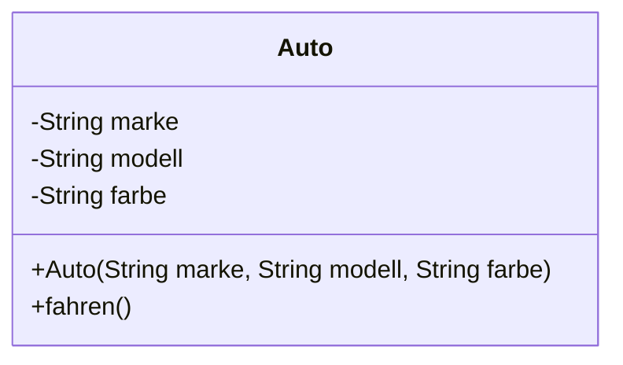

<h1>Einführung in die Objekt-orientierte Programmierung in Java</h1>

<h2>Inhaltsverzeichnis</h2>

- [1. Einführung in die Objektorientierte Programmierung in Java](#1-einführung-in-die-objektorientierte-programmierung-in-java)
  - [1.1. Die 4 Säulen der objektorientierten Programmierung](#11-die-4-säulen-der-objektorientierten-programmierung)
  - [1.2. Klassen und Objekte](#12-klassen-und-objekte)
    - [1.2.1. Erstellen von Klassen und Objekte](#121-erstellen-von-klassen-und-objekte)
    - [1.2.2. UML - Darstellung der Klasse `Auto`](#122-uml---darstellung-der-klasse-auto)
  - [1.3. Eigenschaften (Properties) von Klassen](#13-eigenschaften-properties-von-klassen)
    - [1.3.1. Regeln zur Definition von optionalen, verpflichtenden und nicht veränderbaren Eigenschaften in Java](#131-regeln-zur-definition-von-optionalen-verpflichtenden-und-nicht-veränderbaren-eigenschaften-in-java)
  - [1.4. Methoden von Klassen](#14-methoden-von-klassen)
    - [1.4.1. Methoden Überladen (Method Overloading)](#141-methoden-überladen-method-overloading)
    - [1.4.2. Konstruktoren ("*Konstruktions - Methode*")](#142-konstruktoren-konstruktions---methode)
    - [1.4.3. Statische Methoden (= *Klassen gebundene Methoden*)](#143-statische-methoden--klassen-gebundene-methoden)
  - [1.5. Sichtbarkeiten](#15-sichtbarkeiten)
- [2. Enumerations in Java](#2-enumerations-in-java)
  - [2.1. Definition von Ein- und mehrwertigen Enums in Java](#21-definition-von-ein--und-mehrwertigen-enums-in-java)
    - [2.1.1. Einwertige Enums](#211-einwertige-enums)
    - [2.1.2. Mehrwertige Enums](#212-mehrwertige-enums)
  - [2.2. Anwendung von Enumerations](#22-anwendung-von-enumerations)
  - [2.3. Vorteile gegenüber herkömmlichen Konstanten:](#23-vorteile-gegenüber-herkömmlichen-konstanten)
  - [2.4. Unterschied zu Klassen:](#24-unterschied-zu-klassen)
- [3. Vererbung von Klassen und Verwendung von abstrakter Klassen](#3-vererbung-von-klassen-und-verwendung-von-abstrakter-klassen)
  - [3.1. Vererbung](#31-vererbung)
    - [3.1.1. Darstellung von Vererbung im UML - Diagramm](#311-darstellung-von-vererbung-im-uml---diagramm)
    - [3.1.2. Vererbung in Java](#312-vererbung-in-java)
    - [3.1.3. Die Klasse `Object` - Basisklasse aller Objekte](#313-die-klasse-object---basisklasse-aller-objekte)
  - [3.2. Abstrakte Klassen](#32-abstrakte-klassen)
    - [3.2.1. Darstellung abstrakter Klassen in UML](#321-darstellung-abstrakter-klassen-in-uml)
    - [3.2.2. Abstrakte Klassen in Java](#322-abstrakte-klassen-in-java)
  - [3.3. Verwendung von abstrakten Klassen bei der Vererbung](#33-verwendung-von-abstrakten-klassen-bei-der-vererbung)
    - [3.3.1. Polymorphismus bei der Vererbung](#331-polymorphismus-bei-der-vererbung)
  - [3.4. Beispiele zur Verwendung von Vererbung in Programmen](#34-beispiele-zur-verwendung-von-vererbung-in-programmen)
- [4. Schnittstellen](#4-schnittstellen)
  - [4.1. UML - Darstellung von Schnittstellen](#41-uml---darstellung-von-schnittstellen)
  - [4.2. Definition und Anwendung von Schnittstellen](#42-definition-und-anwendung-von-schnittstellen)
  - [4.3. Polymorphismus bei Interfaces](#43-polymorphismus-bei-interfaces)
    - [4.3.1. Verwendung von Schnittstellen als Datentyp für Arrays](#431-verwendung-von-schnittstellen-als-datentyp-für-arrays)
    - [4.3.2. Verwendung von Schnittstellen als Datentyp für Parameter](#432-verwendung-von-schnittstellen-als-datentyp-für-parameter)
    - [4.3.3. Austauschbarkeit von Implementierungen](#433-austauschbarkeit-von-implementierungen)
  - [4.4. (EXP) Verwendung von Schnittstellen als Ersatz für Mehrfachvererbung](#44-exp-verwendung-von-schnittstellen-als-ersatz-für-mehrfachvererbung)
    - [4.4.1. Beispiel für die Verwendung mehrerer Interfaces](#441-beispiel-für-die-verwendung-mehrerer-interfaces)
    - [4.4.2. Sinnhaftigkeit der Verwendung mehrerer Interfaces](#442-sinnhaftigkeit-der-verwendung-mehrerer-interfaces)
  - [4.5. Verwendung von Interfaces in Programmen](#45-verwendung-von-interfaces-in-programmen)
    - [4.5.1. Kombination verschiedener Fähigkeiten](#451-kombination-verschiedener-fähigkeiten)
    - [4.5.2. Kommunikation zwischen Modulen](#452-kommunikation-zwischen-modulen)
    - [4.5.3. Typische Beispiele](#453-typische-beispiele)
  - [4.6. Vererbung vs. Interfaces](#46-vererbung-vs-interfaces)
  - [4.7. (Exp) Gleichzeitige Verwendung von Interfaces und Vererbung](#47-exp-gleichzeitige-verwendung-von-interfaces-und-vererbung)
- [5. Glossar](#5-glossar)


<div style="page-break-after: always;"></div>

<div style="width: 100%;"> 	
    <div style="margin-left:1cm; margin-right:1cm; text-align: center;">
    <h2>Version History</h2>
    <table style="border solid 1px;width: 100%;">
    <th style="text-align:left">Version</th>
    <th>Änderungen</th>
    <th style="text-align:right">Autor</th>
    <tr>
    <td style="text-align:left">2023-09-05</td>
    <td style="text-align:left">offizielle Erstversion für SJ 23/24</td>
    <td style="text-align:right">KUW</td>
    </tr>
     <tr>
    <td style="text-align:left">2023-12-01</td>
    <td style="text-align:left">Abschnitt 1.2:<br>
    - Umstrukturiert<br>
    - Abschnitt call-by-value / call-by-reference entfernt<br>
    - Überladen von Methoden hinzugefügt
    </td>
    <td style="text-align:right">KUW</td>
    </tr>
    <tr>
    <td style="text-align:left">2023-12-04</td>
    <td style="text-align:left">Neuer Abschnitt 1.3.1:<br>
    Regeln zur Definition von optionalen, verpflichtenden und nicht veränderbaren Eigenschaften in Java
    </td>
    <td style="text-align:right">KUW</td>
    </tr>
    <tr>
    <td style="text-align:left">2024-01-22</td>
    <td style="text-align:left">Neuer Abschnitt 3.1.3:<br>
     Die Klasse `Object` - Basisklasse aller Objekte
    </td>
    <td style="text-align:right">KUW</td>
    </tr>
     <tr>
    <td style="text-align:left">2024-03-05</td>
    <td style="text-align:left">Umstrukturierung von Abschnitt 3:<br>
     Interfaces in eigenen Abschnitt 4 verschoben<br>
     Neue Abschnitte: <br>
     - 4.3.1 Verwendung von Schnittstellen als Datentyp für Arrays<br>
     - 4.3.2 Verwendung von Schnittstellen als Datentyp für Parameter<br>
     - 4.3.3 Austauschbarkeit von Implementierungen<br>
     - 4.5 Verwendung von Interfaces in Programmen<br>
     - 4.7 Gleichzeitige Verwendung von Interfaces und Vererbung
    </td>
    <td style="text-align:right">KUW</td>
    </tr>
    </table>
    </div> 
</div>

<div style="page-break-after: always;"></div>

# 1. Einführung in die Objektorientierte Programmierung in Java

## 1.1. Die 4 Säulen der objektorientierten Programmierung

Die vier Säulen der objektorientierten Programmierung sind grundlegende Konzepte, die dazu beitragen, den Code strukturiert und verständlich zu halten. Sie sind entscheidend für die Entwicklung von Softwareanwendungen. Im Folgenden sind die vier Säulen mit einer kurzen Erklärung und einfachen Beispielen aufgeführt:

1. **Abstraktion:** Abstraktion bedeutet, die wesentlichen Merkmale eines Objekts zu isolieren und dabei unwichtige Details zu ignorieren. Es ermöglicht es uns, ein Problem in einfache, überschaubare Teile zu zerlegen. 
   - Beispiel: Wenn wir eine Klasse `Auto` erstellen, können wir uns auf Merkmale wie `Farbe`, `Marke` und `Geschwindigkeit` konzentrieren und dabei Details wie die genaue Art des Motors ignorieren.

2. **Kapselung:** Kapselung bedeutet, die Daten und Methoden, die auf diese Daten zugreifen und sie manipulieren, innerhalb einer Klasse zu kombinieren. Es schützt die Daten vor direktem Zugriff und Manipulation von außen.
   - Beispiel: In der Klasse `Auto` könnten wir eine private Variable `geschwindigkeit` haben und Methoden wie `beschleunigen()` und `bremsen()`, um die Geschwindigkeit zu ändern, anstatt die Variable direkt zu manipulieren.

3. **Vererbung:** Vererbung ist ein Mechanismus, der es ermöglicht, eine neue Klasse auf der Basis einer bereits existierenden Klasse zu erstellen. Die neue Klasse erbt die Attribute und Methoden der bestehenden Klasse und kann zusätzliche Merkmale und Verhalten hinzufügen oder vorhandene überschreiben.
   - Beispiel: Wir könnten eine Klasse `Elektroauto` erstellen, die von der Klasse `Auto` erbt. Die Klasse `Elektroauto` könnte zusätzliche Merkmale wie `Batteriekapazität` und `Reichweite` haben.

4. **Polymorphismus:** Polymorphismus bedeutet, dass unterschiedliche Klassen mit der gleichen Schnittstelle (z.B. die gleichen Methodennamen) unterschiedliches Verhalten haben können. Das ermöglicht es, den Code flexibel und erweiterbar zu gestalten.
   - Beispiel: Sowohl die Klasse `Auto` als auch die Klasse `Elektroauto` könnten eine Methode `fahre()` haben, aber das genaue Verhalten dieser Methode könnte in jeder Klasse unterschiedlich sein.

> <span style="font-size: 1.5em">:bulb:</span> Zusammenfassend können wir sagen, dass die vier Säulen der objektorientierten Programmierung uns helfen, Code zu schreiben, der gut strukturiert, wartbar und erweiterbar ist. Sie sind ein wichtiger Bestandteil der modernen Softwareentwicklung und können uns helfen, effizientere und effektivere Programme zu erstellen.

## 1.2. Klassen und Objekte

In der objektorientierten Programmierung sind Klassen die "Blaupause" oder "Vorlage" für ein bestimmtes "Ding" oder "Konzept" in einem Programm. Eine Klasse beschreibt die Eigenschaften (Felder) und Verhaltensweisen (Methoden) einer Sache. 

Ein Objekt ist eine konkrete **Instanz** einer Klasse. Wenn Sie eine Klasse haben, die "Auto" beschreibt, dann können Sie daraus viele verschiedene Objekte erstellen, z.B. "meinAuto", "deinAuto", "ihrAuto". Jedes dieser Objekte hat die gleichen Eigenschaften (z.B. Farbe, Marke, Modell) und Verhaltensweisen (z.B. fahren, bremsen), aber jedes Objekt hat seine eigenen individuellen Werte für diese Eigenschaften.

> <span style="font-size: 1.5em">:bulb:</span> **Was ist eine Instanz:**<br> In der objektorientierten Programmierung versteht man unter einer Instanz ein bestimmtes Objekt, das von einer bestimmten Klasse erstellt wurde. Eine Instanz ist also eine "lebendige" Ausführung einer Klasse mit **konkreten** Werten (Eigenschaften)
> 
> **Ein Beispiel**: Klasse Auto hat als Eigenschaft die Farbe und eine Methode fahren, wenn man aus dieser Klasse drei Objekte erstellt, hat jeder eine eigene Farbe und alle können fahren (verhalten), die drei sind dann drei Instanzen dieser Klasse.

> <span style="font-size: 1.5em">:bulb:</span> **Zusammenfassend:** Eine **Klasse** ist eine Art von "**Schablone**" oder "Definition" für eine Sache, während ein **Objekt** eine tatsächliche, **"lebendige" Instanz** dieser Sache ist, die in einem Programm existiert.

### 1.2.1. Erstellen von Klassen und Objekte

Hier ist ein einfaches Beispiel dafür, wie man in Java eine Klasse erstellt und wie man dann unterschiedliche Objekte dieser Klasse erstellt:

```java
// Erstellen einer Klasse "Auto"
class Auto {
    // Felder (Eigenschaften)
    private String marke;
    private String modell;
    private String farbe;

    // Konstruktor
    public Auto(String marke, String modell, String farbe) {
        this.marke = marke;
        this.modell = modell;
        this.farbe = farbe;
    }

    // Methoden
    public void fahren() {
        System.out.println(marke + " " + modell + " fährt vorbei.");
    }

    public void stop() {
        System.out.println(marke + " " + modell + " hat gestoppt.");
    }
}
```

Dies ist eine einfache Klasse "Auto", die drei Felder (Eigenschaften) hat: "marke", "modell" und "farbe". Es hat auch zwei Methoden "fahren" und "stop", die jeweils eine Meldung anzeigen werden, wenn sie aufgerufen werden.

Jetzt können wir unterschiedliche Objekte dieser Klasse erstellen, indem wir den **Konstruktor** verwenden und die entsprechenden Parameter übergeben:

```java
Auto meinAuto = new Auto("Audi", "A4", "schwarz");
Auto deinAuto = new Auto("BMW", "320i", "weiß");
Auto ihrAuto = new Auto("Mercedes", "C300", "silber");
```

Jedes dieser Objekte ist jetzt eine **Instanz** der Klasse "Auto" und hat die Felder "marke", "modell" und "farbe" sowie die Methoden "fahren" und "stop", die Sie aufrufen können:

```java
meinAuto.fahren(); // gibt "Audi A4 fährt vorbei." aus
meinAuto.stop(); // gibt "Audi A4 hat gestoppt." aus
```

Es ist wichtig zu beachten, dass jede Instanz ihre eigenen, unabhängigen Werte für die Felder hat (jedes auto hat eine andere Marke,Modell,Farbe), obwohl sie alle von der gleichen Klasse erstellt wurden und die gleichen Methoden besitzen.

### 1.2.2. UML - Darstellung der Klasse `Auto`

In einem UML (Unified Modeling Language) - Diagramm werden Klassen als Rechtecke dargestellt, wobei der Name der Klasse oben in der Mitte des Rechtecks steht. Innerhalb des Rechtecks werden die Eigenschaften (Felder) und Methoden der Klasse aufgelistet.



Eigenschaften bzw. Methoden werden normalerweise mit einem "+" oder "-" vor dem Namen gekennzeichnet. Ein "+" zeigt an, dass die Eigenschaft öffentlich (`public`) ist und von außerhalb der Klasse zugänglich ist, während ein "-" symbolisiert dass die Eigenschaft privat (`private`) ist und nur innerhalb der Klasse zugänglich ist - hier geschieht dies mit kleinen grünen Kreisen, wobei die **ausgefüllten Kreise** für `public` und die **nicht ausgefüllten Kreise** für `private` stehen.

## 1.3. Eigenschaften (Properties) von Klassen

Felder oder Eigenschaften (auch als Variablen oder Membervariablen bezeichnet) einer Klasse sind die Daten, die von einer Klasse gespeichert werden, um ihren Zustand darzustellen. Eigenschaften beschreiben die Charakteristika eines Objekts, das von einer bestimmten Klasse erstellt wird.
Felder bzw. Eigenschaften sind ähnlich wie Variablen, jedoch sind sie Teil einer Klasse und nicht Teil einer Methode. Sie werden verwendet um Daten zu speichern und zu verwalten, die für das Verhalten und die Funktionsweise der Klasse relevant sind. Felder werden gewöhnlich von Methoden in der Klasse genutzt und können auch von aussenstehenden Methoden und Klassen gelesen bzw. verändert werden, je nach Sichtbarkeit (public, private, protected, default).

Hier ist ein Beispiel:

```java
class Auto {
    // Felder (Eigenschaften)
    private String marke;
    private String modell;
    private String farbe;
    private int geschwindigkeit;
    // Methoden und Konstruktoren
    // ...
}
```

   In diesem Beispiel hat die Klasse "`Auto`" vier Felder: "`marke`", "`modell`", "`farbe`" und "`geschwindigkeit`". Diese Felder speichern Informationen über das Auto, wie zum Beispiel die Marke, das Modell und die Farbe. "`geschwindigkeit`" speichert die momentane Geschwindigkeit des Autos.

Es ist wichtig darauf zu achten, dass die Felder so privat wie möglich gehalten werden, um die **Integrität** des Objekts zu schützen und die Auswirkungen unabsichtlicher Änderungen durch andere Teile des Programms zu minimieren.

Daher empfiehlt es sich, die Zugriff auf die Felder zu steuern und z.B. nur über Getter und Setter Methoden zugreifbar zu machen, um die Integrität des Objekts zu schützen (siehe Abschnitt `Methoden`).

### 1.3.1. Regeln zur Definition von optionalen, verpflichtenden und nicht veränderbaren Eigenschaften in Java

In Java können Eigenschaften von Klassen als optional, verpflichtend oder nicht veränderbar definiert werden.  Hier sind die Regeln und Praktiken für jede dieser Eigenschaftstypen:

#### Optionale Eigenschaften

Optionale Eigenschaften sind solche, die nicht zwingend erforderlich sind, damit ein Objekt der Klasse funktioniert. Sie können entweder einen Wert haben oder `null` sein.

- **Initialisierung**: Optionale Eigenschaften müssen nicht im Konstruktor initialisiert werden. Sie können entweder direkt bei der Deklaration oder später im Programmablauf einen Wert zugewiesen bekommen.
  
- **Verwendung von `null`**: Eine gängige Praxis ist es, optionale Eigenschaften standardmäßig auf `null` zu setzen. Dies zeigt an, dass sie keinen Wert haben.

- **Getter und Setter**: Für optionale Eigenschaften sollten Getter- und Setter-Methoden bereitgestellt werden. Der Getter sollte überprüfen, ob die Eigenschaft `null` ist, bevor er einen Wert zurückgibt.

#### Verpflichtende Eigenschaften (änderbar)

Verpflichtende Eigenschaften sind solche, die für das ordnungsgemäße Funktionieren des Objekts unerlässlich sind. Sie müssen bei der Erstellung des Objekts gesetzt werden, können aber im Laufe des Lebenszyklus des Objekts geändert werden.

- **Konstruktor-Initialisierung**: Verpflichtende Eigenschaften sollten durch den Konstruktor der Klasse initialisiert werden. Dies stellt sicher, dass alle Instanzen der Klasse über gültige Anfangswerte für diese Eigenschaften verfügen.

- **Keine Standardwerte**: Im Gegensatz zu optionalen Eigenschaften sollten verpflichtende Eigenschaften keine Standardwerte haben, da sie immer explizit durch den Konstruktor oder die Setter-Methode gesetzt werden müssen.

- **Setter-Methoden**: Im Gegensatz zu nicht veränderbaren Eigenschaften, sollten für verpflichtende Eigenschaften Setter-Methoden bereitgestellt werden, um ihre Werte im Laufe der Zeit zu aktualisieren. Diese Methoden ermöglichen es, den Zustand des Objekts nach seiner Erstellung zu ändern.

- **Validierung**: Es ist ratsam, dass die Setter-Methoden die Gültigkeit der neuen Werte überprüfen, bevor sie die Eigenschaften aktualisieren. Dies stellt sicher, dass das Objekt immer in einem konsistenten und gültigen Zustand bleibt.

- **Dokumentation**: Es sollte in der Dokumentation der Klasse klar angegeben werden, dass diese Eigenschaften essenziell sind, aber dennoch geändert werden können.

#### Nicht veränderbare Eigenschaften

Nicht veränderbare Eigenschaften sind solche, deren Wert nach der Erstinitialisierung nicht mehr geändert werden soll.

- **Deklaration als `final`**: Die Eigenschaft soll als `final` deklariert werden - d.h. es kann ihr nur ein einziges mal ein Wert zugewiesen werden.

- **Initialisierung im Konstruktor**: Diese Eigenschaften sollten wie verpflichtende Eigenschaften im Konstruktor initialisiert werden.

- **Verzicht auf Setter**: Um die Unveränderlichkeit zu gewährleisten, wird auf die Bereitstellung von Setter-Methoden verzichtet werden. Der Wert kann **nur einmal im Konstruktor** gesetzt werden und bleibt danach unverändert.

#### Beispiel mit allen drei Eigenschaftstypen

Hier ist ein Beispiel einer Klasse in Java, die eine nicht änderbare, eine verpflichtende und eine optionale Eigenschaft beinhaltet:

```java
public class Buch {
    // Nicht änderbare Eigenschaft
    private final String isbn;

    // Verpflichtende, aber änderbare Eigenschaft
    private String titel;

    // Optionale Eigenschaft
    private String autor;

    public Buch(String isbn, String titel) {
        this.isbn = isbn;
        this.titel = titel;
    }

    // Getter für die nicht änderbare Eigenschaft
    public String getIsbn() {
        return isbn;
    }

    // Getter und Setter für die verpflichtende, aber änderbare Eigenschaft
    public String getTitel() {
        return titel;
    }

    public void setTitel(String titel) {
        this.titel = titel;
    }

    // Getter und Setter für die optionale Eigenschaft
    public String getAutor() {
        return autor;
    }

    public void setAutor(String autor) {
        this.autor = autor;
    }
}
```

In diesem Beispiel:

- `isbn` ist eine nicht änderbare Eigenschaft. Sie wird einmal im Konstruktor gesetzt und kann danach nicht mehr geändert werden. Sie wird als `final` deklariert - d.h. es kann ihr nur einmal ein Wert zugewiesen werden. Es gibt nur einen Getter für `isbn`, aber keinen Setter.
- `titel` ist eine verpflichtende Eigenschaft. Sie muss beim Erstellen des Objekts gesetzt werden, kann aber später geändert werden, wie es der Setter ermöglicht.
- `autor` ist eine optionale Eigenschaft. Sie kann `null` sein und wird standardmäßig nicht im Konstruktor gesetzt. Sowohl Getter als auch Setter sind für `autor` definiert, was das spätere Setzen oder Ändern dieser Eigenschaft erlaubt.

## 1.4. Methoden von Klassen

In Java werden Methoden als Teil einer Klasse definiert. Eine Methode hat einen **Namen**, einen **Rückgabetyp**, und eine Liste von Parametern. Auch kann eine Methode Modifizierer wie `public`, `private`, `protected` oder default(keiner) haben  (*näheres dazu im Abschnitt `Sichtbarkeiten`*). 

Beispiel:

```java
public void myMethod(String strgParam, int intParam){
    // Implementierung der Methode
}
```

Die vorgestellte Methode `myMethod` ist ein Beispiel für eine typische Methode in Java. Hier eine detaillierte Beschreibung der einzelnen Teile der Methode:

1. **Modifizierer**: Die Methode verwendet den Modifizierer `public`, was bedeutet, dass sie von jeder anderen Klasse aus aufgerufen werden kann. Dies steht im Gegensatz zu anderen Modifizierern wie `private` oder `protected`, die die Sichtbarkeit und Zugänglichkeit der Methode einschränken.

2. **Rückgabetyp**: Der Rückgabetyp der Methode ist `void`. Dies bedeutet, dass diese Methode keinen Wert zurückgibt. Methoden, die einen Wert zurückgeben, spezifizieren den Datentyp dieses Wertes (z.B. `int`, `String`, `boolean` usw.) anstelle von `void`.

3. **Methodenname**: Der Name der Methode ist `myMethod`. In Java folgen Methodennamen üblicherweise dem CamelCase-Format, wobei der erste Buchstabe klein und jeder erste Buchstabe eines nachfolgenden Wortes groß geschrieben wird.

4. **Parameterliste**: Diese Methode nimmt zwei Parameter entgegen:
   - `String strgParam`: Ein Parameter vom Typ `String`. Dies bedeutet, dass beim Aufrufen der Methode ein `String`-Objekt übergeben werden muss. Der Name `strgParam` ist ein Platzhalter, der innerhalb der Methode verwendet wird, um auf den übergebenen Wert zu verweisen.
   - `int intParam`: Ein zweiter Parameter vom Typ `int`. Das ist ein primitiver Datentyp in Java, der eine Ganzzahl repräsentiert.

5. **Methodenkörper**: Zwischen den geschweiften Klammern `{ }` befindet sich der Code, der die eigentliche Funktionalität der Methode definiert. Im gegebenen Beispiel ist der Körper leer, was durch den Kommentar `// Implementierung der Methode` angedeutet wird. In einer realen Anwendung würde hier der Code stehen, der ausgeführt wird, wenn die Methode aufgerufen wird.

Die einfachsten Methoden sind die sogenannten **Getter-/und Setter** Methoden - sie werden verwendet werden, um die Werte der Eigenschaften der Klasse:

1. zu **lesen**: z.B. `public String getMarke()` 
2. zu **setzen**: z.B. `public void setMarke(String marke)`

Eine Methode kann auch auf Felder der Klasse (inklusive private) zugreifen und diese verändern - siehe folgende Beispiele:

```java
class Auto {
    // Felder (Eigenschaften)
    private String marke;
    private String modell;
    private String farbe;
    private boolean gestartet;
    private int geschwindigkeit;
   
    public String getMarke() {
        return marke;
    }

    public void setMarke(String marke) {
        this.marke = marke;
    }

    public void starten() {
        if (!gestartet) {
            gestartet = true;
            System.out.println(marke + " " + modell + " wurde gestartet.");
        } else {
            System.out.println(marke + " " + modell + " ist bereits gestartet.");
        }
    }

    public void beschleunigen(int kmh) {
        geschwindigkeit += kmh;
        System.out.println(marke + " " + modell + " beschleunigt auf " + geschwindigkeit + " km/h.");
    }

    public int berechneFahrzeit(int entfernung) {
        int fahrzeit = entfernung / geschwindigkeit;
        return fahrzeit;
    }
}
```

1. Die Methode `starten()`: hat keine Parameter und keinen Rückgabewert. Sie nutzt eine private Eigenschaft "`gestartet`" um zu verhindern, das ein Auto gestartet wird, wenn es bereits gestartet ist.
2. die Methode `beschleunigen(int kmh)`: hat einen Parameter, "`kmh`", der angibt, um wie viel die Geschwindigkeit des Autos erhöht werden soll. Sie hat keinen Rückgabewert, sondern nutzt eine private Eigenschaft "geschwindigkeit" um den aktuellen Wert der Geschwindigkeit zu ändern und es dann auf der Konsole auszugeben. Wenn die Methode aufgerufen wird, gibt es keinen Rückgabewert, aber die Eigenschaft geschwindigkeit wurde verändert.
3. die Methode `int berechneFahrzeit(int entfernung)`: hat einen Parameter "`entfernung`" und einen Rückgabewert vom Typ `int`. Es berechnet die Fahrzeit in Stunden, die benötigt wird um die angegebene Entfernung zu fahren, basierend auf der aktuellen Geschwindigkeit des Autos. Der Rückgabewert dieser Methode ist die berechnete Fahrzeit.

### 1.4.1. Methoden Überladen (Method Overloading)

Das Überladen von Methoden in Java ist ein Konzept, bei dem mehrere Methoden in derselben Klasse denselben Namen haben können, sich jedoch in der Anzahl oder im Typ ihrer Parameter unterscheiden. Diese Technik ermöglicht es, Methoden für verschiedene Anwendungsfälle flexibler zu gestalten.

#### Grundkonzepte des Methodenüberladens

1. **Gleicher Methodenname, unterschiedliche Parameter**: Methoden werden als überladen betrachtet, wenn sie denselben Namen, aber unterschiedliche Parameterlisten haben. Diese Unterschiede können sich auf die Anzahl der Parameter, deren Typen oder beides beziehen.

2. **Rückgabetyp irrelevant**: Der Rückgabetyp einer Methode spielt beim Überladen keine Rolle. Zwei Methoden mit demselben Namen und derselben Parameterliste, aber unterschiedlichen Rückgabetypen gelten nicht als Überladung.

3. **Kompilierzeitbindung**: Methodenüberladung wird zur Kompilierzeit aufgelöst. Der Compiler entscheidet anhand der Methodensignatur, welche Methode aufgerufen wird.

#### Beispiel für Methodenüberladung

```java
public class BeispielKlasse {

    // Erste Methode: Keine Parameter
    public void zeigeNachricht() {
        System.out.println("Hallo, Welt!");
    }

    // Überladene Methode: Ein String-Parameter
    public void zeigeNachricht(String nachricht) {
        System.out.println(nachricht);
    }

    // Weitere Überladung: Zwei Parameter, unterschiedliche Typen
    public void zeigeNachricht(String nachricht, int wiederholungen) {
        for(int i = 0; i < wiederholungen; i++) {
            System.out.println(nachricht);
        }
    }
}
```

#### Vorteile des Methodenüberladens

1. **Verbesserte Lesbarkeit**: Methodenüberladung erhöht die Lesbarkeit des Codes, indem sie es ermöglicht, verschiedene Varianten einer Methode unter demselben Namen zu gruppieren.

2. **Benutzerfreundlichkeit**: Bietet Flexibilität bei der Methodennutzung, da Entwickler je nach Bedarf unterschiedliche Parameter verwenden können.

3. **Konsistente Codierung**: Fördert einen konsistenten Codestil, da Methoden mit ähnlicher Funktionalität denselben Namen tragen.

#### Überlegungen beim Überladen von Methoden

- **Klarheit bewahren**: Zu viele überladene Methoden können zu Verwirrung führen. Es ist wichtig, ein Gleichgewicht zu finden, um die Klarheit des Codes zu erhalten.
- **Signaturunterscheidung**: Stellen Sie sicher, dass sich jede überladene Methode in ihrer Signatur (Parameterliste) eindeutig von den anderen unterscheidet.
- **Typkonversionen beachten**: Bei ähnlichen Datentypen (z.B. `int` und `long`) muss darauf geachtet werden, wie der Compiler Typkonversionen handhabt, um unerwartetes Verhalten zu vermeiden.

> <span style="font-size: 1.5em">:bulb:</span> Das Überladen von Methoden ist ein mächtiges Werkzeug in der Objektorientierten Programmierung, das die Flexibilität und Wiederverwendbarkeit von Code wesentlich erhöht.

### 1.4.2. Konstruktoren ("*Konstruktions - Methode*")

In Java ist ein Konstruktor eine **spezielle Methode**, die aufgerufen wird, wenn ein neues Objekt einer Klasse erstellt werden soll. Der **Konstruktor** hat **denselben Namen wie die Klasse** und hat **keinen Rückgabetyp** (nicht mal void).

Der Zweck eines Konstruktors ist es, die **Anfangszustände** eines Objekts zu initialisieren, indem es den Werten von Feldern bestimmte Werte zuweist und/oder andere Initialisierungsaufgaben durchführt.

> <span style="font-size: 1.5em">:bulb:</span> Wenn **kein Konstruktor** explizit definiert wurde, wird automatisch ein **default Konstruktor** ohne Parameter mit **leerem Körper** bereitgestellt, das heißt ein Konstruktor ohne Argumente. Wenn man jedoch **selbst einen Konstruktor definiert**, muss man auch den **default Konstruktor explizit anlegen**, falls er noch benötigt wird.

Ein Beispiel für eine Klasse "Auto" mit einem Konstruktor:

```java
class Auto {
    // Felder (Eigenschaften)
    private String marke;
    private String modell;
    private String farbe;

    // Konstruktor
    public Auto(String marke, String modell, String farbe) {
        this.marke = marke;
        this.modell = modell;
        this.farbe = farbe;
    }
    // Methoden
    //....
}
```

Im obigen Beispiel, der Konstruktor `Auto(String marke, String modell, String farbe)` hat 3 argumente, die erwartet werden, wenn eine Instanz der Klasse erstellt wird. Also wenn jemand ein `Auto` Objekt erstellen möchte muss er/sie diese drei Parameter übergeben.

```java
Auto meinAuto = new Auto("Audi", "A4", "schwarz");
```

Es ist zu beachten, dass es möglich ist **mehrere Konstruktoren** in einer Klasse zu haben, die sich in der Anzahl und Art der Parameter unterscheiden, dies wird als **Überladen** bezeichnet.

#### Der `this` Operator

Der this-Operator in Java wird verwendet, um auf die aktuelle Instanz einer Klasse zu verweisen. Es kann verwendet werden, um auf Felder und Methoden der aktuellen Instanz zu verweisen, die innerhalb der Klasse deklariert sind.

Hier ist ein Beispiel:

```java
class Auto {
    // Felder (Eigenschaften)
    private String marke;
    private String modell;
    private String farbe;

    // Konstruktor
    public Auto(String marke, String modell, String farbe) {
        this.marke = marke;
        this.modell = modell;
        this.farbe = farbe;
    }

    // Methoden
    public void beschreibeAuto() {
        System.out.println("Dies ist ein " + this.farbe + " " + this.marke + " " + this.modell + ".");
    }
}
```

In diesem Beispiel wird der Konstruktor verwendet um die Felder `marke`, `modell`, `farbe` der Instanz zu setzen. Hier wurde `this` verwendet um auf die Felder der Instanz zu verweisen und sie mit den Argumenten des Konstruktors zu setzen. In der Methode `beschreibeAuto()` wird ein Text ausgegeben, welcher die Felder der Instanz nutzt, hier wurde ebenfalls `this` verwendet um auf die Felder der Instanz zu verweisen.

In der Regel ist es nicht zwingend notwendig den `this`-Operator zu verwenden, da der Compiler in der Lage ist, die richtigen Felder oder Methoden zu identifizieren, auch wenn kein `this` verwendet wird.
Der `this` Operator kann jedoch nützlich sein, um die Lesbarkeit des Codes zu verbessern und um Missverständnisse bei lokalen Variablen mit gleichem Namen wie Feldern zu vermeiden.

Es gibt auch den Fall, dass man den `this` benutzen muss, um explizit auf eine Methode innerhalb der Klasse zu verweisen, wenn es eine lokale Variable oder eine Parameter gibt die mit einer Methode der Klasse gleicht.

### 1.4.3. Statische Methoden (= *Klassen gebundene Methoden*)

Statische Methoden sind Methoden, die der **Klasse selbst zugeordnet** sind und **nicht den Instanzen** (Objekten) dieser Klasse. Das bedeutet, dass man sie **direkt über den Klassennamen aufrufen** kann, ohne eine Instanz der Klasse erstellen zu müssen. Statische Methoden verwenden das Schlüsselwort **`static`**.

Einige wichtige Punkte zu statischen Methoden:

- Sie können direkt durch den Klassennamen ohne Erzeugung eines Objekts der Klasse aufgerufen werden.
- Statische Methoden können nur auf statische Felder der Klasse zugreifen und keine nicht-statischen Felder oder Methoden direkt aufrufen.
- Sie werden oft verwendet, um Aufgaben auszuführen, die nicht spezifisch für eine Instanz der Klasse sind, wie z.B. Utility- oder Hilfsmethoden.

Beispiel:

```java
class Mathematik {
    // Statisches Feld
    static final double PI = 3.141592653589793;

    // Statische Methode
    static double kreisFlaeche(double radius) {
        return PI * radius * radius;
    }
}

public class Test {
    public static void main(String[] args) {
        // Aufruf der statischen Methode ohne Erstellung einer Mathematik-Instanz
        double flaeche = Mathematik.kreisFlaeche(5);
        System.out.println("Fläche des Kreises = " + flaeche);
    }
}
```

Ausgabe:

```
Fläche des Kreises = 78.53981633974483
```

In diesem Beispiel haben wir eine statische Methode `kreisFlaeche` definiert, die die Fläche eines Kreises berechnet. Diese Methode kann direkt über den Klassennamen `Mathematik` aufgerufen werden, ohne dass eine Instanz dieser Klasse erforderlich ist.

## 1.5. Sichtbarkeiten

In Java gibt es mehrere Sichtbarkeiten (auch bekannt als Zugriffsmodifizierer), die festlegen, von welchem Teil eines Programms aus ein bestimmtes Feld oder eine Methode zugreifbar ist. Die gängigsten Sichtbarkeiten sind:

1. `public`: Ein öffentliches Feld oder eine Methode ist von überall aus dem Programm aus zugreifbar.
private: Ein privates Feld oder eine Methode ist nur innerhalb der Klasse, in der es definiert ist, zugreifbar.
2. `protected`: Ein geschütztes Feld oder eine Methode ist innerhalb der Klasse, in der es definiert ist und innerhalb von Unterklassen zugreifbar.
3. `default` (auch bekannt als "package-private"): Ein Feld oder eine Methode mit default-Sichtbarkeit ist innerhalb der gleichen Pakete zugreifbar, in dem es definiert ist.
Wenn kein Zugriffsmodifizierer explizit angegeben wird, gilt die Sichtbarkeit als default.

Es ist wichtig zu beachten, dass die Sichtbarkeit von Methoden und Feldern nicht nur den Zugriff auf diese Elemente innerhalb des Programms regelt, sondern auch die Art und Weise, wie man mit ihnen arbeitet und sie verwendet, sowie die Art und Weise, wie sie von anderen Entwicklern verstanden werden.
Es wird oft empfohlen, Felder und Methoden so privat wie möglich zu halten und nur diejenigen, die tatsächlich von außerhalb der Klasse verwendet werden, als public oder protected zu markieren. Auf diese Weise kann die Integrität des Objekts besser geschützt werden und es wird verhindert, dass es unabsichtlich von anderen Teilen des Programms beeinträchtigt wird.

<div style="page-break-after: always;"></div>

# 2. Enumerations in Java

Enumerationen (kurz Enums) in Java sind spezielle Datentypen, die es erlauben, eine Gruppe von verwandten Konstanten zu definieren. Sie sind besonders nützlich, wenn Sie eine begrenzte Menge von Werten repräsentieren möchten, z. B. die Wochentage (Monday, Tuesday, ...) oder die Farben eines Regenbogens (Red, Orange, Yellow, ...)

## 2.1. Definition von Ein- und mehrwertigen Enums in Java

### 2.1.1. Einwertige Enums

Einwertige Enums, auch einfache Enums genannt, sind die am häufigsten verwendeten Enum-Typen in Java. Sie werden verwendet, um eine feste Menge von verwandten Konstanten zu definieren, wobei jede Konstante einen eindeutigen Wert repräsentiert. Sie können ohne zusätzliche Informationen definiert werden.

Beispiel:

```java
public enum DayOfWeek {
    MONDAY, TUESDAY, WEDNESDAY, THURSDAY, FRIDAY, SATURDAY, SUNDAY
}
```

In diesem Beispiel repräsentiert jede Konstante in der Enum `DayOfWeek` einen Tag der Woche. Sie können den Wochentag wie folgt verwenden:

```java
DayOfWeek today = DayOfWeek.FRIDAY;
System.out.println("Today is " + today + ".");
```

### 2.1.2. Mehrwertige Enums

Mehrwertige Enums, auch komplexe Enums genannt, enthalten zusätzliche Informationen neben dem Enum-Namen. Sie können mit Attributen und Methoden definiert werden, um die zusätzlichen Informationen zu speichern und abzurufen.

Beispiel:

```java
public enum Planet {
    MERCURY(0.39, 0.38),
    VENUS(0.72, 0.95),
    EARTH(1.00, 1.00),
    MARS(1.52, 0.53);

    private final double abstandZurSonne; // in Astronomischen Einheiten
    private final double durchmesser; // im Verhältnis zur Erde

    Planet(double abstandZurSonne, double durchmesser) {
        this.abstandZurSonne = abstandZurSonne;
        this.durchmesser = durchmesser;
    }

    public double getAbstandZurSonne() {
        return abstandZurSonne;
    }

    public double getDurchmesser() {
        return durchmesser;
    }
}
```

In diesem Beispiel enthält die Enum `Planet` zwei Attribute: `abstandZurSonne` und `durchmesser`. Sie können die zusätzlichen Informationen wie folgt verwenden:

```java
Planet erde = Planet.EARTH;
System.out.println("Die Erde hat einen Durchmesser von " + erde.getDurchmesser() + " Erddurchmessern.");
```

Mehrwertige Enums sind besonders nützlich, wenn Sie zusätzliche Informationen zu den Enum-Konstanten speichern und abrufen möchten.

## 2.2. Anwendung von Enumerations

Enums können in verschiedenen Kontexten in Java verwendet werden. Hier sind einige Beispiele, wie Sie Enums in if- und switch-Anweisungen, Iterationen, der toString()-Methode, beim Drucken und mit der valueOf()-Methode verwenden können:

1. **Enums in if-Anweisungen**

```java
enum Farbe {
    ROT, GRUEN, BLAU
}

public class Test {
    public static void main(String[] args) {
        Farbe meineFarbe = Farbe.ROT;
        if (meineFarbe == Farbe.ROT) {
            System.out.println("Die Farbe ist Rot.");
        }
    }
}
```

In diesem Beispiel überprüfen wir in einer if-Anweisung, ob die Variable `meineFarbe` den Wert `ROT` hat.

2. **Enums in switch-Anweisungen**

```java
enum Wochentag {
    MONTAG, DIENSTAG, MITTWOCH, DONNERSTAG, FREITAG, SAMSTAG, SONNTAG
}

public class Test {
    public static void main(String[] args) {
        Wochentag heute = Wochentag.FREITAG;
        switch (heute) {
            case FREITAG:
                System.out.println("Endlich Freitag!");
                break;
            case SAMSTAG:
            case SONNTAG:
                System.out.println("Wochenende!");
                break;
            default:
                System.out.println("Ein normaler Arbeitstag.");
        }
    }
}
```

Hier verwenden wir eine switch-Anweisung, um basierend auf dem Wert der Variable `heute` eine Nachricht auszugeben.

3. **Enum-Iteration**

```java
enum Planet {
    MERKUR, VENUS, ERDE, MARS, JUPITER, SATURN, URANUS, NEPTUN
}

public class Test {
    public static void main(String[] args) {
        for (Planet p : Planet.values()) {
            System.out.println(p);
        }
    }
}
```

In diesem Beispiel iterieren wir über die Werte der Enum `Planet` und geben jeden Planetennamen aus.

4. **Enum toString()**

```java
enum Tier {
    HUND, KATZE, MAUS
}

public class Test {
    public static void main(String[] args) {
        Tier meinTier = Tier.HUND;
        System.out.println("Mein Tier ist: " + meinTier.toString());
    }
}
```

Hier verwenden wir die `toString()` Methode, um den Wert der Enum-Variable `meinTier` als String auszugeben.

5. **Enum-Drucken**

```java
enum Fahrzeug {
    AUTO, FAHRRAD, MOTORRAD
}

public class Test {
    public static void main(String[] args) {
        Fahrzeug meinFahrzeug = Fahrzeug.AUTO;
        System.out.println("Mein Fahrzeug ist: " + meinFahrzeug);
    }
}
```

In diesem Beispiel geben wir den Wert der Enum-Variable `meinFahrzeug` direkt aus. Java ruft implizit die `toString()` Methode auf.

6. **Enum valueOf()**

```java
enum Instrument {
    GITARRE, KLAVIER, SCHLAGZEUG
}

public class Test {
    public static void main(String[] args) {
        Instrument meinInstrument = Instrument.valueOf("GITARRE");
        System.out.println("Mein Instrument ist: " + meinInstrument);
    }
}
```

In diesem Beispiel verwenden wir die `valueOf()` Methode, um eine Enum-Instanz aus einem String-Namen zu erhalten und den Wert der Enum-Variable `meinInstrument` auszugeben.

## 2.3. Vorteile gegenüber herkömmlichen Konstanten:

Hier sind die Vorteile von Enums gegenüber Konstanten mit der Hinzufügung der Mehrwertigkeit:

1. **Typsicherheit:** Enums sind typsicher, was bedeutet, dass Sie keine ungültigen Werte zuweisen können.

2. **Lesbarkeit:** Enums können benannte Konstanten verwenden, die den Code lesbarer und verständlicher machen.

3. **Mehrwertigkeit:** Enums können mehrere Werte oder Attribute für jede Konstante speichern, was mit herkömmlichen Konstanten nicht möglich ist.

4. **Namespace:** Enums schaffen einen eigenen Namespace, wodurch die Gefahr von Namenskonflikten reduziert wird.

5. **Einfache Iteration:** Sie können leicht über alle Werte eines Enums iterieren.

## 2.4. Unterschied zu Klassen:

1. **Begrenzte Instanzen:** Im Gegensatz zu Klassen, bei denen Sie beliebig viele Objekte erzeugen können, gibt es bei einer Enumeration nur eine feste Menge von Instanzen. Diese Instanzen werden bei der Definition der Enumeration aufgelistet und können später nicht verändert oder erweitert werden.

2. **Singleton-Eigenschaft:** Jede Enum-Instanz existiert nur einmal im gesamten Programm. Das bedeutet, Sie können Enums sicher mit dem Gleichheitsoperator (`==`) vergleichen, während Sie bei Klassenobjekten die Methode equals() verwenden sollten.

3. **Automatische Methoden:** Enums haben automatisch Methoden wie `values()`, `ordinal()` und `valueOf()` zur Verfügung, die nützlich sind, um mit den definierten Werten zu arbeiten.

<div style="page-break-after: always;"></div>

# 3. Vererbung von Klassen und Verwendung von abstrakter Klassen

## 3.1. Vererbung

Vererbung ist ein **Konzept der objektorientierten Programmierung**, das es ermöglicht, dass eine Klasse (die sogenannte **Unterklasse** oder **Kindklasse**) die Eigenschaften und Methoden einer anderen Klasse (die sogenannte **Oberklasse** oder **Elternklasse**) übernimmt und erweitert.

Eine Unterklasse **erbt** also die Felder und Methoden der Elternklasse, und kann darüber hinaus eigene Felder und Methoden definieren und bestehende Felder und Methoden überschreiben oder erweitern.
Auf diese Weise wird der **Code wiederverwendet**, und es können **hierarchische Beziehungen** zwischen Klassen aufgebaut werden.

### 3.1.1. Darstellung von Vererbung im UML - Diagramm

In UML (Unified Modeling Language) wird Vererbung **durch einen Pfeil** dargestellt, der von einer Unterklasse (Subclass) zu einer Oberklasse (Superclass) zeigt. Der Pfeilspitz ist dabei mit einer dünnen Linie umrandet. Diese Darstellung zeigt an, dass die Unterklasse alle Eigenschaften und Methoden der Oberklasse erbt und diese weiterverwenden oder überschreiben kann.

```plantuml
:[Vererbung: Klassendiagramm](diagramms/vererbung_class_dg.puml)
```

### 3.1.2. Vererbung in Java

In Java kann eine Klasse von einer anderen Klasse erben, indem sie das Schlüsselwort "**`extends`**" verwendet.

Hier ist ein Beispiel:
```java
class Vehicle {
    private int speed;
    public void setSpeed(int speed) {
        this.speed = speed;
    }
    public int getSpeed() {
        return speed;
    }
}

class Car extends Vehicle {
    private int numberOfDoors;
    public void setNumberOfDoors(int numberOfDoors) {
        this.numberOfDoors = numberOfDoors;
    }
    public int getNumberOfDoors() {
        return numberOfDoors;
    }
}
```
In diesem Beispiel erbt die Klasse `Car` von der Klasse `Vehicle`. Sie erbt somit die Eigenschaft `speed` und die Methoden `setSpeed(int)` und `getSpeed()`. Die Klasse `Car` definiert auch ihre eigene Eigenschaft `numberOfDoors` und die Methoden `setNumberOfDoors(int)` und `getNumberOfDoors()`

hier ist ein Beispiel, in dem die abgeleitete Klasse `Car` verwendet wird:

```java
class Main {
    public static void main(String[] args) {
        Car myCar = new Car();
        myCar.setSpeed(100);
        myCar.setNumberOfDoors(4);
        System.out.println("My car's speed is: " + myCar.getSpeed() + " and has " + myCar.getNumberOfDoors() + " doors");
    }
}
```

In diesem Beispiel wird ein Objekt der Klasse `Car` erstellt und in die Variable `myCar` gespeichert.
Die Methode `setSpeed(int)` und `setNumberOfDoors(int)` werden verwendet um die Eigenschaft des Objektes zu setzen.
Die Methode `getSpeed()` und `getNumberOfDoors()` werden verwendet um die Eigenschaft des Objektes auszulesen.

Das Objekt `myCar` hat nun die Eigenschaft `speed` und `numberOfDoors` die es von seiner Basisklasse und von seiner Klasse erbt. Es kann die Methoden `setSpeed(int)`, `getSpeed()`, `setNumberOfDoors(int)` und `getNumberOfDoors()` verwenden, die von seiner Basisklasse und von seiner Klasse definiert sind.

> <span style="font-size: 1.5em">:warning:</span> Eine Klasse kann nur von **einer einzigen Superklasse erben**, aber kann **mehrere Interfaces implementieren**

Vererbung ermöglicht es, gemeinsamen Code in einer Basisklasse zu definieren und diesen dann in abgeleiteten Klassen zu verwenden. Auf diese Weise kann **Code Redundanz vermieden** werden, da der gleiche Code nicht in mehreren Klassen dupliziert werden muss.

Wenn zum Beispiel viele Klassen eine bestimmte Methode haben, die dieselbe Implementierung hat, kann diese Methode in einer Basisklasse definiert werden und dann von allen abgeleiteten Klassen geerbt werden. Auf diese Weise muss die Implementierung nur einmal geschrieben und gewartet werden, anstatt in jeder Klasse einzeln.

Auch Eigenschaften können auf diese Weise geerbt und somit eine Redundanz vermieden werden.

Durch die Vererbung kann auch eine hierarchische Struktur von Klassen aufgebaut werden, bei der allgemeine Methoden und Eigenschaften in der Basisklasse definiert werden und spezifischere Methoden und Eigenschaften in abgeleiteten Klassen hinzugefügt werden können. Dies ermöglicht eine **bessere Organisation des Codes** und eine **einfachere Wartung**.

### 3.1.3. Die Klasse `Object` - Basisklasse aller Objekte

Die Klasse `Object` ist in Java sehr wichtig, da sie die Basis für alle anderen Klassen bildet. Jede Klasse in Java ist eine Erweiterung dieser Klasse, auch wenn es nicht immer direkt sichtbar ist. Drei wichtige Methoden dieser Klasse sind `equals(Object obj)`, `toString()` und `hashCode()`.

#### Die Methode `equals(Object obj)`

- **Was sie tut**: Vergleicht zwei Objekte, um festzustellen, ob sie gleich sind.
- **Warum sie wichtig ist**: Standardmäßig überprüft sie, ob zwei Objekte dieselbe Speicherstelle (Referenz) haben. Man kann diese Methode jedoch so anpassen, dass sie überprüft, ob die Inhalte der Objekte gleich sind, nicht nur ihre Adressen.
- **Beispiel**:
  ```java
  class Auto {
      private int anzahlTueren;
      private String marke;

      Auto(String marke, int anzahlTueren) {
          this.anzahlTueren = anzahlTueren;
          this.marke = marke;
      }

      // Getter- und Setter

      @Override
      public boolean equals(Object obj) {
          //(1) // vergleich der Objekt-Referenzen
          if (this == obj) return true; 
          //(2) // Vergleich der Klassen (gleiche "Baupläne")
          if (obj == null || getClass() != obj.getClass()) return false;
          // Expliziter Cast
          Auto auto = (Auto) obj;
          // (3) Vergleich der Attribute
          return (this.anzahlTueren == auto.AnzahlTueren()
          && this.marke.equals(auto.getMarke());
      }
  }

  // Anwendung
  Auto auto1 = new Auto("Audi", 4);
  Auto auto2 = new Auto("Audi", 4);
  Auto auto3 = new Auto("Audi", 2);

  System.out.println(auto1.equals(auto2)); // Gibt 'true' aus
  System.out.println(auto1.equals(auto3)); // Gibt 'false' aus
  ```

#### Die Methode `toString()`

- **Was sie tut**: Gibt eine Textdarstellung eines Objekts zurück.
- **Warum sie wichtig ist**: Sie wird häufig für das Debugging und Logging verwendet. Man kann sie anpassen, um nützlichere Informationen über das Objekt auszugeben.
- **Beispiel**:
  ```java
  class Auto {
      private int anzahlTueren;
      private int geschwindigkeit;

      Auto(int anzahlTueren, int geschwindigkeit) {
          this.anzahlTueren = anzahlTueren;
          this.geschwindigkeit = geschwindigkeit;
      }

      @Override
      public String toString() {
          return "Auto{" +
                 "anzahlTueren=" + anzahlTueren +
                 ", geschwindigkeit=" + geschwindigkeit +
                 '}';
      }
  }

  // Anwendung
  Auto meinAuto = new Auto(4, 100);
  System.out.println(meinAuto); // Gibt 'Auto{anzahlTueren=4, geschwindigkeit=100}' aus
  ```

#### Die Methode `hashCode()`

- **Was sie tut**: Erzeugt eine Ganzzahl, die das Objekt repräsentiert, basierend auf seinen Daten.
- **Warum sie wichtig ist**: Diese Zahl wird in Hash-basierten Sammlungen verwendet, um Objekte effizient zu speichern und zu finden.
- **Beispiel**:
  ```java
  class Auto {
      private int anzahlTueren;
      private int geschwindigkeit;

      Auto(int anzahlTueren, int geschwindigkeit) {
          this.anzahlTueren = anzahlTueren;
          this.geschwindigkeit = geschwindigkeit;
      }

      @Override
      public int hashCode() {
          return Objects.hash(anzahlTueren, geschwindigkeit);
      }
  }

  // Anwendung
  Auto meinAuto = new Auto(4, 100);
  System.out.println(meinAuto.hashCode()); // Gibt den Hashcode des Objekts aus
  ```

> <span style="font-size: 1.5em">:bulb:</span> Diese Methoden sind in der Klasse `Object` grundlegend, weil sie definieren, wie Objekte verglichen, dargestellt und in speziellen Sammlungen gehandhabt werden. Sie sind wichtig, um Objekte in Java effektiv und effizient zu nutzen.

## 3.2. Abstrakte Klassen

In Java sind abstrakte Klassen ein spezieller Typ von Klassen, die verwendet werden, um eine gemeinsame **Basis** für andere Klassen zu bilden. Sie können sowohl Eigenschaften (Felder) als auch Methoden enthalten (die auch abstrakt sein können), aber sie können **nicht instanziiert** werden. Das bedeutet, dass man kein Objekt einer abstrakten Klasse erstellen kann.

### 3.2.1. Darstellung abstrakter Klassen in UML

Bei abstrakten Klassen werden die Namen der Klassen, sowie die von abstrakten Methoden ***kursiv*** geschrieben.

```plantuml
:[UML - Klassen Diagramm: abstakte Klasse](diagramms/abstract_class_dg.puml)
```

### 3.2.2. Abstrakte Klassen in Java

Eine abstrakte Klasse kann in Java durch das Schlüsselwort "``abstract``" vor dem Klassenbezeichner deklariert werden. Beispiel:

```java
abstract class Shape {
    int x,y;
    abstract double getArea();
}
```

Eine abstrakte Klasse **kann** sogenannte **abstrakte Methoden** enthalten, die **nicht implementiert** sind (*dies ist jedoch nicht zwingend*). Diese müssen mit dem Schlüsselwort `abstract` gekennzeichnet werden. Eine abstrakte Methode hat **keinen Rumpf** und **endet mit einem Semikolon** anstelle von geschweiften Klammern. Sie **muss** von einer **Unterklasse implementiert (bzw. überschrieben) werden**. Beispiel:

```java
abstract class Shape {
    ....
    abstract double getArea();
}

class Rectangle extends Shape {
     double a;
     double b;
     
     public Rectangle(double a, double b) {
        this.a = a;
        this.b = b;
     }

     @Override
     public double getArea() {
         return a * b; 
     }
}
```

Eine abstrakte Klasse kann auch **nicht-abstrakte Methoden enthalten**, die bereits implementiert sind. Diese Methoden können von Unterklassen verwendet werden, ohne dass sie sie erneut implementiert werden müssen.

## 3.3. Verwendung von abstrakten Klassen bei der Vererbung

Es ist wichtig zu beachten, dass **abstrakte Klassen nicht instanziiert werden können** und daher nicht als "Template" für Objekte verwendet werden können. Sie dienen daher **als Basisklasse** für andere Klassen und ermöglichen es, Code zu organisieren und zu wiederverwenden.

Das folgende Beispiel zeigt eine **typische Verwendung** von abstrakten Klassen, bei der neben einer abstrakten Methode auch eine implementierte Methode vorhanden ist, die von den abgeleiten Unterklassen verwendet werden kann:

```java
abstract class Shape {
    protected int x, y;
    
    // implmentierte Methode
    public void move(int x, inte y) {
        this.x += x;
        this.y += y;
    }
    // abstrakte Methode
    public abstract double getArea();
}

class Rectangle extends Shape {
    private double width, height;
    public Rectangle(double width, double height) {
        this.width = width;
        this.height = height;
    }
    @Override
    public double getArea() {
        return width * height;
    }
}

class Circle extends Shape {
    private int radius;
    public Circle(int radius) {
        this.radius = radius;
    }
    @Override
    public double getArea() {
        return Math.PI * radius * radius;
    }
}
```

In diesem Beispiel haben wir die abstrakte Basisklasse `Shape` mit den Eigenschaften `x` und `y`, die die Position des Shapes auf der x- und y-Achse speichern und eine **implementierte Methode** `move(int x, int y)`, welche die Eigenschaften `x` und `y` verändert, sowie eine **abstrakte Methode** `getArea()`, welche von den Unterklassen implementiert werden muss.

Wir haben dann zwei abgeleitete Klassen `Rectangle` und `Circle`, die von der Klasse `Shape` erben. Beide Klassen haben die Eigenschaft `x` und `y` geerbt und können die Methode `move(int x, int y)` verwenden um die Position zu verändern, **müssen** jedoch die **abstrakte Methode** `getArea()` jeweils selbst **implementieren**, welche die Fläche der jeweiligen Form berechnet und zurückliefert.

Die Klasse `Rectangle` hat zusätzlich die Eigenschaft `width` und `height` mit deren Wert die Fläche des Rechtecks in der eigenen Implementierung der abstrakten Methode `getArea()` durchgeführt wird.

Die Klasse `Circle` hat eine Eigenschaft `radius`. Auch hier wird die neue Variable (hier `radius`) verwendet um die Fläche des Kreises in der eigenen Implementierung der geerbten abstrakten Methode `getArea()` durchzuführen.

Wir haben hier also die Methode `move(int x, int y)` und die Eigenschaften `x`,`y` nur **einmal** definiert und können sie nun in beiden Klassen verwenden **ohne sie erneut zu definieren**. Auf diese Weise wird Code-Redundanz vermieden und die Wartung des Codes erleichtert.
 
Das folgende Beispiel zeigt die Anwendung der beiden Klassen:

```java
class Main {
    public static void main(String[] args) {
        Rectangle rectangle = new Rectangle(5, 10);
        Circle circle = new Circle(3);

        rectangle.move(1, 2);
        circle.move(3, 4);

        System.out.println("Rectangle area: " + rectangle.getArea());
        System.out.println("Circle area: " + circle.getArea());
        System.out.println("Rectangle position: (" + rectangle.x + "," + rectangle.y + ")");
        System.out.println("Circle position: (" + circle.x + "," + circle.y + ")");
    }
}
```

In der Methode `main` werden zwei Objekte erstellt, ein `Rectangle`-Objekt und ein `Circle`-Objekt. Beide Objekte verwenden die Methode `move(int x, int y)` um ihre Position zu verändern und die Methoden `getArea()` um ihre Flächeninhalte zu berechnen, die sie von ihren jeweiligen Klassen erben.

Es wird auch die Position ausgegeben, die von der **abstrakten Basisklasse** `Shape` geerbt wurde.

> <span style="font-size: 1.5em">:bulb:</span> **Merksatz zu abstakten Klassen:**<br>
> Abstrakte Klassen in Java sind ein spezieller Typ von Klassen,
> die in der Regel als gemeinsame Basis für andere Klassen (= **Basisklasse**) verwendet werden. Sie
> können sowohl Eigenschaften (Felder) als auch Methoden enthalten,
> aber sie **können nicht instanziiert** werden. Sie **können abstrakte Methoden enthalten**, die von Unterklassen implementiert werden
> müssen, oder **auch bereits implementierte Methoden** die von
> Unterklassen verwendet werden können. 


> <span style="font-size: 1.5em">:bulb:</span> **Merksatz zur Anwendung von Vererbung:** <br>
> Vererbung ermöglicht es, **Code effizienter zu organisieren**, indem sie es ermöglicht, gemeinsamen Code zu sammeln und zu wiederverwenden, anstatt ihn in mehreren Klassen zu duplizieren. Dies führt zu einer **besseren Code-Struktur** und **reduziert die Fehleranfälligkei**t und die Zeit die für Wartung und Pflege benötigt wird.

### 3.3.1. Polymorphismus bei der Vererbung

Polymorphismus bezieht sich auf die Fähigkeit, dass eine Variable, Methode oder Klasse verschiedene Formen annehmen kann. Im Zusammenhang mit vererbten Klassen bedeutet dies, dass eine Variable einer Oberklasse auch ein Objekt einer davon abgeleiteten Klasse speichern kann und auf die Methoden der abgeleiteten Klasse zugreifen kann.
Das bedeutet, dass die gleiche Methode auf verschiedene Arten von Objekten aufgerufen werden kann und trotzdem die erwartete Funktionalität ausführt.

Ein Beispiel hierfür wäre die Verwendung von Polymorphismus in einer Liste von verschiedenen `Shape`-Objekten, wie z.B. `Circle`, `Rectangle` und `Square`. Jede dieser Klassen hat die abstrakte Methode `getArea()`, welche die Fläche des Objekts berechnet. Sie können eine Liste von `Shape`-Objekten erstellen, die sowohl Kreis- als auch Rechteck- und Quadratobjekte enthält und die Methode `getArea()` auf jedes Element in der Liste anwenden.

```java
abstract class Shape {
    public abstract double getArea();
}
class Circle extends Shape {
    private double radius;
    public Shape(double radius) {
        this.radius = radius;
    }
    @Override
    public double getArea(){
        //...
    }
}
class Rectangle extends Shape {
    private double width, height;
    public Rectangle(double width, double height) {
        this.width = width;
        this.height = height;
    }
    @Override
    public double getArea(){
        //...
    }
}
class Square extends Shape {
    private double side;

    public Square(double side) {
        this.side = side;
    }

    @Override
    public double getArea(){
        //..
    }
```

In dem Beispiel habe ich eine Klasse `Shape` erstellt, die die Methode `getArea()` definiert. Dann habe ich drei **Unterklassen** von Shape erstellt: `Circle`, `Rectangle` und `Square`, die alle die Methode `getArea()` **überschreiben** (= `override`), um die Fläche des jeweiligen Shapes zu berechnen. Dies wird auch durch die Kennzeichnung `@Override` (= **Annotation**), die direkt über der Methode `getArea()` angeführt ist, dem **Compiler** mitgeteilt. 

Da die Unterklassen von `Shape` erben, können Sie eine Liste von `Shape`-Objekten erstellen, die aus `Circle`-, `Rectangle`- und `Square`-Objekten besteht und darauf die Methode `getArea()` anwenden. Das bedeutet, dass die Methode `getArea()` für jede Form (= `Circle`, `Rectangle`, oder `Square`) angewendet werden kann, da sie alle von der Klasse `Shape` erben und somit dieselbe Methode bereitstellen.

```java
List<Shape> shapes = new ArrayList<>();
shapes.add(new Circle(5.0));
shapes.add(new Rectangle(3.0, 2.0));
shapes.add(new Square(4.0));
for(Shape s : shapes) {
    System.out.println(s.getArea());
}
```

In der `"for-each"`-Schleife, wird jedes Element in der Liste durchlaufen. Innerhalb dieser Schleife wird die Methode `getArea()` auf jedes Element angewendet, unabhängig davon, welche spezifische Form das Objekt hat. Da die Methode `getArea()` in jeder der Unterklassen überschrieben wurde, wird die jeweils passende Methode der jeweiligen Klasse aufgerufen.

## 3.4. Beispiele zur Verwendung von Vererbung in Programmen

Im folgende möchte ich einige **typische Beispiele** vorstellen, bei denen Vererbung zum Einsatz kommt:

1. **Modellierung** von **Tieren und Pflanzen**: Eine abstrakte Klasse "Lebewesen" kann Eigenschaften und Methoden enthalten, die für alle Lebewesen gelten (z.B. Atmung, Fortbewegung). Unterklassen wie "Säugetiere", "Vögel", "Fische" und "Pflanzen" können von dieser abstrakten Klasse erben und spezifische Eigenschaften und Methoden hinzufügen (z.B. Fell bei Säugetieren, Flügel bei Vögeln, Photosynthese bei Pflanzen).
2. **Modellierung** von **Fahrzeugen**: Eine abstrakte Klasse "Fahrzeug" kann Eigenschaften und Methoden enthalten, die für alle Fahrzeuge gelten (z.B. Anzahl der Räder, Motor). Unterklassen wie "Auto", "LKW", "Bus" und "Fahrrad" können von dieser abstrakten Klasse erben und spezifische Eigenschaften und Methoden hinzufügen (z.B. Anzahl der Sitze bei Autos, Ladekapazität bei LKWs).
3. **Modellierung** von **Musikinstrumenten**: Eine abstrakte Klasse "Musikinstrument" kann Eigenschaften und Methoden enthalten, die für alle Musikinstrumente gelten (z.B. Anzahl der Saiten, Art des Klangs). Unterklassen wie "Gitarre", "Klavier", "Saxophon" und "Schlagzeug" können von dieser abstrakten Klasse erben und spezifische Eigenschaften und Methoden hinzufügen (z.B. Anzahl der Saiten bei Gitarre, Anzahl der Tasten bei Klavier).
4. **Modellierung** von **Benutzern** und **Benutzerrollen**: Eine abstrakte Klasse "Benutzer" kann Eigenschaften und Methoden enthalten, die für alle Benutzer gelten (z.B. Name, Passwort). Unterklassen wie "Administrator", "Moderator" und "Standardbenutzer" können von dieser abstrakte Klasse erben und spezifische Eigenschaften und Methoden hinzufügen (z.B. Berechtigungen zum Ändern von Einstellungen für Administrator, Berechtigungen zum Löschen von Inhalten für Moderatoren).

> <span style="font-size: 1.5em">:bulb:</span> **Merksatz zur Verwendung von Vererbung:**<br>
> Verwende Vererbung, wenn es um die Abbildung von **`is-a` Beziehungen** (z.B. eine **Katze `ist ein` Tier**) zwischen Klassen geht und die Eigenschaften und Methoden einer bestehenden Klasse genutzt und erweitert werden sollen, um ähnliche Klassen zu erstellen bzw.<br>
> Wenn du **feststellst**, dass du **Code duplizierst**, um ähnliche Klassen zu erstellen, solltest du überlegen ob Vererbung die Lösung sein kann.

# 4. Schnittstellen

In objektorientierten Sprachen wie Java ist **ein Interface** eine Art "**Vertrag**" oder "**Protokoll**", das **beschreibt welche Methoden** eine Klasse **implementieren** sollte, aber **nicht wie** diese Methoden **implementiert** werden. 

> <span style="font-size: 1.5em">:warning:</span>Ein Interface enthält nur die **Methodensignaturen** (*Name, Rückgabetyp, Argumente*), aber keine Implementierungen.

Eine Klasse, die ein Interface implementiert, "verspricht" also, dass sie alle Methoden des Interfaces implementieren wird, und stellt sicher, dass sie über die richtigen Methoden verfügt, damit andere Klassen darauf vertrauen können, dass sie in einer bestimmten Weise arbeiten werden.

## 4.1. UML - Darstellung von Schnittstellen

Schnittstellen werden in UML - Klassendiagramm ähnlich wie abstrakte Klassen dargestellt. Auch hier wird der Name des Interface kursiv geschrieben.


## 4.2. Definition und Anwendung von Schnittstellen

Folgendes Beispiel zeigt die Defintion und die Implementierung eines Interfaces in Java.

```java
interface Shape {
    public double getArea();
}


class Circle implements Shape {
    private double radius;
    public Circle(double radius) {
        this.radius = radius;
    }
    @Override
    public double getArea() {
        return Math.PI * radius * radius;
    }
}
```

In diesem Beispiel habe ich ein Interface `Shape` definiert, das die Methode `getArea()` ohne Implementierung beschreibt. Jede Klasse die dieses Interface implementiert, muss diese Methode implementieren, das bedeutet sie muss die Methode mit Inhalt füllen. In diesem Fall habe ich die Klasse `Circle` implementiert, welche die Methode `getArea()` überschreibt und die Fläche eines Kreises berechnet (π * r²).

## 4.3. Polymorphismus bei Interfaces

Das Interface `Shape` kann von mehreren Klassen implementiert werden, die unterschiedliche Formen darstellen, wie z.B. `Circle`, `Rectangle`, `Square. Jede dieser Klasse hat jedoch seine eigene Implementierung dieser Methode, da sich die Berechnung der Fläche der Formen voneinander unterscheiden.

```java
interface Shape {
    public double getArea();
}
class Circle implements Shape {
    private double radius;
    public Circle(double radius) {
        this.radius = radius;
    }
    public double getArea() {
        return Math.PI * radius * radius;
    }
}
class Rectangle implements Shape {
    private double width;
    private double height;
    public Rectangle(double width, double height) {
        this.width = width;
        this.height = height;
    }
    public double getArea() {
        return width * height;
    }
}
```

### 4.3.1. Verwendung von Schnittstellen als Datentyp für Arrays

Java erlaubt es nicht Objekte unterschiedlicher Klassen in einem Array zu speichern. Es gibt jedoch die Möglichkeit ein Interface als Datentyp für ein Array zu verwenden, wodurch es möglich ist alle Objekte von Klassen in dem Array zu speichern, welches das entsprechende Interface implementieren.

```java
Shape[] shapes = new Shape[3];

Circle circle1 = new Circle(5);
Rectangle rectangle = new Rectangle(3,5);
Cicrle circle2 = new Circle(6);
shapes[0] = circle1;
shapes[1] = rectangle;
shapes[3] = circle2;
```

In dem oben dargestellten Beispiel werden im Array `shapes` 2 `Circle`-Objekte und ein `Rectangle`-Objekt gespeichert.

### 4.3.2. Verwendung von Schnittstellen als Datentyp für Parameter

Im folgenden Beispiel wird die im vorhergegangen Abschnitt definierte Schnittstelle `Shape` als Datentyp für einen Parameter der Methode `calculateShapeArea` verwendet. 

```java
class Calculator {
    public static double calculateShapeArea(Shape shape) {
        return shape.getArea();
    }
```

In diesem Beispiel verwenden wir **Polymorphismus**, indem wir das **Interface** `Shape` als **Parameter - Datentyp** für die Methode `calculateShapeArea()` in der Klasse `Calculator` verwenden. Das bedeutet, dass jedes Objekt einer Klasse, die das Interface `Shape` implementiert, als Argument für diese Methode verwendet werden kann.

Da sowohl die Klasse `Circle` als auch die Klasse `Rectangle` das Interface `Shape` implementieren, können sowohl `Circle`-Objekte als auch `Rectangle`-Objekte als Argumente für die Methode `calculateShapeArea()` verwendet werden. Diese Methode ruft die Methode `getArea()` auf, die von dem übergebenen Shape-Objekt bereitgestellt wird.

### 4.3.3. Austauschbarkeit von Implementierungen

Implementieren Klassen ein Interfaces, so ist oft auch der Grund hierfür, dass es möglich sein soll, die Implementierung für das Interface wählen/tauschen zu können. Hierfür gibt es meist folgende Gründe: 

- es stehen mehrere Implementierungen zur Verfügung, welche je nach Verwendungszweck verwendet werden können - z.B. `ArrayList` und `LinkedList` des Collection - Frameworks, welche beide das `List` - Interface implementieren
- die zu verwendende Implementierung soll erst während der Laufzeit bestimmt werden - `Factory` - Pattern (*wird erst in der 3. Klasse behandelt*)
-  Erstellen von **Dummy** - Implementierungen (= *Implementierungen, die nur so tun als ob*), bei der Entwicklung von mehren Softwaremodulen, die möglichst unabhängig voneinander durch unterschiedliche Porgammierern  entwickelt werden sollen.
  
```java
List<String> myArrayList = new ArrayList();
List<String> myLinkedList = new LinkedList();
```

> <span style="font-size: 1.5em">:bulb:</span> In der Regel gilt, im Fall, dass eine Klasse ein Interface implementiert, so soll in den meisten Fällen, als Datentyp das `Interface` und **NICHT** die **Implementierung** verwendet werden! (*siehe Beispiel oben*)

## 4.4. (EXP) Verwendung von Schnittstellen als Ersatz für Mehrfachvererbung

In Java gibt es **keine Mehrfachvererbung** von Klassen, um die damit verbundenen Komplexitäten zu vermeiden. Jedoch unterstützt Java, dass eine Klasse **mehrere Interfaces** implementiert, wodurch eine Art von Mehrfachvererbung ermöglicht wird, ohne die klassischen Probleme zu verursachen.

> <span style="font-size: 1.5em">:bulb:</span> In Java ist es möglich dass eine Klasse **mehrere Interfaces implementieren** kann, es gibt also **keine strikte 1:1 Beziehung** zwischen Klassen und Interfaces.

### 4.4.1. Beispiel für die Verwendung mehrerer Interfaces

Hierzu ein einfaches Beispiel, bei dem zwei Interfaces von einer Klasse implementiert werden:

```java
interface Shape {
    public double getArea();
}
interface Printable {
    public void print();
}
class Circle implements Shape, Printable {
    private double radius;
    public Circle(double radius) {
        this.radius = radius;
    }
    @Override
    public double getArea() {
        return Math.PI * radius * radius;
    }
    @Override
    public void print() {
        System.out.println("I am a Circle");
    }
}
```

In diesem Beispiel habe ich zwei Interfaces definiert: `Shape` und `Printable`. Das Interface `Shape` beschreibt die Methode `getArea()`, während das Interface `Printable` die Methode `print()` beschreibt.

Ich habe dann die Klasse `Circle` definiert, die sowohl von `Shape` als auch von Printable implementiert wird, indem ich sowohl nach  `implements` beide Interfaces `Shape, Printable` angebe. Das bedeutet, dass die Klasse `Circle` die Methoden `getArea()` und `print()` bereitstellen muss.

Die Klasse `Circle` implementiert die Methode `getArea()` um die Fläche eines Kreises zu berechnen und implementiert die Methode `print()` um einen String auszugeben `"I am a Circle"`.

### 4.4.2. Sinnhaftigkeit der Verwendung mehrerer Interfaces

> <span style="font-size: 1.5em">:bulb:</span> Durch die Implementierung mehrerer Interfaces können Klassen flexibel **verschiedene Verhaltensweisen** annehmen, **OHNE an eine einzelne Vererbungshierarchie** gebunden zu sein. Dies steigert die Flexibilität, Wiederverwendbarkeit und Wartbarkeit des Codes, besonders in großen und komplexen Projekten.

## 4.5. Verwendung von Interfaces in Programmen

### 4.5.1. Kombination verschiedener Fähigkeiten

Schnittstellen (Interfaces) werden besonders dann eingesetzt, wenn Objekte mehrere Fähigkeiten besitzen sollen, die nicht in einer einzigen Vererbungshierarchie organisiert sind. Dies ist ein Ersatz für die Mehrfachvererbung, die in Java nicht direkt unterstützt wird.

**Beispiel**: Stellen Sie sich eine Anwendung für ein Unterhaltungs-System vor, in der Sie Klassen für verschiedene Arten von Medieninhalten haben, wie `Film`, `Musikvideo` und `Tutorial`. Diese Medien könnten verschiedene Schnittstellen wie `Abspielbar` (mit einer Methode `spieleAb`), `Pausierbar` (mit einer Methode `pause`) und `Bewertbar` (mit einer Methode `bewerte`) implementieren. Ein `Film` und ein `Musikvideo` könnten sowohl `Abspielbar` als auch `Pausierbar` sein, während ein `Tutorial` zusätzlich `Bewertbar` sein könnte, da Nutzer es nach dem Ansehen bewerten können.

### 4.5.2. Kommunikation zwischen Modulen

Schnittstellen sind auch nützlich für die Kommunikation zwischen Modulen in Programmen, die unterschiedliche Funktionalitäten abdecken. Sie ermöglichen es, dass Module unabhängig voneinander entwickelt werden, da man mit sogenannten Dummy-Implementierungen arbeiten kann.

**Beispiel**: Angenommen, Sie entwickeln eine Webanwendung mit Frontend- und Backend-Modulen. Sie könnten eine Schnittstelle `DatenLader` definieren, die Methoden wie `ladeBenutzerdaten` und `speichereBenutzerdaten` enthält. Während das Backend-Modul die echte Implementierung dieser Schnittstelle bereitstellt, kann das Frontend-Modul mit einer **Dummy-Implementierung** entwickelt werden, die vorübergehend statische Daten zurückgibt. Dadurch können Frontend-Entwickler ihre Arbeit fortsetzen, auch wenn das Backend noch nicht fertig ist.

### 4.5.3. Typische Beispiele

1. **Gerätesteuerung in einem Smart-Home-System**: Verschiedene Geräte wie `Thermostat`, `Lichtschalter` und `Sicherheitskamera` könnten eine Schnittstelle wie `SmarthomeSteuerbar` implementieren. Obwohl diese Geräte unterschiedlichen Geräte - Kategorien angehören, erlaubt die Verwendung der Schnittstelle eine einheitliche Behandlung in der Steuerungslogik des Smart-Home-Systems.

2. **Zahlungsabwicklung in E-Commerce-Systemen**: Unterschiedliche Zahlungsmethoden wie `Kreditkarte`, `PayPal` und `Banküberweisung` könnten eine gemeinsame Schnittstelle `Zahlbar` implementieren, die eine Methode `zahleBetrag` enthält. Dies ermöglicht es dem E-Commerce-System, neue Zahlungsmethoden leicht zu integrieren, indem einfach neue Klassen hinzugefügt werden, die die `Zahlbar`-Schnittstelle implementieren.

3. **Plugin-Architektur in einer Softwareanwendung**: Eine Softwareanwendung könnte eine Schnittstelle `Plugin` definieren, die Methoden wie `initialisiere`, `starte` und `beende` enthält. Verschiedene Plugins wie `Datenexport`, `Analysetools` und `Benutzerbenachrichtigungen` können diese Schnittstelle implementieren. Die Hauptanwendung kann dann die Plugins laden und ihre Methoden aufrufen, ohne die spezifischen Details jedes Plugins zu kennen.

Diese Beispiele demonstrieren, wie durch die Verwendung von Schnittstellen eine klare Trennung zwischen verschiedenen Teilen eines Programms erreicht und gleichzeitig eine hohe Flexibilität und Erweiterbarkeit sichergestellt werden kann.

## 4.6. Vererbung vs. Interfaces

Grundsätzlich sollten Sie Klassen verwenden, wenn Sie eine Implementierung für die Methoden bereitstellen möchten, die in einer bestimmten Hierarchie von Objekten verwendet werden sollen. Interfaces hingegen sollten verwendet werden, wenn Sie lediglich die Methodensignaturen definieren möchten, ohne eine Implementierung bereitzustellen.

Ein weiteres wichtiges Unterscheidungsmerkmal ist, dass eine Klasse von einer anderen Klasse erben kann, während eine Klasse mehrere Interfaces implementieren kann.

Ein weiterer wichtiger Aspekt ist, dass Interfaces in Java lediglich Methodensignaturen enthalten, ohne tatsächliche Implementierungen zu bereitstellen, während eine Klasse sowohl Methodensignaturen als auch Implementierungen bereitstellen kann.

Es gibt einige Anwendungsfälle in denen es sinnvoller ist Interfaces zu verwenden:

- Wenn Sie eine gemeinsame Schnittstelle für unterschiedliche Klassen bereitstellen möchten, die dieselben Methoden bereitstellen sollen.
- Wenn Sie Polymorphismus nutzen möchten, um unterschiedliche Klassen auf die gleiche Art und Weise behandeln zu können
- Wenn Sie die Mehrfachvererbung von Klassen ersetzen möchten.

Es gibt jedoch auch Anwendungsfälle, in denen es sinnvoller ist Klassen zu verwenden:

- Wenn Sie die Implementierung von Methoden bereitstellen möchten.
- Wenn Sie eine Hierarchie von Objekten aufbauen möchten, bei der eine Klasse von einer anderen Klasse erben kann.
- Wenn Sie die Möglichkeit haben möchten, Objekte der Klasse mittels der new-Operator zu erstellen.

Es ist wichtig zu beachten, dass die Verwendung von Interfaces und Klassen nicht ausschließlich ist und es auch **Fälle** geben kann, in denen **beide gleichzeitig verwendet** werden können.

## 4.7. (Exp) Gleichzeitige Verwendung von Interfaces und Vererbung

Durch eine gleichzeitige Verwendung von Interfaces und Vererbung kann man die Vorteile beider Konzepte kombinieren. Oft werden abstrakte Klassen als Basisklasse verwendet, von denen weitere Klassen abgeleitet werden. Diese abstrakten Basisklassen implementieren oft zusätzlich ein Interfaces. Diese Kombination bietet folgende Vorteile:

- **Vorteile** aufgrund der **Vererbung**: Es kann Funktionalität implmentiert werden, welche in den vererbten Klassen verwendet werden kann.
- **Vorteile** aufgrund des **Interfaces**:
  - es fördert die **modulare Entwicklung**, durch austauschbare Implementierungen (z.B. auch die Verwendung von **Dummy** - Klassen)
  - es ermöglicht eine **Art Mehrfachvererbung** beim Einsatz mehrerer Interfaces

> <span style="font-size: 1.5em">:bulb:</span> Die Kombination von Interfaces und Klassen in Verbindung mit Vererbung kommt häufig bei sogenannten **Design Patterns** (*Stoff der 3. Klasse*) vor, welche meist verwendet werden um komplexere Aufgabenstellungen zu lösen. 


# 5. Glossar

Im folgenden werden die wichtigsten Fachbegriffe in alphabetischer Reihenfolge angeführt, die im Rahmen dieses Scripts behandelt/verwendet werden.

1. **Abstraktion**: Das Herausfiltern der wichtigen Eigenschaften eines Objekts und das Ignorieren der unwichtigen, um die Komplexität zu reduzieren.

2. **Abstrakte Klasse**: Eine Klasse, die nicht instanziiert werden kann und dazu dient, eine Basis für andere Klassen zu schaffen.

3. **Enumeration**: Ein Datentyp in Java, der eine feste Anzahl von Konstanten definiert.

4. **Interface (Schnittstelle)**: Eine Art Vertrag, der angibt, welche Methoden eine Klasse implementieren muss, ohne die Implementierungsdetails vorzugeben.

5. **Interface-Implementierung**: Der Prozess des Schreibens von Klassen, die alle Methoden eines Interfaces umsetzen.

6. **Kapselung**: Das Verbergen von Details der Implementierung in einer Klasse und das Bereitstellen einer öffentlichen Schnittstelle.

7. **Klasse**: Eine Blaupause oder Vorlage, die Eigenschaften und Verhaltensweisen (Methoden) für Objekte definiert.

8. **Konstruktor**: Eine spezielle Methode in einer Klasse, die aufgerufen wird, um ein neues Objekt der Klasse zu erstellen.

9. **Methoden Überladen (Method Overloading)**: Das Definieren von mehreren Methoden in einer Klasse mit demselben Namen, aber unterschiedlichen Parametern.

10. **Objekt**: Eine Instanz einer Klasse, die konkrete Werte für die in der Klasse definierten Eigenschaften hält.

11. **Parameter**: Eine Variable, die als Eingabe für eine Methode oder einen Konstruktor dient und den Methoden oder Konstruktoren Informationen übergeben kann.

12. **Polymorphismus**: Die Fähigkeit, in verschiedenen Formen aufzutreten; in der OOP bedeutet dies, dass Methoden unterschiedliche Ausführungen haben können, je nachdem, in welcher Klasse sie implementiert sind.

13. **Polymorphismus in der Vererbung**: Eine Eigenschaft der Vererbung, bei der eine Unterklasse unterschiedliche Formen oder Verhaltensweisen der geerbten Methode aufweisen kann.

14. **Sichtbarkeit**: Bestimmt, ob andere Klassen auf eine Klasse oder Methode zugreifen können; umfasst `public`, `private`, `protected` und Paket-private (kein Modifizierer).

15. **Statische Methode**: Eine Methode, die der Klasse und nicht den Instanzen der Klasse zugeordnet ist.

16. **Variable**: Eine Speicherstelle in einem Programm, die Daten enthält, die während der Ausführung des Programms geändert werden können.

17. **Vererbung**: Ein Mechanismus, der es einer Klasse ermöglicht, Eigenschaften und Methoden von einer anderen Klasse zu erben.

18. **Vererbung vs. Interfaces**: Der Unterschied zwischen der Vererbung von Eigenschaften und Verhaltensweisen von einer Basisklasse und der Implementierung eines Interfaces, das lediglich die zu implementierenden Methoden vorschreibt.

> <span style="font-size: 1.5em">:bulb:</span> Dieses Glossar umfasst sowohl spezifische Konzepte der objektorientierten Programmierung in Java als auch allgemeine Programmierungsbegriffe.