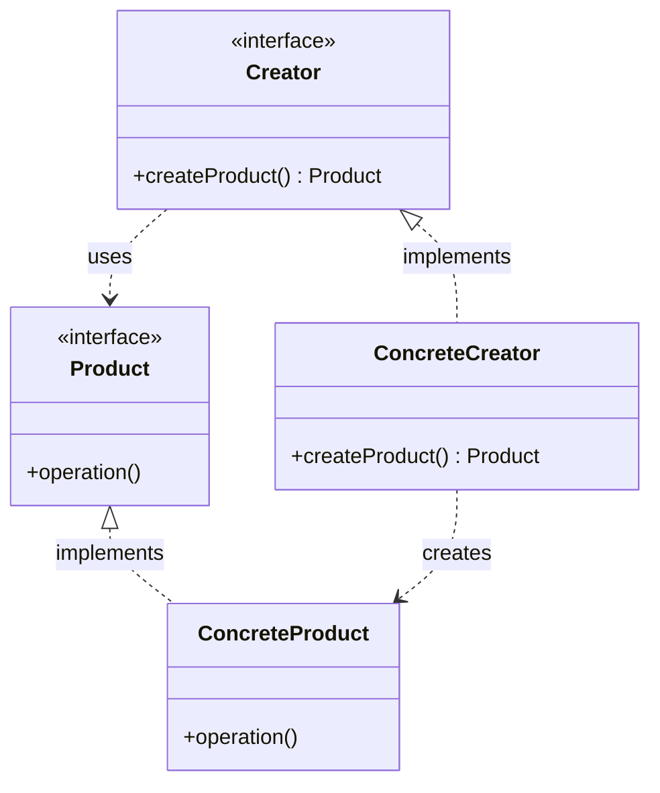
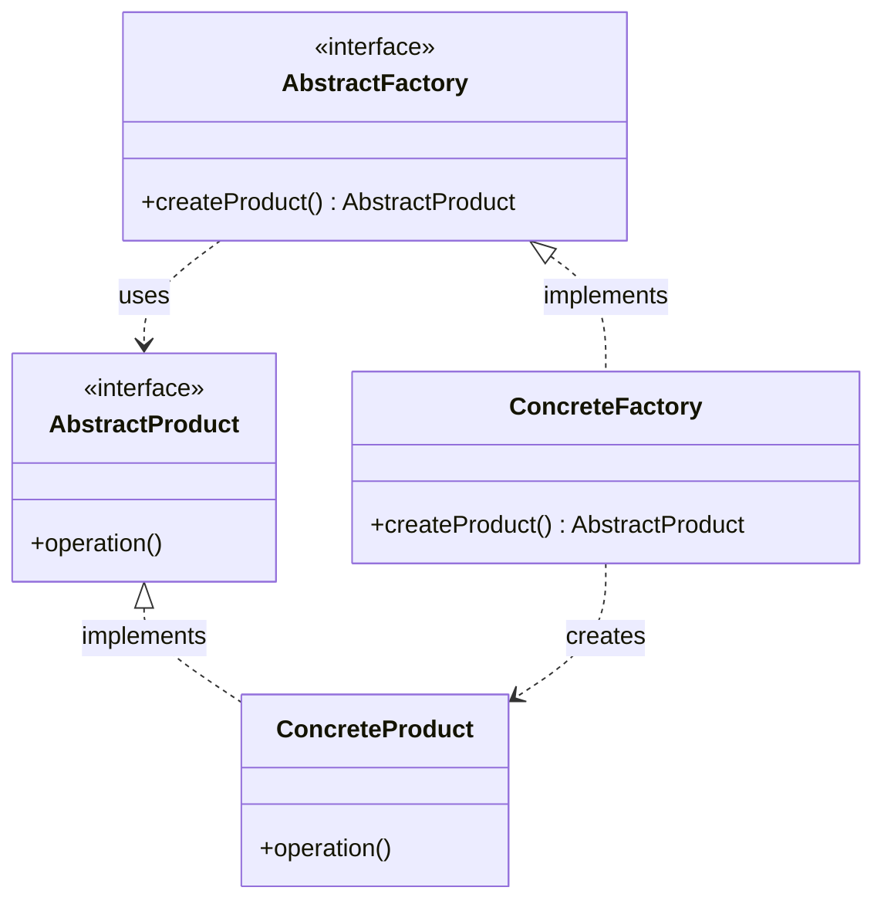
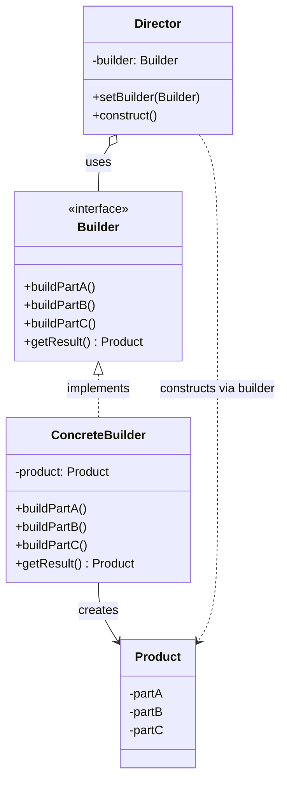
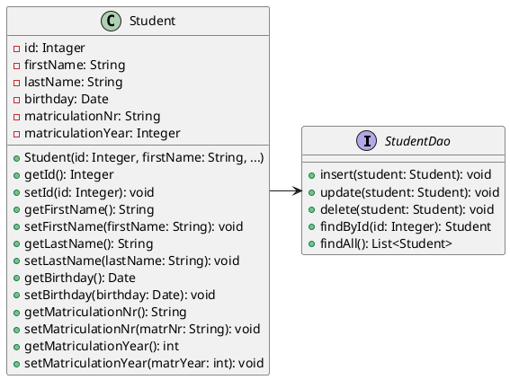

<h1>Design Patterns</h1>

<h2>Inhaltsverzeichnis</h2>

- [1. Allgemeines zu Design Patterns](#1-allgemeines-zu-design-patterns)
- [2. Creational Patterns](#2-creational-patterns)
  - [2.1. Das `Singleton Pattern`](#21-das-singleton-pattern)
    - [2.1.1. Implementierungsvarianten des Singleton Pattern](#211-implementierungsvarianten-des-singleton-pattern)
    - [2.1.2. Anwendungsbeispiele zum `Singleton` Pattern](#212-anwendungsbeispiele-zum-singleton-pattern)
  - [2.2. Das `Factory Pattern`](#22-das-factory-pattern)
    - [2.2.1. Einfache Beispielimplementierung eines Factory Patterns](#221-einfache-beispielimplementierung-eines-factory-patterns)
    - [2.2.2. Anwendungspbeispiele für ein `Factory` Pattern](#222-anwendungspbeispiele-für-ein-factory-pattern)
  - [2.3. (V) Das `Abstract Factory Pattern`](#23-v-das-abstract-factory-pattern)
    - [2.3.1. Einfache Beispielimplementierung eines `Abstract Factory` Patterns](#231-einfache-beispielimplementierung-eines-abstract-factory-patterns)
    - [2.3.2. Anwendungsbeispiele zum `Abstract Factory` Pattern](#232-anwendungsbeispiele-zum-abstract-factory-pattern)
  - [2.4. Das `Builder Pattern`](#24-das-builder-pattern)
    - [2.4.1. Einfache Beispielimplementierung eines Builder Patterns](#241-einfache-beispielimplementierung-eines-builder-patterns)
    - [2.4.2. Beispielimplementierung zur Erstellung von `immutable` Objects mittels `method-chaining`](#242-beispielimplementierung-zur-erstellung-von-immutable-objects-mittels-method-chaining)
    - [2.4.3. Anwendungsbeispiele zum `Builder` Pattern](#243-anwendungsbeispiele-zum-builder-pattern)
- [3. Structural Design Patterns](#3-structural-design-patterns)
  - [3.1. Bekannte Structural Patterns](#31-bekannte-structural-patterns)
  - [3.2. Das Proxy - Pattern und deren Varianten](#32-das-proxy---pattern-und-deren-varianten)
    - [3.2.1. Implementierungsvarianten des Proxy Patterns](#321-implementierungsvarianten-des-proxy-patterns)
- [4. `Behavioural` Patterns](#4-behavioural-patterns)
  - [4.1. Bekannte Behavioral Patterns](#41-bekannte-behavioral-patterns)
  - [4.2. Das `State Pattern`](#42-das-state-pattern)
    - [4.2.1. Konkretes Beispiel eines `State` Patterns](#421-konkretes-beispiel-eines-state-patterns)
    - [4.2.3. Beispiel eines komplexeren State Patterns](#423-beispiel-eines-komplexeren-state-patterns)
    - [4.2.4. Vorgangsweise bei der Iplementierung des State Patterns](#424-vorgangsweise-bei-der-iplementierung-des-state-patterns)
    - [4.3.1. Beispielimplementierung eines `Observer` Patterns](#431-beispielimplementierung-eines-observer-patterns)
    - [4.3.2. Anwendungsbeispiele zum `Observer` Pattern](#432-anwendungsbeispiele-zum-observer-pattern)
  - [4.4. Das `D`ata `A`ccess `O`bject Pattern](#44-das-data-access-object-pattern)
    - [4.4.1. Beispiel Implementieurng eines DAO - Patterns](#441-beispiel-implementieurng-eines-dao---patterns)
    - [4.4.2. Anwendungsbeispiele für das DAO - Pattern](#442-anwendungsbeispiele-für-das-dao---pattern)
- [5. 5.Anwendung der unterschiedlichen Pattern in einer Applikation](#5-5anwendung-der-unterschiedlichen-pattern-in-einer-applikation)
  - [5.1. WebShop Beispiel](#51-webshop-beispiel)
  - [5.2. Adventure Game Beispiel](#52-adventure-game-beispiel)
  - [5.3. Fiteness App Beispiel](#53-fiteness-app-beispiel)
- [6. Glossar von Fachbegriffen zum Thema Design Patterns](#6-glossar-von-fachbegriffen-zum-thema-design-patterns)
- [7. Spezielle Themen und Ergänzungen zum Scriptum](#7-spezielle-themen-und-ergänzungen-zum-scriptum)
  - [7.1. Spezielle Implementierungen des Singelton Patterns](#71-spezielle-implementierungen-des-singelton-patterns)

<div style="page-break-after: always;"></div>

<div style="width: 100%;"> 	
    <div style="margin-left:1.5cm; margin-right:1.5cm; text-align: center;">
    <h2>Version History</h2>
    <table style="border solid 1px;width: 100%;">
    <th style="text-align:left">Version</th>
    <th>Änderungen</th>
    <th style="text-align:right">Autor</th>
    <tr>
    <td style="text-align:left">2023-09-03</td>
    <td style="text-align:left">offizielle Erstversion für SJ 23/24</td>
    <td style="text-align:right">KUW</td>
    </tr>
    <tr>
    <td style="text-align:left">2023-10-19</td>
    <td style="text-align:left">Abschnitt 7 - Spezielle Themen und Ergänzungen zum Script hinzugefügt (ohne Inhalt)</td>
    <td style="text-align:right">KUW</td>
    </tr>
    <tr>
    <td style="text-align:left">2023-12-14</td>
    <td style="text-align:left">Strutcral Pattern Behavioral Pattern<br>
    Structural Pattern Übersicht<br>
    Arten von Proxy - Pattern
    </td>
    <td style="text-align:right">KUW</td>
    </tr>
    <tr>
    <td style="text-align:left">2024-12-05</td>
    <td style="text-align:left">Neuer Abschnitt:<br>
    4.2.2. Vorgehensweise bei der Umsetzung eines State Patterns
    </td>
    <td style="text-align:right">KUW</td>
    </tr>
    </table>
</div>

<div style="page-break-after: always"></div>


# 1. Allgemeines zu Design Patterns

Ein Design Pattern ist eine wiederverwendbare Lösung für ein wiederkehrendes Problem in der Softwareentwicklung. Es beschreibt ein bewährtes Verhaltensmuster, das in einer bestimmten Situation eingesetzt werden kann, um ein bestimmtes Problem zu lösen. Design Patterns können dazu beitragen, Code lesbarer und wartbarer zu machen und die Entwicklung von Software zu beschleunigen.  Es gibt verschiedene Arten von Design Patterns, die in objektorientierten Sprachen verwendet werden können, darunter:  
- **`Creational Patterns`**: Diese Patterns konzentrieren sich auf die **Schaffung von Objekten** und umgehen die Notwendigkeit, den Konstruktor explizit aufzurufen. Beispiele hierfür sind das `Abstract Factory` Pattern, das `Builder` Pattern und das `Prototype` Pattern.  
- **`Structural Patterns`**: Diese Patterns konzentrieren sich auf die **Struktur von Klassen und Objekten** und wie sie zusammengefügt werden, um neue Funktionalitäten zu ermöglichen. Beispiele hierfür sind das `Adapter`, das `Bridge` und das `Composite`.  
- **`Behavioral Patterns`**: Diese Patterns konzentrieren sich auf die **Kommunikation zwischen Objekten** und wie sie zusammenarbeiten, um eine bestimmte Aufgabe auszuführen. Beispiele hierfür sind das `Chain of Responsibility` Pattern, das `Command` Pattern und das `Observer` Pattern.

# 2. Creational Patterns

## 2.1. Das `Singleton Pattern`

Das Singleton Pattern ist ein **Creational Design Pattern**, das sicherstellt, dass **eine Klasse nur ein einziges Objekt** (= **Single**) hat und bietet einen **globalen Zugriffspunkt** zu diesem Objekt. Es wird verwendet, wenn genau eine Instanz einer Klasse benötigt wird und es einen globalen Zugriffspunkt dafür gibt.



Das Singleton Pattern kann dazu beitragen:

- den **Code zu vereinfachen**, indem es sicherstellt, dass nur eine Instanz einer Klasse existiert.
- es **Ressourcen** spart, indem es verhindert, dass mehrere ähnliche Objekte erstellt werden.
- es bietet eine **globale Zugriffsmöglichkeit** auf diese Instanz.

### 2.1.1. Implementierungsvarianten des Singleton Pattern

Standardimplementierungen von Singelton Patterns haben folgende Eigenschaften:

- **Privater Konstruktor**: dieser verhindert, dass eine beliebige Klasse eine Instanz der Singelton Klasse erstellen kann.
- eine `public static` - Methode, welche die Instanz der Klasse zurückliefert.

Singletons können generell auf zwei Arten instanziiert werden, deren Unterschied sich auf den Zeitpunkt der Instanz-Erstellung bezieht:

- **eager**: Wird bereits gleich beim Laden der Klasse erstellt
- **lazy**: Wird während der Laufzeit, also beim ersten Aufruf im laufenden Programm (d.h. *Laufzeit*) erstellt.

> <span style="font-size:1.5em">:mag:</span> Es gibt auch weitere spezielle Implementierungen des Singelton Patterns, die sich im Laufe der Zeit etapliert haben. Diese finden Sie im Anhang des dieses Scriptums.

#### 2.1.1.1. `Eager` Singleton

 Bei einem eager Singleton wird die Singleton-Instanz bei der Klassenladung erstellt. Dies geschieht unabhängig davon, ob die Anwendung die Singleton-Instanz tatsächlich verwendet oder nicht. Dies kann nützlich sein, wenn die Erstellung der Singleton-Instanz nicht viel Ressourcen verbraucht und die Anwendung die Singleton-Instanz in jedem Fall benötigt.

```java
public class EagerSingleton {
    private static final EagerSingleton instance = new EagerSingleton();

    private EagerSingleton() {
        // Konstruktor ist privat
    }
    
    public static EagerSingleton getInstance() {
        return instance;
    }
}
```

1. **`private static final EagerSingleton instance = new EagerSingleton();`**: Hier wird die Singleton-Instanz erstellt. Das Schlüsselwort `static` bedeutet, dass die Variable `instance` auf Klassenebene existiert und nicht auf Instanzebene. Das bedeutet, dass es **nur eine `instance`**-Variable für **alle Objekte dieser Klasse** gibt. Das Schlüsselwort `final` bedeutet, dass der **Wert** der Variable nach der Initialisierung **nicht mehr geändert** werden kann. Hier wird `instance` bei der Klassenladung instanziiert, daher handelt es sich um ein eager Singleton.

2. **`private EagerSingleton() {}`**: Der Konstruktor der Klasse ist privat. Dies bedeutet, dass keine anderen Klassen diesen Konstruktor aufrufen und neue Instanzen der Klasse `EagerSingleton` erstellen können.

3. **`public static EagerSingleton getInstance() {...}`**: Diese Methode bietet einen globalen Zugriffspunkt zur Singleton-Instanz. Jeder Aufruf dieser Methode liefert die gleiche Singleton-Instanz zurück.

Insgesamt stellt dieser Code sicher, dass es nur eine einzige Instanz der Klasse `EagerSingleton` gibt und dass es einen globalen Zugriffspunkt gibt, um diese Instanz zu erhalten.

#### 2.1.1.2. `Lazy` Singleton

Bei einem lazy Singleton wird die Singleton-Instanz erst erstellt, wenn sie das erste Mal benötigt wird. Dies kann nützlich sein, wenn die Erstellung der Singleton-Instanz viel Ressourcen verbraucht und es nicht sicher ist, ob die Anwendung die Singleton-Instanz benötigt.

```java
public class LazySingleton {
    private static LazySingleton instance;
    
    private LazySingleton() {
        // Konstruktor ist privat
    }
    
    public static LazySingleton getInstance() {
        if (instance == null) {
            instance = new LazySingleton();
        }
        return instance;
    }
}
```

1. **`private static LazySingleton instance;`**: Hier wird die Singleton-Instanz deklariert. Das Schlüsselwort `static` bedeutet, dass die Variable `instance` auf Klassenebene existiert und nicht auf Instanzebene. Dies bedeutet, dass es nur eine `instance`-Variable für alle Objekte dieser Klasse gibt. Da `instance` nicht sofort instanziiert wird, handelt es sich um ein Lazy Singleton.

2. **`private LazySingleton() {}`**: Der Konstruktor der Klasse ist **privat**. Dies bedeutet, dass keine anderen Klassen diesen Konstruktor aufrufen und neue Instanzen der Klasse `LazySingleton` erstellen können.

3. **`public static LazySingleton getInstance() {...}`**: Diese Methode bietet einen globalen Zugriffspunkt zur Singleton-Instanz. Beim ersten Aufruf dieser Methode wird die Singleton-Instanz erstellt. Bei allen weiteren Aufrufen wird die bereits erstellte Instanz zurückgegeben.

Insgesamt stellt dieser Code sicher, dass es nur eine einzige Instanz der Klasse `LazySingleton` gibt und dass es einen globalen Zugriffspunkt gibt, um diese Instanz zu erhalten. Zudem wird die Instanz erst bei ihrem ersten Gebrauch erstellt, daher wird dieses Modell als "Lazy" bezeichnet.

#### 2.1.1.3. (V) `Thread-Safe` Singleton

In einer **Multithreaded**-Umgebung kann das lazy Singleton-Modell zu Problemen führen. Wenn zwei Threads gleichzeitig auf die `getInstance()` Methode zugreifen und feststellen, dass die Singleton-Instanz `null` ist, könnten sie gleichzeitig eine neue Instanz erstellen. Dies würde dazu führen, dass zwei Singleton-Instanzen erstellt werden, was dem Singleton-Pattern widerspricht.

Um dies zu verhindern, kann ein `synchronized` Schlüsselwort zur `getInstance()` Methode hinzugefügt werden, um sicherzustellen, dass nur ein Thread gleichzeitig darauf zugreifen kann. Dies wird als Thread-Safe Singleton bezeichnet.

```java
public class ThreadSafeSingleton {
    private static ThreadSafeSingleton instance;
    
    private ThreadSafeSingleton() {
        // Konstruktor ist privat
    }
    
    public static synchronized ThreadSafeSingleton getInstance() {
        if (instance == null) {
            instance = new ThreadSafeSingleton();
        }
        return instance;
    }
}
```

Dieser Ansatz hat jedoch den Nachteil, dass er die Leistung beeinträchtigen kann, da die Synchronisation einen Overhead verursacht. Ein optimierter Ansatz wäre die Verwendung der "Double-Checked Locking" Idiom, bei dem die Synchronisation nur beim ersten Aufruf der `getInstance()` Methode erfolgt.

```java
public class DoubleCheckedLockingSingleton {
    private static volatile DoubleCheckedLockingSingleton instance;

    private DoubleCheckedLockingSingleton() {
        // Konstruktor ist privat
    }

    public static DoubleCheckedLockingSingleton getInstance() {
        if (instance == null) {
            synchronized (DoubleCheckedLockingSingleton.class) {
                if (instance == null) {
                    instance = new DoubleCheckedLockingSingleton();
                }
            }
        }
        return instance;
    }
}
```

In dieser Implementierung wird die `volatile` Variable verwendet, um sicherzustellen, dass die Singleton-Instanz sicher in einem Mehrthread-Umfeld veröffentlicht wird.

### 2.1.2. Anwendungsbeispiele zum `Singleton` Pattern

Hier sind einige Anwendungsbeispiele für das Singleton Pattern:

- Ein **System für die Protokollierung von Daten**, das eine einzige Protokolldatei verwendet, die von mehreren Teilen der Anwendung gemeinsam genutzt wird. Die Protokollierungsklasse könnte ein Singleton sein, um sicherzustellen, dass nur eine Instanz existiert, die auf die Protokolldatei zugreift.
- Ein **System zur Verwaltung von Datenbankverbindungen**, bei dem nur eine Verbindung auf einmal geöffnet sein kann. Die Datenbankverbindungsklasse könnte ein Singleton sein, um sicherzustellen, dass nur eine Verbindung geöffnet ist.
- Ein **System zur Verwaltung von Systemeinstellungen**, bei dem die Einstellungen von mehreren Teilen der Anwendung gemeinsam genutzt werden. Die Einstellungsklasse könnte ein Singleton sein, um sicherzustellen, dass nur eine Instanz existiert, die die Einstellungen speichert und zur Verfügung stellt.

## 2.2. Das `Factory Pattern`

Das Factory Pattern ist ein Creational Design Pattern, das die Instanziierung von Objekten an eine Factory-Klasse auslagert. Dieses Muster wird verwendet, wenn ein System abhängig von Klassen ist, die zur Laufzeit instanziiert werden. Die Factory-Methode erlaubt es, den genauen Typ und die Abhängigkeiten der zu erstellenden Objekte zu abstrahieren.

Das Factory Pattern besteht aus den folgenden Komponenten:

- **`Product`**: Das ist das Produkt, das die Factory erstellt. Es definiert die Schnittstelle der Objekte, die die Factory-Methode erstellt.
- **`ConcreteProduct`**: Dies ist eine Klasse, die die `Product`-Schnittstelle implementiert.
- **`Creator`**: Das ist die Factory-Schnittstell, welche die Factory-Methode definiert, um ein Product zu erstellen.
- **`ConcreteCreator`**: Dies ist eine Klasse, welche die Factory-Methode implementiert, um ein `ConcreteProduct` zu erstellen.


### 2.2.1. Einfache Beispielimplementierung eines Factory Patterns

```java
// Product
public interface Shape {
    void draw();
}

// ConcreteProduct
public class Circle implements Shape {
    public void draw() {
        System.out.println("Draw a circle");
    }
}

// ConcreteProduct
public class Square implements Shape {
    public void draw() {
        System.out.println("Draw a square");
    }
}

// Creator
public interface ShapeFactory {
     Shape createShape(String shapeType);
}

// ConcreteCreator
public class ConcreteShapeFactory implements ShapeFactory {
    public Shape createShape(String shapeType) {
        if (shapeType.equalsIgnoreCase("CIRCLE")) {
            return new Circle();
        } else if (shapeType.equalsIgnoreCase("SQUARE")) {
            return new Square();
        }
        return null;
    }
}

// Main class
public class FactoryPatternDemo {
    public static void main(String[] args) {
        ShapeFactory shapeFactory = new ConcreteShapeFactory();

        Shape circle = shapeFactory.createShape("CIRCLE");
        circle.draw();

        Shape square = shapeFactory.createShape("SQUARE");
        square.draw();
    }
}
```

In diesem Beispiel haben wir eine `Shape`-Schnittstelle (Product) und zwei Implementierungen: `Circle` und `Square` (ConcreteProduct). Wir haben auch eine `ShapeFactory`-Schnittstelle (Creator) und eine Implementierung `ConcreteShapeFactory` (ConcreteCreator), die je nach Eingabeparameter entweder ein `Circle`- oder `Square`-Objekt erstellt.

### 2.2.2. Anwendungspbeispiele für ein `Factory` Pattern

Das Factory Pattern wird verwendet, um Objekte einer Klasse bzw. einer (abgeleiteten) Klassenfamilie (z.B. `Shape`) zu erzeugen, die generell wenige Eigenschaften, besitzen, anhand dessen sie sich unterscheiden. Hier folgen einige Beispiele, in denen das Factory Pattern zum Einsatz kommt:

1. **Datenbankverbindungen**: Eine Factory-Methode kann verwendet werden, um eine Verbindung zu einer Datenbank herzustellen. Die genaue Art der Datenbank (z.B. MySQL, PostgreSQL, MongoDB) kann zur Laufzeit bestimmt werden
2. **GUI-Elemente**: In einem grafischen Benutzeroberflächen-Framework könnte eine Factory-Methode verwendet werden, um verschiedene Arten von Widgets zu erstellen, wie z.B. Buttons, Textfelder, Checkboxes usw.
3. **Dateiformat-Konverter**: Eine Factory könnte verwendet werden, um verschiedene Arten von Konvertern zu erstellen, die Dateien von einem Format in ein anderes umwandeln (z.B. von CSV zu JSON, von XML zu CSV usw.).

## 2.3. (V) Das `Abstract Factory Pattern`

Das Abstract Factory Pattern ist eine **Erweiterung des Factory Patterns**. Es ist ein Creational Design Pattern, das eine Schnittstelle für die **Erstellung von Familien** verwandter oder abhängiger Objekte bereitstellt, ohne ihre konkreten Klassen anzugeben. Anstatt dass eine Factory nur eine Art von Produkt ( z.B. `Shape`) erstellt, erstellt die Abstract Factory eine Familie von Produkten (z.B. GUI-Elemente für Windows oder MacOS).

Das Abstract Factory Pattern besteht aus den folgenden Komponenten:

- **`AbstractProduct`**: Dies definiert eine Produktschnittstelle.
- **`ConcreteProduct`**: Dies ist eine Klasse, die die `AbstractProduct`-Schnittstelle implementiert.
- **`AbstractFactory`**: Diese Schnittstelle enthält die Signatur für die Erstellung einer Familie von Produkten.
- **`ConcreteFactory`**: Dies ist eine Klasse, die die `AbstractFactory`-Schnittstelle implementiert und konkrete Produkte erstellt.




### 2.3.1. Einfache Beispielimplementierung eines `Abstract Factory` Patterns

```java
// AbstractProduct
interface Button {
    void click();
}

// ConcreteProduct
class WindowsButton implements Button {
    public void click() {
        System.out.println("Windows button click");
    }
}

// ConcreteProduct
class MacOSButton implements Button {
    public void click() {
        System.out.println("MacOS button click");
    }
}

// AbstractFactory
interface GUIFactory {
    Button createButton();
}

// ConcreteFactory
class WindowsFactory implements GUIFactory {
    public Button createButton() {
        return new WindowsButton();
    }
}

// ConcreteFactory
class MacOSFactory implements GUIFactory {
    public Button createButton() {
        return new MacOSButton();
    }
}

// Main class
public class AbstractFactoryPatternDemo {
    public static void main(String[] args) {
        GUIFactory factory;
        Button button;

        factory = new WindowsFactory();
        button = factory.createButton();
        button.click();

        factory = new MacOSFactory();
        button = factory.createButton();
        button.click();
    }
}
```

In diesem Beispiel haben wir eine `Button`-Schnittstelle (AbstractProduct) und zwei Implementierungen: `WindowsButton` und `MacOSButton` (ConcreteProduct). Wir haben auch eine `GUIFactory`-Schnittstelle (AbstractFactory) und zwei Implementierungen: `WindowsFactory` und `MacOSFactory` (ConcreteFactory), die je nach Betriebssystem entweder ein `WindowsButton`- oder `MacOSButton`-Objekt erstellen.

### 2.3.2. Anwendungsbeispiele zum `Abstract Factory` Pattern

Das Abstract Factory Pattern wird verwendet, wenn ein System unabhängig von der Art der erstellten **Produktfamilien** sein muss und/oder das System mit **mehreren Produktfamilien** konfiguriert werden muss. Hier sind einige Beispiele:

1. **Cross-Platform UI-Rendering**: Ein Abstract Factory Pattern könnte verwendet werden, um UI-Elemente für verschiedene Plattformen zu erstellen. Zum Beispiel könnte es eine Factory für Windows geben, die Windows-spezifische Buttons, Menüs usw. erstellt, und eine andere Factory für MacOS, die MacOS-spezifische UI-Elemente erstellt.
2. **Datenbankmigrationen**: Ein Abstract Factory Pattern könnte verwendet werden, um Migrationsskripte für verschiedene Datenbanksysteme zu erstellen. Zum Beispiel könnte es eine Factory für MySQL geben, die MySQL-spezifische Migrationsskripte erstellt, und eine andere Factory für PostgreSQL, die PostgreSQL-spezifische Migrationsskripte erstellt
3. **Spieleentwicklung**: In der Spieleentwicklung könnte ein Abstract Factory Pattern verwendet werden, um verschiedene Arten von Spielobjekten zu erstellen, abhängig von der Spielumgebung. Zum Beispiel könnte es eine Factory für Weltraumspiele geben, die Raumschiffe, Aliens usw. erstellt, und eine andere Factory für Fantasy-Spiele, die Ritter, Drachen usw. erstellt.

## 2.4. Das `Builder Pattern`

Das Builder Pattern ist ein Creational Design Pattern, das Ihnen hilft, **komplexe Objekte** Schritt für Schritt zu erstellen. Es bietet Ihnen die Möglichkeit, Objekte in mehreren Schritten zu erstellen, indem Sie immer nur das nächste benötigte Teil hinzufügen, anstatt das gesamte Objekt in einem großen Konstruktor, der alle Parameter enthält, zu erstellen.

Das Builder Pattern kann dazu beitragen:
- den **Code zu vereinfachen**, indem es sicherstellt, dass alle erforderlichen Felder gesetzt werden, bevor ein neues Objekt erstellt wird
- es sicherstellt, dass die **Erstellung** eines Objekts **in einem einzigen Ort konzentrier**t wird. 
- die **Lesbarkeit und Wartbarkeit** des Codes zu verbessern, indem es sicherstellt, dass alle Schritte zur **Erstellung eines Objekts an einem einzigen Ort dokumentiert** sind.

Das Builder Pattern besteht aus folgenden Komponenten:

- **`Builder`** (**optional**): Die Schnittstelle, die die Methoden zum Erstellen des Produkts definiert.
- **`ConcreteBuilder`**: Die konkrete Implementierung der Builder-Schnittstelle, die die Methoden zum Erstellen des Produkts implementiert.
- **`Director`**: Der Code, der die ConcreteBuilder-Methoden aufruft, um das Produkt Schritt für Schritt zu erstellen.
- **`Product`**: Das komplexe Objekt, das von dem Builder erstellt wird.




### 2.4.1. Einfache Beispielimplementierung eines Builder Patterns

```java
// Builder
interface Builder {
  void setType(Type type);
  void setSeats(int seats);
  void setEngine(Engine engine);
  void setTransmission(Transmission transmission);
  void setTripComputer(TripComputer tripComputer);
  void setGPS(GPS gps);
}

// ConcreteBuilder
class CarBuilder implements Builder {
  private Car car;

  public CarBuilder() {
    car = new Car();
  }

  public void setType(Type type) {
    car.setType(type);
  }

  public void setSeats(int seats) {
    car.setSeats(seats);
  }

  public void setEngine(Engine engine) {
    car.setEngine(engine);
  }

  public void setTransmission(Transmission transmission) {
    car.setTransmission(transmission);
  }

  public void setTripComputer(TripComputer tripComputer) {
    car.setTripComputer(tripComputer);
  }

  public void setGPS(GPS gps) {
    car.setGPS(gps);
  }

  public Car getResult() {
    return car;
  }
}

// Director
class Director {
  private Builder builder;

  public void setBuilder(Builder builder) {
    this.builder = builder;
  }

  public Car buildCar() {
    builder.setType(Type.COUPE);
    builder.setSeats(2);
    builder.setEngine(new Engine(3.0, 0));
    builder.setTransmission(Transmission.MANUAL);
    builder.setTripComputer(new TripComputer());
    builder.setGPS(new GPS());
    return builder.getResult();
  }
}

// Product
class Car {
  private Type type;
  private int seats;
  private Engine engine;
  private Transmission transmission;
  private TripComputer tripComputer;
  private GPS gps;
}
```

### 2.4.2. Beispielimplementierung zur Erstellung von `immutable` Objects mittels `method-chaining`

Zunächst eine Erkärung zu den beiden Begriffen **immutable** und **method-chaining**: 

- **"Immutable"** bezieht sich auf Objekte, die nicht verändert werden können, nachdem sie erstellt wurden. Ein immutable Objekt ist ein Objekt, dessen Zustand nicht geändert werden kann, nachdem es konstruiert wurde. Dies steht im Gegensatz zu einem **"mutable"** Objekt, das nach seiner Erstellung modifiziert werden kann. In Java wird ein immutable Objekt typischerweise dadurch erstellt, dass alle seine Felder final sind und dass keine Setter-Methoden bereitgestellt werden. Dies verhindert, dass der Zustand des Objekts nach seiner Konstruktion verändert werden kann.

- **"Method chaining"** ist eine Technik, bei der mehrere Methoden auf demselben Objekt aufgerufen werden, wobei jede Methode das Objekt selbst zurückgibt. Dies ermöglicht es, die Methoden in einer einzigen Anweisung "anzuketten", anstatt jede Methode in einer separaten Zeile aufzurufen. Method chaining wird oft verwendet, um fluide Schnittstellen zu erstellen, die für die einfache Lesbarkeit und Verwendung entwickelt wurden.
```java
StringBuilder sb = new StringBuilder();
sb.append("Hello").append(" ").append("world").append("!");
```
In diesem Beispiel wird die Methode `append()` mehrmals auf demselben `StringBuilder`-Objekt aufgerufen, wobei jeder Aufruf eine Referenz auf das Objekt selbst zurück. 

**Implementierung des Builder - Patterns für die Klasse `Computer`:**

```java
public class Computer {
    private String cpu;
    private String gpu;
    private int gbRam;
    private int gbSSD;
    private int gbHDD;
    private String os;

    private Computer(ComputerBuilder builder) {
        this.cpu = builder.cpu;
        this.gpu = builder.gpu;
        this.gbRam = builder.gbRam;
        this.gbSSD = builder.gbSSD;
        this.os = builder.os;
    }

    public static class ComputerBuilder {
        private String cpu;
        private String gpu;
        private int gbRam;
        private int gbSSD;

        private String os;

        public ComputerBuilder(String cpu, int gbRam) {
            this.cpu = cpu;
            this.gbRam = gbRam;
        }

        public ComputerBuilder gpu(String gpu) {
            this.gpu = gpu;
            return this;
        }

        public ComputerBuilder gbSSD(int gbSSD) {
            this.gbSSD = gbSSD;
            return this;
        }

           
        public ComputerBuilder os(String os) {
            this.os = os;
            return this;
        }

        private void validate() throws NotSupportedConfigurationException {
           
            if (this.gbRam <= 8 && gpu != null) {
                throw new NotSupportedConfigurationException("GPU not supported if Ram <= 8GB");
            }
        }

        public Computer build() throws NotSupportedConfigurationException {
            validate();
            return new Computer(this);
        }
    }
}
```
In dieser speziellen Implementierung des Builder Patterns wird eine **innere Klasse** `ComputerBuilder` definiert, die als Builder für die äußere Klasse `Computer` dient. Der `ComputerBuilder` hat die gleichen Felder wie Computer, welcher **einen private** Konstruktor und **keine public Setter-Methoden** hat. Stattdessen stellt der `ComputerBuilder` spezielle Methoden wie `gpu()` und `gbSSD()`, bereit, die als "Setter" fungieren und das ComputerBuilder-Objekt zurückgeben, damit weitere Methoden direkt aufgerufen werden können (= **method-chaining**). Es gibt auch eine `validate()`-Methode, die verwendet wird, um zu überprüfen, ob die **aktuelle Konfiguration des Computers unterstützt** wird. Schließlich gibt es die **build()**-Methode, die verwendet wird, um ein neues Computer-Objekt zu erstellen, indem sie die Felder des ComputerBuilder übergibt.

###  2.4.3. Anwendungsbeispiele zum `Builder` Pattern

Hier sind einige Anwendungsbeispiele für das Builder Pattern:

- Ein **System zum Erstellen von Lebensläufen**, das verschiedene Abschnitte wie persönliche Informationen, Bildungshintergrund und Arbeitserfahrung enthält. Der Benutzer kann jeden Abschnitt einzeln ausfüllen und das System verwendet den Builder, um das Lebenslauf-Objekt schrittweise zusammenzusetzen.
- Ein **System zum Erstellen von Mahlzeiten**, das verschiedene Zutaten wie Fleisch, Gemüse und Saucen enthält. Der Benutzer wählt die gewünschten Zutaten aus und das System verwendet den Builder, um das Mahlzeit-Objekt schrittweise zusammenzusetzen.
- Ein **System zum Erstellen von Formularen**, das verschiedene Formularelemente wie Textfelder, Auswahllisten und Schaltflächen enthält. Der Benutzer wählt die gewünschten Formularelemente aus und das System verwendet den Builder, um das Formular-Objekt schrittweise zusammenzusetzen.

# 3. Structural Design Patterns

Structural Patterns, auf Deutsch Strukturelle Muster, sind Konzepte in der Softwareentwicklung, die sich damit beschäftigen, wie man Objekte und Klassen zu größeren Strukturen zusammenfügt. Diese Muster helfen dabei, eine Software so zu gestalten, dass sie nicht nur gut funktioniert, sondern auch leicht zu verstehen, zu erweitern und zu warten ist.

Stellen Sie sich vor, Sie bauen ein Haus. In diesem Fall wären die Structural Patterns wie die Baupläne, die Ihnen zeigen, wie Sie verschiedene Teile wie Ziegel, Holz und Glas zu Wänden, Fenstern und Türen zusammenfügen. Genau wie beim Hausbau, wo Sie verschiedene Materialien zusammenfügen, um eine stabilere und funktionalere Struktur zu schaffen, helfen Ihnen Structural Patterns, verschiedene Teile Ihrer Software so zu kombinieren, dass sie gut zusammenarbeiten.

## 3.1. Bekannte Structural Patterns
 
Einige der bekanntesten Structural Patterns sind:

1. **Adapter Pattern**: Dieses Muster ist wie ein Adapterstecker, den Sie verwenden, wenn Ihr Handy-Ladegerät nicht in die Steckdose passt. Es hilft zwei unvereinbare Schnittstellen zusammenzubringen, so dass sie zusammenarbeiten können.

2. **Composite Pattern**: Dieses Muster organisiert Objekte in Baumstrukturen, um Teil-Ganzes-Hierarchien zu repräsentieren. Es ist, als würden Sie ein Puzzle zusammensetzen, bei dem jedes Teil zum Gesamtbild beiträgt.

3. **Proxy Pattern**: Ein Proxy ist wie ein Stellvertreter oder Mittelsmann. Stellen Sie sich vor, Sie haben einen Assistenten, der Ihre Post sortiert und Ihnen nur das Wichtigste gibt. Der Proxy handelt im Namen eines anderen Objekts, um den Zugriff auf dieses zu kontrollieren oder zu vereinfachen.

4. **Bridge Pattern**: Das Bridge Pattern trennt eine Abstraktion von ihrer Implementierung, so dass beide unabhängig voneinander variieren können. Es ist, als hätten Sie eine Fernbedienung (die Abstraktion) und verschiedene Geräte wie einen Fernseher oder ein Radio (die Implementierungen), die Sie mit derselben Fernbedienung steuern können.
5. **Facade Pattern**: Das Facade Pattern bietet eine vereinfachte Schnittstelle zu einem komplexen Subsystem. Es ist so, als hätten Sie eine einfache Fernbedienung, die die komplizierten Steuerungssysteme eines Hauses (wie Beleuchtung, Heizung, Sicherheitssysteme) mit nur wenigen Tasten bedient. Das Facade Pattern verbirgt die Komplexität und bietet dem Nutzer eine einfache, benutzerfreundliche Schnittstelle.

> <span style="font-size: 1.5em">:bulb:</span> Diese Muster sind hilfreich, um große und komplexe Softwareanwendungen zu strukturieren. Sie sorgen dafür, dass der Code sauber, gut organisiert und flexibel bleibt, was die Wartung und Erweiterung der Software erleichtert.

## 3.2. Das Proxy - Pattern und deren Varianten

Das Proxy Pattern ist ein Struktur-Designmuster, das als Stellvertreter für ein anderes Objekt dient, um den Zugriff auf dieses zu steuern. Es ist besonders nützlich, wenn Objekte aufgrund von Netzwerklatenz, hoher Speicherkosten oder Sicherheitsaspekten nicht direkt zugänglich sein sollen. Ein Proxy kann die gleiche Schnittstelle wie das eigentliche Objekt implementieren und fungiert somit als Zwischenschicht.

### 3.2.1. Implementierungsvarianten des Proxy Patterns

Es gibt verschiedene Arten von Proxies, darunter:

- **Virtueller Proxy**: Verzögert die Erstellung eines teuren Objekts, bis es tatsächlich benötigt wird.
- **Schutz-Proxy**: Kontrolliert den Zugriff auf das Objekt, oft im Kontext von Sicherheitsanforderungen.
- **Remote Proxy**: Stellt ein lokales Repräsentant für ein Objekt in einem anderen Adressraum dar, typischerweise bei Verteilten Systemen.
- **Smart Proxy**: Fügt zusätzliche Aktionen hinzu, wenn auf das Objekt zugegriffen wird, wie Referenzzählung oder Thread-Sicherheit.
  
# 4. `Behavioural` Patterns

Behavioral Patterns, oder auf Deutsch Verhaltensmuster, sind ein wichtiger Bestandteil der Entwurfsmuster in der Softwareentwicklung. Diese Muster fokussieren sich darauf, wie Objekte und Klassen miteinander interagieren und kommunizieren. Während andere Muster sich darauf konzentrieren, wie Strukturen aufgebaut oder Objekte erstellt werden, geht es bei den Behavioral Patterns darum, effiziente, flexible und intuitive Wege zu finden, um das Verhalten in einem Software-System zu organisieren.

Stellen Sie sich vor, Sie organisieren eine Party. Jeder Gast (ähnlich wie ein Objekt in Ihrem Code) hat eine bestimmte Rolle oder ein Verhalten, wie zum Beispiel Tanzen, Essen servieren oder Musik auswählen. Behavioral Patterns helfen dabei, diese Interaktionen zu strukturieren und zu koordinieren, damit die Party reibungslos abläuft.

## 4.1. Bekannte Behavioral Patterns

Einige bekannte Behavioral Patterns sind:

1. **Observer Pattern**: Dieses Muster ist wie eine Nachrichtenagentur, die Nachrichten an ihre Abonnenten sendet. In der Software sendet ein Objekt (der „Sender“) Updates an andere Objekte (die „Beobachter“), die auf diese Änderungen reagieren.

2. **Strategy Pattern**: Dieses Muster ermöglicht es, die Strategie (d.h. den Algorithmus) eines Objekts dynamisch zu ändern. Es ist, als hätten Sie verschiedene Reiserouten zur Auswahl, und Sie können entscheiden, welche Route Sie basierend auf dem aktuellen Verkehr nehmen.

3. **Command Pattern**: Hier werden Anfragen oder einfache Operationen in Objekte gekapselt. Dies erlaubt es Ihnen, Anfragen zu queueen, zu protokollieren oder rückgängig zu machen, ähnlich wie eine Fernbedienung verschiedene Befehle für ein Gerät speichert.

4. **State Pattern**: Dieses Muster ermöglicht einem Objekt, sein Verhalten zu ändern, wenn sein interner Zustand wechselt. Es ist, als ob sich Ihre Persönlichkeit ändert, je nachdem, ob Sie müde, hungrig oder aufgeregt sind.

5. **Iterator Pattern**: Dieses Muster gibt eine Möglichkeit, auf die Elemente einer Sammlung zuzugreifen, ohne deren zugrundeliegende Repräsentation zu enthüllen. Es ist, als ob Sie ein Buch Seite für Seite lesen, ohne zu wissen, ob es sich um ein gedrucktes Buch oder ein E-Book handelt.

> <span style="font-size: 1.5em">:bulb:</span> Behavioral Patterns sind entscheidend, um sicherzustellen, dass die verschiedenen Teile Ihrer Software gut zusammenarbeiten. Sie helfen dabei, Code sauber und organisiert zu halten und sorgen dafür, dass die Komponenten einer Anwendung effektiv miteinander kommunizieren können.

## 4.2. Das `State Pattern`

Das State Pattern ist ein Behavioral Design Pattern, das es Ihnen ermöglicht, das Verhalten eines Objekts zu ändern, wenn sich sein interner Zustand ändert. Es ermöglicht es Ihnen, den Code für die Verarbeitung von Zustandswechseln in separate Klassen auszulagern, um ihn wiederverwendbar und änderungssicher zu machen.

Das State Pattern besteht aus folgenden Komponenten:

- **`Context`**: Das Objekt, dessen Verhalten sich ändert, wenn sich sein Zustand ändert. Der Context **delegiert** (= übergibt die Aufgabe/Verantwortung) die Verarbeitung von Zustandswechseln an die State-Klasse.
- **`State`**: Die Schnittstelle, die die Methoden für die Verarbeitung von Zustandswechseln definiert.
- **`ConcreteState`**: Die konkrete Implementierung der State-Schnittstelle, die die Methoden für die Verarbeitung von Zustandswechseln implementiert.
  
```plantuml  
:[uml-digramm: observer pattern](./diagrams/state_pattern_class_dg.puml)
```

### 4.2.1. Konkretes Beispiel eines `State` Patterns
State - Diagramm zum Beispiel einer Lampe, die ein- und ausgeschaltet werden kann.
```plantuml
:[uml-digramm: observer pattern](./diagrams/ligthBlub_state_dg.puml)
```
#### 3.1.1.1. Implementierung des State-Patterns:

```java
interface LampState {
  void switchOn(Lamp context);
  void switchOff(Lamp context);
}

class OffState implements LampState {
  public static LampState INSTANCE = new OffState();

  private OffState() {}

  @Override
  public void switchOn(Lamp context) {
    context.setState(PowerOn.INSTANCE);
    System.out.println("Turning on the lamp");
    context.setLightOn();
   
  }

  @Override
  public void switchOff(Lamp context) {
    // Kein Statuswechsel!!
    System.out.println("The lamp is already off");
  }
}

class OnState implements LampState {
  public static LampState INSTANCE = new OnState();

  private OnState() {}

  @Override
  public void switchOn(Lamp context) {
    // kein Statuswechsel!!
    System.out.println("The lamp is already on");
  }

  @Override
  public void switchOff(Lamp context) {
    context.setState(PowerOff.INSTANCE);
    System.out.println("Turning off the lamp");
    context.setLightOff();
    
  }
}

class Lamp {
  private LampState state;
  private boolean lightOn = false;

  public Lamp() {
    state = OffState.INSTANCE;
  }

  public void switchOn() {
    state.switchOn(this)
  }

  public void switchOff() {
    state.switchOff(this);
  }

  public void setLightOn() {
    lightOn = true;
  }

  public void setLightOff() {
    lightOn = false;
  }
}

// Usage
Lamp lamp = new Lamp();
lamp.switchOn(); // Turning on the lamp
lamp.switchOn(); // The lamp is already on
lamp.switchOff(); // Turning off the lamp
lamp.switchOff(); // The lamp is already off

```

Dieser Code ist eine Implementierung des **State-Design-Musters**. Die Schnittstelle `LampState` definiert zwei Methoden, `switchOn()` und `switchOff()`, die von konkreten Zustandsklassen implementiert werden. Die Klassen `OffState` und `OnState` sind konkrete Implementierungen der Schnittstelle `LampState`. Sie haben beide ein statisches Feld `INSTANCE`, das es ihnen ermöglicht, als **Singleton-Objekte** verwendet zu werden. Die Klasse `OffState` hat einen **privaten Konstruktor**, der verhindert, dass sie direkt instanziiert wird. Stattdessen muss das Feld `INSTANCE` verwendet werden, um eine **Referenz** auf das **`OffState`-Objekt** zu erhalten. Die Klasse `OnState` ist auf ähnliche Weise implementiert.
> **Achtung:** Als Datentyp für die `INSTANCE` Variable ist immer das State - Interface (hier `LampState`) zu verwenden (z.B. `LampState INSTANCE = new OffState()`). Anderenfalls wäre es nicht möglich den entsprechenden State in der **Context** Klasse (hier `Lamp`) zu setzen.

Die Klasse `Lamp` hat ein Feld `state` vom Typ `LampState` und ein boolesches Feld `lightOn`. Die Methoden `switchOn()` und `switchOff()` delegieren die Aufgabe an das **aktuelle Zustandsobjekt**, die entsprechende Aktion auszuführen. Die Methoden `setLightOn()` und `setLightOff()` werden von den Zustandsobjekten verwendet, um das Feld `lightOn` des Objekts der Klasse `Lamp` zu aktualisieren.

Die Klasse `Lamp` hat einen initialen Zustand von `OffState`, was bedeutet, dass die Lampe ausgeschaltet ist, wenn sie erstellt wird. Die Methode `switchOn()` kann aufgerufen werden, um die Lampe einzuschalten, und die Methode `switchOff()` kann aufgerufen werden, um die Lampe auszuschalten. Wenn die Methode `switchOn()` aufgerufen wird, wenn die Lampe bereits eingeschaltet ist, wird das `OnState`-Objekt eine Meldung ausgeben, dass die Lampe bereits eingeschaltet ist. Wenn die Methode `switchOff()` aufgerufen wird, wenn die Lampe bereits ausgeschaltet ist, wird das `OffState`-Objekt eine Meldung ausgeben, dass die Lampe bereits ausgeschaltet ist.

### 4.2.3. Beispiel eines komplexeren State Patterns


Dieses hier dargestellte State Diagramm einer Kaffemaschine enthält sowohl Zustände (= States) und Zustandsübergänge/Aktionen, auf die von **Aussen** (hier Benutzer) **Einfluss genommen** werden kann (***hier grün dargestellt***), als auch rein interne Zustände/Zustandsübergange die nur **innerhalb** der Kaffeemaschine (= Context Objekt) ablaufen. 

In diesem Zustandsdiagramm gibt es auch **Zustände** von denen aus **mehr als ein Zustandsübergang/Zustandsaktion** durchgeführt werden kann (z.B. die Zustände `ProductSelected` oder `ProductNotAvailable`). Die **Entscheidung welcher der möglichen Zustandsübergänge/Aktionen** durchgeführt wird, muss in jenem **Zustandsübergang/Aktion** (hier `selectProduct`) getroffen werden, von dem das Context - Objekt (hier `CoffeeMachine`) **in den neuen Zustand** (z.B. `ProductSelected`) versetzt wurde - *siehe folgendes Codesnippet*.
```java
public class StandByState implements CoffeeMachineState {
  ...

  public void selectProduct(CoffeeMachine context, ProductType product) {
		context.setState(ProductSelectedState.INSTANCE);
		if (context.isProductAvailable(product)) {
			context.prepareProduct(product);
		} else {
			context.displayError();
		}
	}
}
```
Analog dazu fällt die Entscheiung ob vom Zustand `ProductNotAvailable` die Zustandsaktion `backToStandby` oder `setOutOfOrder` durchgeführt wird, in der Zustandsübergangaktion `displayError` - *siehe folgendes Codesnippet*
```java
public class ProductSeledted implements CoffeeMachineState {
  @Override
	public void displayError(CoffeeMachine context) {
    // Setzen des neuen Zustand GLEICH zu BEGINN
		context.setState(ProductNotAvailableState.INSTANCE);
		if (context.isCacaoAvailable() || context.isCappucinoAvailable()
				|| context.isEspressoAvailable()) {
			System.out.println("Ausgewähltes Produkt nicht verfügbar!");
			context.backToStandBy();
		} else {
			context.setOutOfOrder();
		}
	}
}
``` 

Zu beachten ist, dass beim Aufruf der Methode der Zustandsaktion (z.B. `displayError(CoffeeMachine context)` **gleich als erstes der aktuelle Zustand im Context - Objekt** gesetzt werden muss (z.B. `ProductNotAvailableState`), da sonst die beiden mögliche Zustandsaktionen (hier `backToStandby` bzw. `setOutOfOrder`) nicht aufgerufen werden können.

Das Auslösen von Zustandsübergänge/Aktionen die ohne Beeinflussung von aussen (z.B. vom Benutzer), also intern ablaufen und somit auch nicht von aussen beeinflusst/ausgelöst werden können, ist es üblich, dass diese **direkt in der State Klasse durchgeführt werden** werden (hier `prepareProduct`, `displayError`, `backToStandBy` und `setOutOfOrder`) - *siehe folgende Codesnippets*

```java
public class StandByState implements CoffeeMachineState {
@Override
	public void selectProduct(CoffeeMachine context, ProductType product) {
		context.setState(ProductSelectedState.INSTANCE);
		if (context.isProductAvailable(product)) {
      // INTERNER Statuswechsel
			context.prepareProduct(product);
		} else {
      // INTERNER Statuswechsel
			context.displayError();
		}
	}
}

public class ProductPreparedState implements CoffeeMachineState {
  ...
  @Override
	public void removeProduct(CoffeeMachine context) {
		context.setState(ProductRemovedState.INSTANCE);
		context.setProductRemoved(true);
		System.out.println("Produkt wurde entfernt!");
    // INTERNER Statuswechsel
		context.backToStandBy();
	}

}

public class ProductSelectedState implements CoffeeMachineState {
...
@Override
	public void displayError(CoffeeMachine context) {
		context.setState(ProductNotAvailableState.INSTANCE);
		if (context.isCacaoAvailable() || context.isCappucinoAvailable()
				|| context.isEspressoAvailable()) {
			System.out.println("Ausgewähltes Produkt nicht verfügbar!");
      // INTERNER Statuswechsel
			context.backToStandBy();
		} else {
      // INTERNER Statuswechsel
			context.setOutOfOrder();
		}
	}
}
```

### 4.2.4. Vorgangsweise bei der Iplementierung des State Patterns

Zunächst muss es bereits eine Context - Klasse geben (z.B. `CoffeMachine`), die aber noch nicht vollständig implementiert sein muss. 

Die weiteren Schritte sind:

1. Erstellen Sie eine Schnittstelle (oder eine abstrakte Klasse) für den Zustand (z.B. `CoffeMachineState`). Diese Schnittstelle sollte die Methoden definieren, die zum Wechseln zwischen den Zuständen (= Zustandsübergänge/Aktionen) verwendet werden. In dem `CoffeeMachine` Beispiel sind dies beispielsweise die Methoden `selectProduct`, `removeProduct`, usw.. Dabei ist den Methoden immer das **Context - Objekt** (= `CoffeeMachine`), sowie Daten, die für die Verabeitung in der Aktion notwendig sind ( = `product`) als Parameter zu übergeben. Nur dadurch ist es möglich, dass in der Methode (z.B. `selectProduct`), Änderungen am Context - Objekt (= `CoffeeMachine`), z.B. setzen des neuen Status, oder Prüfen der Verfügbarkeit von Produkten möglich (z.B. `context.isProductAvailable(product)` ist)
   
    ```java
    public interface CoffeeMachineState {
      public void selectProduct(CoffeeMachine context, ProductType product);
      ...
      public void removeProduct(CoffeMachine context);
      ...
    }
    ```
2. Identifizieren Sie die verschiedenen Zustände des Systems (z.B. anhand des bereitgestellten State - Diagramms). Im Fall einer Kaffeemaschine könnten die Zustände "`StandBy`", "`SelectProduct`", "`ProduktPrepared`" usw. sein.
3. Erstellen Sie **eine Klasse für jeden Zustand** (= `ConcreteState` Klassen), die die Zustandsschnittstelle implementiert, ohne dass die einzelnen Methoden implementiert werden.
   
      ```java
      public class StandByState extends CoffeeMachineState {

        public void selectProduct(CoffeeMachine context, ProductType product) {
          // noch ohne Implementierung ("Leerimplementierung")
        }

        public void removeProduct(CoffeeMachine context) 
        {
           // noch ohne Implementierung (("Leerimplementierung")
        }
        ...
      }
      ```
1. Nachdem sie alle `ConcreteState` - Klassen (mit "_**Leerimplentierung**_" der Methoden), können sie in der `Context` - Klasse (hier `CoffeeMachine`):
   1. State - Klassenvariable mit Getter- und Setter-Methoden
   2. den **Konstruktor** mit dem **Anfangszustand**
   3. die **Aktionsmethoden** für jeden Zustandsübergang, welche den gleichen Namen wie die Zustandsübergangsmethoden haben sollten (`selectProduct`, `removeProduct`, ...), welche wiederum die Zustandsübergang-Methoden aufrufen (z.G. `state.selectProduct(..)`)
   
    implementieren.
      ```java
        
        ...
        private CoffeMachineState state;
        
        public CoffeeMachine() {
          this.state = StandByState.INSTANCE;
        }
        ...
        public void setState(CoffeeMachineState state) {
          this.state = state;
        }
        public CoffeeMachineState getState() {
          return this.state;
        }
        ...
        public void selectProduct(ProductType product) {
          state.selectProduct(this, product);
        }
        ...
        public void removeProduct() {
          state.removeProduct(this);
        } 
      ```

2. Jetzt kann damit begonnen werden die einzelnen Methoden der `Concrete` - State Klassen **entsprechend der Anforderungen** mit den notwendigen **Zustandsänderungen** zu implementieren.
   ```java
    ...
    public StandByState implements CoffeeMachineState {
      ...
      public void selectProduct(CoffeeMachine context, ProductType product) {
          context.setState(ProductSelectedState.INSTANCE);
          if (context.isProductAvailable(product)) {
            // INTERNER Statuswechsel
            context.prepareProduct(product);
          } else {
            // INTERNER Statuswechsel
            context.displayError();
          }
      }
    }
    ```
 
3. Abschließend kann nun die **`Main`** - Applikation implementiert werden, über die Aktionen von Aussen (z.B. durch Benutzer) auf das `Context` - Objekt einwirken. Verwenden Sie Schaltflächen/Consolen-Input innerhalb der Main Methode um Benutzeingaben zu verarbeiten und rufen Sie die entsprechenden Methoden der Hauptklasse mit den entsprechenden Parametern auf.
    ```java
    public static void main(String[] args) {
      
        CoffeeMachine coffeMachine = new CoffeeMachine(10, 10, 20, 10);
        
        do {
          ProductType prodType = null;
          do {
            System.out.print("Wählen Sie ein Produkt aus (e-espresso, k-kakao, c-cappuchino): ");
            switch (sc.nextLine()) {
              ...
            }
          }while (prodType == null);
          
          coffeMachine.selectProduct(prodType);
          if (coffeMachine.getState() == ProductPreparedState.INSTANCE) {
            System.out.print("Bitte entfernen Sie das Produkt (mit Enter-Taste):");
            sc.nextLine();
            coffeMachine.removeProduct();
          }
          
        } while (coffeMachine.getState() != OutOfOrderState.INSTANCE);
      }
    ```

### 4.2.5. Anwendungsbeipiele zum State Pattern

- Ein **Autovermietungssystem**, das den **Verleihstatus** eines Autos verfolgt und entsprechende Aktionen durchführt, wie das Senden von Erinnerungen für das Rückgabedatum oder das Berechnen von Strafen für verspätete Rückgaben.
- Ein **Musikplayer**, der verschiedene **Wiedergabemodi** unterstützt, wie zufällige Wiedergabe, Wiederholung eines Titels oder Wiederholung einer Playlist. Der Musikplayer ändert sein Verhalten entsprechend, wenn der Benutzer den Wiedergabemodus ändert.
- Ein **Task-Management-System**, das den **Aufgaben Status** verfolgt und entsprechende Aktionen durchführt, wie das Senden von Erinnerungen für anstehende Aufgaben oder das Archivieren abgeschlossener Aufgaben.

## 4.3. Das `Observer` Pattern

Das Observer Pattern ist ein Behavioral Design Pattern, das es Ihnen ermöglicht, Änderungen an einem Objekt zu verfolgen und entsprechende Aktionen durchzuführen. Es ermöglicht es Ihnen, Objekte zu kapseln, die Benachrichtigungen über Änderungen an einem Objekt empfangen und auf diese reagieren.

Das Observer Pattern besteht aus folgenden Komponenten:

- **`Subject`**: Die Schnittstelle, welche das Objekt implementiert, das überwacht wird. Es bietet Methoden zum Hinzufügen, Entfernen und benachrichtigen von Observern. 
- **`ConcreteSubject`**: Die konkrete Implementierung, der `Subject` Schnittstelle (hier `StockPrice`). Diese verwaltet eine Liste (`observers`) aller registrierten `Observer`.
- **`Observer`**: Die Schnittstelle, die die Methoden für die Verarbeitung von Benachrichtigungen definiert.
- **`ConcreteObserver`**: Die konkrete Implementierung der Observer-Schnittstelle (hier `Investor`), die die Methoden für die Verarbeitung von Benachrichtigungen implementiert.
  
```plantuml
interface Subject {
  +registerObserver(Observer): void
  +removeObserver(Observer): void
  +notifyObservers(): void
}

interface Observer {
  +update(float): void
}

class StockPrice {
  -observers: List<Observer>
  -price: float
  +registerObserver(Observer): void
  +removeObserver(Observer): void
  +notifyObservers(): void
  +setPrice(float): void
}

class Investor {
  -subject: Subject
  +update(float): void
}

Subject <|-- StockPrice
Observer <|-- Investor
Observer <-- StockPrice
```

### 4.3.1. Beispielimplementierung eines `Observer` Patterns

```java
// Subject
interface Subject {
  void registerObserver(Observer observer);
  void removeObserver(Observer observer);
  void notifyObservers();
}

// ConcreteSubject
class StockPrice implements Subject {
  private List<Observer> observers;
  private float price;
  private String name;

  public StockPrice(String name) {
    this.name = name;
    // Linked List ist performanter als ArrayList!!
    observers = new LinkedList<>();
  }

  public void registerObserver(Observer observer) {
    observers.add(observer);
  }

  public void removeObserver(Observer observer) {
    observers.remove(observer);
  }

  public void notifyObservers() {
    for (Observer observer : observers) {
      observer.update(price);
    }
  }

  public void setPrice(float price) {
    this.price = price;
    notifyObservers();
  }
}

// Observer
interface Observer {
  void update(float price);
}

// ConcreteObserver
class Investor implements Observer {
  private Subject subject;

  public Investor(Subject subject) {
    this.subject = subject;
    subject.registerObserver(this);
  }

  public void update(float price) {
    // React to the price update
  }
}
```
 Die Schnittstelle `Subject` definiert Methoden zum **Registrieren und Entfernen** von `Observer` (`add/removeObserver()`) sowie zum Benachrichtigen aller registrierten `Observer` (`notifyObservers()`). Die Klasse `StockPrice` ist eine konkrete Implementierung der Schnittstelle `Subject`. Sie verwaltet eine Liste von `Observer` und stellt die erforderlichen Methoden zum Hinzufügen und Entfernen von `Observer` aus dieser Liste bereit. Wenn der Preis sich ändert, ruft die Methode `setPrice()`, welches das Feld preis aktualisiert und dann die Methode `notifyObserver()` auf, die wiederum die Methode `update()` auf allen registrierten `Observer` aufruft.

Die Schnittstelle `Observer` definiert eine einzige Methode, `update()`, die ein einzelnes Argument entgegennimmt. Diese Methode wird von dem `Subject` aufgerufen, wenn der Zustand des `Subject` sich ändert. Die Klasse `Investor` ist eine konkrete Implementierung der Schnittstelle `Observer`. Sie hat ein Feld `subject` vom Typ `Subject` und registriert sich selbst als `Observer` dieses `Subject` im Konstruktor, indem sie die Methode `registerObserver()` von dem `Subject` aufruft. Wenn die Methode `update()` aufgerufen wird, kann der `Investor` auf die **Preisaktualisierung** auf irgendeine Weise reagieren (z.B. die Aktie verkaufen/kaufen)

```java
// Usage
StockPrice knappStockPrice = new StockPrice("Knapp Logistik");

Investor investor1 = new Investor(knappStockPrice);
Investor investor2 = new Investor(knappStockPrice);

// price changes are reported to the investor
knappStockPrice.setPrice(123.4f);
...
```

### 4.3.2. Anwendungsbeispiele zum `Observer` Pattern

Hier sind einige weitere Anwendungsbeispiele für das Observer Pattern:

- Ein **Nachrichtensystem**, das Benachrichtigungen über **neue Nachrichten** an alle registrierten **Abonnenten** sendet.
- Ein **E-Commerce-System**, das Benachrichtigungen über **Preisänderungen** und Angebote an alle registrierten **Kunden** sendet.
- Ein **Wetterdienst**, der **Wetterdaten** sammelt und Benachrichtigungen über Wetterwarnungen und Vorhersagen an alle registrierten **Benutzer** sendet.


## 4.4. Das `D`ata `A`ccess `O`bject Pattern

Das Data Access Object (DAO) Pattern ist ein Entwurfsmuster in der Softwareentwicklung, das zur **Strukturierung** und Organisation von Datenbankzugriffen verwendet wird. Das DAO-Pattern stellt eine **Abstraktionsschicht** zwischen der **Anwendungslogik** und der **Datenbank** bereit, um die **Trennung von Datenzugriff und Geschäftslogik** zu ermöglichen.

Das DAO-Pattern definiert eine Schnittstelle, über die die Anwendungslogik mit der Datenbank kommunizieren kann, ohne sich um die Details der Datenbank-Implementierung kümmern zu müssen. Konkret bedeutet dies, dass alle Datenbankzugriffe über eine DAO-Schnittstelle erfolgen, und nicht direkt von der Anwendungslogik aus.

Die DAO-Schnittstelle definiert typischerweise `CRUD`-Operationen (kommt von `Create`, `Read`, `Update`, `Delete`), die von der Anwendungslogik aufgerufen werden können, um auf die Datenbank zuzugreifen. Die DAO-Implementierung kümmert sich dann um die konkrete Umsetzung dieser Operationen für die verwendete Datenbank. 

Das DAO-Pattern ermöglicht es, die **Datenbank-Implementierung auszutauschen** oder zu ändern, ohne dass dies Auswirkungen auf die Anwendungslogik hat. Es verbessert auch die Testbarkeit der Anwendung, da die DAO-Schnittstelle einfach durch eine **Mock-Implementierung** (= Dummy-Implementierung) ersetzt werden kann, um Unit-Tests durchzuführen.



Das obige Diagramm zeigt eine Schnittstelle `StudentDao`, die die `CRUD`-Operationen `insert` (entspricht create), `update` (entspricht update), `update`, `delete` sowie die weiteren Methoden `findById` und `findAll` für die Klasse `Student` definiert. Die Klasse `Student` implementiert keine Schnittstelle, sondern wird nur von der Schnittstelle `StudentDao` verwendet.

### 4.4.1. Beispiel Implementieurng eines DAO - Patterns

#### 4.1.1.1. Die POJO - Klasse (**P**lain **O**ld **J**ava **O**bject)

Die **POJO** - Klasse repräsentiert beim DAO - Pattern den **Datensatz**, wobei die **Klasse** mit der **Tabelle** und die **Attribute** mit den **Spalten** der Tabelle gleichgesetzt werden kann. 

```java
public class Product {

    private Integer productId;

    private String productName;
    private String productDesc;
    private Double productPrice;

    public Product() { }

    public Product(Integer prodcutId, String productName, String productDesc, double productPrice) {
        this.productId = productId;
        this.productName = productName;
        this.productDesc = productDesc;
        this.productPrice = productPrice;
    }

    // getter- und setter-Methoden der weiteren Attribute
}
```

> :warning: **Beachte:** Da Spalten von Tabellen `NULL` - Werte besitzen können, sollte, wenn nicht anders vorgegeben, **statt** den **primitiven Datentypen** wie `int`, `double`, `boolean` udgl. deren **Objekt Datentyp** (`Integer`, `Double`, `Boolean`, udgl.) verwendet werden, da die **primitiven Datentypen keine** `NULL`-Werte erlauben.

#### 4.1.1.2. Das DAO - Interface

```java
public interface ProductDao {
    public void insert(Product product) throws SQLExecption;
    public void update(Product product) throws SQLExecption;
    public void delete(Product product) throws SQLExecption;
    public Product getById(int id) throws SQLExecption;
    public List<Product> getAll() throws SQLExecption;
}
```

#### 4.1.1.3. Die Implementierung des DAO - Interface

Die Klasse `ProductDaoImpl` implementiert das `ProductDao`-Interface und stellt eine Verbindung zur Datenbank her, um CRUD-Operationen für die `Product`-Objekte auszuführen.

```java
import java.sql.*;
import java.util.ArrayList;
import java.util.List;

public class ProductDaoImpl implements ProductDao {
    private Connection connection;

    public ProductDaoImpl(Connection connection) {
        this.connection = connection;
    }

    @Override
    public void insert(Product product) throws SQLExeption {
        
        // In diesem Fall wird die ID automatisch
        // auf DB-Seite erstellt
        // z.B. In SQLite wird eine Spalte die als //Primärschlüssel 
        // definiert wird automatisch eine rowid erstellt
        PreparedStatement statement = connection.prepareStatement(
                "INSERT INTO products (product_name, product_desc, product_price) VALUES (?, ?, ?)");
        statement.setString(1, product.getProductName());
        statement.setString(2, product.getProductDesc());
        statement.setDouble(3, product.getProductPrice());
        statement.executeUpdate();

        statement.close();     
    }

    @Override
    public void update(Product product) throws SQLException {
        
        PreparedStatement statement = connection.prepareStatement(
                "UPDATE products SET product_name=?, product_desc=?, product_price=? WHERE product_id=?");
        statement.setString(1, product.getProductName());
        statement.setString(2, product.getProductDesc());
        statement.setDouble(3, product.getProductPrice());
        statement.setInt(4, product.getProductId());
        statement.executeUpdate();
        statement.close();
    }

    @Override
    public void delete(Product product) throws SQLException {

        PreparedStatement statement = connection.prepareStatement(
                "DELETE FROM products WHERE product_id=?");
        statement.setInt(1, product.getProductId());
        statement.executeUpdate();
        statement.close();        
    }

    @Override
    public Product getById(int id) throws SQLExecption {
        Product product = null;

        PreparedStatement statement = connection.prepareStatement(
                "SELECT * FROM products WHERE product_id=?");
        statement.setInt(1, id);
        ResultSet resultSet = statement.executeQuery();
        if (resultSet.next()) {
            product = new Product(
                    resultSet.getInt("product_id"),
                    resultSet.getString("product_name"),
                    resultSet.getString("product_desc"),
                    resultSet.getDouble("product_price"));
        }
        resultSet.close();
        statement.close();
       
        return product;
    }

    @Override
    public List<Product> getAll() {
        List<Product> products = new ArrayList<>();
        try {
            Statement statement = connection.createStatement();
            ResultSet resultSet = statement.executeQuery("SELECT * FROM products");
            while (resultSet.next()) {
                Product product = new Product(
                        resultSet.getInt("product_id"),
                        resultSet.getString("product_name"),
                        resultSet.getString("product_desc"),
                        resultSet.getDouble("product_price"));
                products.add(product);
            }
            resultSet.close();
            statement.close();
        } catch (SQLException e) {
            e.printStackTrace();
        }
        return products;
    }
}
```

Die Klasse verfügt über einen Konstruktor, der eine `Connection`-Instanz als Parameter akzeptiert und diese für alle Datenbankoperationen verwendet. Die `ProductDaoImpl`-Klasse implementiert die Methoden `insert`, `update`, `delete`, `getById` und `getAll`, die im `ProductDao`-Interface definiert sind.

Die `insert`, `update` und `delete`-Methoden verwenden `PreparedStatement`-Objekte, um SQL-Abfragen auszuführen. Diese Klasse ist eine Unterklasse von `Statement` und wird verwendet, um SQL-Anweisungen auszuführen, die Eingabeparameter enthalten können. Durch die Verwendung von `PreparedStatement` können **SQL-Injektionsangriffe vermieden** werden. Im Gegensatz dazu wird `Statement` verwendet, um einfache SQL-Abfragen ohne Parameter auszuführen.

Die `getById`-Methode verwendet ebenfalls ein `PreparedStatement`-Objekt, um eine einzelne Zeile aus der Datenbank abzurufen und eine `Product`-Instanz zu erstellen, die dann zurückgegeben wird. Die `getAll`-Methode verwendet dagegen ein `Statement`-Objekt, um alle Zeilen aus der Datenbank abzurufen und eine `List` von `Product`-Objekten zurückzugeben.

Die `ResultSet`-Klasse wird verwendet, um die Ergebnisse einer SQL-Abfrage zu verwalten. Das `ResultSet`-Objekt wird von den `executeQuery`-Methoden von `Statement` und `PreparedStatement` zurückgegeben. Das `ResultSet`-Objekt ist eine Cursor-artige Struktur, die eine Position im Ergebnisdatensatz hält. Mit `next()` kann man durch die Zeilen des Ergebnisdatensatzes iterieren und die Werte der einzelnen Spalten abrufen.

### 4.4.2. Anwendungsbeispiele für das DAO - Pattern

Das DAO - Pattern kann überall dort angwandt werden, wo man den Zugriff auf die Datenbank bzw. Persistenzschicht von der Geschäftslogik **entkoppeln** möchte. Durch die Verwendung des DAO - Interfaces ist die Implementierung des Datenzugriffs auf die Persistenz-/Datenbankschicht völlig von jener der Geschsäftslogik **unabhängig**.

# 5. 5.Anwendung der unterschiedlichen Pattern in einer Applikation

Im Folgenden wird exemplarisch gezeigt, wie die unterschiedlichen Design-Patterns in unterschiedlichen Applikationen Anwendung finden könnte.

## 5.1. WebShop Beispiel

Lassen Sie uns einen fiktiven Webshop als Beispiel nehmen und sehen, wie wir verschiedene Design Patterns in verschiedenen Teilen der Anwendung verwenden könnten:

**1. Singleton Pattern:** Das Singleton Pattern könnte in einem Webshop für die Konfiguration der Anwendung verwendet werden. Stellen Sie sich vor, Sie haben eine Konfigurationsdatei (z.B. eine .properties oder .json Datei), die verschiedene Einstellungen für den Webshop enthält, wie z.B. Datenbankverbindungsdetails, API-Schlüssel, Umgebungseinstellungen usw.

**2. Factory Pattern:** Wir könnten das Factory Pattern verwenden, um verschiedene Arten von Zahlungsverarbeitungsobjekten zu erstellen, je nachdem, welche Zahlungsmethode der Kunde wählt. Zum Beispiel könnten wir eine Factory-Methode haben, die ein PayPal-Zahlungsverarbeitungsobjekt zurückgibt, wenn der Kunde PayPal wählt, oder ein Stripe-Zahlungsverarbeitungsobjekt, wenn der Kunde Stripe wählt.

**3. Abstract Factory Pattern:** Wir könnten das Abstract Factory Pattern verwenden, um verschiedene Arten von Produktobjekten zu erstellen, je nachdem, welche Art von Produkt der Kunde anzeigen möchte. Zum Beispiel könnten wir eine Factory für Bücher haben, die Buchobjekte erstellt, und eine andere Factory für Elektronik, die Elektronikobjekte erstellt.

**4. Builder Pattern:** Stellen Sie sich vor, wir haben eine komplexe "User"-Klasse in unserem Webshop. Ein User könnte viele verschiedene Attribute haben, wie z.B. Vorname, Nachname, E-Mail, Telefonnummer, Adresse, Benutzername, Passwort, Bestellhistorie, Warenkorb, Zahlungsinformationen usw. - Einige dieser Attribute sind obligatorisch (wie Vorname, Nachname, E-Mail, Benutzername und Passwort), während andere optional sind (wie Telefonnummer, Adresse, Bestellhistorie, Warenkorb und Zahlungsinformationen).

**5. State Pattern:** Wir könnten das State Pattern verwenden, um den Zustand eines Bestellungsobjekts zu verwalten. Eine Bestellung könnte verschiedene Zustände haben, wie z.B. "Neu", "Verarbeitet", "Versandt", "Geliefert" usw. Mit dem State Pattern könnten wir das Verhalten des Bestellungsobjekts ändern, je nachdem, in welchem Zustand es sich befindet.

**6. Observer Pattern:** Wir könnten das Observer Pattern verwenden, um Benachrichtigungen zu senden, wenn der Zustand einer Bestellung sich ändert. Zum Beispiel könnten wir ein System haben, das den Kunden per E-Mail benachrichtigt, wenn seine Bestellung versandt oder geliefert wird. Dieses System könnte das Observer Pattern verwenden, um auf Änderungen des Zustands der Bestellung zu reagieren.

**7. Data Access Object (DAO) Pattern:** Wir könnten das DAO Pattern verwenden, um den Zugriff auf die Datenbank zu kapseln. Jede Entität in unserer Anwendung (wie Produkt, Bestellung, Kunde usw.) könnte ihr eigenes DAO haben, das die spezifischen Datenzugriffsoperationen für diese Entität durchführt. Dies würde es uns ermöglichen, die Geschäftslogik von der Datenzugriffslogik zu trennen.

## 5.2. Adventure Game Beispiel

Hier ist ein Beispiel, wie wir verschiedene Design Patterns in einem fiktiven Adventure-Spiel verwenden könnten:

**1. Singleton Pattern:** Wir könnten das Singleton Pattern für das Spiel-Manager-Objekt verwenden, das die Spiellogik und den Spielzustand verwaltet. Da wir nur eine Instanz des Spiel-Managers in der gesamten Anwendung benötigen, könnten wir das Singleton Pattern verwenden, um sicherzustellen, dass nur eine Instanz existiert.

**2. Factory Pattern:** Wir könnten das Factory Pattern verwenden, um verschiedene Arten von Spielobjekten zu erstellen, je nachdem, welche Art von Objekt benötigt wird. Zum Beispiel könnten wir eine Factory-Methode haben, die ein Monster-Objekt zurückgibt, wenn ein Monster benötigt wird, oder ein Schatz-Objekt, wenn ein Schatz benötigt wird.

**3. Abstract Factory Pattern:** Wir könnten das Abstract Factory Pattern verwenden, um verschiedene Arten von Spielobjekten zu erstellen, je nachdem, welche Art von Level der Spieler spielt. Zum Beispiel könnten wir eine Factory für Wald-Level haben, die Wald-spezifische Objekte erstellt, und eine andere Factory für Dungeon-Level, die Dungeon-spezifische Objekte erstellt.

**4. Builder Pattern:** Wir könnten das Builder Pattern verwenden, um komplexe Level-Objekte zu erstellen. Ein Level könnte verschiedene Attribute wie Größe, Schwierigkeitsgrad, Liste von Monstern, Liste von Schätzen usw. haben. Mit dem Builder Pattern könnten wir ein Level-Objekt schrittweise erstellen, indem wir diese Attribute einzeln setzen.

**5. State Pattern:** Wir könnten das State Pattern verwenden, um den Zustand des Spielers zu verwalten. Ein Spieler könnte verschiedene Zustände haben, wie z.B. "Normal", "Verletzt", "Stark" usw. Mit dem State Pattern könnten wir das Verhalten des Spieler-Objekts ändern, je nachdem, in welchem Zustand es sich befindet.

**6. Observer Pattern:** Wir könnten das Observer Pattern verwenden, um Spielereignisse zu verwalten. Zum Beispiel könnten wir ein System haben, das den Spieler benachrichtigt, wenn sein Gesundheitszustand einen kritischen Wert erreicht oder wenn er einen Schatz findet. Dieses System könnte das Observer Pattern verwenden, um auf diese Ereignisse zu reagieren.

**7. Data Access Object (DAO) Pattern:** Wir könnten das DAO Pattern verwenden, um den Zugriff auf die Spielstand-Datenbank zu kapseln. Jede Entität in unserem Spiel (wie Spieler, Level, Monster usw.) könnte ihr eigenes DAO haben, das die spezifischen Datenzugriffsoperationen für diese Entität durchführt. Dies würde es uns ermöglichen, die Spiellogik von der Datenzugriffslogik zu trennen.

## 5.3. Fiteness App Beispiel

Hier ist ein Beispiel, wie wir verschiedene Design Patterns in einer fiktiven Smartphone Fitness-App verwenden könnten:

**1. Singleton Pattern:** Wir könnten das Singleton Pattern für das App-Settings-Objekt verwenden, das die Benutzereinstellungen verwaltet. Da wir nur eine Instanz der App-Settings in der gesamten Anwendung benötigen, könnten wir das Singleton Pattern verwenden, um sicherzustellen, dass nur eine Instanz existiert.

**2. Factory Pattern:** Wir könnten das Factory Pattern verwenden, um verschiedene Arten von Workout-Objekten zu erstellen, je nachdem, welche Art von Workout der Benutzer auswählt. Zum Beispiel könnten wir eine Factory-Methode haben, die ein Cardio-Workout-Objekt zurückgibt, wenn der Benutzer ein Cardio-Workout auswählt, oder ein Strength-Workout-Objekt, wenn der Benutzer ein Strength-Workout auswählt.

**3. Abstract Factory Pattern:** Wir könnten das Abstract Factory Pattern verwenden, um verschiedene Arten von Workout-Objekten zu erstellen, je nachdem, welches Fitnessziel der Benutzer hat. Zum Beispiel könnten wir eine Factory für Gewichtsverlust haben, die Gewichtsverlust-spezifische Workouts erstellt, und eine andere Factory für Muskelaufbau, die Muskelaufbau-spezifische Workouts erstellt.

**4. Builder Pattern:** Wir könnten eine "WorkoutRoutine"-Klasse in unserer Fitness-App haben. Eine WorkoutRoutine könnte viele verschiedene Übungen enthalten, und jede Übung könnte verschiedene Attribute haben, wie z.B. Name der Übung, Anzahl der Wiederholungen, Anzahl der Sätze, Ruhezeit zwischen den Sätzen usw. - Einige dieser Attribute sind obligatorisch (wie der Name der Übung), während andere optional sind (wie die Anzahl der Wiederholungen, die Anzahl der Sätze und die Ruhezeit).

**5. State Pattern:** Wir könnten das State Pattern verwenden, um den Zustand der App zu verwalten. Die App könnte verschiedene Zustände haben, wie z.B. "Workout-Modus", "Ruhe-Modus", "Ernährungs-Tracker-Modus" usw. Mit dem State Pattern könnten wir das Verhalten der App ändern, je nachdem, in welchem Zustand sie sich befindet.

**6. Observer Pattern:** Wir könnten das Observer Pattern verwenden, um Benachrichtigungen zu senden, wenn bestimmte Ereignisse eintreten. Zum Beispiel könnten wir ein System haben, das den Benutzer benachrichtigt, wenn es Zeit für sein nächstes Workout ist, oder wenn er ein neues Fitnessziel erreicht hat. Dieses System könnte das Observer Pattern verwenden, um auf diese Ereignisse zu reagieren.

**7. Data Access Object (DAO) Pattern:** Wir könnten das DAO Pattern verwenden, um den Zugriff auf die Datenbank zu kapseln. Jede Entität in unserer App (wie User-Profil, Workout, Ernährungsdaten usw.) könnte ihr eigenes DAO haben, das die spezifischen Datenzugriffsoperationen für diese Entität durchführt. Dies würde es uns ermöglichen, die App-Logik von der Datenzugriffslogik zu trennen.Basierend auf den Inhalten des von Ihnen bereitgestellten PDF-Dokuments habe ich ein Glossar mit Fachbegriffen und ihren Erklärungen erstellt. Die Erklärungen sind allgemein gehalten, um die Verständlichkeit für 15-Jährige zu gewährleisten:

# 6. Glossar von Fachbegriffen zum Thema Design Patterns

- **Behavioral Design Patterns**
  - Entwurfsmuster, die sich auf Kommunikationsmuster zwischen Objekten konzentrieren, um flexiblere und effizientere Kommunikation zu ermöglichen.

- **ConcreteSubject**
  - Eine spezifische Implementierung des "Subject"-Interfaces in einem Observer Pattern. In Ihrem Dokument wird dies durch die StockPrice-Klasse repräsentiert.

- **ConcreteObserver**
  - Eine spezifische Implementierung des "Observer"-Interfaces in einem Observer Pattern. In Ihrem Dokument wird dies durch die Investor-Klasse repräsentiert.

- **Connection-Instanz**
  - Ein Objekt, das eine Verbindung zu einer Datenbank repräsentiert. Es wird verwendet, um SQL-Anweisungen auszuführen und die Ergebnisse zu verwalten.

- **DAO (Data Access Object) Pattern**
  - Ein Struktur-Entwurfsmuster, das den Zugriff auf Daten in einer Datenbank kapselt. Es wird durch ein Interface repräsentiert, das Methoden für den Zugriff auf die Datenbank definiert.

- **Observer Pattern**
  - Ein Entwurfsmuster, bei dem ein "Subject" mehrere "Observer" über Änderungen in seinem Zustand informiert.

- **POJO (Plain Old Java Object)**
  - Eine einfache Java-Klasse, die keine speziellen Einschränkungen hat und nicht von speziellen Klassen erben muss.

- **PreparedStatement**
  - Eine Klasse in Java, die es ermöglicht, SQL-Anweisungen vorzubereiten und auszuführen. Sie bietet Vorteile wie verbesserte Leistung und verhindert SQL-Injection-Angriffe.

- **ResultSet**
  - Ein Objekt in Java, das die Ergebnisse einer SQL-Abfrage repräsentiert. Es ermöglicht den Zugriff auf die Daten in den zurückgegebenen Zeilen.

- **SQL-Abfragen**
  - Anweisungen, die in der SQL-Sprache geschrieben sind, um Daten in einer Datenbank zu manipulieren, wie das Einfügen, Aktualisieren oder Abrufen von Daten.

- **Statement**
  - Eine Klasse in Java, die es ermöglicht, SQL-Anweisungen auszuführen und die Ergebnisse zu verwalten.

- **Structural Design Patterns**
  - Entwurfsmuster, die sich darauf konzentrieren, wie Klassen und Objekte zusammengesetzt werden können, um größere Strukturen zu bilden.

- **Subject**
  - In einem Observer Pattern ist das "Subject" das Objekt, das beobachtet wird. Es kann mehrere "Observer" haben, die über Änderungen in seinem Zustand informiert werden.

# 7. Spezielle Themen und Ergänzungen zum Scriptum

## 7.1. Spezielle Implementierungen des Singelton Patterns