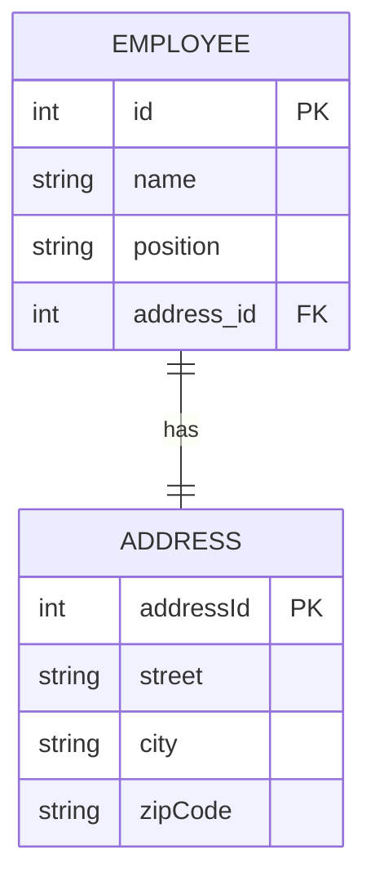
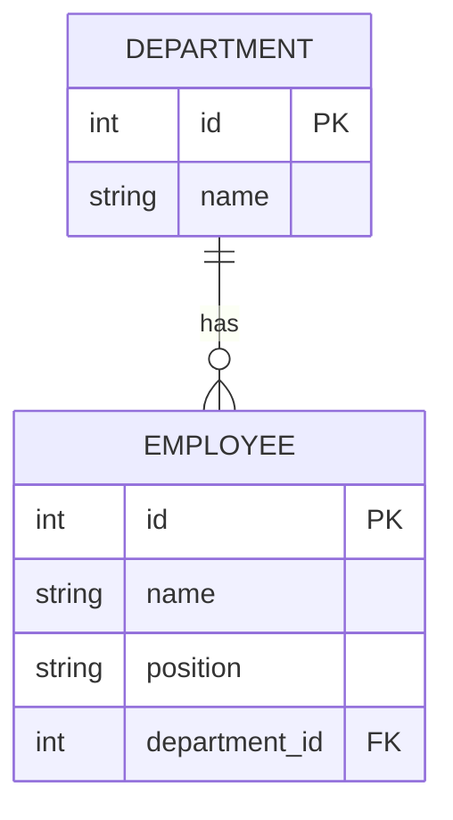
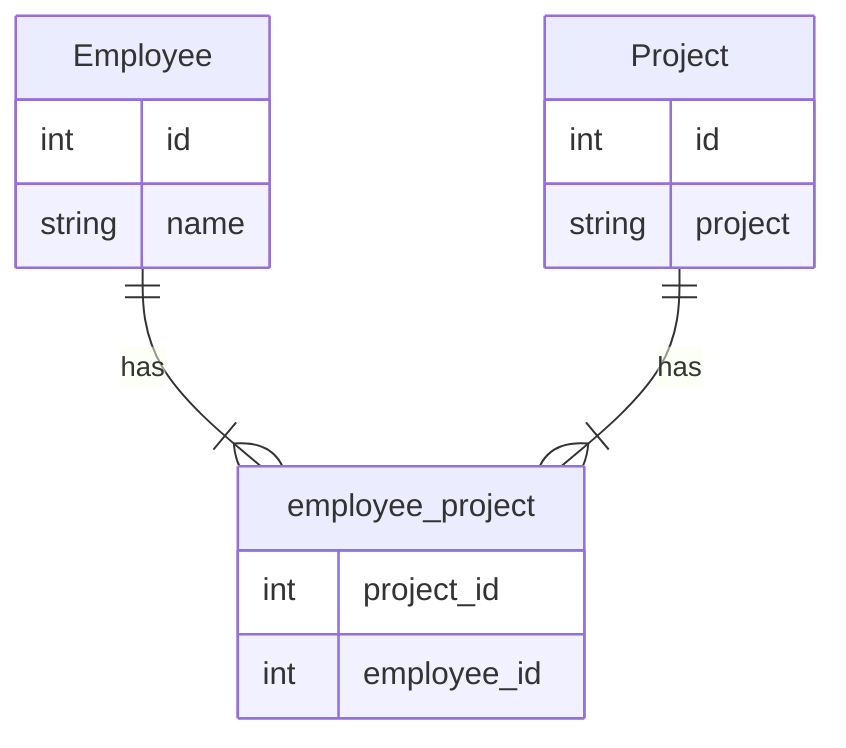
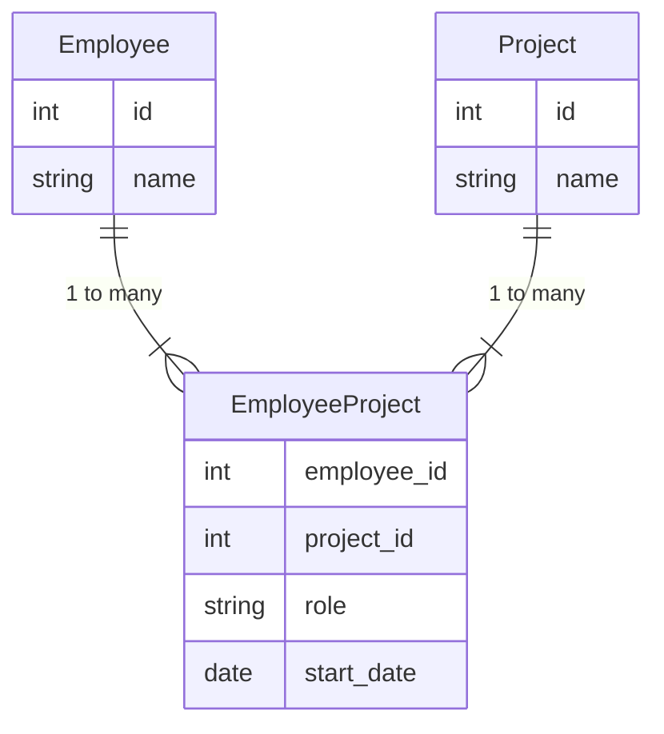

<h1> Java Persistence API</h2>

<h2>Inhaltsverzeichnis</h2>

- [1. Introduction to the Java Persistence API (JPA)](#1-introduction-to-the-java-persistence-api-jpa)
  - [1.1. Transition from `javax.persistence` to `jakarta.persistence` in Java](#11-transition-from-javaxpersistence-to-jakartapersistence-in-java)
    - [1.1.1. Key Points](#111-key-points)
    - [1.1.2. Updating `persistence.xml` for Jakarta Persistence in Jakarta EE 9](#112-updating-persistencexml-for-jakarta-persistence-in-jakarta-ee-9)
  - [1.2. Object - relational Mapping](#12-object---relational-mapping)
  - [1.3. Setting up a simple JPA project](#13-setting-up-a-simple-jpa-project)
    - [1.3.1. JPA Project structure](#131-jpa-project-structure)
  - [1.4. Configurate the persistence with `perstistence.xml`](#14-configurate-the-persistence-with-perstistencexml)
    - [1.4.1. Setting the Database Dialect in JPA `persistence.xml`](#141-setting-the-database-dialect-in-jpa-persistencexml)
    - [1.4.2. Configuring JPA Startup Behavior in `persistence.xml`](#142-configuring-jpa-startup-behavior-in-persistencexml)
    - [1.4.3. Advanced settings for the `persitsence.xml`](#143-advanced-settings-for-the-persitsencexml)
  - [1.5. Simple JPA project sample storing an entity object](#15-simple-jpa-project-sample-storing-an-entity-object)
- [2. `O`bject - `R`elational - `M`apping with Constraints using JPA Annotations](#2-object---relational---mapping-with-constraints-using-jpa-annotations)
  - [2.1. Mapping Entity Classes](#21-mapping-entity-classes)
    - [2.1.1. Basic Mapping with `@Entity` and `@Table`](#211-basic-mapping-with-entity-and-table)
    - [2.1.2. Field-Based vs. Property-Based Access](#212-field-based-vs-property-based-access)
    - [2.1.3. Best Practices and Choosing an Approach](#213-best-practices-and-choosing-an-approach)
  - [2.2. Defining Constraints in JPA](#22-defining-constraints-in-jpa)
    - [2.2.1. Bean Validation vs Database Constraints](#221-bean-validation-vs-database-constraints)
    - [2.2.2. Database Level Constraints](#222-database-level-constraints)
    - [2.2.3. (V) Bean Validation Constraints](#223-v-bean-validation-constraints)
    - [2.2.4. Best Practices](#224-best-practices)
  - [2.3. Generating primary key (surrogate keys)](#23-generating-primary-key-surrogate-keys)
    - [2.3.1. (EXT) Identity Columns](#231-ext-identity-columns)
    - [2.3.2. (Ext) Using Database Sequences](#232-ext-using-database-sequences)
  - [2.4. (V) JPA Mapping Strategies: Annotations on Class Attributes vs. Methods](#24-v-jpa-mapping-strategies-annotations-on-class-attributes-vs-methods)
    - [2.4.1. Mapping on Class Attributes](#241-mapping-on-class-attributes)
    - [2.4.2. Mapping on Methods (Getters/Setters)](#242-mapping-on-methods-getterssetters)
    - [2.4.3. When to Use Which Approach?](#243-when-to-use-which-approach)
  - [2.5. Mapping relationships (one-to-one, one-to-many, many-to-one, many-to-many)](#25-mapping-relationships-one-to-one-one-to-many-many-to-one-many-to-many)
    - [2.5.1. Understanding Relationship Ownership in JPA](#251-understanding-relationship-ownership-in-jpa)
    - [2.5.2. Key Concepts of Relationship Ownership](#252-key-concepts-of-relationship-ownership)
    - [2.5.3. One-to-one (1:1) relationship](#253-one-to-one-11-relationship)
    - [2.5.4. `One-to-Many` (1:n) Relationship](#254-one-to-many-1n-relationship)
    - [2.5.5. `Many-to-many` (n:m) Relationship](#255-many-to-many-nm-relationship)
    - [2.5.6. `Many-to-many` (n:m) Relationship with Relationship Attributes](#256-many-to-many-nm-relationship-with-relationship-attributes)
    - [2.5.7. How It Works in the `Employee`–`Project` Example](#257-how-it-works-in-the-employeeproject-example)
    - [2.5.8. Fetch Strategies in JPA for One-to-Many and Many-to-Many Relationships](#258-fetch-strategies-in-jpa-for-one-to-many-and-many-to-many-relationships)
    - [2.5.9. (V) Strategies for the Use of Cascade Operations in JPA](#259-v-strategies-for-the-use-of-cascade-operations-in-jpa)
  - [2.6. Inheritance mapping (single table, joined, table per class)](#26-inheritance-mapping-single-table-joined-table-per-class)
    - [2.6.1. Single Table Strategy](#261-single-table-strategy)
    - [2.6.2. Joined Strategy](#262-joined-strategy)
    - [2.6.3. Table Per Class Strategy](#263-table-per-class-strategy)
    - [2.6.4. Choosing the Right Strategy](#264-choosing-the-right-strategy)
- [3. Using the `EntityManager` to manage entities](#3-using-the-entitymanager-to-manage-entities)
  - [3.1. Persisting entities](#31-persisting-entities)
  - [3.2. Retrieving entities](#32-retrieving-entities)
  - [3.3. Updating and deleting entities](#33-updating-and-deleting-entities)
    - [3.3.1. Updating Entities](#331-updating-entities)
    - [3.3.2. Deleting Entities](#332-deleting-entities)
  - [3.4. Refresh the state of an entity](#34-refresh-the-state-of-an-entity)
  - [3.5. Ensuring Data Consistency in Entities](#35-ensuring-data-consistency-in-entities)
    - [3.5.1. Managing Bidirectional Relationships](#351-managing-bidirectional-relationships)
    - [3.5.2. Client-Side Consistency](#352-client-side-consistency)
    - [3.5.3. Transaction Management](#353-transaction-management)
- [4. Querying with JPQL](#4-querying-with-jpql)
  - [4.1. Basic Queries](#41-basic-queries)
  - [4.2. Joins and Aggregations](#42-joins-and-aggregations)
    - [4.2.1. Using `List<Object[]>` as Resultlist in `JPQL`](#421-using-listobject-as-resultlist-in-jpql)
  - [4.3. Dynamic Queries with the CriteriaQuery API](#43-dynamic-queries-with-the-criteriaquery-api)
- [5. Futher Topics](#5-futher-topics)
  - [5.1. DAO with JPA](#51-dao-with-jpa)
    - [5.1.1. What is a DAO?](#511-what-is-a-dao)
    - [5.1.2. Benefits of Using DAO with JPA](#512-benefits-of-using-dao-with-jpa)
    - [5.1.3. A Complete Example of DAO with JPA](#513-a-complete-example-of-dao-with-jpa)

<div style="page-break-after: always;"></div>

<div style="width: 100%;"> 	
    <div style="margin-left:1cm; margin-right:1cm; text-align: center;">
    <h2>Version History</h2>
    <table style="border solid 1px;width: 100%;">
    <th style="text-align:left;width:2cm">Version</th>
    <th>Änderungen</th>
    <th style="text-align:right">Autor</th>
    <tr>
    <td style="text-align:left">2023-11-19</td>
    <td style="text-align:left">offizielle Erstversion für SJ 23/24</td>
    <td style="text-align:right">KUW</td>
    </tr>
    <tr>
    <td style="text-align:left;vertical-align:top;">2023-12-29</td>
    <td style="text-align:left">Umstrukturierung der Abschnitte:</br>
    - neuer Abschnitt: 2. Object - Relational - Mapping with Constraints using JPA mit den besthenden Inhalten</br>
    - Überarbeitung von Abschnitt 2.2 Defining Constraints in JPA (Unterscheidung zwischen Database Level und Validation Constraints)</br>
    - Ergänzungen in Abschnit 3. Using EntityManger to manage entities: Refresh the state of an entity
    </td>
    <td style="text-align:right;vertical-align:top;">KUW</td>
    </tr>
      <tr>
    <td style="text-align:left;vertical-align:top;">2024-01-08</td>
    <td style="text-align:left">Neuer Abschnitt eingefügt:</br>
    - 2.4. (V) JPA Mapping Strategies: Annotations on Class Attributes vs. Methods<br>
    - 2.5.1. Understanding Relationship Ownership in JPA
    </td>
    <td style="text-align:right;vertical-align:top;">KUW</td>
    </tr>
     <tr>
    <td style="text-align:left">2024-01-31</td>
    <td style="text-align:left">Aktualisierter Abschnitt:<br>
    - 2.5. Mapping relationships: ER-Diagramme ergänzt<br>
  Neuer Abschnitt:<br>
    - 5.1. DAO with JPA</td>
    <td style="text-align:right">KUW</td>
    </tr>
    <tr>
    <td style="text-align:left">2024-12-16</td>
    <td style="text-align:left">Neuer Abschnitt:<br>
     2.5.7. (V) Strategies for the Use of Cascade Operations in JPA</td>
    <td style="text-align:right">KUW</td>
    </tr>
    <tr>
    <td style="text-align:left">2025-02-10</td>
    <td style="text-align:left">Neuer Abschnitt:<br>
     3.5. Ensuring Data Consistency in Entities</td>
    <td style="text-align:right">KUW</td>
    </tr>
    <tr>
    <td style="text-align:left">2025-03-07</td>
    <td style="text-align:left">
    Aktualisierte/neue Abschnitte: <br>
    (neu) 2.1.2. Field-Based vs. Property-Based Access<br>
    (neu) 2.1.3. Best Practices and Choosing an Approach<br>
    (aktualisiert) 2.5.5. Many-to-many (n:m) Relationship: Unique Constraints in Beziehungstabelle<br>
    (neu) 2.5.6 Many-to-many (n:m) Relationship with Relationship Attributes</td>
    <td style="text-align:right">KUW</td>
    </tr>
    <tr>
    <td style="text-align:left">2025-03-10</td>
    <td style="text-align:left">
    Aktualisierter Abschnitt: <br>
    2.5.6 Many-to-many (n:m) Relationship with Relationship Attributes</td>
    <td style="text-align:right">KUW</td>
    </tr>
    </table>
    </div> 
</div>

<div style="page-break-after: always"></div>


# 1. Introduction to the Java Persistence API (JPA)

The **Java Persistence API (JPA)** is a Java specification for accessing, persisting, and managing data between Java objects/classes and a relational database. JPA was defined as part of the Enterprise JavaBeans (EJB) 3.0 specification as a replacement for the EJB 2 CMP Entity Beans specification.

JPA is a standard interface for **object-relational mapping (ORM)** in the Java ecosystem. ORM is the process of mapping data between a database and an object-oriented programming language, such as Java. JPA allows developers to more easily write applications that can interact with a database by providing a set of classes and methods to persist and retrieve Java objects to and from a database.

JPA is implemented by a number of different ORM providers, such as `Hibernate`, `EclipseLink`, and `Apache OpenJPA`. Each provider offers a different set of features and may have different performance characteristics, so developers can choose the ORM provider that best meets their needs.

## 1.1. Transition from `javax.persistence` to `jakarta.persistence` in Java

The shift from `jakarta.persistence` to `jakarta.persistence` packages marks a significant milestone in the Java community, particularly in the context of the Java Persistence API (JPA). This change is part of the broader transition of Java EE (Enterprise Edition) technologies from Oracle to the Eclipse Foundation, leading to the renaming of Java EE to Jakarta EE.

### 1.1.1. Key Points

1. **Beginning of Transition**: The transition process began in 2017 when Oracle decided to transfer Java EE technologies to the Eclipse Foundation.

2. **Release of Jakarta EE 9**: The pivotal change of package names from `jakarta.*` to `jakarta.*` was officially implemented with the release of Jakarta EE 9 in December 2020. This release marked a significant update in the Java ecosystem.

3. **Impact on JPA**: For the Java Persistence API (JPA), this meant altering the package structure from `jakarta.persistence` to `jakarta.persistence`. This change was part of a broader effort to move Java EE into the open-source community and was not limited to JPA but encompassed all Java EE APIs.

4. **Implications for Developers**: This transition required developers to update their existing applications to accommodate the new package structure. It was a critical update for ensuring compatibility with future versions of Jakarta EE.

5. **Purpose of the Change**: The primary goal of this change was to bring Java EE technologies into the open-source space, fostering greater community involvement and innovation in the Java ecosystem.

The transition from `jakarta.persistence` to `jakarta.persistence` represents a landmark in the evolution of Java, signifying a step towards more community-driven development and open-source collaboration in the Java ecosystem.

### 1.1.2. Updating `persistence.xml` for Jakarta Persistence in Jakarta EE 9

With the transition from `jakarta.persistence` to `jakarta.persistence` in Jakarta EE 9, significant changes have also been introduced in the `persistence.xml` configuration file used in Java Persistence API (JPA) applications.

#### Key Changes:

1. **Namespace Update**: In versions prior to Jakarta EE 9, properties and configurations in `persistence.xml` were defined under the `jakarta.persistence.*` namespace. However, with the shift to Jakarta EE 9, these references need to be updated to the new `jakarta.persistence.*` namespace.

2. **Implications for Configuration**: This means that any reference that previously started with `jakarta.persistence` must now be changed to `jakarta.persistence` to maintain compatibility with the new API version.

3. **Necessity of Change**: This update is crucial as using the outdated `jakarta.persistence` properties in an application based on Jakarta EE 9 or later can lead to configuration errors.

4. **Compatibility Concerns**: Developers upgrading their applications to Jakarta EE 9 must ensure that their `persistence.xml` file reflects these changes to avoid compatibility issues.

In summary, with the move to Jakarta EE 9 and the subsequent adoption of the `jakarta.persistence` namespace, it is essential to update the entries in the `persistence.xml` file accordingly. This step is vital for ensuring that JPA applications function correctly under the new specifications of Jakarta EE.

## 1.2. Object - relational Mapping

Object-relational mapping (ORM) is a technique that allows developers to work with a database using an object-oriented programming language. In the case of JPA, the object-oriented programming language is Java, and the database can be any relational database, such as MySQL, Oracle, or PostgreSQL.

ORM is useful because it allows developers to write code that manipulates data in the database using objects and methods in the programming language, rather than writing SQL statements. This can make it easier to develop applications, as developers do not need to be familiar with the specific syntax of SQL in order to work with the database.

In JPA, ORM is implemented through the use of entity classes. An entity class is a Java class that is annotated with the `@Entity` annotation and represents a table in the database. The fields in the entity class correspond to columns in the table, and the entity class provides methods for persisting and retrieving data from the table.

For example, consider an `Employee` entity class that represents a table of employee data in the database. The `Employee` class might have fields for the employee's ID, name, and salary, and methods for querying the database for employees with a particular ID or salary. To persist an `Employee` object to the database, a developer would simply call the appropriate method on the object, and JPA would handle the details of translating the object's data into a SQL INSERT statement and executing it against the database.
See the following example:

```java
import jakarta.persistence.*;

@Entity
@Table(name="employees")
public class Employee {
   @Id
   @GeneratedValue(strategy=GenerationType.IDENTITY)
   private int id;
   private String name;
   private int salary;

   // Constructors, getters, and setters omitted for brevity

   public void persist() {
      EntityManagerFactory emf = Persistence.createEntityManagerFactory("EmployeeService");
      EntityManager em = emf.createEntityManager();
      em.getTransaction().begin();
      em.persist(this);
      em.getTransaction().commit();
      em.close();
      emf.close();
   }
}
```

This `Employee` class includes the following features:

1. The `@Entity` annotation indicates that this class is an entity class and should be persisted to a database table.
The `@Table` annotation specifies the name of the database table that this entity class maps to.
2. The `@Id` annotation indicates that the id field is the primary key for the table.
The `@GeneratedValue` annotation specifies that the primary key value should be generated automatically by the database when a new row is inserted.
3. The `persist()` method is a custom method that can be used to persist an Employee object to the database. It creates an EntityManager and begins a transaction, then calls the persist() method on the EntityManager to persist the object. Finally, it commits the transaction and closes the EntityManager.
To use this Employee class, a developer would create an `Employee` object and set its fields, then call the `persist()` method to save it to the database. For example:

```java
Employee e = new Employee();
e.setName("John Smith");
e.setSalary(45000);
e.persist();
```
This would create a new row in the `employees` table with the specified name and salary.

## 1.3. Setting up a simple JPA project

To set up a JPA project, one of the best ways is, to create a **Maven** project. Now you will need to do the following steps:

1. Add the JPA dependency to your project (`pom.xml`). This will typically libraries containing the `jakarta.persistence` package, which is included in most Java application servers. You can also use only the libraries of a **JPA - provider**, like `hibernate`. These can also be downloaded from the [**Maven repository**](https://mvnrepository.com/) - Search for eg. for **`hibernate core`** 

2. Create your `entity` classes. Entity classes are plain old Java objects (**POJOs**) that represent the entities in your application. They should be annotated with JPA annotations such as `@Entity`, `@Table`, and `@Column` to specify how they should be mapped to the database.

3. Create a **persistence unit**. A persistence unit defines a set of entity classes and specifies the properties for connecting to the database. It is typically defined in a `persistence.xm`l file, which should be placed in the `META-INF` directory of your project.(Using the maven project structure, it has to be under the `resource` folder)

4. Obtain an `EntityManagerFactory` and an `EntityManager`. The `EntityManagerFactory` is used to create EntityManager instances, which are used to manage the persistence of entity instances. You can obtain an `EntityManagerFactory` by calling the Persistence class's `createEntityManagerFactory` method, and you can obtain an `EntityManager` by calling the EntityManagerFactory's createEntityManager method.

5. Begin a transaction and perform your database operations. To perform database operations, you will need to begin a transaction using the EntityManager's `getTransaction` method and calling its begin method. You can then use the `EntityManager` to persist, retrieve, update, and delete entity instances as needed. When you are finished, you should commit the transaction by calling the commit method on the `EntityTransaction` object.

### 1.3.1. JPA Project structure

A typical Java project using JPA (Java Persistence API) and Maven might have the following structure:
```text
- myproject/
    - pom.xml
    - src/
        - main/
            - java/
                - com/
                    - mycompany/
                        - myproject/
                            - model/
                                - Entity/ (JPA entities)
                            - dao/
                                - JPADAO.java (JPA Data Access Object)
                            - service/
                                - BusinessService.java
                            - Main.java
            - resources/
                - META-INF/
                    - persistence.xml (JPA configuration file)

```

1. The root directory, "`myproject/`", contains the Maven POM (Project Object Model) file, "pom.xml", which defines the project's dependencies, build settings, and other information.
2. The "`src/main`" directory contains the main source code of the project, including the application's Java code and resources such as the JPA configuration file "persistence.xml".
3. The "`src/main/java`" directory contains the application's Java code organized by package.
4. The "`src/main/resources`" directory contains non-Java files used by the application, such as configuration files and resources.
5. The "`com/mycompany/myproject`" package contains the packages for different parts of the application.
6. The "`model/entities`" package contains the JPA entities, representing the tables of your database.
7. The "`dao`" package contains the JPA data access objects (DAOs), which handle database operations.
8. The "`service`" package contains the business services, where the logic of your application should reside.
9. The "`Main.java`" file contains the main method and start the application.

Keep in mind that this is just a typical structure and it can vary depending on the specific requirements of your project and your team's coding conventions.

## 1.4. Configurate the persistence with `perstistence.xml`

The persistence.xml file is used to define the persistence unit for a JPA application. It specifies the entity classes that are part of the persistence unit, as well as the properties for connecting to the database and configuring other aspects of the persistence unit.

```xml
<persistence xmlns="https://jakarta.ee/xml/ns/persistence"
             xmlns:xsi="http://www.w3.org/2001/XMLSchema-instance"
             xsi:schemaLocation="https://jakarta.ee/xml/ns/persistence https://jakarta.ee/xml/ns/persistence/persistence_3_0.xsd"
             version="3.0">
   <persistence-unit name="myPU" transaction-type="RESOURCE_LOCAL">
   <!-- Provider, der die JPA Spezifikation implementiert - hier Hibernate -->
   <provider>org.hibernate.jpa.HibernatePersistenceProvider</provider>
      <class>com.example.Employee</class>
      <class>com.example.Department</class>
      <properties>
         <property name="jakarta.persistence.jdbc.url" value="jdbc:mysql://localhost:3306/mydb"/>
         <property name="jakarta.persistence.jdbc.user" value="username"/>
         <property name="jakarta.persistence.jdbc.password" value="password"/>
         <property name="jakarta.persistence.jdbc.driver" value="com.mysql.jdbc.Driver"/>
      </properties>
   </persistence-unit>
</persistence>
```

In this example, the `persistence-unit` element defines the name of the persistence unit (`"myPU"`) and the **transaction type** (`"RESOURCE_LOCAL"`). It also specifies the entity classes that are part of the persistence unit using the class element.

The properties element contains a list of properties that are used to configure the persistence unit. These properties include the JDBC connection URL, username, password, and driver class for connecting to the database, as well as other optional properties that can be used to configure various aspects of the persistence unit.

The `persistence.xml` file should be placed in the `META-INF` directory of your project.

### 1.4.1. Setting the Database Dialect in JPA `persistence.xml`

In JPA, setting the database dialect in the `persistence.xml` file is crucial for ensuring that the JPA provider (like Hibernate) generates SQL statements compatible with the specific type of database you are using.

#### What is a Database Dialect?

A database dialect refers to the SQL variations used by different database systems. Each database (like MySQL, PostgreSQL, Oracle, etc.) has its own set of SQL syntax, functions, and data types. The dialect configuration in JPA informs the provider about these specificities.

#### How to Set the Database Dialect

1. **Identify the Correct Dialect Class**: Depending on your database type, you need to identify the corresponding dialect class provided by your JPA implementation. For instance, Hibernate provides dialect classes like `org.hibernate.dialect.MySQLDialect` for MySQL, `org.hibernate.dialect.PostgreSQLDialect` for PostgreSQL, etc.

2. **Configure in `persistence.xml`**: Once you have identified the correct dialect class, set it in the `persistence.xml` file under the `<properties>` section.

Example for MySQL:

```xml
<properties>
    <property name="hibernate.dialect" value="org.hibernate.dialect.MySQLDialect"/>
    <!-- Other properties -->
</properties>
```

This configuration ensures that Hibernate generates SQL queries that are compatible with MySQL’s SQL syntax and features.

#### Importance of Setting the Dialect

- **SQL Compatibility**: The dialect ensures that generated SQL queries will work with your specific type of database.
- **Performance Optimization**: Using the correct dialect can also help optimize the performance, as the SQL generated will be tailored to utilize database-specific features and functions.
- **Avoiding Errors**: Incorrect or default dialect settings can lead to SQL syntax errors and unexpected application behaviors, as the JPA provider might use SQL features not supported by your database.

Setting the database dialect is a straightforward yet essential step in configuring a JPA application, as it aligns the JPA provider's SQL generation with your database's specific syntax and capabilities.

### 1.4.2. Configuring JPA Startup Behavior in `persistence.xml`

In JPA, you can control the startup behavior, particularly how the schema is managed when the application starts, using specific properties in the `persistence.xml` file. This is especially relevant for application development and testing phases.

#### Common Startup Behaviors

1. **Create (`create`)**: This option drops the existing schema and recreates it on startup. It's useful during development to start with a fresh database schema each time.

2. **Drop and Create (`create-drop`)**: Similar to `create`, but it also drops the schema when the `EntityManagerFactory` is closed, typically when the application is stopped. This is useful for testing to ensure no data is left from previous tests.

3. **Validate (`validate`)**: This option validates the existing schema against the entity mappings but makes no changes to the database. It's used to ensure that the JPA entities and the database schema are in sync.

4. **Update (`update`)**: This option updates the schema to reflect the entity mappings without losing existing data. It's beneficial when you have made incremental changes to your entities and want to apply these changes to the database.

5. **None (`none`)**: This option disables schema generation and validation. It assumes that the schema is managed externally.

#### Setting the Startup Behavior

To configure the startup behavior, use the `jakarta.persistence.schema-generation.database.action` property in `persistence.xml`. Here is how you can set the behavior (z.B. `create`):

```xml
<properties>
    <!-- Create -->
    <property name="jakarta.persistence.schema-generation.database.action" value="create"/>
    
    <!-- Other properties -->
</properties>
```

#### Considerations

- **Development vs. Production**: Typically, `create` or `create-drop` are used in development or testing environments. For production environments, `validate` or `none` are safer choices to avoid accidental data loss or schema changes.

- **Version Control**: In a team environment or for continuous integration, controlling schema changes through version-controlled migration scripts might be preferable over automatic schema generation.

Configuring the startup behavior in JPA is an essential aspect of aligning the application's lifecycle management with the project's requirements, helping to automate tasks during development and testing while providing safety checks for production environments.

### 1.4.3. Advanced settings for the `persitsence.xml`

The persistence.xml file allows you to specify a wide range of advanced settings for your JPA persistence unit. Here are some examples of the types of settings you can configure:

1. **`jakarta.persistence.schema-generation.database.action`**: This property controls what action should be taken when the database schema is generated or updated. Possible values include `none`, `create`, `update`, `validate`, `drop-and-create`, and `drop`.

2. `jakarta.persistence.schema-generation.create-source`: This property controls how the database schema is generated. Possible values include `metadata`, `script`, and `script-source`.

3. `jakarta.persistence.schema-generation.drop-source`: This property controls how the database schema is dropped. Possible values include `metadata`, `script`, and `script-source`.

4. `jakarta.persistence.schema-generation.create-script-source`: This property specifies the source of the SQL script used to create the database schema.

5. `jakarta.persistence.schema-generation.drop-script-source`: This property specifies the source of the SQL script used to drop the database schema.

6. `jakarta.persistence.schema-generation.scripts.action`: This property controls what action should be taken when generating schema generation scripts. Possible values include `none`, `create`, `drop-and-create`, and `drop`.

7. `jakarta.persistence.schema-generation.scripts.create-target`: This property specifies the target of the create schema generation scripts.

8. `jakarta.persistence.schema-generation.scripts.drop-target`: This property specifies the target of the drop schema generation scripts.

9. `jakarta.persistence.validation.mode`: This property controls the level of bean validation to be performed. Possible values include none, callback, and auto.

10. `jakarta.persistence.sharedCache.mode`: This property controls the level of caching to be used. Possible values include NONE, ENABLE_SELECTIVE, and ALL.

These are just a few examples of the advanced settings that you can configure in the persistence.xml file. You can find a complete list of the available properties in the JPA specification.

## 1.5. Simple JPA project sample storing an entity object

Here is a simple example of how you might use JPA to store an `Employee` entity in a database:

1. First, you will need to define the `Employee` entity class:
   ```java
   @Entity
   @Table(name="employee")
   public class Employee {
      @Id
      @GeneratedValue
      private int id;
      private String name;
      private String title;

      // Constructors, getters, and setters omitted for brevity
   }
   ```

2. Next, you will need to create an EntityManagerFactory and an EntityManager using the `Persistence` class:
   ```java
   EntityManagerFactory emf = Persistence.createEntityManagerFactory("myPU");
   EntityManager em = emf.createEntityManager();
   ```
3. Now you are ready to begin storing `Employee` entities in the database. To do this, you will need to create a new `Employee` object, begin a **transaction, persist** the object, and **commit** the transaction:
   ```java
   // This steps will store a new `Employee` entity in the database with the name "John Smith" and the title "Manager".

   Employee employee = new Employee();
   employee.setName("John Smith");
   employee.setTitle("Manager");

   em.getTransaction().begin();
   em.persist(employee);
   em.getTransaction().commit();
   ```

4. Finally, when you are finished using the `EntityManager`, you should close it and the `EntityManagerFactory` to release any resources they are using:
   ```java
   em.close();
   emf.close();
   ```

This is a very simple example of how to use JPA to store an entity in a database. You can find more detailed information about using JPA in the JPA specification and in the documentation for your particular JPA implementation.

# 2. `O`bject - `R`elational - `M`apping with Constraints using JPA Annotations

## 2.1. Mapping Entity Classes

### 2.1.1. Basic Mapping with `@Entity` and `@Table`

In JPA, to map a **Java class** to a **database table**, you typically:
1. Mark the class with `@Entity` to indicate it is a JPA entity.
2. Optionally use `@Table` to specify details like the actual table name or schema.

**Example:**

```java
@Entity
@Table(name = "employees") // Maps the Employee class to the "employees" table
public class Employee {
   @Id
   @GeneratedValue
   private int id;

   private String name;
   private String title;

   // Constructors, getters, and setters omitted for brevity
}
```

- `@Entity`: Tells the JPA provider (e.g., Hibernate) that this class is an entity whose instances should be managed in the persistence context.  
- `@Table(name = "employees")`: Overrides default naming conventions (which might have used "Employee") to specify **"employees"** as the table name.  

>  :white_check_mark: If you omit the `@Table` annotation, JPA will infer a default table name—often the same as the class name but can differ depending on the provider’s conventions.

### 2.1.2. Field-Based vs. Property-Based Access

Once you have declared your class as an entity using `@Entity` (and optionally specified the table with `@Table`), JPA must map each **attribute** (e.g., `id`, `name`, `title`) to corresponding **columns** in the database. There are two main strategies for how JPA accesses these attributes:

1. **Field-Based Access**  
2. **Property-Based Access**  

#### 1. Field-Based Access

**What It Is**  
- You place JPA annotations—like `@Id`, `@Column`, `@GeneratedValue`—**directly on the class fields**.  
- JPA reads and writes **the fields** directly through **reflection** (bypassing getters and setters).

```java
@Entity
@Table(name = "employees")
public class Employee {

    @Id
    @GeneratedValue
    @Column(name = "employee_id")
    private int id;

    @Column(name = "last_name")
    private String name;

    @Column(name = "job_title")
    private String title;

    // Getters and setters are not annotated;
    // JPA doesn't rely on them for persistence.
    public int getId() { return id; }
    public void setId(int id) { this.id = id; }
    // etc.
}
```

**Advantages**
1. **Simplicity**: JPA automatically accesses the fields; you don’t have to write extra boilerplate in getters/setters for persisting.  
2. **Encapsulation**: Because JPA never calls your setters/getters for persistence, you can keep domain logic separate—those methods remain purely for business logic or UI use.  
3. **Less overhead**: If your getters/setters have complex logic or do expensive computations, JPA does not trigger them when loading/saving the entity.

**Disadvantages**
1. **Bypassing business logic**: If your getters or setters contain important checks or side effects, JPA will skip them because it works on the fields directly.  
2. **Less control**: If you want JPA to respect constraints or automatically invoke validations in the setters, field-based access won’t do that.

**When to Prefer Field-Based Access**  
- You want a **lightweight** approach, and you’re content for JPA to not call your getters/setters.  
- You want to keep domain logic separate from persistence logic.  
- You prefer minimal annotation overhead and simpler code structure.

#### 2. Property-Based Access

**What It Is**  
- You place JPA annotations on the **getter** (or **setter**) methods rather than on the fields.  
- JPA reads/writes attribute values **by calling** those methods.

```java
@Entity
@Table(name = "employees")
public class Employee {

    private int id;
    private String name;
    private String title;

    @Id
    @GeneratedValue
    @Column(name="employee_id")
    public int getId() {
       return id;
    }
    public void setId(int id) {
       this.id = id;
    }

    @Column(name="last_name")
    public String getName() {
       return name;
    }
    public void setName(String name) {
       this.name = name;
    }

    @Column(name="job_title")
    public String getTitle() {
       return title;
    }
    public void setTitle(String title) {
       this.title = title;
    }
}
```

**Advantages**
1. **Integration with business logic**: If you have validations, computed values, or domain-specific logic in your getters/setters, JPA will naturally invoke them, ensuring consistency.  
2. **JavaBean conventions**: Many frameworks (JSF, Spring, etc.) favor classes with standard getter/setter naming conventions for integration.  
3. **Intercept changes**: If you want to do something every time a property changes (like logging or additional calculations), property-based access can be useful because JPA calls the setter method.

**Disadvantages**
1. **Unwanted side effects**: If getters/setters contain heavy computations or unexpected side effects, JPA will trigger them for each read/write operation, potentially impacting performance or causing issues.  
2. **More complex**: Potentially more overhead if you are simply reading/writing data with no business logic.

**When to Prefer Property-Based Access**  
- You need to guarantee that certain logic always runs whenever an attribute is read or written (e.g., validations, logging).  
- You want JPA to integrate with your domain logic in the getters/setters.  
- You (or your team) already rely on a JavaBean-style approach for other frameworks.

### 2.1.3. Best Practices and Choosing an Approach

1. **Consistency**: Within a single entity, **don’t mix** field-based and property-based for different attributes. JPA can become confused. Choose one approach per entity.  
2. **Team/Project Norms**: Some teams standardize on either field-based or property-based across an entire project for uniformity.  
3. **Business Logic Location**: If your entity’s getters/setters do heavy lifting or validations that must run at persistence time, property-based can be advantageous. If your domain logic is handled elsewhere (e.g., in service layers), field-based often leads to cleaner code.  

In summary, start with **field-based** if you want a straightforward mapping and do not need JPA to trigger your domain logic in getters/setters. Switch to **property-based** if you rely on JavaBean conventions or want to ensure JPA interacts with your custom property methods.

## 2.2. Defining Constraints in JPA

In JPA (Java Persistence API), defining constraints is an essential aspect of ensuring data integrity and enforcing business rules at the database level. Constraints in JPA are defined using annotations in entity classes. These constraints are then translated into corresponding database constraints when the schema is generated.

### 2.2.1. Bean Validation vs Database Constraints

- **Bean Validation (JSR 380)**: Annotations like `@NotNull`, `@Size`, and `@Pattern` are part of the Java Bean Validation specification (JSR 380). They are used for **validating Java objects**, usually **before** persisting them to the database.

- **Database Level Constraints**: Annotations like `@Column(unique = true)` **directly translate to database constraints**. These are enforced at the database level regardless of the application logic.

### 2.2.2. Database Level Constraints

In Java Persistence API (JPA), defining database-level constraints is crucial for ensuring the integrity of your database. Unlike Jakarta Bean Validation constraints (like `@NotNull`), these constraints are applied directly at the database schema level. Here we will explore some key constraints that can be defined using JPA annotations without relying on Jakarta Bean Validation.

#### Unique Constraint

The `@Column(unique = true)` attribute ensures that all values in a specific column are unique across the database table.

- **Usage:** It is part of the `@Column` annotation.
- **Example:**
  ```java
  @Column(unique = true)
  private String email;
  ```

#### Length Constraint

The `length` attribute within the `@Column` annotation specifies the column size. It's commonly used with string data types.

- **Usage:** Part of the `@Column` annotation.
- **Example:**
  ```java
  @Column(length = 255)
  private String username;
  ```

#### Column Definition

The `@Column` annotation itself is used to define various constraints on a column.

- **nullable:** Determines whether the column can have null values.
- **length:** Defines the maximum length of the column (for string).
- **precision and scale:** For decimal numbers, precision is the total number of digits, and scale is the number of digits after the decimal point.
- **Example:**
  ```java
  @Column(nullable = false, length = 100)
  private String name;
  ```

#### Primary Key Constraint

The `@Id` annotation is used to define a primary key, which is a unique identifier for each record in a database table.

- **Usage:** Applied to a field to mark it as the primary key.
- **Example:**
  ```java
  @Id
  private Long id;
  ```

#### (V) Composite Constraints

For more complex constraints involving multiple fields, JPA allows for composite constraints.

- **@Table(uniqueConstraints = ...)**: Allows defining a unique constraint involving multiple columns.
    ```java
    @Table(uniqueConstraints = @UniqueConstraint(columnNames = {"firstName", "lastName"}))
    public class Employee { ... }
    ```

#### Foreign Key Constraint

The `@JoinColumn` annotation is used to specify a foreign key column in the owner entity.

- **name:** Specifies the name of the column used as a foreign key.
- **referencedColumnName:** Specifies the name of the referenced primary key column (*normaly not necessary*)
- **Example:**
  ```java
  @ManyToOne
  @JoinColumn(name = "department_id", referencedColumnName = "id")
  private Department department;
  ```

#### Conclusion

> <span style="font-size: 1.5em">:bulb:</span> These JPA annotations allow developers to define essential database-level constraints directly in their Java code, which are then translated into corresponding constraints in the database schema. This approach ensures data integrity and enforces business rules without needing external validation frameworks.

### 2.2.3. (V) Bean Validation Constraints

For implementing validation constraints in JPA, it's necessary to include the Maven dependency `org.hibernate.validator`. This dependency provides the Hibernate Validator, which is an implementation of the Jakarta Bean Validation specification. Here's how you can include it in your `pom.xml`:

```xml
<dependency>
    <groupId>org.hibernate.validator</groupId>
    <artifactId>hibernate-validator</artifactId>
    <version>YOUR_DESIRED_VERSION</version>
</dependency>
```

The reason for needing this dependency is that while JPA allows defining constraints via annotations (like `@NotNull`, `@Size`, etc.), the actual validation logic is not a part of the JPA specification itself. Instead, this logic is a part of the Jakarta Bean Validation (formerly Java Bean Validation) API. Hibernate Validator, as an implementation of this specification, provides the functionality to check these constraints and throw validation exceptions if the constraints are violated.

By integrating `org.hibernate.validator`, your application gains the ability to perform automatic validation of entity attributes according to the specified annotations. This ensures that your business rules are enforced consistently throughout the application, enhancing data integrity and reducing the likelihood of data-related errors.

#### Commonly Used Constraint Annotations

1. **@NotNull**: Ensures that a column cannot have a null value.
    ```java
    @NotNull
    private String name;
    ```

2. **@Size**: Defines the minimum and maximum size for a column. Commonly used for strings.
    ```java
    @Size(min = 1, max = 200)
    private String description;
    ```

3. **@Min and @Max**: Specifies the minimum and maximum value for a numeric column.
    ```java
    @Min(1)
    @Max(100)
    private int quantity;
    ```

4. **@Pattern**: Enforces a regular expression pattern.
    ```java
    @Pattern(regexp = "[a-z0-9]+@[a-z]+\\.[a-z]{2,3}")
    private String email;
    ```

### 2.2.4. Best Practices

1. **Consistency**: Ensure that constraints are consistent with the business logic of your application.

2. **Performance Considerations**: Be mindful of the performance implications of certain constraints, especially in large databases.

3. **Validation Layers**: Use a combination of bean validation and database constraints to ensure data integrity both at the application level and the database level.

Defining constraints effectively in JPA ensures robust data validation and integrity, aligning the data model with business requirements and rules.

## 2.3. Generating primary key (surrogate keys)

The primary key of an entity in JPA is typically generated automatically by the persistence provider, using a strategy such as auto-increment or sequence.

To specify that the primary key should be generated automatically, you can use the `@GeneratedValue` annotation on the primary key field or property. The `@GeneratedValue` annotation has an optional strategy attribute that allows you to specify the generation strategy to use.

Here is an example of how you might specify that the primary key of an Employee entity should be generated using the `auto-increment` strategy:

```java
@Entity
public class Employee {
   @Id
   @GeneratedValue(strategy=GenerationType.AUTO)
   private int id;
   private String name;
   private String title;

   // Constructors, getters, and setters omitted for brevity
}

```

In this example, the id field is annotated with both @Id and `@GeneratedValue`, with the `@GeneratedValue` annotation specifying the AUTO generation strategy. This will cause the persistence provider to use an auto-increment strategy to generate the primary key value.

Other possible values for the strategy attribute include `SEQUENCE`, which uses a database sequence to generate the primary key value, and `IDENTITY`, which uses an identity column in the database to generate the primary key value. 

### 2.3.1. (EXT) Identity Columns

An identity column is a type of column in a database table that is designed to automatically generate a unique, incrementing value for each row that is inserted. Identity columns are often used as the primary key of a table, as they can provide a unique, easily-generated value that can be used to identify each row.

In JPA, you can use the `IDENTITY` generation strategy to specify that the primary key of an entity should be generated using an identity column in the database. To do this, you can set the strategy attribute of the `@GeneratedValue` annotation to `IDENTITY`

Identity columns are supported by many database systems, but the exact details of how they work can vary depending on the specific database you are using. You should consult the documentation for your database system for more information on how identity columns work and how to configure them.

### 2.3.2. (Ext) Using Database Sequences

A database sequence is a special type of database object that generates a unique, incrementing value each time it is accessed. **Sequences** are often used to **generate primary key** values for database tables, as they provide a simple and efficient way to generate unique, incrementing values.

In JPA, you can use the `SEQUENCE` generation strategy to specify that the primary key of an entity should be generated using a database sequence. To do this, you can use the `@SequenceGenerator` annotation to define the sequence, and set the strategy attribute of the `@GeneratedValue` annotation to `SEQUENCE`, as shown in the following example:

```java
@Entity
@Table(name="employee")
@SequenceGenerator(name="employee_seq", sequenceName="employee_id_seq", allocationSize=1)
public class Employee {
   @Id
   @GeneratedValue(strategy=GenerationType.SEQUENCE, generator="employee_seq")
   @Column(name="id")
   private int id;
   private String name;
   private String title;

   // Constructors, getters, and setters omitted for brevity
}
```

## 2.4. (V) JPA Mapping Strategies: Annotations on Class Attributes vs. Methods

The placement of annotations for mapping entity classes to database tables is a core aspect of JPA. There are two primary approaches to placing these annotations: either directly on the class attributes or on the getter methods. Both approaches have their advantages and disadvantages, as well as specific use cases.

### 2.4.1. Mapping on Class Attributes

**Advantages:**
1. **Directness and Clarity:** Annotations directly on the attributes provide a clear and direct association between the attribute and the database column.
2. **Simplicity:** This approach is simpler and more intuitive, especially for developers new to JPA.
3. **Performance:** In some cases, direct field mapping might be slightly more performant as it does not require method calls.

**Disadvantages:**
1. **Limited Flexibility:** If business logic is integrated into getter and setter methods, direct mapping can cause issues as JPA accesses the field directly, bypassing the logic in the methods.
2. **Encapsulation Breach:** Direct field access by JPA can be seen as a breach of the encapsulation principle.

### 2.4.2. Mapping on Methods (Getters/Setters)

**Advantages:**
1. **Control over Access:** Allows the integration of business logic or validations in getter and setter methods, which are then automatically used by JPA.
2. **Encapsulation:** This approach supports the principle of encapsulation, as data access occurs through methods, not directly.

**Disadvantages:**
1. **Complexity:** Can be more complex, especially for developers less familiar with JPA.
2. **Potential Performance Impact:** Additional method calls can lead to minimal performance impacts, especially with large data volumes.

#### Example of JPA Mapping at the Method Level

Here's a simple example of a JPA mapping at the method level. In this example, a basic `Person` entity class is presented, containing two attributes: `id` and `name`. Business logic is integrated into the getter and setter methods for the `name` attribute to demonstrate how JPA utilizes the methods instead of the fields directly.

```java
import javax.persistence.*;

@Entity
@Table(name = "Person")
public class Person {

    private Long id;
    private String name;

    public Person() {
    }

    @Id
    @GeneratedValue(strategy = GenerationType.IDENTITY)
    @Column(name = "id")
    public Long getId() {
        return id;
    }

    public void setId(Long id) {
        this.id = id;
    }

    @Column(name = "name")
    public String getName() {
        return name;
    }

    public void setName(String name) {
        // Business logic can be inserted here, e.g., validation
        if (name == null || name.trim().isEmpty()) {
            throw new IllegalArgumentException("Name cannot be empty");
        }
        this.name = name;
    }
}
```

In this example:
- The `@Id` annotation on the `getId` method indicates that the `id` field is the primary key of the entity.
- The `@GeneratedValue` annotation specifies the strategy for generating the primary key.
- The `@Column` annotation on the `getName` method maps the `name` field to a column in the database table.
- In the `setName` method, a simple piece of business logic is embedded, checking if the provided name is not empty. This logic is executed every time a person's name is set, ensuring that invalid names are caught.

### 2.4.3. When to Use Which Approach?

1. **Use attribute mapping** when your entity class is a straightforward mapping without complex business logic and when you value simplicity and directness.

2. **Use method mapping** when you have complex business logic or validations in your entities that should be executed with every data access. This is also advisable if you want to emphasize the principles of encapsulation and abstraction more strongly.

In practice, the choice of mapping approach may depend on the specific requirements of the project, the preferences of the development team, and the standards of the organization. It's also possible to mix both approaches in the same application, although this is generally not recommended to maintain consistency.

## 2.5. Mapping relationships (one-to-one, one-to-many, many-to-one, many-to-many)

In JPA, you can define relationships between entity classes to represent the relationships between tables in a database. There are four main types of relationships that can be defined: `one-to-one`, `one-to-many`, `many-to-one`, and `many-to-many`.

### 2.5.1. Understanding Relationship Ownership in JPA

In Java Persistence API (JPA), understanding the concept of relationship ownership is crucial for effective data modeling and database operations. In JPA, when you have two entities connected by a relationship, one of these entities is designated as the "owner" of the relationship. This ownership concept is essential for mapping relationships between entities and managing how these relationships are persisted and updated in the database.

### 2.5.2. Key Concepts of Relationship Ownership

1. **Definition of Relationship Owner:** The relationship owner is the entity that "owns" the foreign key in a database relationship. This is typically the entity where you define the join column(s).

2. **Bidirectional Relationships:** In bidirectional relationships, where two entities have references to each other, one entity must be designated as the owner. The other entity is then known as the "inverse" or "non-owning" side of the relationship.

3. **Unidirectional Relationships:** In unidirectional relationships, there is only one owner, as the relationship is only recognized from one entity.

#### Importance in ORM

1. **Database Synchronization:** The relationship owner is responsible for updating the relationship in the database. When you modify a relationship, JPA will only consider the changes made on the owner side for updating the database.

2. **Performance Implications:** Incorrectly assigning the ownership can lead to inefficient database operations. Proper understanding of relationship ownership can improve performance by reducing unnecessary database updates.

#### Best Practices

1. **Foreign Key Ownership:** As a general rule, the entity that holds the foreign key in its corresponding database table should be the owner of the relationship.

2. **One-to-Many and Many-to-One:** In one-to-many and many-to-one relationships, the many-to-one side is typically the owner. It is more efficient as it avoids additional join tables.

3. **Many-to-Many Relationships:** In many-to-many relationships, either side can be the owner. However, it is common practice to choose the side that is most logically suited to manage the relationship.

4. **Consistency:** Ensure consistency in how you manage and update relationships, especially in bidirectional relationships, to avoid data integrity issues.

Understanding and correctly implementing relationship ownership in JPA is vital for creating effective and efficient data models. It not only simplifies the object-relational mapping but also optimizes the performance of database operations.

### 2.5.3. One-to-one (1:1) relationship

Here is an example of how you might define a `one-to-one` relationship between two entity classes, `Employee` and `Address`:



```java
@Entity
public class Employee {
   @Id
   @GeneratedValue
   private int id;
   private String name;
   private String position;

   @OneToOne(cascade = CascadeType.ALL)
   @JoinColumn(name="address_id")
   private Address address;

   // Constructors, getters, and setters omitted for brevity
}

@Entity
public class Address {
   @Id
   @GeneratedValue
   private int id;
   private String street;
   private String city;
   private String zip;

   // Constructors, getters, and setters omitted for brevity
}
```

In this example, the `@OneToOne` annotation on the address field in the `Employee` class indicates that each employee has a single address. The `@JoinColumn` annotation specifies the name of the column in the employee table that stores the **foreign key** to the address table.

### 2.5.4. `One-to-Many` (1:n) Relationship

To create a `one-to-many` relationship, you can use the `@OneToMany `annotation on the side of the one-to-many relationship and the `@ManyToOne` annotation on the side of the many-to-one relationship. For example:



```java
@Entity
public class Department {
   @Id
   @GeneratedValue
   private int id;
   private String name;

   @OneToMany(mappedBy="department")
   private List<Employee> employees;

   // Constructors, getters, and setters omitted for brevity
}

@Entity
public class Employee {
   @Id
   @GeneratedValue
   private int id;
   private String name;
   private String position;

   @ManyToOne
   @JoinColumn(name="department_id")
   private Department department;

   // Constructors, getters, and setters omitted for brevity
}
```

 In this example, each department has many employees, and each employee belongs to a single department. The `@OneToMany` annotation on the employees field in the Department class and the `@ManyToOne` annotation on the department field in the Employee class define the relationship.

### 2.5.5. `Many-to-many` (n:m) Relationship

To create a **n:m** (many-to-many) relationship, you can use the `@ManyToMany` annotation on both sides of the relationship. A basic example might look like this:



```java
@Entity
public class Employee {
   @Id
   @GeneratedValue
   private int id;
   private String name;

   @ManyToMany
   @JoinTable(
      name = "employee_project",
      joinColumns = @JoinColumn(name = "employee_id"),
      inverseJoinColumns = @JoinColumn(name = "project_id")
   )
   private List<Project> projects;

   // Constructors, getters, and setters omitted for brevity
}

@Entity
public class Project {
   @Id
   @GeneratedValue
   private int id;
   private String name;

   @ManyToMany(mappedBy = "projects")
   private List<Employee> employees;

   // Constructors, getters, and setters omitted for brevity
}
```

In this example, the `@ManyToMany` annotation on the `projects` field in the `Employee` class and on the `employees` field in the `Project` class defines the relationship. The `@JoinTable` annotation specifies the name of the join table as well as the names of the foreign key columns.

> <span style="font-size: 1.5em">:warning:</span> **Important Note**:  
> Depending on your database configuration, it might be possible for the **same employee** to be assigned more than once to the **same project**, or for the **same project** to be assigned multiple times to the **same employee**. To prevent this, you can add a **unique constraint** covering the combination of both foreign key columns (`employee_id` and `project_id`) in the join table. This ensures each combination appears only once:
>
> ```java
> @Entity
> public class Employee {
>    @Id
>    @GeneratedValue
>    private int id;
>    private String name;
>
>    @ManyToMany
>    @JoinTable(
>       name = "employee_project",
>       joinColumns = @JoinColumn(name = "employee_id"),
>       inverseJoinColumns = @JoinColumn(name = "project_id"),
>       uniqueConstraints = {
>          @UniqueConstraint(columnNames = {"employee_id", "project_id"})
>       }
>    )
>    private List<Project> projects;
>
>    // Constructors, getters, and setters omitted for brevity
> }
> ```
>
> This effectively prohibits the duplication of the `(employee_id, project_id)` combination in the `employee_project` table, ensuring that no employee is assigned to the same project more than once (and vice versa).

### 2.5.6. `Many-to-many` (n:m) Relationship with Relationship Attributes

In many scenarios, you may need to store **additional information** about the relationship between `Employee` and `Project`, such as a start date, the employee’s role, or hours allocated. A basic `@ManyToMany` setup with a plain join table (containing only foreign keys) does not allow you to store extra attributes.

The solution is to create a **third entity** (often called a **link entity**) instead of a simple join table. This link entity references both `Employee` and `Project` via `@ManyToOne` relationships and holds as many additional attributes as required.

#### ER Diagram



- An `Employee` can be linked to multiple `EmployeeProject` records (one for each project).  
- A `Project` can also be linked to multiple `EmployeeProject` records (one for each employee).  
- `EmployeeProject` serves as the **relationship table** containing extra attributes like `role` and `startDate`.

#### Example Code

**1. `Employee` Entity**

```java
@Entity
@Table(name = "employee")
public class Employee {

    @Id
    @GeneratedValue
    private int id;

    private String name;

    // Optional: one way to keep track of related EmployeeProject records
    // @OneToMany(mappedBy = "employee")
    // private List<EmployeeProject> employeeProjects;

    // Constructors, getters, setters omitted for brevity
    public Employee() {}

    public Employee(String name) {
        this.name = name;
    }

    // Getters/Setters ...
}
```

**2. `Project` Entity**

```java
@Entity
@Table(name = "project")
public class Project {

    @Id
    @GeneratedValue
    private int id;

    private String name;

    // Optional: one way to keep track of related EmployeeProject records
    // @OneToMany(mappedBy = "project")
    // private List<EmployeeProject> employeeProjects;

    // Constructors, getters, setters omitted for brevity
    public Project() {}

    public Project(String name) {
        this.name = name;
    }

    // Getters/Setters ...
}
```

**3. `EmployeeProject` (Link Entity)**

```java
@Entity
@Table(name = "employee_project")
public class EmployeeProject {

    @EmbeddedId
    private EmployeeProjectId id;

    // Example relationship attributes:
    private String role;
    private LocalDate startDate;

    @ManyToOne
    @MapsId("employeeId")  // Maps the 'employeeId' from the embedded ID
    @JoinColumn(name = "employee_id")
    private Employee employee;

    @ManyToOne
    @MapsId("projectId")   // Maps the 'projectId' from the embedded ID
    @JoinColumn(name = "project_id")
    private Project project;

    public EmployeeProject() {}

    // Convenience constructor
    public EmployeeProject(Employee employee, Project project, String role, LocalDate startDate) {
        this.employee = employee;
        this.project = project;
        this.role = role;
        this.startDate = startDate;
        this.id = new EmployeeProjectId(employee.getId(), project.getId());
    }

    // Getters/Setters ...
}
```

**4. `EmployeeProjectId` (Composite Key)**

```java
@Embeddable
public class EmployeeProjectId implements Serializable {

    private static final long serialVersionUID = 1L;

    private int employeeId;
    private int projectId;

    // Required by JPA
    public EmployeeProjectId() {}

    // Convenience constructor
    public EmployeeProjectId(int employeeId, int projectId) {
        this.employeeId = employeeId;
        this.projectId = projectId;
    }

    // Getters/Setters ...

    // equals() and hashCode() should be overridden for composite keys!
    @Override
    public boolean equals(Object o) {
        if (this == o) return true;
        if (!(o instanceof EmployeeProjectId)) return false;
        EmployeeProjectId that = (EmployeeProjectId) o;
        return employeeId == that.employeeId && projectId == that.projectId;
    }

    @Override
    public int hashCode() {
        return Objects.hash(employeeId, projectId);
    }
}
```

#### **Explanation**: `@Embeddable` vs. `@Embedded` vs. `@EmbeddedId`

- **`@Embeddable`**:  
  - Used on a **class** (e.g., `EmployeeProjectId`) to indicate that its instances are **embedded** into some other entity.  
  - This means the fields inside this `@Embeddable` class do **not** map to a separate table—they become part of the entity’s own table.

- **`@Embedded`**:  
  - Used on a **field** or **property** within an **entity** to indicate that **this field** is an **embedded** type.  
  - The embedded type must be annotated with `@Embeddable`.  
  - For example, if you had:  
    ```java
    @Entity
    public class AddressEntity {
       @Embedded
       private Address address; // 'Address' class is annotated with @Embeddable
    }
    ```  
    This would tell JPA to embed all columns from `Address` (like `street`, `city`, etc.) into `AddressEntity`’s underlying table.

- **`@EmbeddedId`**:  
  - A special case of embedding specifically for **composite primary keys**.  
  - Tells JPA that this embedded object (e.g., `EmployeeProjectId`) represents the **identifier** for the entity.  
  - Internally uses the same mechanism as `@Embedded`, but also marks the embedded object as part of the entity’s **primary key**.

In the example above, `@EmbeddedId` is used in `EmployeeProject` to mark `EmployeeProjectId` as the entity’s **composite primary key**. If you simply had an embedded object that was **not** a primary key, you would use `@Embedded`. For instance, you might have a class `Address` with fields like `street`, `city`, `zipCode`—and embed it in an `Employee` entity with:

```java
@Embedded
private Address address;
```

This approach avoids creating a separate table for `Address`. Instead, the columns from `Address` are placed directly in the `employee` table.

### 2.5.7. How It Works in the `Employee`–`Project` Example

1. **`EmployeeProjectId`** is annotated with `@Embeddable`, meaning it can be embedded into another entity.  
2. **`EmployeeProject`** has a field `id` annotated with `@EmbeddedId`, which denotes that this embedded object is also the **composite identifier** for `EmployeeProject`.  
3. The additional attributes `role` and `startDate` are stored in the **same table** (`employee_project`) as the `employee_id` and `project_id` columns from `EmployeeProjectId`.  
4. `@MapsId("employeeId")`/`@MapsId("projectId")` ensure that the relevant `employeeId` and `projectId` from the ID object link properly to the `Employee` and `Project` entities.

This design provides:
- **Flexibility**: Any number of extra fields (e.g., `role`, `startDate`, `hoursWorked`, etc.) can be added to the link entity.  
- **Clarity**: `EmployeeProject` is a **first-class entity**, making queries, updates, and constraints straightforward.  
- **Unique Combinations**: The composite key `(employeeId, projectId)` ensures each `(Employee, Project)` combination is tracked distinctly, and you won’t have duplicates unless explicitly allowed.

#### **Summary**

When you need to attach additional attributes to a many-to-many relationship, **don’t** rely on a simple join table. Instead, create a **link entity** with a composite primary key (`@EmbeddedId`) and add any necessary fields (e.g., role, startDate, etc.). 

- **`@Embeddable`** goes on classes that can be embedded within an entity.  
- **`@Embedded`** goes on an entity field that references an `@Embeddable` class.  
- **`@EmbeddedId`** is specifically used for entities that have a composite primary key embedded within them.  

This pattern is common whenever you have **relationship-specific attributes** in a many-to-many link, ensuring maximum flexibility and data integrity.

### 2.5.8. Fetch Strategies in JPA for One-to-Many and Many-to-Many Relationships

In JPA, fetch strategies determine how related entities are loaded from the database, particularly in one-to-many (1:N) and many-to-many (N:N) relationships. These strategies are crucial for managing performance and avoiding common pitfalls like the N+1 select problem, especially in bidirectional relationships.

#### Types of Fetch Strategies

1. **Eager Fetching**: With eager fetching, related entities are loaded simultaneously when the parent entity is loaded. This is achieved using a single query that joins the parent with the child entities.

   - **Usage**: Defined in entity mappings using `fetch = FetchType.EAGER`.
   - **Consideration**: While this can be efficient for small datasets or where related entities are always used, it can lead to performance issues for large datasets or complex graphs due to the overhead of loading unnecessary data.

2. **Lazy Fetching**: Lazy fetching loads only the parent entity initially. The related entities are fetched on-demand when accessed for the first time.

   - **Usage**: Defined in entity mappings using `fetch = FetchType.LAZY`.
   - **Consideration**: This approach is generally more efficient as it loads data only when needed. However, it requires an active session to fetch related entities, potentially leading to the "LazyInitializationException" if accessed outside of an active session.

#### Bidirectional Relationships

In bidirectional relationships, both sides of the relationship have references to each other. This adds complexity, especially in fetch strategies:

- **Managing Lazy Loading**: In a bidirectional lazy relationship, accessing one side might trigger loading the other side, depending on how the access patterns are defined and used in the application.

- **Cascading**: Cascading operations in bidirectional relationships can lead to unintended data loading or modifications. It's essential to define cascading behavior carefully to avoid performance impacts or data integrity issues.

#### Example: One-to-Many Relationship

Consider an example of a one-to-many relationship between `Author` and `Book` entities:

```java
@Entity
public class Author {
    @OneToMany(mappedBy = "author", fetch = FetchType.LAZY)
    private List<Book> books;
}

@Entity
public class Book {
    @ManyToOne(fetch = FetchType.LAZY)
    @JoinColumn(name = "author_id")
    private Author author;
}
```

In this example, accessing an `Author` won't immediately load all associated `Books` due to the lazy fetching strategy. The books are loaded only when the `books` collection is explicitly accessed.

#### Example: Many-to-Many Relationship

For a many-to-many relationship, such as between `Student` and `Course`, lazy fetching is often preferred:

```java
@Entity
public class Student {
    @ManyToMany(fetch = FetchType.LAZY)
    @JoinTable(
        name = "student_course",
        joinColumns = @JoinColumn(name = "student_id"),
        inverseJoinColumns = @JoinColumn(name = "course_id")
    )
    private List<Course> courses;
}

@Entity
public class Course {
    @ManyToMany(mappedBy = "courses", fetch = FetchType.LAZY)
    private List<Student> students;
}
```

Here, accessing a `Student` won't immediately load all `Courses`, and vice versa. The collections are loaded when accessed, which is more efficient for large data sets.


#### Conclusion

Choosing the right fetch strategy in JPA, especially for bidirectional relationships, is vital for balancing performance and convenience. It requires a good understanding of application data access patterns and careful consideration of how data is loaded and interacted with in the application context.

### 2.5.9. (V) Strategies for the Use of Cascade Operations in JPA

Cascade operations in JPA determine how changes to one entity propagate to its related entities. Choosing the right strategy for cascade operations ensures proper management of entity relationships and avoids common pitfalls like unintended data persistence or deletion.

#### Types of Cascade Operations

JPA provides several cascade types, each serving a specific purpose:

1. **`CascadeType.PERSIST`**: Propagates the `persist` operation to associated entities.
   - **Use Case**: When a parent entity is saved, its related entities should also be saved automatically.
   - **Example**: Saving an `Order` should also save its `OrderItems`.

2. **`CascadeType.MERGE`**: Propagates the `merge` operation to associated entities.
   - **Use Case**: Used when updating an entity and its associated entities simultaneously.

3. **`CascadeType.REMOVE`**: Propagates the `remove` operation to associated entities.
   - **Use Case**: Deleting a parent entity should automatically delete its related entities.

4. **`CascadeType.REFRESH`**: Propagates the `refresh` operation to associated entities.
   - **Use Case**: Updates an entity and its associations to their current database state.

5. **`CascadeType.DETACH`**: Propagates the `detach` operation to associated entities.
   - **Use Case**: Detaches an entity and all its associations from the persistence context.

6. **`CascadeType.ALL`**: Applies all cascade types (`PERSIST`, `MERGE`, `REMOVE`, `REFRESH`, `DETACH`) to associated entities.
   - **Use Case**: Simplifies configuration when all operations should cascade to related entities.

#### Best Practices and Strategies for Cascade Operations

1. **Align Cascade Operations with Business Logic**:  
   Cascade settings should reflect the relationship between entities. For example:
   - Use `CascadeType.PERSIST` and `CascadeType.REMOVE` for parent-child relationships (e.g., `Order` and `OrderItems`).
   - Avoid `CascadeType.REMOVE` in relationships where deletion of one entity should not impact the other.

2. **Avoid Overuse of `CascadeType.ALL`**:  
   While convenient, `CascadeType.ALL` may lead to unintended consequences, such as cascading deletions inappropriately. Use it only when all operations are explicitly required to cascade.

3. **Careful Use with Bidirectional Relationships**:  
   In bidirectional relationships, cascading operations on both sides can lead to unexpected behavior or infinite loops. Ensure only the owning side manages the cascade.

4. **Optimize with Fetch Strategies**:  
   Combine cascade operations with appropriate fetch strategies (`LAZY` or `EAGER`) to avoid unnecessary database operations, especially in complex entity graphs.

5. **Testing and Validation**:  
   Test cascade operations thoroughly to ensure they behave as expected, particularly in edge cases like orphan removal or complex nested relationships.

#### Example: CascadeType.PERSIST and CascadeType.REMOVE

Consider an example of a `Department` and its associated `Employees`:

```java
@Entity
public class Department {
    @Id
    @GeneratedValue
    private Long id;
    private String name;

    @OneToMany(mappedBy = "department", cascade = {CascadeType.PERSIST, CascadeType.REMOVE})
    private List<Employee> employees = new ArrayList<>();

    // Getters, setters, and utility methods omitted for brevity
}

@Entity
public class Employee {
    @Id
    @GeneratedValue
    private Long id;
    private String name;

    @ManyToOne
    @JoinColumn(name = "department_id")
    private Department department;

    // Getters and setters omitted for brevity
}
```

In this example:
- When a `Department` is saved, all associated `Employees` are automatically saved (`CascadeType.PERSIST`).
- When a `Department` is deleted, all associated `Employees` are also deleted (`CascadeType.REMOVE`).

#### Conclusion

The careful use of cascade operations can greatly simplify entity management in JPA. However, it requires a solid understanding of the relationships and data flow in your application to avoid unintended side effects. By aligning cascade operations with business requirements and following best practices, you can ensure consistency and efficiency in your JPA persistence layer.

## 2.6. Inheritance mapping (single table, joined, table per class)

Inheritance mapping in JPA allows you to map the object-oriented inheritance structure to a relational database. JPA supports three primary strategies for mapping inheritance hierarchies: Single Table, Joined, and Table Per Class.

### 2.6.1. Single Table Strategy

In the Single Table strategy, the entire inheritance hierarchy is stored in a single table. A discriminator column is used to distinguish between different entity types in the hierarchy.

- **Pros**: Efficient in terms of performance as it avoids joins.
- **Cons**: The table can have a lot of null values if there are many attributes that are specific to subclasses.

Example:

```java
@Entity
@Inheritance(strategy = InheritanceType.SINGLE_TABLE)
@DiscriminatorColumn(name = "TYPE", discriminatorType = DiscriminatorType.STRING)
public abstract class Vehicle { ... }

@Entity
@DiscriminatorValue("CAR")
public class Car extends Vehicle { ... }

@Entity
@DiscriminatorValue("BIKE")
public class Bike extends Vehicle { ... }
```

`@DiscriminatorColumn`

- **Bedeutung**: `@DiscriminatorColumn` wird auf die Basisklasse in der Vererbungshierarchie angewendet. Diese Annotation definiert eine Spalte (Diskriminatorspalte), die den Typ jeder Zeile angibt. Es hilft JPA zu identifizieren, welche Entitätsklasse zu einer bestimmten Zeile in der Tabelle gehört.
- **Spaltenname**: Der Name der Spalte in der Datenbanktabelle wird durch das Attribut name in `@DiscriminatorColumn` festgelegt. Wenn kein Name angegeben wird, verwendet JPA standardmäßig "`DTYPE`" als Spaltennamen.

`@DiscriminatorValue`

- **Bedeutung**: @DiscriminatorValue wird auf jede konkrete Entitätsklasse in der Vererbungshierarchie angewendet. Diese Annotation gibt den Wert an, der in der Diskriminatorspalte für Zeilen verwendet wird, die dieser Entitätsklasse entsprechen.
- **Spaltenwert**: Der Wert, der durch @DiscriminatorValue festgelegt wird, erscheint in der Diskriminatorspalte, um den Typ der jeweiligen Entität zu kennzeichnen.

### 2.6.2. Joined Strategy

The Joined strategy uses a separate table for each class in the hierarchy. The tables are normalized and joined using foreign keys.

- **Pros**: Eliminates the need for null values and can be more efficient for complex hierarchies.
- **Cons**: Performance can be slower due to the need for joins.

Example:
```java
@Entity
@Inheritance(strategy = InheritanceType.JOINED)
public abstract class Vehicle { ... }

@Entity
public class Car extends Vehicle { ... }

@Entity
public class Bike extends Vehicle { ... }
```

### 2.6.3. Table Per Class Strategy

In the Table Per Class strategy, each class in the hierarchy is mapped to its own table. All properties of a class, including those inherited, are mapped to the table.

- **Pros**: No null values and no need for discriminator columns.
- **Cons**: Can lead to data redundancy and might impact performance due to the need for UNION queries to retrieve polymorphic queries.

Example:

```java
@Entity
@Inheritance(strategy = InheritanceType.TABLE_PER_CLASS)
public abstract class Vehicle { ... }

@Entity
public class Car extends Vehicle { ... }

@Entity
public class Bike extends Vehicle { ... }
```

### 2.6.4. Choosing the Right Strategy

The choice of strategy depends on the specific requirements of your application, such as performance needs, database schema design, and the complexity of your inheritance hierarchy. Each strategy has its trade-offs, and understanding these can help in making an informed decision.

# 3. Using the `EntityManager` to manage entities

## 3.1. Persisting entities

Persisting entities in JPA involves saving new objects into the database. The `EntityManager` plays a crucial role in this process. To persist an entity:

1. **Create an Instance of the Entity**: Start by creating a new instance of your entity class and setting its properties.
2. **Obtain an EntityManager Instance**: An `EntityManager` instance is typically obtained through `EntityManagerFactory`.
3. **Begin a Transaction**: JPA requires a transaction to persist an entity. Use `entityManager.getTransaction().begin()` to start a transaction.
4. **Persist the Entity**: Call `entityManager.persist(entity)` to save the entity to the database.
5. **Commit the Transaction**: Use `entityManager.getTransaction().commit()` to commit the transaction.
6. **Close the EntityManager**: After the operation, close the `EntityManager` to release resources.

Example:
```java
MyEntity entity = new MyEntity();
entity.setName("Example");
EntityManager entityManager = entityManagerFactory.createEntityManager();
entityManager.getTransaction().begin();
entityManager.persist(entity);
entityManager.getTransaction().commit();
entityManager.close();
```

## 3.2. Retrieving entities

Retrieving entities from the database is a fundamental operation in JPA. To retrieve an entity:

1. **Obtain an EntityManager Instance**: Like in persisting, start with an `EntityManager`.
2. **Use the `find` Method**: The simplest way to retrieve an entity is using `entityManager.find(EntityClass.class, primaryKey)`.
3. **Close the EntityManager**: Always close the `EntityManager` after the operation.

Example:
```java
EntityManager entityManager = entityManagerFactory.createEntityManager();
MyEntity entity = entityManager.find(MyEntity.class, entityId);
entityManager.close();
```

## 3.3. Updating and deleting entities

### 3.3.1. Updating Entities

To update an entity:

1. **Retrieve the Entity**: First, retrieve the entity you want to update.
2. **Begin a Transaction**: Start a transaction using `entityManager.getTransaction().begin()`.
3. **Make Changes to the Entity**: Update the fields of the entity as required.
4. **Merge the Entity**: Call `entityManager.merge(entity)` to update the entity.
5. **Commit the Transaction**: Commit the transaction to save the changes.
6. **Close the EntityManager**: Close the `EntityManager` after the operation.

Example:
```java
EntityManager entityManager = entityManagerFactory.createEntityManager();
entityManager.getTransaction().begin();
MyEntity entity = entityManager.find(MyEntity.class, entityId);
entity.setName("New Name");
entityManager.merge(entity);
entityManager.getTransaction().commit();
entityManager.close();
```

### 3.3.2. Deleting Entities

To delete an entity:

1. **Retrieve the Entity**: Obtain the entity you wish to delete.
2. **Begin a Transaction**: Start a transaction.
3. **Remove the Entity**: Use `entityManager.remove(entity)` to delete it.
4. **Commit the Transaction**: Commit the transaction.
5. **Close the EntityManager**: Close the `EntityManager` after the operation.

Example:

```java
EntityManager entityManager = entityManagerFactory.createEntityManager();
entityManager.getTransaction().begin();
MyEntity entity = entityManager.find(MyEntity.class, entityId);
entityManager.remove(entity);
entityManager.getTransaction().commit();
entityManager.close();
```

## 3.4. Refresh the state of an entity

Refreshing the state of an entity is important when you need to ensure that the entity reflects the current state in the database. This might be necessary if changes have been made to the database by other processes or applications.

1. **Retrieve the Entity**: Obtain the entity you want to refresh.
2. **Begin a Transaction**: Although not always necessary, it's often good practice to handle refreshing within a transaction.
3. **Refresh the Entity**: Use `entityManager.refresh(entity)` to update the entity’s state.
4. **Commit the Transaction**: If you started a transaction, commit it.
5. **Close the EntityManager**: Close the `EntityManager` after the operation.

Example:

```java
EntityManager entityManager = entityManagerFactory.createEntityManager();
entityManager.getTransaction().begin();
MyEntity entity = entityManager.find(MyEntity.class, entityId);
entityManager.refresh(entity);
entityManager.getTransaction().commit();
entityManager.close();
```

## 3.5. Ensuring Data Consistency in Entities

Maintaining data consistency is crucial when working with JPA entities, especially in scenarios involving bidirectional relationships and client-side operations. Here are some strategies to ensure that the data remains consistent both in the database and on the client side:

### 3.5.1. Managing Bidirectional Relationships

Bidirectional relationships in JPA can lead to inconsistencies if not managed properly. To ensure consistency:

1. **Synchronize Both Sides of the Relationship**: Whenever you update one side of a bidirectional relationship, make sure to update the other side as well. This ensures that the in-memory state of the entities remains consistent.

   Example:
   ```java
   // Assuming a bidirectional relationship between Parent and Child entities
   Parent parent = new Parent();
   Child child = new Child();

   // Set the relationship on both sides
   parent.getChildren().add(child);
   child.setParent(parent);
   ```

2. **Use Cascade Operations**: Configure cascade operations to automatically propagate changes from one entity to another. This can help in maintaining consistency, especially during persist, merge, and remove operations.

   Example:
   ```java
   @OneToMany(mappedBy = "parent", cascade = CascadeType.ALL, orphanRemoval = true)
   private List<Child> children = new ArrayList<>();
   ```

3. **Avoid Infinite Loops**: Be cautious of infinite loops when serializing entities with bidirectional relationships. Use annotations like `@JsonIgnore` or `@JsonManagedReference` and `@JsonBackReference` to manage serialization.

### 3.5.2. Client-Side Consistency

Ensuring consistency on the client side involves several best practices:

1. **Use Optimistic Locking**: Implement optimistic locking using the `@Version` annotation to prevent concurrent modifications. This helps in maintaining data integrity by ensuring that only one transaction can update an entity at a time.

   Example:
   ```java
   @Version
   private Long version;
   ```

2. **Refresh Entities**: Use the `EntityManager.refresh()` method to synchronize the state of an entity with the database. This is particularly useful when the entity might have been modified by another transaction.

   Example:
   ```java
   entityManager.refresh(entity);
   ```

3. **Detached Entities**: Be mindful of detached entities. When an entity is detached, changes made to it are not automatically synchronized with the database. Use the `EntityManager.merge()` method to reattach and synchronize detached entities.

   Example:
   ```java
   entityManager.merge(detachedEntity);
   ```

### 3.5.3. Transaction Management

Proper transaction management is essential for maintaining data consistency:

1. **Use Short Transactions**: Keep transactions short to minimize the risk of conflicts and ensure that changes are committed quickly.

2. **Handle Exceptions**: Properly handle exceptions to roll back transactions in case of errors. This ensures that partial updates do not leave the database in an inconsistent state.

   Example:
   ```java
   try {
       entityManager.getTransaction().begin();
       // Perform operations
       entityManager.getTransaction().commit();
   } catch (Exception e) {
       if (entityManager.getTransaction().isActive()) {
           entityManager.getTransaction().rollback();
       }
       throw e;
   }
   ```

By following these strategies, you can ensure that the data in your JPA entities remains consistent both in the database and on the client side, even in complex scenarios involving bidirectional relationships.

# 4. Querying with JPQL

To create a query in JPA, you can use the EntityManager's createQuery method, which takes a `JPQL` (Java Persistence Query Language) string as an argument. JPQL is a declarative language for querying entities, similar to SQL.

Here is an example of how to create and execute a simple JPQL query using the EntityManager:

```java
EntityManager em = emf.createEntityManager();
TypedQuery<Employee> query = em.createQuery("SELECT e FROM Employee e WHERE e.salary > :minSalary", Employee.class);
query.setParameter("minSalary", 50000);
List<Employee> results = query.getResultList();
```

This code creates a `TypedQuery` object that retrieves all employees with a salary greater than 50,000. The `TypedQuery` object is parameterized with the type of the query result, in this case Employee.

The `setParameter` method is used to set the value of the minSalary parameter in the JPQL query. The `getResultList` method is then called to execute the query and return the results as a list of `Employee` objects.

There are many other methods available on the Query interface for executing queries and manipulating the results, such as `setFirstResult` and `setMaxResults` for pagination, and `getSingleResult` for retrieving a single result.

It is also possible to create more complex queries using `JPQL`, such as **joins** and **aggregations**, by using the various clauses and functions available in the language. For example:

```java
SELECT e, d FROM Employee e INNER JOIN e.department d WHERE d.name = 'Sales'
```

This JPQL query retrieves all employees and their departments for the department with the name 'Sales'. The INNER JOIN clause is used to specify the join between the Employee and Department entities, and the WHERE clause is used to filter the results by department name.

## 4.1. Basic Queries

In JPA, basic queries are the foundation of data retrieval. These queries often involve simple operations such as selecting entities based on specific criteria, counting, or finding entities. Basic queries are not only straightforward but also efficient for most standard use cases.

For example, to find all instances of an entity `Employee`, a basic JPQL query would be:

```java
TypedQuery<Employee> query = em.createQuery("SELECT e FROM Employee e", Employee.class);
List<Employee> employees = query.getResultList();
```

This query selects all employees from the database. Such basic queries are ideal for fetching data without any complex conditions or relationships.

## 4.2. Joins and Aggregations

JPQL supports more complex operations like joins and aggregations, which are crucial for querying entities with relationships or when you need to perform calculations across multiple rows.

A join query, for instance, can be used to fetch data from multiple related entities. Here's an example that demonstrates a left join:

```java
TypedQuery<Object[]> query = em.createQuery(
    "SELECT e.name, d.name FROM Employee e LEFT JOIN e.department d",
    Object[].class
);
List<Object[]> results = query.getResultList();
```

In this example, we fetch the names of employees and their respective department names. The LEFT JOIN ensures that employees are listed even if they are not associated with any department.

For aggregations, you might want to count, sum, or average certain fields. An example of using aggregation to count employees in each department is as follows:

```java
TypedQuery<Object[]> query = em.createQuery(
    "SELECT d.name, COUNT(e) FROM Department d LEFT JOIN d.employees e GROUP BY d.name",
    Object[].class
);
List<Object[]> departmentCounts = query.getResultList();
```

This query counts the number of employees in each department.

### 4.2.1. Using `List<Object[]>` as Resultlist in `JPQL`

In the examples where the type `Object[]` is used for the result of `JPQL` queries, the primary reason lies in the nature of the queries fetching data from different entities or different fields within an entity. Such queries do not yield a single entity type as a result, but rather a combination of various data fields, which are not present in any single entity type. In these cases, the result is returned as an array of objects (`Object[]`), with each element of the array corresponding to a field in the SELECT part of the query.

#### Example 1: Joins

```java
TypedQuery<Object[]> query = em.createQuery(
    "SELECT e.name, d.name FROM Employee e LEFT JOIN e.department d",
    Object[].class
);
List<Object[]> results = query.getResultList();
```

In this example, the query retrieves the names of the employees (`e.name`) and the names of their respective departments (`d.name`). Since these data come from two different attributes that are not encapsulated within a single entity, the result is returned as `Object[]`. Each array element represents one of the selected values - the first element is the employee's name and the second is the department's name.

#### Example 2: Aggregations

```java
TypedQuery<Object[]> query = em.createQuery(
    "SELECT d.name, COUNT(e) FROM Department d LEFT JOIN d.employees e GROUP BY d.name",
    Object[].class
);
List<Object[]> departmentCounts = query.getResultList();
```

In this second example, an aggregation function (`COUNT(e)`) is used to count the number of employees in each department. The result of the query consists of two parts: the name of the department and the count of employees in that department. Since these pieces of information are not present in a single entity, the result is again returned as an array of objects (`Object[]`), with the first element of the array being the department's name and the second element the count of employees.

The use of `Object[]` in these scenarios allows for a flexible and dynamic structure for the results, accommodating multiple types of data from various sources.

## 4.3. Dynamic Queries with the CriteriaQuery API

The CriteriaQuery API in JPA is a powerful tool for building dynamic queries programmatically. It offers a type-safe way to create queries without writing JPQL strings. This is particularly useful when the query structure is dynamic and depends on user input or other runtime conditions.

An example of using CriteriaQuery to select employees is shown below:

```java
CriteriaBuilder cb = em.getCriteriaBuilder();
CriteriaQuery<Employee> cq = cb.createQuery(Employee.class);
Root<Employee> employee = cq.from(Employee.class);
cq.select(employee);
TypedQuery<Employee> query = em.createQuery(cq);
List<Employee> results = query.getResultList();
```

In this example, we create a `CriteriaQuery` object and define a query to select all employees. The `CriteriaBuilder` interface is used to construct the criteria query, and the `Root` interface represents the root entity in the query (in this case, Employee).

The Criteria API is especially useful for constructing complex queries dynamically, as it allows for greater flexibility and type safety compared to constructing JPQL strings manually.

# 5. Futher Topics

## 5.1. DAO with JPA

### 5.1.1. What is a DAO?

**DAO** stands for **Data Access Object**. It's a design pattern in software development that simplifies access to data sources. A DAO hides the complexity of data access and provides a clear interface for database operations like insert, update, delete, and query.

### 5.1.2. Benefits of Using DAO with JPA

1. **Separation of Logic and Data**: DAOs separate the business logic of your application from the data access logic.
2. **Simplified Data Access**: With JPA, you can directly store and retrieve objects without writing complex SQL queries.
3. **Portability**: JPA is a standard that allows using the same DAO logic for different databases with minimal code changes.

### 5.1.3. A Complete Example of DAO with JPA

Here's an example of an application for managing books.

#### Step 1: Define the Book Entity

```java
@Entity
public class Book {
    @Id
    @GeneratedValue(strategy = GenerationType.IDENTITY)
    private Long id;
    private String title;
    private String author;

    // Constructors, getters, and setters
    // ...
}
```

#### Step 2: Create the BookDAO Interface

```java
public interface BookDAO {
    void save(Book book);
    void update(Book book);
    Book findById(Long id);
    List<Book> findAll();
    void delete(Book book);
}
```

#### Step 3: Implement BookDAO with JPA

```java
public class JpaBookDAO implements BookDAO {
    private EntityManager entityManager;

    public JpaBookDAO(EntityManager entityManager) {
        this.entityManager = entityManager;
    }

    @Override
    public void save(Book book) {
        entityManager.getTransaction().begin();
        entityManager.persist(book);
        entityManager.getTransaction().commit();
    }

    @Override
    public void update(Book book) {
        entityManager.getTransaction().begin();
        entityManager.merge(book);
        entityManager.getTransaction().commit();
    }

    @Override
    public Book findById(Long id) {
        return entityManager.find(Book.class, id);
    }

    @Override
    public List<Book> findAll() {
        return entityManager.createQuery("SELECT b FROM Book b", Book.class).getResultList();
    }

    @Override
    public void delete(Book book) {
        entityManager.getTransaction().begin();
        entityManager.remove(book);
        entityManager.getTransaction().commit();
    }
}
```

This implementation allows for easy storing, updating, searching, and deleting of books. It serves as a good example to teach students the basics of working with DAOs and JPA.