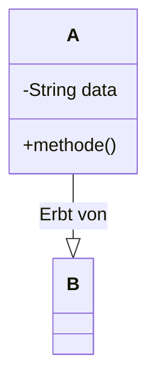

<h1> [THEMA DES SCRIPTS]</h1>

<h2> Inhaltsverzeichnis</h2>

- [1. Einleitung in \[Thema\]](#1-einleitung-in-thema)
  - [1.1. Grundkonzepte](#11-grundkonzepte)
- [2. \[Hauptkapitel 1\]](#2-hauptkapitel-1)
  - [2.1. \[Unterkapitel 2.1\]](#21-unterkapitel-21)

 	
    

    <h2>Version History</h2>
    <table style="border solid 1px;width: 100%;">
    <th style="text-align:left">Version</th>
    <th>Änderungen</th>
    <th style="text-align:right">Autor</th>
    <tr>
    <td style="text-align:left">[JJJJ-MM-TT]</td>
    <td style="text-align:left">Offizielle Erstversion</td>
    <td style="text-align:right">[Initialen des Autors]</td>
    </tr>
    <tr>
    <td style="text-align:left">[JJJJ-MM-TT]</td>
    <td style="text-align:left">Abschnitt [Nummer] hinzugefügt/überarbeitet</td>
    <td style="text-align:right">[Initialen des Autors]</td>
    </tr>
    </table>

# 1. Einleitung in [Thema]

*Hier eine allgemeine, leicht verständliche Einführung in das Thema geben. Eine Analogie hilft, den Einstieg zu erleichtern.*

Stellen Sie sich vor, ...

## 1.1. Grundkonzepte

*Listen Sie die zentralen Säulen oder Konzepte des Themas auf. Geben Sie für jeden Punkt eine kurze, prägnante Erklärung.*

1.  **`Konzept A`**: Kurze Erklärung, was es ist und tut.
2.  **`Konzept B`**: Kurze Erklärung, was es ist und tut.

> :bulb: **Merksatz:** Fassen Sie hier die wichtigste Kernaussage des Kapitels in einem leicht merkbaren Satz zusammen.

---

# 2. [Hauptkapitel 1]

*Beginnen Sie hier mit der detaillierten Behandlung des ersten großen Themenblocks.*

## 2.1. [Unterkapitel 2.1]

*Erklären Sie das spezifische Konzept dieses Unterkapitels. Beschreiben Sie seine Komponenten und seinen Zweck.*

Das `[Konzept]` besteht aus folgenden Teilen:
- **Teil 1:** Beschreibung von Teil 1.
- **Teil 2:** Beschreibung von Teil 2.

*Visuelle Darstellung zur Unterstützung des Verständnisses:*
