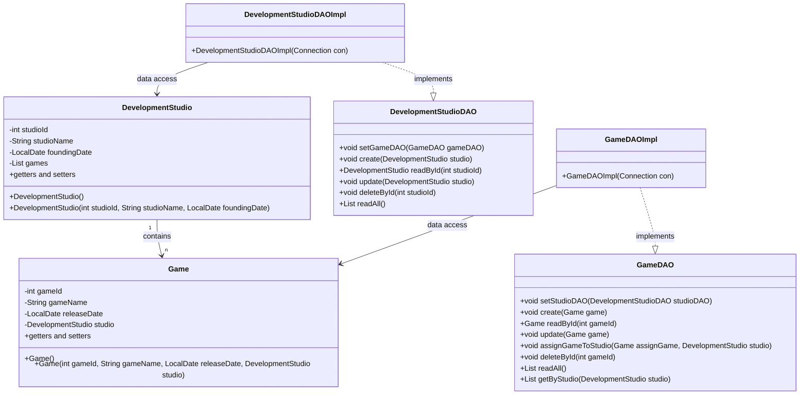

# Entwicklung von Data Access Objects (DAOs) für die Verwaltung von Spielen und Entwicklerstudios

Du arbeitest für ein Gaming-Unternehmen, das ein neues Verwaltungssystem für seine Spiele und Entwicklerstudios entwickelt. Das System soll eine H2-Datenbank verwenden, um Informationen über Spiele und die Entwicklerstudios, die sie erstellt haben, zu speichern. Jedes Spiel wurde von genau einem Entwicklerstudio entwickelt, aber ein Entwicklerstudio kann mehrere Spiele entwickelt haben.

Die beiden Klassen `Game` und `DevelopmentStudio` sind bereits definiert und stellen die Entitäten dar, die in der Datenbank persistiert werden sollen. Deine Aufgabe ist es nun, die Data Access Objects (DAOs) zu implementieren, deren Schnittstellen für diese beiden Klassen bereits vorgegeben sind. Dabei besteht eine **bidirektionale 1:n Beziehung** zwischen den Entwicklerstudios und den von ihnen entwickelten Spielen auf der Client - Seite.

## Klassendiagramm



## Anforderungen

1. Erstelle eine **H2 Datenbank**  `game_studio_management_[nachname]` (z.B. `game_studio_management_kondert`), sowie die beiden Tabellen `GAMES` und `DEVELOPMENT_STUDIOS` mit Hilfe des folgenden SQL - Statements:
    ```sql
    CREATE TABLE IF NOT EXISTS DEVELOPMENT_STUDIOS(
    studio_id INT AUTO_INCREMENT PRIMARY KEY,
    studio_name VARCHAR(255),
    founding_date DATE
    );

    CREATE TABLE IF NOT EXISTS GAMES (
    game_id INT AUTO_INCREMENT PRIMARY KEY,
    game_name VARCHAR(255),
    release_date DATE,
    studio_id INT,
    FOREIGN KEY (studio_id) REFERENCES DEVELOPMENT_STUDIOS(studio_id)
    )
    ```
2. Implementiere das bereitgestellte **Interface** `GameDAO` mit den folgenden Methoden:
    - `public void create(Game game)` - Diese Methode soll ein neues Spiel in der Datenbank anlegen. Existiert im Game - Objekt eine Referenz auf ein DevelopmentStudio, so soll der entsprechende Fremdschlüssel gesetzt werden, sofern es ein Devlopmentstudio mit dieser ID existiert. <br>:warning: **Existiert kein DevelopmentStudio** mit dieser ID muss eine entsprechende SQL-Exception geworfen werden.
    - `public Game readById(int gameId)` - Diese Methode soll ein Spiel anhand seiner ID aus der Datenbank auslesen. Dabei sollen auch die Informationen des zugehörigen Entwicklerstudios geladen werden (falls eines zugeordnet ist)
    - `public void update(Game game)` - Diese Methode soll ein bestehendes Spiel aktualisieren.
    - `public void assignGameToStudio(Game assignGame, DevelopmentStudio studio)` - Zuordnung eines Development Studios zu einem Game
    - `public void deleteById(int gameId)` - Diese Methode soll ein Spiel anhand seiner ID aus der Datenbank löschen.
    - `public List<Game> readAll()` - Diese Methode soll alle in der Datenbank gespeicherten Spiele zurückgeben
    - `public List<Game> getGamesByStudio(DevelopmentStudio studio)` - Diese Methode soll alle Spiele zurückliefern, die dem übergebenen Studio zugeordnet sind

3. Implementiere das bereitgestellte **Interface** `DevelopmentStudioDAO` mit den folgenden Methoden:
    - `public void create(DevelopmentStudio studio)` - Diese Methode soll ein neues Entwicklerstudio in der Datenbank anlegen.
    - `public DevelopmentStudio readById(int studioId)` - Diese Methode soll ein Entwicklerstudio anhand seiner ID aus der Datenbank auslesen. Dabei sollen auch alle Spiele, die von diesem Studio entwickelt wurden, geladen werden.
    - `public void update(DevelopmentStudio studio)` - Diese Methode soll ein bestehendes Entwicklerstudio aktualisieren.
    - `public void deleteById(int studioId)` - Diese Methode soll ein Entwicklerstudio anhand seiner ID aus der Datenbank löschen.
    - `public List<DevelopmentStudio> readAll()` - Diese Methode soll alle Developmenstudions mit ihren jeweils zugeordneten Spielen zurückliefern.

4. Verwende die bereitestellte Klasse `ConsoleUtil` sowie die Enumeration `MenueChoice` um die Implementierung der, durch die Enumeration `MenuChoice` vorgegebenen Aktionen in der Klasse `MainClass` durchzuführen.
   
5. Erstelle ein kurzes Dokument, das die von dir gewählte Umsetzung erläutert und wie die Anforderungen erfüllt wurden.

## (V) Import der CSV - Daten

1. Überlegen Sie sich zunächst eine Strategie, wie sie die CSV-Daten importieren. <br> 
   :warning: Da beim Insertieren die Primärschlüssel automatisch generiert werden, können die bestehenden **Primärschlüssel** und besonders die **Fremdschlüssel** in der CSV-Datei **nicht verwendet** werden.
2. Implementieren Sie den Import der CSV-Dateien

## Zusätzliche Hinweise

- Die Implementierung der DAOs soll ausschließlich mit der `JDBC-API` erfolgen. Die Verwendung von Hibernate oder einer anderen JPA Implementierung ist nicht gestattet.
- Achte auf eine saubere Trennung von Verantwortlichkeiten und eine gute Strukturierung deines Codes.

<span style="font-size: 1.5em">Viel Erfolg bei der Umsetzung!</span>