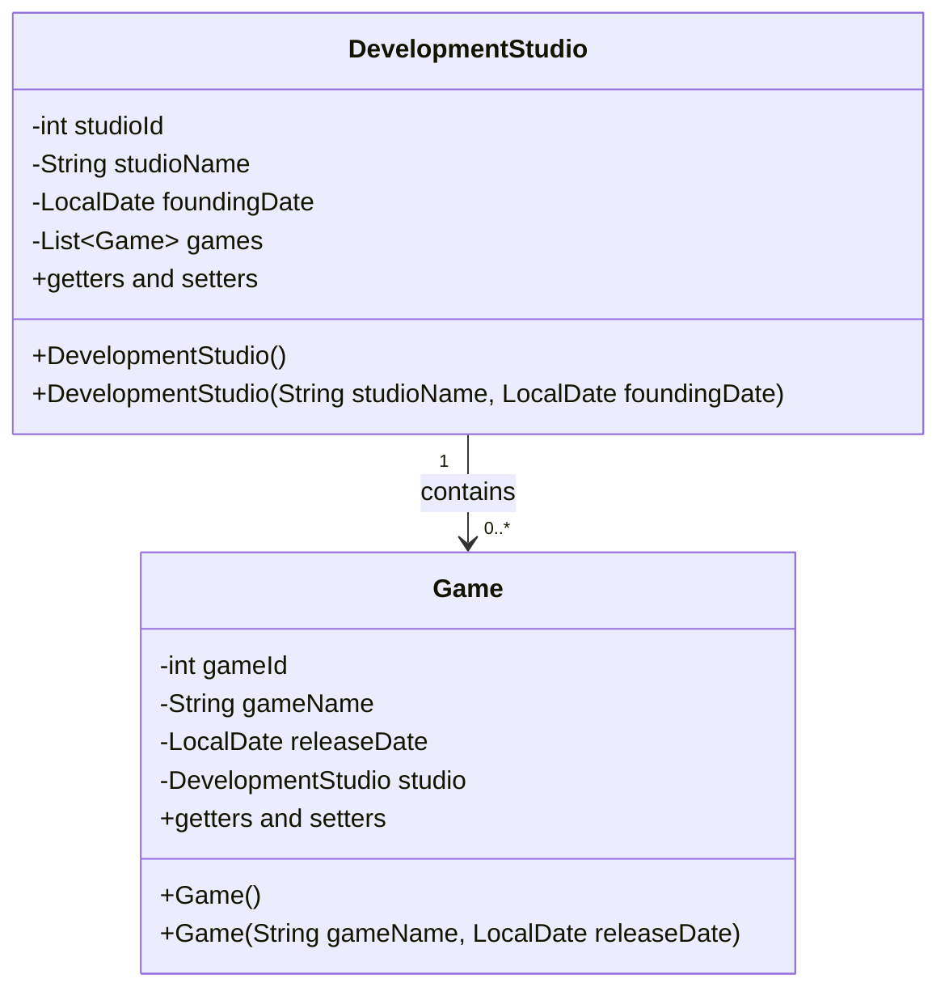
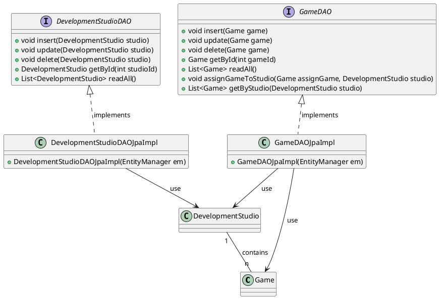

# Entwicklung von Data Access Objects (DAOs) für die Verwaltung von Spielen und Entwicklerstudios

Du arbeitest für ein Gaming-Unternehmen, das ein neues Verwaltungssystem für seine Spiele und Entwicklerstudios entwickelt. Das System soll eine H2-Datenbank verwenden, um Informationen über Spiele und die Entwicklerstudios, die sie erstellt haben, zu speichern. Jedes Spiel wurde von genau einem Entwicklerstudio entwickelt, aber ein Entwicklerstudio kann mehrere Spiele entwickelt haben.

Im folgenden werden die einzelnen Teilaufgaben angeführt.

## Vorbereitung der H2-Datenbank

- Erstellen Sie eine H2-Datenbank mit dem Namen `[nachname]_gamedev_studio`. Ersetzen Sie `[nachname]` durch Ihren eigenen Nachnamen. (z.B. `kondert_gamedev_studio`)

> :bulb: Im Kapitel 2.1 des bereitgestellten Scripts "**Datenbank-Schnittstellen**" finden sie Hinweise, wie eine H2-Datenbank in Windows angelegt wird.

## Anpassung der `persistence.xml`

- Passen Sie die `jdbc-url` in der Datei `persistence.xml` an, um auf Ihre H2-Datenbank zu verweisen.
- Setzen Sie den Parameter für das Startverhalten der JPA für die beiden Persistence-Units:
  -  `create-db`: Zum Erstellen der Datenbanktabellen  
  -  `update-db`: Zur Aktualisieruen der Datenbanktabellen im Falle von Ändrungen bei den definierten `Entity` - Klassen
  
## Implementierung der `Entity` - Klassen

Ziel ist es zunächst die Entity-Klassen mit allen vorgegebenen Constraints mittels Annotationen zu definieren. Dabei besteht eine **bidirektionale 1:n Beziehung** zwischen den Entwicklerstudios und den von ihnen entwickelten Spielen auf der Client - Seite - *siehe nachfolgendes UML-Diagramm*.

### Namensgebung für Tabellen- und Spalten

Es sollen die üblichen Naming Conventions für Datenbanken eingehalten werden. Dies bedeutet:

-  dass die Namen der Tabellen oder Spalten in **Großbuchstaben** zu definieren sind
- zusammengesetzte Namen werden mit einem Unterstrich geschrieben (z.B. `DEVELOPMENT_STUDIO`)

### Constraints der Entity Klasse `Game`

Folgende Constraints sind mittels Annotations bei der Entity Klasse Game zu definieren:

- `gameId`: Automatisch generierter Primärschlüssel
- `gameName`: 
  - nicht `null`
  - eindeutig
  - maximale Länge von 64 Zeichen
- `releaseDate`: keine Constraints

### Constraints der Entity Klasse `DevelopmentStudio`

Folgende Constraints sind mittels Annotations bei der Entity Klasse `DevelopmentStudio` zu definieren:

- `studioId`: Automatisch generierter Primärschlüssel
- `studioName`: 
  - nicht `null`
  - eindeutig
  - maximale Länge von 64 Zeichen
- `foundingDate`: 
  - nicht `null`

#### Constraints der `1:n` - Beziehung

Folgendes soll für die `1:n` - Beziehung gelten:

- Es können DeveloperStudios angelegt werden, ohne das ein Game zugordnet wird.
- Es dürfen **keine** Games **ohne** ein DeveloperStudio angelegt werden
- Wird ein DevelopmentStudio - Entity von der Datenbank gelesen, so sollen die zugeordneten Games erst von der Datenbank gelesen werden, wenn die `getGames` - Methode der `DevelopmentStudio` Entity Klasse aufgerufen wird.

## Erstellung der `DAO` - Implementierungen

Sind die Entiy-Klasse mit ihren Constraints definiert worden, so sind im Anschluss die **bereitgestellten** DAO - Interfaces `DevelopmentStudioDAO` und `GameDAO` zu implementieren.

Die Implementierung soll, so erfolgen, das bei einer insert-, delete- oder update-Operation die Änderungen sofort persistiert werden (*gleich einem **autocommit***)

## Ergänzung der `Main` - Klasse

- In der `Main` Klasse, implementieren Sie die Logik, um über Programmparameter (z.B. `c` - für `create-db`) die entsprechende Persistence Unit (z.B. `create-db` oder `update-db`) auszuwählen. **Default** sollte `update-db` sein (z.B. *wenn kein Parameter angegeben wird*)
- Verwende die bereitestellte Klasse `ConsoleUtil` sowie die Enumeration `MenueChoice` um die Implementierung der, durch die Enumeration `MenuChoice` vorgegebenen Aktionen in der Klasse `MainClass` durchzuführen.

## (V) Implementierung einer abstrakten generischen Basis DAO Klasse (`BaseDaoImpl<T>`)

- Implementieren sie das generische Interface `BaseDao<T>` durch die Implementierung einer generischen Basis DAO Klasse `BaseDaoImpl<T>`.#
- Ergänzen sie die Möglichkeit in der Basisklasse, die DAO - Klasse **mit** oder **ohne** **autocommit** zu instanzieren.
- Erstellen Sie für die beiden Interfaces `GameDAO` und `DevelopmentStudioDAO` eine zweite Implementierung, welche als Basisklasse die abstrakte generische Klasse `BaseDaoImpl<T>` verwendet.