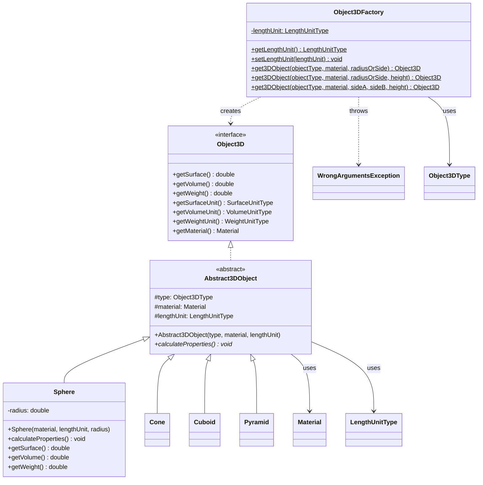

# Object3DFactory

In diesem Beispiel soll das Factory Pattern angewendet werden, um verschiedene 3D-Objekte zu erstellen, von denen die Oberfläche
, das Volumen sowie dessen Gewicht durch Angabe eines Materials mit dessen Dichte, berechnet werden. Gemeinsame Eigenschaften der Objekte 
werden in einer abstrakten Basisklasse (**Abstract3DObject**) abgebildet. Über ein Interface **Object3D** werden alle notwendigen Methoden
definiert, welche die erstellten Objekte bereitstellen sollen.

## Klassendiagramm



## Die Factory Klasse Object3DFactory

Mit Hilfe dieser Factory Klasse, sollen die unterschiedlichen 3D-Objekte erstellt werden. Es stehen drei Methoden zur Objekterstellung
zur Verfügung, wobei sich diese nur in der Anzahl der zur Objekterstellung benötigten Größenangaben unterscheiden (z.B. Kugel benötigt
nur einen Radius, wohnin gegen ein Kegel, Radius und Höhe benötigt). Stimmt die Anzahl der benötigten Größenangaben nicht mit dem,
über den Parameter objektType gewählten ObjektTyp überein, soll eine WrongArgumentsException geworfen werden.
Für das verwendete Längenmaß (LengthUnit) zur Berechnung soll Zentimeter (LengthUnitType.CENTIMETER) als Default - Wert gesetzt werden.


## Die Klasse 3D - Objektklassen
Für folgende "Basis" 3D-Objekte sollen die gleichnamigen Klassen erstellt werden:

1. Cuboid
2. Sphere
3. Pyramid
4. Cone

welche von der abstrakten Basisklasse **Abstract3DObject** abgleitet werden, sowie das Interface **Object3D** implementieren sollen.
Für diese Objekte ist das Volumen, die Oberfläche, sowie das Gewicht zu berechnen. Durch das festgelegte Längenmaß bei der Berechnung
soll automatisch die korrekte Gewichtseinheit ermittelt/gesetzt werden. Bei den Volums- und Oberflächeneinheiten soll die entsprechende 
Einheit gesetzt werden (z.B. cm -> cm² -> cm³)

Für die notwendigen Formeln, Berechung bzw. Kontrolle der Ergebnisse (ohne Unit-Tests) sind folgende Seiten sehr praktisch: 

- https://www.calculator.net/surface-area-calculator.html
- https://www.calculator.net/volume-calculator.html

## Die Enumeration Object3DType

Diese enthält alle 3D-Objekttypen, die bei der Erstellung zur Auswahl stehen.

Sie ist wie folgt definiert:
```java
public enum Object3DType { SPHERE, CONE, CUBE, CUBOID, SQUARE_PYRAMID, PYRAMID;
}
```

## Weitere zur Verfügung gestellten Enumerations

Die Weiteren Enumerations, die bereitgestellt werden, sollten selbsterklärend sein und befinden sich im Unterpackge **types**.
 

