# 4.3 Schnittstellen zwischen CDD und DDD: API-Design und Context-Kommunikation

## Übersicht

Während Kapitel 4.1 die Domain-Logik aus Backend-Perspektive (DDD) und Kapitel 4.2 die Komponentenstruktur aus Frontend-Perspektive (CDD) behandeln, geht es in diesem Kapitel um die kritische Frage: **Wie kommunizieren diese beiden Welten miteinander?**

Die Schnittstellen zwischen Frontend und Backend sind nicht nur technisch relevant, sondern sind das direkte Abbild der architektonischen Entscheidungen, die in DDD und CDD getroffen werden. Eine gut gestaltete API ist der Schlüssel zu wartbarer, skalierbarer und verständlicher Software.

---

## 4.3.1 Von Domain-Modellen zu API-Contracts

### Das Problem der direkten Modelltransaktion

Ein häufiger Fehler ist es, die Domain-Entities 1:1 über die API zu exponieren:

```
DDD Domain Entity → JSON API Response → CDD Component
```

Dies führt zu:
- **Enge Kopplung**: Frontend-Änderungen erfordern Backend-Änderungen
- **Leak von Geschäftslogik**: Interne Struktur wird exponiert
- **Validierungsprobleme**: Wer ist verantwortlich?

### Die korrekte Entkopplung durch API-Layer

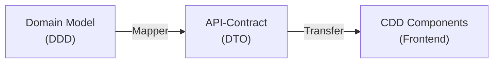

**Prinzip**: API-Contracts sind **unabhängig** von internen Domain-Modellen.

---

## 4.3.2 Arten von Schnittstellen im System

### 1. Frontend-Backend-Schnittstelle (HTTP/REST oder GraphQL)

**Anforderungen**:
- Versionierbarkeit (Breaking Changes!)
- Stabilität (API-Vertrag sollte sich weniger ändern als interne Domain)
- Domänen-Semantik (Begriffe des Ubiquitous Language verwenden)

**Beispiel - Schulbibliothek-System**:

Wir betrachten einen Schüler, der ein Buch sucht und es reservieren möchte.

```javascript
// ❌ Schlecht: Interne Domain-Struktur exponiert
GET /api/buecher/search
{
  "id": "isbn-978-3-446-47575-0",
  "ausleihExemplarAggregateRoot": {
    "boundedContextOwner": "ausleih-service",
    "aggregateId": "exemplar-456",
    "invarianten": [...]
  }
}

// ✅ Gut: Klarer API-Contract mit Ubiquitous Language
GET /api/buecher/verfuegbarkeit?titel=Domain-Driven%20Design
{
  "id": "exemplar-abc-123",
  "titel": "Domain-Driven Design",
  "autor": "Eric Evans",
  "isbn": "978-3-446-47575-0",
  "signatur": "005.1 EVA",
  "verfuebarkeitsstatus": "VERFUEGBAR",
  "standort": "Klassenzimmer-Regal 5",
  "kategorie": "Informatik"
}
```

**Ubiquitous Language beachten**:
- Im Schulbibliothek-Kontext heißt es **"Exemplar"**, nicht "Buch" (das Buch gibt es im Anschaffungs-Kontext)
- Der Status heißt **"Verfügbarkeitsstatus"**, nicht "Status"
- Der Ort heißt **"Signatur"**, nicht "Location"

### 2. Kommunikation zwischen Bounded Contexts

Auch zwischen DDD-Kontexten sind klare Schnittstellen notwendig:

**Kontexte im Schulbibliothek-System** (basierend auf Kapitel 4.1):
- **Ausleih-Kontext (Core Domain)**: Verwaltet Ausleihen, Rückgaben, Vormerkungen und Mahnungen
- **Anschaffungs-Kontext (Supporting Domain)**: Verwaltet Bestellungen von Büchern und Lieferanten
- **Nutzerprofil-Kontext (Generic Domain)**: Verwaltet Benutzerdaten und Authentifizierung

**Beispiel-Kommunikationsmuster: Reservierung eines Buches**

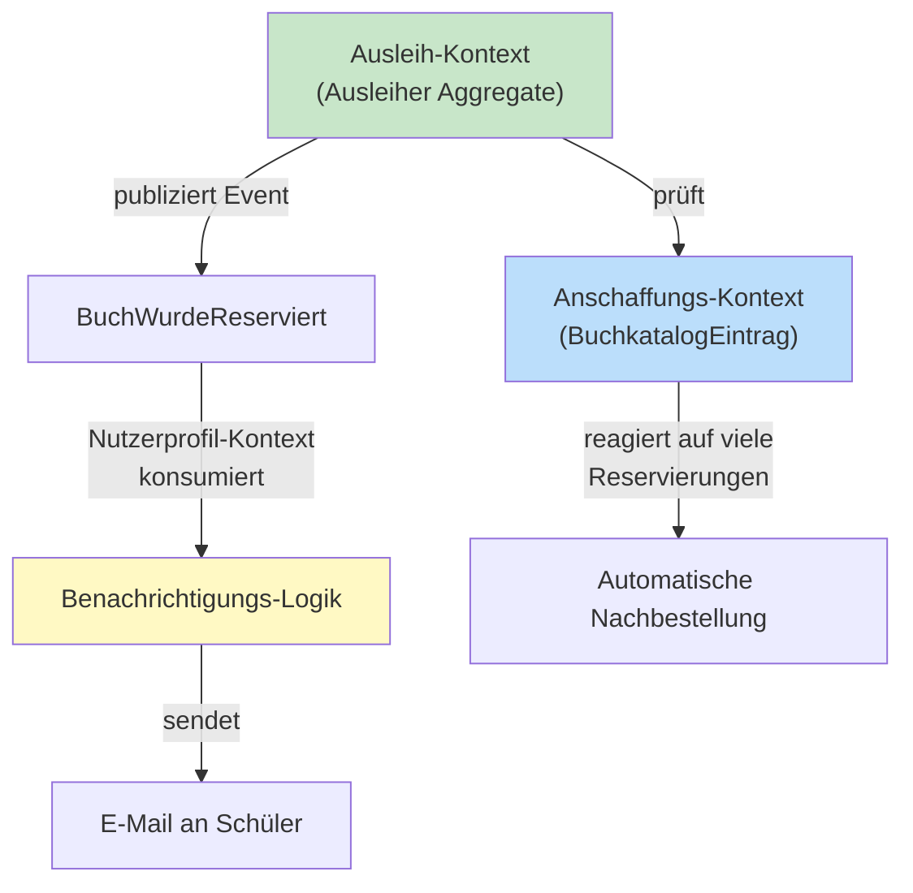

**Wichtig**: Die Kontexte sprechen über **stabile, versioned APIs**, nicht über interne Aggregate-Strukturen.
- Der Ausleih-Kontext publiziert: `BuchWurdeReserviert` mit `exemplarId`, `ausleiherName`, `reservierungsfrist`
- Der Anschaffungs-Kontext empfängt das Event und kann basierend darauf entscheiden, ob mehr Exemplare bestellt werden sollen

---

## 4.3.3 API-Design-Strategien

### Strategy 1: REST mit DTOs

**Vorteil**: Einfach, weit verbreitet, Browser-friendly
**Nachteil**: Over- und Under-Fetching

**Schulbibliothek-Beispiel: Eine Vormerkung anfragen**

```java
// Spring Boot REST Controller (Application Service)
@RestController
@RequestMapping("/api/vormerker")
public class ReservierungController {

    @Autowired
    private AusleiherRepository ausleiherRepository;
    @Autowired
    private ExemplarRepository exemplarRepository;

    @PostMapping("/{ausleiherId}/buecher/{exemplarId}/reservieren")
    public ReservierungsbestaetigungDTO reserviereBuch(
            @PathVariable String ausleiherId,
            @PathVariable String exemplarId) {
        
        // 1. Domain-Aggregates laden
        Ausleiher ausleiher = ausleiherRepository.findById(ausleiherId);
        AusleihExemplar exemplar = exemplarRepository.findById(exemplarId);
        
        // 2. Geschäftslogik im Aggregate ausführen
        Reservierung reservierung = ausleiher.reserviereBuch(exemplar);
        
        // 3. Änderungen speichern
        ausleiherRepository.save(ausleiher);
        exemplarRepository.save(exemplar);
        
        // 4. Mapper nutzen für API-Contract
        return ReservierungMapper.toDTO(reservierung);
    }
}

// Data Transfer Object (API-Contract)
public class ReservierungsbestaetigungDTO {
    public String reservierungsId;
    public String exemplarTitel;
    public LocalDate reservierungsfrist;
    public String abholort;
    public String nachricht;
}
```

**Wichtig**: Der Controller (Application Service) ist die Orchestrierungs-Schicht. Er:
1. Lädt Aggregates über Repositories
2. Ruft Methoden auf den Aggregates auf (Geschäftslogik geschützt)
3. Speichert geänderte Aggregates
4. Publisht Domain Events
5. Transformiert zu DTOs für die API

### Strategy 2: GraphQL für komplexe Abfragen

**Vorteil**: Client kann genau die Felder abfragen, die nötig sind
**Nachteil**: Komplexere Server-Implementierung

**Schulbibliothek-Beispiel: Dashboard zeigt Ausleiher-Übersicht**

```graphql
query {
  ausleiher(id: "schueler-456") {
    id
    name
    ausleihen {
      id
      exemplar {
        titel
        autor
      }
      rueckgabedatum
      ist_ueberfaellig
    }
    vormerkungen {
      id
      exemplar {
        titel
      }
      reservierungsfrist
    }
    offeneMahnungen {
      menge
      gebuehr
    }
  }
}
```

**Vorteile für CDD-Komponenten**:
- Die Dashboard-Komponente wird nur mit den Daten geladen, die sie braucht
- Verschachtelte Komponenten können unterschiedliche Query-Tiefen haben
- Keine redundanten API-Calls

### Strategy 3: Event-driven für Context-Kommunikation

**Vorteil**: Vollständige Entkopplung, asynchron möglich
**Nachteil**: Eventual Consistency, schwerer zu debuggen, nur **reaktive** Kommunikation

> <span style="font-size: 1.5em">:bulb:</span> **Wichtig zu verstehen: Events sind REAKTIV, keine Queries!**
> 
> Events ermöglichen nur asynchrone, reaktive Kommunikation. Ein Kontext **empfängt** ein Event und reagiert darauf. Es findet **keine aktive Anfrage** statt ("Sag mir, wie viele Mahnungen es gibt"). Der Kontext kann nur auf einlangende Events reagieren. Für aktive Anfragen (Queries) brauchen Sie REST/GraphQL!

**Schulbibliothek-Beispiel: Mahnwesen basierend auf Rückgabe-Events (reaktiv!)**

```yaml
Ausleih-Kontext publiziert Domain Events (Fakten, die passiert sind):
  - BuchWurdeAusgeliehen(exemplarId, ausleiherId, rueckgabedatum)
  - BuchWurdeZurückgegeben(exemplarId, ausleiherId, zeitstempel)
  - BuchIstUeberfaellig(exemplarId, ausleiherId, tage)

Mahnservice (eigener Kontext) REAGIERT asynchron auf diese Events:
  - Auf "BuchWurdeZurückgegeben": Mahnung falls vorhanden löschen
  - Auf "BuchIstUeberfaellig": 
    - E-Mail an Ausleiher senden
    - Gebühr 0,50 € pro Tag hinzufügen
    - Nach 14 Tagen: Eskalation an Bibliothekar
    - Nach 30 Tagen: Eltern benachrichtigen

Nutzerprofil-Kontext REAGIERT auf diese Events:
  - Auf "BuchWurdeAusgeliehen": Ausleiher-Statistik aktualisieren
  - Auf "BuchWurdeZurückgegeben": Rückgabe-Frequenz aktualisieren

Bestandsverwaltungs-Kontext REAGIERT auf diese Events:
  - Auf "BuchWurdeZurückgegeben": Exemplar-Status auf "Verfügbar" setzen
  - Ruft ggf. Vormerkungs-Service auf

❌ Nicht möglich mit Events: "Gib mir alle überfälligen Bücher für einen Schüler"
✅ Stattdessen: REST/GraphQL Query aufrufen!
```

**Wichtig**: Die Events sind **Public Language** zwischen den Kontexten. Sie verwenden stabile, domänenorientierte Namen und nicht interne Aggregate-IDs.

---

### Strategy 3b: Hybrid-Approach – Wann welche Kommunikationsart?

Eine professionelle Fullstack-Applikation nutzt **typischerweise ALLE drei Strategien bzw. REST in Verbindung mit Events** kombiniert. Hier sind die Entscheidungskriterien:

#### Entscheidungsmatrix: Kommunikationsart wählen

| Szenario | Art | Grund | Beispiel |
|----------|-----|-------|---------|
| **Frontend braucht Daten von Backend für UI** | REST/GraphQL | Synchron, sofort verfügbar | Buch-Suche, Benutzer-Profil laden |
| **Frontend triggert Aktion und wartet auf Bestätigung** | REST/GraphQL | Validierung & User-Feedback nötig | Buch reservieren, Gebühr bezahlen |
| **Ein Service reagiert auf was anderes passiert ist** | Events | Entkopplung, kann asynchron ablaufen | Nach Rückgabe: Exemplar freigeben, Mahnung löschen |
| **Viele Services sollen das gleiche Event verarbeiten** | Events | Skalierbar, ein Publisher → viele Subscriber | "BuchWurdeZurückgegeben" interessiert Mahndienst, Bestandsverwaltung, Statistik-Service |
| **Informationen müssen SOFORT konsistent sein** | REST/GraphQL | Keine Eventual Consistency | Exemplar-Verfügbarkeit prüfen vor Reservierung |
| **Informationen können später konsistent sein** | Events | Eventual Consistency ok | Ausleiher-Statistik aktualisieren |

#### Praktisches Schulbibliothek-Szenario: Vollständiger Flow mit Mix

```
Frontend-Aktion: Bibliothekar scannt Barcode von Buch und klickt auf "Buch zurückgegeben"
    ↓
1️⃣ REST-Call: POST /api/ausleihen/{id}/zurueckgeben
    ↓
Backend prüft sofort: Ist diese Ausleihe gültig?
    ↓
2️⃣ Backend publiziert Event: "BuchWurdeZurückgegeben"
    ↓
    ├─ 3a️⃣ Mahndienst REAGIERT: Löscht Mahnung (wenn eine existiert)
    ├─ 3b️⃣ Bestandsdienst REAGIERT: Setzt Exemplar auf "Verfügbar"
    ├─ 3c️⃣ Statistik-Service REAGIERT: Aktualisiert Rückgabe-Statistik
    └─ 3d️⃣ Vormerkungs-Service REAGIERT: Benachrichtigt nächsten Ausleiher (wenn vorgemerkt)
    ↓
Frontend wartet auf REST-Response: "Rückgabe erfolgreich"
    ↓
Frontend zeigt Bestätigung: "Danke für die Rückgabe!"
```

**Was ist hier was?**

- **REST (synchron, sofort)**: Frontend braucht Bestätigung, ob Rückgabe geklappt hat (für UI-Feedback)
- **Events (asynchron, später)**: Alle betroffenen Services werden benachrichtigt und können unabhängig reagieren

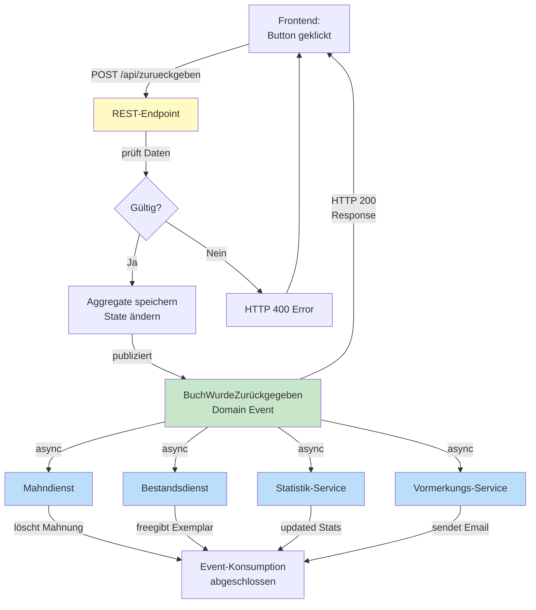

#### Konkreter Code: Hybrid-Kommunikation in der Schulbibliothek

**REST-Endpoint (synchron, von Frontend aufgerufen):**

```java
@RestController
@RequestMapping("/api/ausleihen")
public class AusleihController {

    @Autowired
    private AusleihService ausleihService;

    @PostMapping("/{ausleihId}/zurueckgeben")
    public ResponseEntity<RueckgabeBestaetigung> gibZurueck(
            @PathVariable String ausleihId) {
        try {
            // Synchron: Sofortiges Feedback für UI
            RueckgabeBestaetigung bestaetigung = ausleihService.genehmige​Rueckgabe(ausleihId);
            return ResponseEntity.ok(bestaetigung);
        } catch (AusleihNichtGueltigException ex) {
            return ResponseEntity.badRequest().body(
                new RueckgabeBestaetigung("Fehler", ex.getMessage())
            );
        }
    }
}
```

**Geschäftslogik im Aggregate (registiert Events):**

```java
public class Ausleihe {
    private String id;
    private LocalDate geplantesRueckgabedatum;
    private List<DomainEvent> events = new ArrayList<>();

    /// Domain-Methode: Gibt Buch zurück
    /// Publiziert automatisch Events (reaktive Kommunikation!)
    public void gib​Zurueck() {
        if (!this.istGueltig()) {
            throw new AusleihNichtGueltigException("Diese Ausleihe gilt nicht mehr");
        }
        
        // Status ändern
        this.status = Status.BEENDET;
        this.tatsaechlichesRueckgabedatum = LocalDate.now();
        
        // 🔥 Wichtig: Event registriert (hinzufügen) für anschließende Veröffentlichung (publishen) in Serice Klasse 
        this.addDomainEvent(new BuchWurdeZurückgegebenEvent(
            this.id,
            this.exemplarId,
            this.ausleiherId,
            this.tatsaechlichesRueckgabedatum,
            this.istUeberfaellig()  // weitere Info für Mahnservice
        ));
    }

    private void addDomainEvent(DomainEvent event) {
        events.add(event);
    }

    public List<DomainEvent> getUnpublishedEvents() {
        return new ArrayList<>(events);
    }
}
```

**Event - Publishing registrierter Events durch Service-Klasse:**

```java
@Service
public class AusleihService {

    @Autowired
    private AusleihRepository repo;
    @Autowired
    private DomainEventPublisher publisher;  // z.B. Kafka, RabbitMQ für eigenständige Microservices, EventBus für modularen Monoliten (einzelne Maven-Module in einer Applikation)

    public RueckgabeBestaetigung genehmige​Rueckgabe(String ausleihId) {
        // 1. Aggregate laden
        Ausleihe ausleihe = repo.findById(ausleihId);

        // 2. Geschäftslogik ausführen
        ausleihe.gib​Zurueck();  // ← publiziert intern Domain Events

        // 3. Speichern
        repo.save(ausleihe);

        // 🔥 4. Registrierte Events publizieren (andere Services "hören zu" asynchron)
        ausleihe.getUnpublishedEvents().forEach(event -> {
            publisher.publish(event);  // REST- / GraphQL-Clients erhalten sofort Response
                                        // Event-Subscriber reagieren asynchron!
        });

        // 5. REST-Response zurück an Frontend
        return new RueckgabeBestaetigung("Erfolg", "Buche erfolgreich zurückgegeben");
    }
}
```

**Event-Subscriber (verschiedene Services, asynchron):**

```java
// Mahndienst: Reagiert auf "BuchWurdeZurückgegeben"
@Service
public class MahnService {
   // Listener "hört" auf Event BuchWurdeZurueckgegeben
    @EventListener
    public void behande​leRueckgabe(BuchWurdeZurueckgegebenEvent event) {
        // Diese Methode läuft ASYNCHRON, NACH der REST-Response!
        Mahnung mahnung = mahnungRepo.findByAusleihId(event.ausleihId);
        if (mahnung != null && event.istUeberfaellig) {
            // Buße hinzufügen
            mahnung.addGebuehr(0.50 * event.tageUeberfaellig);
        } else if (mahnung != null) {
            // Mahnung löschen
            mahnungRepo.delete(mahnung);
        }
    }
}

// Bestandsdienst: Reagiert auf "BuchWurdeZurückgegeben"
@Service
public class BestandService {
    @EventListener
    public void behande​leRueckgabe(BuchWurdeZurückgegebenEvent event) {
        // Diese Methode läuft ASYNCHRON
        AusleihExemplar exemplar = exemplarRepo.findById(event.exemplarId);
        exemplar.setVerfuebarkeitsstatus(Status.VERFUEGBAR);
        exemplarRepo.save(exemplar);
        
        // Eventuell: Nächsten Vormerker informieren
        this.benachrichtigeVormerker(exemplar);
    }
}
```

**Zeitliche Abfolge:**

```
t0:  Frontend-User klickt "Zurückgeben"
t1:  REST-POST /api/ausleihen/{id}/zurueckgeben
t2:  Backend prüft, speichert, publiziert Event
t3:  REST-Response (HTTP 200) ← SYNCHRON, sofort
t4:  Frontend zeigt "Rückgabe erfolgreich!"
     [Zeit verstreicht, ein paar Millisekunden...]
t5:  Mahndienst empfängt Event, aktualisiert Mahnung
t6:  Bestandsdienst empfängt Event, setzt Exemplar auf "Verfügbar"
t7:  Statistik-Service empfängt Event, aktualisiert Rückgabe-Quote
     [Alles asynchron, User merkt nichts davon]
```

#### Wann NICHT Events verwenden?

❌ **Events sind NICHT geeignet für:**

1. **Echtzeit-User-Feedback**: "Ist dieses Exemplar verfügbar?" → Braucht REST/GraphQL
2. **Validierung vor Aktion**: "Darf ich dieses Buch buchen?" → Muss synchron geprüft werden
3. **Sofort-Fehler anzeigen**: "Exemplar nicht verfügbar" → User erwartet sofort Feedback
4. **Starke Konsistenz nötig**: "Mein Konto muss exakt aktualisiert sein" → REST ist zuverlässiger
5. **Kurzfristige Transaktionen**: "Reservierung ↔ Zahlung muss atomar sein" → Saga mit REST/Events, nicht nur Events

#### Best Practice: Hybrid-Ansatz Design

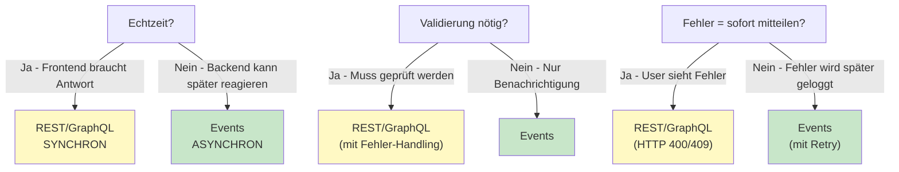

---

## 4.3.4 Mapping zwischen Domain und API

Die Transformation zwischen Domain-Model und API-Daten ist ein **kritisches Design-Pattern**. Das Mapping ist die Brücke zwischen zwei Welten: der **Geschäftslogik** (DDD) und der **öffentlichen Schnittstelle** (API).

### Bidirektionales Mapping am Schulbibliothek-Beispiel


```java
// Java Implementation (Backend Mapper)
public class AusleiherMapper {

    /**
     * Transformiert ein Ausleiher-Aggregat in ein API-DTO (Domain -> API)
     */
    public static AusleiherDTO toDTO(Ausleiher ausleiher) {
        AusleiherDTO dto = new AusleiherDTO();
        dto.id = ausleiher.getId();
        dto.name = ausleiher.getName();
        dto.rolle = ausleiher.getRolle().toString();
        
        // Abgeleitete Werte für die UI
        dto.anzahlAktuellerAusleihen = ausleiher.getAusleihen().size();
        dto.limitErreicht = ausleiher.hatLimitErreicht();
        
        return dto;
    }
    
    /**
     * Transformiert eine Request in ein Domain-Aggregat (API -> Domain)
     */
    public static Ausleiher toDomain(CreateAusleiherDTO dto) {
        // Business Factory nutzt Ubiquitous Language
        return Ausleiher.registrieren(
            dto.name,
            Rolle.valueOf(dto.rolle)
        );
    }
}
```


```java
// Java Mapping für Commands und Events
public class ReservierungMapper {

    // API-Request -> Domain-Command
    public static ReserviereBuchCommand toCommand(String aId, String eId) {
        return new ReserviereBuchCommand(aId, eId);
    }
  
    // Domain-Event -> API-DTO/Notification
    public static ReservierungsbestaetigungDTO toDTO(BuchWurdeReserviertEvent event) {
        ReservierungsbestaetigungDTO dto = new ReservierungsbestaetigungDTO();
        dto.reservierungsId = event.getReservierungsId();
        dto.nachricht = "Buch reserviert bis " + event.getFrist();
        return dto;
    }
}
```

**Wichtige Prinzipien beim Mapping**:

1. **Einseitiges Vertrauen**: DTOs kennen und validieren nie Domain-Objekte
2. **Datenreduktion**: API exponiert weniger Daten als Domain (Secrets schützen)
3. **Semantik-Bewahrung**: Ubiquitous Language bleibt erhalten
4. **Separierte Concerns**: Business-Rules sind NUR in der Domain, nicht im DTO

---

## 4.3.5 Versionierung und Evolution von APIs

Auch die beste API muss sich weiterentwickeln. Strategien:

### 1. URL-Versionierung
```
GET /api/v1/food-listings
GET /api/v2/food-listings  (mit zusätzlichen Feldern)
```

### 2. Header-Versionierung
```
GET /api/food-listings
Accept-Version: 2.0
```

### 3. Graduelle Migration
```
GET /api/food-listings → v1 (deprecated)
GET /api/food-listings/v2 → v2 (current)

Nach Übergangsfrist: v1 abschalten
```

---

## 4.3.6 Behandlung von Cross-Cutting Concerns

Authentifizierung, Autorisierung, Logging – diese sollten **nicht** die API-Contracts beeinflussen.

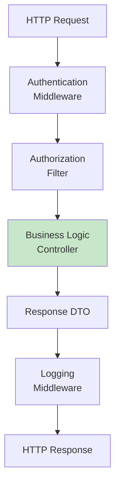

---

## 4.3.7 Praktisches Beispiel: Schulbibliothek

### Szenario 1: Buch reservieren (Smart & Presentation Components)

Dieses Beispiel zeigt die **Integration aller Schichten** aus Kapiteln 4.1, 4.2 und 4.3:

```
Backend (DDD 4.1): Geschäftslogik in Aggregates
  ↓ API-Contract (4.3)
Frontend Smart Component (CDD 4.2): Lädt Daten, verwaltet State, ruft API auf
  ↓ Props & Events
Frontend Presentation Component (CDD 4.2): Zeigt UI, emittiert Events
```

#### **Fronteend (CDD)**

**Frontend-Architektur (CDD):**

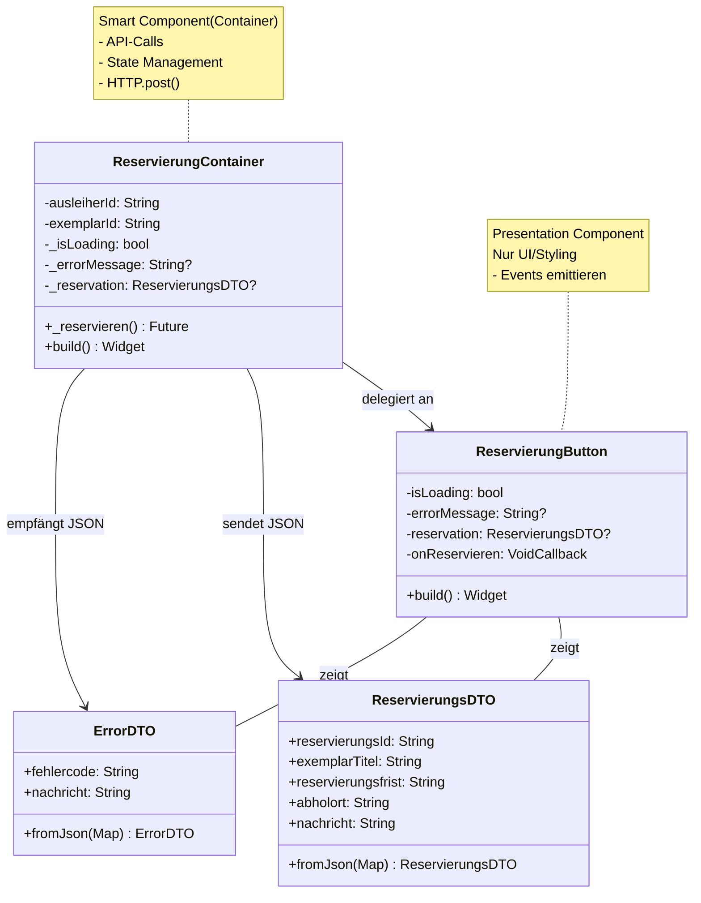

**Presentation Component (Dumb) – Nur UI & Styling:**

```dart
/// Zeigt Button und Status-Informationen
/// Hat KEINE API-Calls, KEINE Geschäftslogik
/// Nur Props rein, Events raus (Callbacks)
class ReservierungButton extends StatelessWidget {
  final bool isLoading;
  final String? errorMessage;
  final ReservierungsDTO? reservation;
  final VoidCallback onReservieren;  // Event: Parent wird benachrichtigt

  const ReservierungButton({
    required this.isLoading,
    required this.errorMessage,
    required this.reservation,
    required this.onReservieren,
  });

  @override
  Widget build(BuildContext context) {
    // Wenn bereits reserviert → Erfolgsmeldung
    if (reservation != null) {
      return Column(
        children: [
          Icon(Icons.check_circle, color: Colors.green, size: 48),
          SizedBox(height: 16),
          Text(
            'Reservierung bestätigt!',
            style: Theme.of(context).textTheme.headlineSmall,
          ),
          SizedBox(height: 8),
          Text('Abholdatum: ${reservation!.reservierungsfrist}'),
          SizedBox(height: 8),
          Text('Ort: ${reservation!.abholort}'),
        ],
      );
    }

    // Wenn Fehler → Error-Message anzeigen
    if (errorMessage != null) {
      return Column(
        children: [
          Icon(Icons.error_outline, color: Colors.red, size: 48),
          SizedBox(height: 16),
          Text(
            'Reservierung fehlgeschlagen',
            style: Theme.of(context).textTheme.headlineSmall,
          ),
          SizedBox(height: 8),
          Text(
            errorMessage!,
            style: TextStyle(color: Colors.red),
            textAlign: TextAlign.center,
          ),
        ],
      );
    }

    // Normal: Button zum Reservieren
    return ElevatedButton(
      onPressed: isLoading ? null : onReservieren,  // Event nach Parent
      child: isLoading
          ? SizedBox(
              height: 20,
              width: 20,
              child: CircularProgressIndicator(strokeWidth: 2),
            )
          : Text('Buch reservieren'),
    );
  }
}

// DTOs für API-Contract (Schnittstelle zwischen Frontend und Backend)
class ReservierungsDTO {
  final String reservierungsId;
  final String exemplarTitel;
  final String reservierungsfrist;
  final String abholort;
  final String nachricht;

  ReservierungsDTO({
    required this.reservierungsId,
    required this.exemplarTitel,
    required this.reservierungsfrist,
    required this.abholort,
    required this.nachricht,
  });

  factory ReservierungsDTO.fromJson(Map<String, dynamic> json) {
    return ReservierungsDTO(
      reservierungsId: json['reservierungsId'],
      exemplarTitel: json['exemplarTitel'],
      reservierungsfrist: json['reservierungsfrist'],
      abholort: json['abholort'],
      nachricht: json['nachricht'],
    );
  }
}

class ErrorDTO {
  final String fehlercode;
  final String nachricht;

  ErrorDTO({required this.fehlercode, required this.nachricht});

  factory ErrorDTO.fromJson(Map<String, dynamic> json) {
    return ErrorDTO(
      fehlercode: json['fehlercode'],
      nachricht: json['nachricht'],
    );
  }
}
```

**Smart Component (Container) – Datenmanagement und API-Calls:**

```dart
/// Orchestriert die Reservierungs-Logik: Laden, API-Call, Error-Handling
class ReservierungContainer extends StatefulWidget {
  final String ausleiherId;
  final String exemplarId;
  
  const ReservierungContainer({
    required this.ausleiherId,
    required this.exemplarId,
  });

  @override
  State<ReservierungContainer> createState() => _ReservierungContainerState();
}

class _ReservierungContainerState extends State<ReservierungContainer> {
  bool _isLoading = false;
  String? _errorMessage;
  ReservierungsDTO? _reservation;

  /// Ruft Backend-API auf (4.3: API-Contract)
  /// Backend-Controller verwendet DDD-Aggregate (4.1)
  Future<void> _reservieren() async {
    setState(() {
      _isLoading = true;
      _errorMessage = null;
    });

    try {
      final response = await http.post(
        Uri.parse('/api/ausleiher/${widget.ausleiherId}/buecher/${widget.exemplarId}/reservieren'),
        headers: {'Content-Type': 'application/json'},
      );

      if (response.statusCode == 200) {
        // Mapping: JSON → DTO (API-Contract aus 4.3)
        final data = ReservierungsDTO.fromJson(jsonDecode(response.body));
        
        setState(() {
          _reservation = data;
          _isLoading = false;
        });

        // Erfolgs-Benachrichtigung
        if (mounted) {
          ScaffoldMessenger.of(context).showSnackBar(
            SnackBar(content: Text(data.nachricht)),
          );
        }
      } else if (response.statusCode == 400) {
        // Business Rule verletzt (von Backend/DDD validiert)
        final error = ErrorDTO.fromJson(jsonDecode(response.body));
        setState(() {
          _errorMessage = error.nachricht;
          _isLoading = false;
        });
      } else if (response.statusCode == 409) {
        // Exemplar nicht verfügbar
        final error = ErrorDTO.fromJson(jsonDecode(response.body));
        setState(() {
          _errorMessage = error.nachricht;
          _isLoading = false;
        });
      }
    } catch (e) {
      setState(() {
        _errorMessage = 'Fehler beim Reservieren: ${e.toString()}';
        _isLoading = false;
      });
    }
  }

  @override
  Widget build(BuildContext context) {
    // Smart Component delegiert UI vollständig an Presentation Component
    return ReservierungButton(
      isLoading: _isLoading,
      errorMessage: _errorMessage,
      reservation: _reservation,
      onReservieren: _reservieren,
    );
  }
}
```


**Verantwortlichkeits-Aufteilung (nach CDD aus 4.2):**

| Aspekt | Smart Component | Presentation Component |
|--------|-----------------|----------------------|
| **API-Calls** | ✅ Macht HTTP-Requests | ❌ Nie |
| **State Management** | ✅ Verwaltet Lade-Status, Fehler | ❌ Nur Props |
| **Geschäftslogik** | ✅ Entscheidet was zu tun ist | ❌ Keine |
| **Styling & Layout** | ❌ Minimal | ✅ Vollständig |
| **Props empfangen** | Wenig (nur IDs) | Viel (alle Daten) |
| **Events emittieren** | ❌ | ✅ Callbacks an Parent |
| **Testbar** | Ohne Backend (Mocks) | ✅ Sehr einfach |
| **Wiederverwendbar** | ❌ Spezifisch für Reservierung | ✅ Überall nutzbar |

---


#### **API-Contract** (REST - Schnittstelle):

```json
POST /api/ausleiher/{ausleiherId}/buecher/{exemplarId}/reservieren

Response (200 OK):
{
  "reservierungsId": "res-12345",
  "exemplarTitel": "Domain-Driven Design",
  "reservierungsfrist": "2025-12-18",
  "abholort": "Klassenzimmer-Regal 5",
  "nachricht": "Buch erfolgreich reserviert. Bitte holen Sie es bis 18.12.2025 ab."
}

Response (400 Bad Request - Business Rule verletzt):
{
  "fehlercode": "RESERVATION_LIMIT_EXCEEDED",
  "nachricht": "Sie haben bereits 3 Reservierungen. Maximal 3 gleichzeitig erlaubt.",
  "betroffenerRessourcen": ["exemplarId"]
}

Response (409 Conflict - Exemplar nicht verfügbar):
{
  "fehlercode": "EXEMPLAR_NOT_AVAILABLE",
  "nachricht": "Dieses Exemplar ist nicht verfügbar.",
  "alternativeExemplare": [
    { "exemplarId": "ex-99", "signatur": "005.1 EVA-2" }
  ]
}
```

#### **Backend (DDD)

**Backend-Architektur**

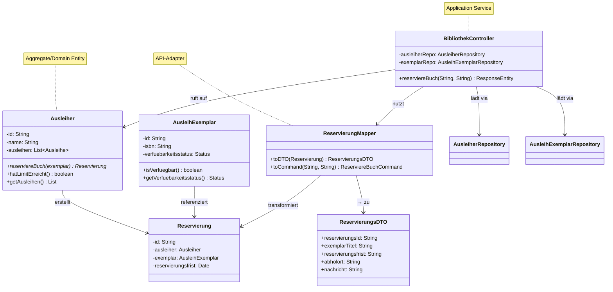

---


```java
@RestController
@RequestMapping("/api/ausleiher")
public class BibliothekController {

    @PostMapping("/{ausleiherId}/buecher/{exemplarId}/reservieren")
    public ResponseEntity<?> reserviereBuch(
            @PathVariable String ausleiherId,
            @PathVariable String exemplarId) {
        try {
            // 1. Aggregates laden
            Ausleiher ausleiher = ausleiherRepo.findById(ausleiherId);
            AusleihExemplar exemplar = exemplarRepo.findById(exemplarId);

            // 2. Geschäftslogik im Aggregate (DDD Core)
            // Wirft DomainException bei Regelverstoß
            Reservierung res = ausleiher.reserviereBuch(exemplar);

            // 3. Persistenz
            ausleiherRepo.save(ausleiher);
            
            // 4. Mapping & Response
            return ResponseEntity.ok(ReservierungMapper.toDTO(res));

        } catch (ReservationLimitExceededException ex) {
            return ResponseEntity.badRequest().body(new ErrorDTO("LIMIT_EXCEEDED", ex.getMessage()));
        } catch (ExemplarNotAvailableException ex) {
            return ResponseEntity.status(HttpStatus.CONFLICT).body(new ErrorDTO("NOT_AVAILABLE", ex.getMessage()));
        }
    }
}
```


#### **Der komplette Flow (4.2 → 4.3 → 4.1):**

```
┌─ Frontend: Präsentation (CDD 4.2) ────────────────────────────────┐
│                                                                    │
│  ReservierungContainer (Smart Component)                           │
│  • Lädt: await http.post('/api/.../reservieren')                   │
│  • State: _isLoading=true, _errorMessage=null                      │
│  • Delegiert UI an: ReservierungButton (Presentation Component)    │
│                                                                    │
│    ReservierungButton (Presentation Component)                     │
│    • Props: {isLoading, errorMessage, reservation, onReservieren}  │
│    • Events: onReservieren() ← aufgerufen vom Button-Click         │
│    • Nur UI: Icon, Text, Button                                    │
│                                                                    │
└────────────────────────────────────────────────────────────────────┘
                              ↓ HTTP
┌─ API-Contract (4.3) ───────────────────────────────────────────────┐
│                                                                    │
│  POST /api/ausleiher/{id}/buecher/{id}/reservieren               │
│                                                                    │
│  Request:  { }  (IDs kommen in der URL)                           │
│  Response: { reservierungsId, exemplarTitel, ... }               │
│  Error:    { fehlercode, nachricht }                              │
│                                                                    │
│  DTO-Mapping: Transformer zwischen Frontend und Backend           │
│  • Frontend sendet IDs (die Instanz weiß wenig)                   │
│  • Backend antwortet mit UserDTO (die UI braucht nur Anzeige)     │
│                                                                    │
└────────────────────────────────────────────────────────────────────┘
                              ↓ HTTP
┌─ Backend: Geschäftslogik (DDD 4.1) ────────────────────────────────┐
│                                                                    │
│  BibliothekController (Application Service)                        │
│  1. Parse Request & Validate Input                                 │
│  2. Load Aggregates from Repository:                               │
│     • Ausleiher ausleiher = repo.findById(ausleiherId)            │
│     • AusleihExemplar exemplar = repo.findById(exemplarId)        │
│                                                                    │
│  3. Führe Geschäftslogik im Aggregate aus:                         │
│     • Reservierung res = ausleiher.reserviereBuch(exemplar)       │
│     • ❌ Wirft Exception wenn: Limit überschritten, nicht verfügbar│
│                                                                    │
│  4. Persistiere Änderungen:                                        │
│     • ausleiherRepo.save(ausleiher)                               │
│     • Domain-Events publizieren (Event Sourcing)                   │
│                                                                    │
│  5. Mapper für Response:                                           │
│     • ReservierungMapper.toDTO(res) ← DTO-Transformation          │
│                                                                    │
└────────────────────────────────────────────────────────────────────┘
```

**Wichtige Erkenntnisse von diesem Durchlauf:**
1. **Smart Component weiß: Mit welcher URL spricht ich den Backend?** → API-Contract (4.3)
2. **Presentation Component weiß: Wie präsentiere ich das Ergebnis?** → Styling nur hier
3. **Backend weiß: Ist diese Aktion nach den Geschäftsregeln erlaubt?** → DDD-Aggregate (4.1)
4. **DTO schützt: Frontend & Backend können unabhängig gewechselt ↔ API bleibt stabil** → Versioning (4.3)

### Szenario 2: Buch-Suche (Smart Component mit GraphQL-Query)

Dieses Szenario zeigt, wie auch **Abfragen** (nicht nur Commands) die Smart/Dumb-Struktur nutzen:

#### Klassendiagramme für Szenario 2: Suche

**Frontend-Architektur (CDD):**

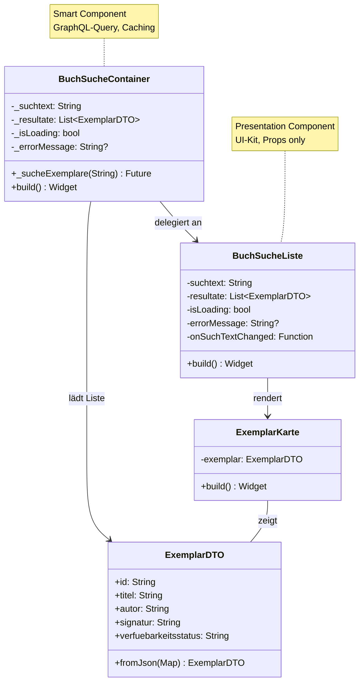

**Backend-Architektur (DDD):**

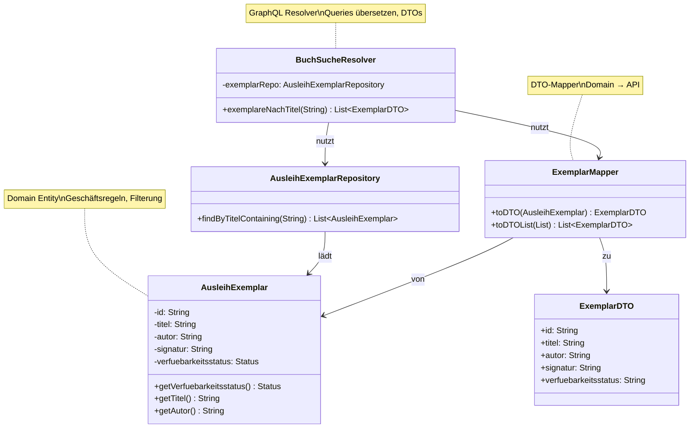

---

**Smart Component – Daten laden & cachen:**

```dart
class BuchSucheContainer extends StatefulWidget {
  const BuchSucheContainer();

  @override
  State<BuchSucheContainer> createState() => _BuchSucheContainerState();
}

class _BuchSucheContainerState extends State<BuchSucheContainer> {
  String _suchtext = '';
  List<ExemplarDTO> _resultate = [];
  bool _isLoading = false;
  String? _errorMessage;

  /// GraphQL-Query ausführen (4.3: API-Contract)
  Future<void> _sucheExemplare(String titel) async {
    if (titel.isEmpty) {
      setState(() => _resultate = []);
      return;
    }

    setState(() {
      _isLoading = true;
      _errorMessage = null;
    });

    try {
      // GraphQL Query (API-Contract)
      final query = '''
        query SucheVerfuegbareExemplare(\$titel: String!) {
          exemplareNachTitel(titel: \$titel) {
            id
            titel
            autor
            signatur
            verfuebarkeitsstatus
          }
        }
      ''';

      final response = await http.post(
        Uri.parse('/graphql'),
        headers: {'Content-Type': 'application/json'},
        body: jsonEncode({
          'query': query,
          'variables': {'titel': titel}
        }),
      );

      if (response.statusCode == 200) {
        final data = jsonDecode(response.body);
        final exemplare = (data['data']['exemplareNachTitel'] as List)
            .map((e) => ExemplarDTO.fromJson(e))
            .toList();

        setState(() {
          _resultate = exemplare;
          _isLoading = false;
        });
      } else {
        setState(() {
          _errorMessage = 'Fehler bei der Suche';
          _isLoading = false;
        });
      }
    } catch (e) {
      setState(() {
        _errorMessage = 'Netzwerkfehler: ${e.toString()}';
        _isLoading = false;
      });
    }
  }

  @override
  Widget build(BuildContext context) {
    // Smart Component delegiert UI an Presentation Component
    return BuchSucheListe(
      suchtext: _suchtext,
      resultate: _resultate,
      isLoading: _isLoading,
      errorMessage: _errorMessage,
      onSuchTextChanged: (text) {
        setState(() => _suchtext = text);
        _sucheExemplare(text);
      },
    );
  }
}
```

**Presentation Component – Nur Suche-UI & Resultate-Anzeige:**

```dart
class BuchSucheListe extends StatelessWidget {
  final String suchtext;
  final List<ExemplarDTO> resultate;
  final bool isLoading;
  final String? errorMessage;
  final Function(String) onSuchTextChanged;

  const BuchSucheListe({
    required this.suchtext,
    required this.resultate,
    required this.isLoading,
    required this.errorMessage,
    required this.onSuchTextChanged,
  });

  @override
  Widget build(BuildContext context) {
    return Column(
      children: [
        // Suchfeld (Atom aus CDD)
        TextField(
          onChanged: onSuchTextChanged,
          decoration: InputDecoration(
            hintText: 'Nach Titel suchen...',
            prefixIcon: Icon(Icons.search),
            border: OutlineInputBorder(),
          ),
        ),
        SizedBox(height: 16),

        // Fehler anzeigen
        if (errorMessage != null)
          Padding(
            padding: EdgeInsets.all(8),
            child: Text(
              errorMessage!,
              style: TextStyle(color: Colors.red),
            ),
          ),

        // Lade-Indicator
        if (isLoading) CircularProgressIndicator(),

        // Resultate als Liste von Exemplar-Karten
        if (!isLoading && resultate.isNotEmpty)
          Expanded(
            child: ListView.builder(
              itemCount: resultate.length,
              itemBuilder: (context, index) => ExemplarKarte(
                exemplar: resultate[index],
              ),
            ),
          ),

        // Keine Resultate
        if (!isLoading && resultate.isEmpty && suchtext.isNotEmpty)
          Text('Keine Bücher gefunden'),
      ],
    );
  }
}

// DTO für API-Response
class ExemplarDTO {
  final String id;
  final String titel;
  final String autor;
  final String signatur;
  final String verfuebarkeitsstatus;

  ExemplarDTO({
    required this.id,
    required this.titel,
    required this.autor,
    required this.signatur,
    required this.verfuebarkeitsstatus,
  });

  factory ExemplarDTO.fromJson(Map<String, dynamic> json) {
    return ExemplarDTO(
      id: json['id'],
      titel: json['titel'],
      autor: json['autor'],
      signatur: json['signatur'],
      verfuebarkeitsstatus: json['verfuebarkeitsstatus'],
    );
  }
}
```

**Backend: GraphQL Resolver (DDD-Integration)**

```java
@Component
public class BuchSucheResolver implements GraphQLQueryResolver {

    @Autowired
    private AusleihExemplarRepository exemplarRepo;

    /// GraphQL Query: exemplareNachTitel
    /// Nutzt Repositories um vom Backend-Kontext (4.1) zu laden
    public List<ExemplarDTO> exemplareNachTitel(@GraphQLArgument String titel) {
        // 1. Query im Ausleih-Kontext (nur verfügbare Exemplare)
        List<AusleihExemplar> exemplare = exemplarRepo.findByTitelContaining(titel);
        
        // 2. Filterung nach Geschäftsregel: Nur verfügbare Exemplare
        List<AusleihExemplar> verfuegbar = exemplare.stream()
            .filter(e -> e.getVerfuegbarkeitsstatus() == Status.VERFUEGBAR)
            .collect(Collectors.toList());
        
        // 3. Mapping zu DTO (API-Contract)
        return verfuegbar.stream()
            .map(ExemplarMapper::toDTO)
            .collect(Collectors.toList());
    }
}
```

**API-Contract (GraphQL)**:

```graphql
query SucheVerfuegbareExemplare($titel: String!) {
  exemplareNachTitel(titel: $titel) {
    id
    titel
    autor
    signatur
    verfuebarkeitsstatus      # nur verfügbare!
  }
}

# Response-Beispiel:
{
  "data": {
    "exemplareNachTitel": [
      {
        "id": "ex-123",
        "titel": "Domain-Driven Design",
        "autor": "Eric Evans",
        "signatur": "005.1 EVA",
        "verfuebarkeitsstatus": "VERFUEGBAR"
      },
      {
        "id": "ex-456",
        "titel": "Clean Architecture",
        "autor": "Robert C. Martin",
        "signatur": "005.1 MAR",
        "verfuebarkeitsstatus": "VERFUEGBAR"
      }
    ]
  }
}
```

**Wichtig**: Die GraphQL-Query folgt dem **Ubiquitous Language** aus dem Schulbibliothek-Kontext:
- Feld heißt **"exemplareNachTitel"**, nicht "searchBooks"
- Status ist **"verfuebarkeitsstatus"**, nicht "availability"
- Die Query liefert nur **verfügbare** Exemplare (Geschäftsregel aus DDD)

---

## 4.3.8 Zusammenfassung: Wie 4.1, 4.2 und 4.3 zusammenarbeiten

Lassen Sie uns nochmals die **drei Kapitel als System** betrachten:

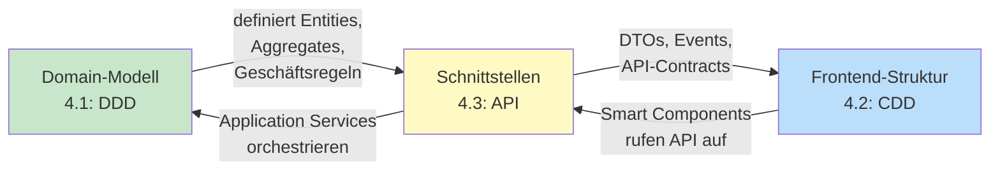

### Der praktische Fluss

**Beispiel: Schüler reserviert ein Buch (wie oben gezeigt)**

| Schicht | Was passiert | Kapitel |
|---------|-------------|---------|
| **1. Frontend: UI-Layer** | Schüler klickt "Buch reservieren" → `ReservierungButton` (Presentation Component) emittiert Event | 4.2 |
| **2. Frontend: Smart Layer** | `ReservierungContainer` empfängt Event, triggert API-Call mit HTTP POST | 4.2 |
| **3. API-Contract** | HTTP-Request geht raus, Frontend schickt nur die IDs, Backend antwortet mit DTO | **4.3** |
| **4. Backend: Application Layer** | `BibliothekController` empfängt HTTP, validiert Input, lädt Aggregates | 4.1 |
| **5. Backend: Domain Layer** | `Ausleiher.reserviereBuch(exemplar)` prüft: Limit überschritten? Exemplar verfügbar? | 4.1 |
| **6. Backend: Persistenz** | Aggregate speichern, Events publizieren (Event Sourcing) | 4.1 |
| **7. API-Response** | `ReservierungMapper.toDTO()` transformiert Domain-Objekt zu DTO für Response | **4.3** |
| **8. Frontend: Smart Layer** | `ReservierungContainer` empfängt DTO, updated State (`_reservation = data`) | 4.2 |
| **9. Frontend: Presentation Layer** | `ReservierungButton` re-rendert mit neuer Erfolgsmeldung | 4.2 |

### Die kritischen Design-Entscheidungen

| Frage | Antwort | Kapitel |
|-------|--------|---------|
| **Wer prüft, ob das Limit überschritten ist?** | Das `Ausleiher`-Aggregate im Backend (DDD) | 4.1 |
| **Wer zeigt die Erfolgsmeldung?** | Das `ReservierungButton` Presentation Component im Frontend (CDD) | 4.2 |
| **Wer transformiert Aggregate zu API-Response?** | Mapper-Klasse unter Nutzung von DTOs (API-Design) | **4.3** |
| **Wer orchestriert den Ablauf?** | Smart Component vorne, Application Service hinten | 4.2 + 4.1 |

### Warum diese Aufteilung?

- **DDD schützt Geschäftsregeln**: Die Regel "Max. 5 Ausleihen pro Schüler" gilt immer, egal welche UI
- **CDD schützt UI-Konsistenz**: Das `ReservierungButton` sieht überall gleich aus, egal welche API
- **API schützt Autonomie**: Frontend und Backend können unabhängig versioniert und deployed werden

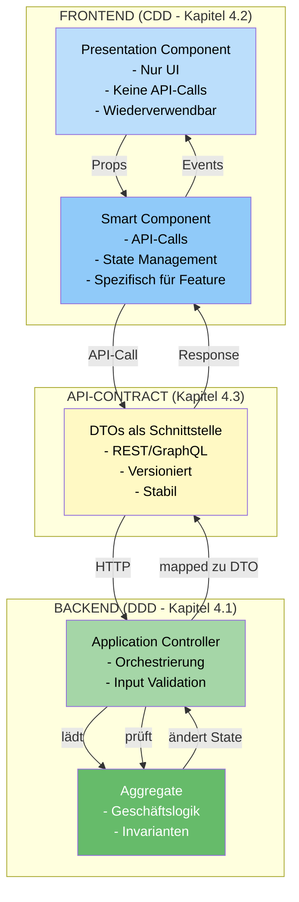

---

## Zusammenfassung: Die vier Schichten der Schulbibliothek-Architektur

| Schicht | Zuständigkeit | Kapitel | Beispiel |
|---------|---------------|---------|----------|
| **DDD (Domain Layer)** | *Welche Geschäftsregeln gelten?* | 4.1 | Ausleiher-Limite, Strafgebühren |
| **CDD (Presentation Layer)** | *Wie sieht die UI aus?* | 4.2 | Reservierungs-Button, Such-Resultat-Tabelle |
| **API-Contract** | *Wie kommunizieren Frontend & Backend?* | **4.3** | DTOs, REST-Routes, GraphQL-Queries |
| **Infrastructure** | *Wie speichern wir Daten?* | 4.4+ | Repository, ORM, Event Store |

Die API ist nicht nur technisch – sie ist eine **Manifestation des DDD-Modells**, übersetzt in Begriffe, die der Frontend verstehen kann, mit Schutz der Autonomie beider Seiten.

---

## Weiterführende Ressourcen

- Kapitel 5.2: Von Bounded Contexts zu Architekturmustern (strategische Anwendung)
- Kapitel 5.5: API-Spezifikation (OpenAPI/Swagger)
