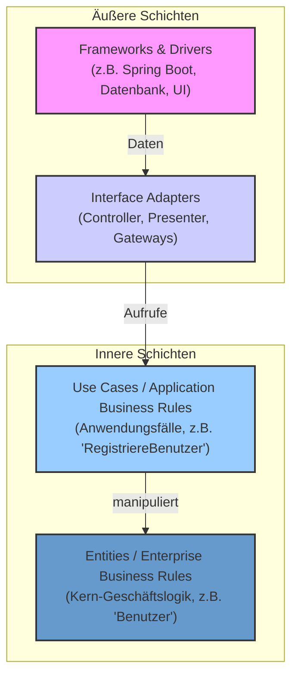

<h1>Leitfaden für das Semesterprojekt: Praktische Umsetzung mit Scrumban und Clean Architecture</h1>

<h2>Versionshistory</h2>
<div style="width: 100%;"> 	
    <div style="margin-left:1cm; margin-right:1.5cm; text-align: center;">
    <h2>Version History</h2>
    <table style="border solid 1px;width: 100%;">
    <th style="text-align:left">Version</th>
    <th>Änderungen</th>
    <th style="text-align:right">Autor</th>
    <tr>
    <td style="text-align:left">2025-09-02</td>
    <td style="text-align:left">Initiale Erstellung basierend auf Gliederung</td>
    <td style="text-align:right">G. Copilot</td>
    </tr>
    </table>
</div>

<div style="page-break-after: always"></div>

<h2>Inhaltsverzeichnis</h2>

- [1. Das Fundament – Projektmanagement und Planung](#1-das-fundament--projektmanagement-und-planung)
  - [1.1. Einleitung: Vom Konzept zum Code](#11-einleitung-vom-konzept-zum-code)
    - [1.1.1. Ziel dieses Leitfadens](#111-ziel-dieses-leitfadens)
    - [1.1.2. Die drei Säulen des Projekts](#112-die-drei-säulen-des-projekts)
  - [1.2. Agiles Projektmanagement mit Scrumban](#12-agiles-projektmanagement-mit-scrumban)
    - [1.2.1. Was ist Scrumban und warum ist es ideal für unser Projekt?](#121-was-ist-scrumban-und-warum-ist-es-ideal-für-unser-projekt)
    - [1.2.2. Werkzeuge - Das digitale Whiteboard](#122-werkzeuge---das-digitale-whiteboard)
    - [1.2.3. Der Scrumban-Workflow in der Praxis](#123-der-scrumban-workflow-in-der-praxis)
- [2. Die Struktur – Software-Architektur und Technologie](#2-die-struktur--software-architektur-und-technologie)
  - [2.1. Clean Architecture: Ein Bauplan für wartbare Software](#21-clean-architecture-ein-bauplan-für-wartbare-software)
    - [2.1.1. Das "Warum": Probleme von ungeordnetem Code](#211-das-warum-probleme-von-ungeordnetem-code)
    - [2.1.2. Die Kernidee: Trennung der Verantwortlichkeiten](#212-die-kernidee-trennung-der-verantwortlichkeiten)
    - [2.1.3. Die Abhängigkeitsregel](#213-die-abhängigkeitsregel)
    - [2.1.4. Praktische Umsetzung im Projekt (Beispiel Spring Boot)](#214-praktische-umsetzung-im-projekt-beispiel-spring-boot)
  - [2.2. API-First: Die Schnittstelle als Vertrag](#22-api-first-die-schnittstelle-als-vertrag)
    - [2.2.1. Was bedeutet API-First? Ein allgemeinerer Blick auf Schnittstellen](#221-was-bedeutet-api-first-ein-allgemeinerer-blick-auf-schnittstellen)
    - [2.2.2. Vorteile für die Teamarbeit](#222-vorteile-für-die-teamarbeit)
    - [2.2.3. Praktische Umsetzung: Driving Ports und Driven Ports](#223-praktische-umsetzung-driving-ports-und-driven-ports)
- [3. Die Umsetzung – Praktische Leitfäden](#3-die-umsetzung--praktische-leitfäden)
  - [3.1. Schritt-für-Schritt: Vom Feature zur Implementierung – Der vertikale Schnitt](#31-schritt-für-schritt-vom-feature-zur-implementierung--der-vertikale-schnitt)
    - [3.1.1. Der rote Faden: Ein Feature vertikal umsetzen](#311-der-rote-faden-ein-feature-vertikal-umsetzen)
    - [3.1.2. Tipps für den Technologie-Stack](#312-tipps-für-den-technologie-stack)
  - [3.2. Teststrategie: Qualität von innen nach außen sichern](#32-teststrategie-qualität-von-innen-nach-außen-sichern)
    - [3.2.1. Unit-Tests: Die Geschäftslogik mit Mock-Objekten isolieren](#321-unit-tests-die-geschäftslogik-mit-mock-objekten-isolieren)
    - [3.2.2. Integrationstests: Das Zusammenspiel der Schichten](#322-integrationstests-das-zusammenspiel-der-schichten)
    - [3.2.3. UI-Tests (Widget-Tests): Die Benutzeroberfläche](#323-ui-tests-widget-tests-die-benutzeroberfläche)
  - [3.3. Kollaboration mit Git: Ein einfacher Workflow für das Team](#33-kollaboration-mit-git-ein-einfacher-workflow-für-das-team)
    - [3.3.1. Die Branching-Strategie: Ordnung im Repository](#331-die-branching-strategie-ordnung-im-repository)
    - [3.3.2. Der Workflow in der Praxis: Schritt für Schritt erklärt](#332-der-workflow-in-der-praxis-schritt-für-schritt-erklärt)
    - [3.3.3. Linting: Der automatische Schiedsrichter](#333-linting-der-automatische-schiedsrichter)
    - [3.3.4. Namenskonventionen: Sprechender Code](#334-namenskonventionen-sprechender-code)
    - [3.3.5. Dokumentation im Code: Das "Warum" erklären](#335-dokumentation-im-code-das-warum-erklären)
  - [3.4. Code-Qualität und Konventionen: Eine gemeinsame Sprache sprechen](#34-code-qualität-und-konventionen-eine-gemeinsame-sprache-sprechen)
    - [3.4.1. Linting: Der automatische Schiedsrichter](#341-linting-der-automatische-schiedsrichter)
    - [3.4.2. Namenskonventionen: Sprechender Code](#342-namenskonventionen-sprechender-code)
    - [3.4.3. Dokumentation im Code: Das "Warum" erklären](#343-dokumentation-im-code-das-warum-erklären)
- [4. Glossar \& weiterführende Ressourcen](#4-glossar--weiterführende-ressourcen)

<div style="page-break-after: always;"></div>

# 1. Das Fundament – Projektmanagement und Planung

## 1.1. Einleitung: Vom Konzept zum Code

Willkommen zum Leitfaden für Ihr Semesterprojekt! Die vor Ihnen liegende Aufgabe, ein komplettes Softwareprojekt von der Idee bis zum fertigen Produkt zu entwickeln, mag zunächst wie eine gewaltige Herausforderung erscheinen. Aber keine Sorge: Mit den richtigen Werkzeugen, einer klaren Struktur und einer flexiblen Methode ist dies nicht nur machbar, sondern auch eine unglaublich lehrreiche Erfahrung.

Stellen Sie sich vor, Sie sind nicht nur einfache Programmierer, sondern Architekten, Bauleiter und Handwerker eines digitalen Bauvorhabens. Ein Hausbau würde auch nicht damit beginnen, dass man wahllos Ziegel aufeinandersetzt. Er folgt einem Plan und einer bewährten Methodik. Genau das werden wir auch tun.

In unserem Projekt ist:
-   **Scrumban** Ihre flexible Bauleitung, die dafür sorgt, dass die richtigen Dinge zur richtigen Zeit passieren.
-   Die **Clean Architecture** Ihr detaillierter Bauplan, der ein stabiles, langlebiges und wartbares Fundament garantiert.
-   Der vorgegebene **Technologie-Stack** (Spring Boot, Flutter/React etc.) Ihr hochwertiges Baumaterial, auf dessen Qualität Sie sich verlassen können.

Dieses Skript dient Ihnen als roter Faden, der Sie sicher durch alle Phasen dieses komplexen, aber spannenden Vorhabens führt.

### 1.1.1. Ziel dieses Leitfadens

Der Zweck dieses Dokuments ist es, Ihnen eine Brücke zwischen Theorie und Praxis zu bauen. Es soll Sie nicht nur auf das Projekt vorbereiten, sondern Ihnen während der gesamten Entwicklungszeit als verlässliches Nachschlagewerk dienen.

**Dieses Skript wird Ihnen helfen:**
-   Ein **gemeinsames Verständnis** für die verwendeten Methoden und Architekturen zu schaffen.
-   Ihnen **praktische, schrittweise Anleitungen** für die Einrichtung und Umsetzung zu geben.
-   Als **zentrale Wissensbasis** im Team zu fungieren, um Missverständnisse zu vermeiden und die Zusammenarbeit zu erleichtern.

Es ist bewusst **kein** Lehrbuch, das jede Technologie im Detail erklärt. Stattdessen fokussiert es sich auf das **"Wie" der Integration**: Wie bringen wir Projektmanagement, Architektur und Code zu einem erfolgreichen Ganzen zusammen?

### 1.1.2. Die drei Säulen des Projekts

Der Erfolg Ihres Projekts wird auf drei fundamentalen Säulen ruhen. Jede dieser Säulen ist entscheidend, und nur ihr Zusammenspiel führt zu einem qualitativ hochwertigen Ergebnis.

1.  **`Projektmanagement (Scrumban)`**: Dies ist die Säule, die Ihre **Arbeitsweise** definiert. Wir lernen, wie wir unsere Aufgaben effizient organisieren, im Team zusammenarbeiten, flexibel auf Änderungen reagieren und den Fortschritt für alle transparent machen.
2.  **`Software-Architektur (Clean Architecture)`**: Diese Säule bestimmt die **Struktur und Qualität** Ihres Codes. Wir lernen, wie wir unsere Anwendung so aufbauen, dass sie robust, leicht zu testen, einfach zu warten und langfristig erweiterbar ist. Eine gute Architektur ist das Rückgrat jeder professionellen Software.
3.  **`Implementierungsstrategie (API-First)`**: Diese Säule regelt die **Kommunikation und Zusammenarbeit** zwischen den verschiedenen Teilen Ihrer Anwendung (insbesondere zwischen Frontend und Backend). Wir lernen, wie wir durch klar definierte Schnittstellen ("Verträge") die parallele Entwicklung ermöglichen und die Integration vereinfachen.

> <span style="font-size: 1.5em">:bulb:</span> **Merksatz:** Ein erfolgreiches Softwareprojekt kombiniert eine flexible Methode (Scrumban), eine saubere Struktur (Clean Architecture) und eine klare Kommunikationsstrategie (API-First).

Wenn diese drei Säulen fest stehen, haben Sie die besten Voraussetzungen, um Ihr Projekt nicht nur abzuschließen, sondern ein Produkt zu schaffen, auf das Sie stolz sein können.

---

## 1.2. Agiles Projektmanagement mit Scrumban

Nachdem wir das Fundament gelegt haben, widmen wir uns nun der Bauleitung – unserer Projektmanagement-Methode. Wir verwenden **Scrumban**, einen hybriden Ansatz, der die Stärken von Scrum und Kanban kombiniert, um uns eine Struktur zu geben, die sowohl robust als auch flexibel ist.

### 1.2.1. Was ist Scrumban und warum ist es ideal für unser Projekt?

Stellen Sie sich vor, Sie planen Ihre Mahlzeiten für die Woche. **Scrum** wäre wie ein fester Wochenplan: Sie legen am Sonntag genau fest, was es jeden Tag gibt (ein fester Sprint-Plan). **Kanban** wäre wie eine Einkaufsliste mit Ideen: Sie haben eine Liste von Gerichten, die Sie kochen könnten, und entscheiden jeden Tag spontan, worauf Sie Lust haben und welche Zutaten verfügbar sind (ein flexibler Flow).

**Scrumban** kombiniert das Beste aus beiden Ansätzen: Sie haben vielleicht einen groben Plan für die Woche (die Struktur von Scrum), aber Sie sind flexibel genug, ihn anzupassen, wenn unvorhergesehene Gäste kommen oder eine Zutat ausverkauft ist (die Flexibilität von Kanban).

Für unser Semesterprojekt bedeutet das:
-   Wir übernehmen die **Struktur von Scrum**, wie z.B. klare Rollen und regelmäßige Zyklen (Arbeitswochen), um den Fortschritt messbar zu machen.
-   Wir nutzen die **Flexibilität von Kanban**, indem wir unsere Arbeit auf einem visuellen Board organisieren und uns auf einen kontinuierlichen Arbeitsfluss ("Flow") konzentrieren, anstatt auf starre Sprint-Grenzen.

Das Ziel ist, Bürokratie zu minimieren und den Fokus auf das Wesentliche zu legen: kontinuierlich wertvolle Software zu liefern.

#### Die agilen Rollen: Vom Scrum-Team zum Scrumban-Flow

Die aus Scrum bekannten Rollen bleiben in ihrer grundsätzlichen Verantwortung bestehen, aber ihr Fokus verschiebt sich, um den kontinuierlichen Fluss von Scrumban zu unterstützen.

*   **`Product Owner (Der Visionär)`**:
    *   **Verantwortung:** Stellt sicher, dass das Team **die richtigen Dinge** baut. Er oder sie ist die Stimme des Kunden, managt die Anforderungen im Product Backlog und priorisiert sie nach ihrem Wert.
    *   **Fokus-Shift in Scrumban:** Statt einen kompletten Sprint im Voraus zu planen, konzentriert sich der Product Owner darauf, dass es immer einen gut vorbereiteten und priorisierten Vorrat an Aufgaben (`Ready`-Spalte) gibt. Er sorgt für einen stetigen Nachschub an Arbeit für das Team.

*   **`Scrum Master (Der Flow-Manager)`**:
    *   **Verantwortung:** Stellt sicher, dass das Team **die Dinge richtig** baut. Er ist der Coach des Teams, beseitigt Hindernisse und schützt den Arbeitsprozess.
    *   **Fokus-Shift in Scrumban:** Seine Hauptaufgabe ist die Optimierung des Arbeitsflusses. Er hilft dem Team, Engpässe (Bottlenecks) zu erkennen (z.B. "Aufgaben stauen sich immer vor dem Testen"), und achtet auf die Einhaltung der **WIP-Limits** (Work in Progress), um das Team vor Überlastung und ständigem Kontextwechsel zu schützen.

*   **`Development Team (Die Experten)`**:
    *   **Verantwortung:** Setzt die Anforderungen in qualitativ hochwertige Software um. Das Team ist interdisziplinär und organisiert sich selbst.
    *   **Fokus-Shift in Scrumban:** Das Team arbeitet nach dem **Pull-Prinzip**. Statt dass ihnen zu Beginn eines Sprints Arbeit zugewiesen wird, "ziehen" sie sich die nächste Aufgabe mit der höchsten Priorität aus dem `Ready`-Bereich, sobald sie Kapazität dafür haben. Dies fördert Eigenverantwortung und einen gleichmäßigen Arbeitsrhythmus.

### 1.2.2. Werkzeuge - Das digitale Whiteboard

Das Herzstück von Scrumban ist ein visuelles Board, das den gesamten Workflow transparent darstellt. Jeder im Team kann auf einen Blick sehen, woran gerade gearbeitet wird, was als Nächstes ansteht und wo es möglicherweise hakt.

- **Option A: `GitHub Projects`**:
  - **Vorteil:** Perfekt in den Entwicklungs-Workflow integriert. Issues, Branches und Pull Requests können direkt mit den Aufgabenkarten auf dem Board verknüpft werden. Dies schafft eine nahtlose Verbindung zwischen Planung und Code.
  - **Nachteil:** Kann für reines Projektmanagement ohne direkten Code-Bezug überladen wirken. Die Lernkurve ist möglicherweise steiler, wenn das Team mit GitHub noch nicht vertraut ist.
  - **Anwendungsbereich:** Ideal für Entwicklerteams, die bereits GitHub für die Versionskontrolle verwenden. Perfekt, wenn eine enge Verknüpfung von Aufgaben (Issues) und Code-Änderungen (Branches, Pull Requests) gewünscht ist.

- **Option B: `Trello`**:
  - **Vorteil:** Extrem einfach und intuitiv zu bedienen. Ideal für einen schnellen Start in die visuelle Projektorganisation.
  - **Nachteil:** Die Integration in Entwicklungsprozesse (wie GitHub) ist nur über "Power-Ups" (Erweiterungen) möglich und nicht so nahtlos wie bei GitHub Projects. Bei sehr großen Projekten kann die Übersichtlichkeit leiden.
  - **Anwendungsbereich:** Hervorragend für Projekte, bei denen der Fokus auf einfachem, visuellem Task-Management liegt und weniger auf der direkten Code-Integration. Gut geeignet für gemischte Teams (z.B. mit Designern, Marketing), die ein unkompliziertes Werkzeug benötigen.
  
#### Verwendung von Github-Copilot als Tool

- **Einrichtung eines Scrum Boards in GitHub Projects:**
  1.  **Projekt erstellen:** Navigieren Sie in Ihrem Repository zum Tab `Projects`. Klicken Sie auf `New project` und wählen Sie die Vorlage `Board`. Geben Sie dem Projekt den Namen ihres Projekts.
  2.  **Sichtbarkeit anpassen:** Öffnen Sie die Projekteinstellungen (über die drei Punkte `...` oben rechts) und setzen Sie die Sichtbarkeit auf `Public`, damit alle Teammitglieder darauf zugreifen können.
  3.  **Spalten konfigurieren:** Passen Sie die Standardspalten an unseren Workflow an. Löschen oder benennen Sie die Spalten um, sodass Sie die folgende Struktur erhalten:
      -   `Backlog`: Hier sammeln Sie alle Ideen, Features und User Stories als Issues. Dies ist Ihr Ideen-Speicher.
      -   `Bereit zur Entwicklung (Ready)`: Aufgaben aus dem Backlog, die klar definiert, priorisiert und bereit für die Umsetzung sind.
      -   `In Arbeit (In Progress)`: Aufgaben, an denen aktiv gearbeitet wird. **Wichtig:** Jedes Teammitglied sollte sich hier eine Aufgabe zuweisen, um Doppelarbeit zu vermeiden.
      -   `Review / Test`: Eine Aufgabe ist technisch fertig und wartet auf die Überprüfung durch ein anderes Teammitglied (Code-Review) oder einen Test.
      -   `Fertig (Done)`: Die Aufgabe ist vollständig abgeschlossen, geprüft und in den Haupt-Branch integriert. Feiern Sie diesen Erfolg!
- **Tipps für die effektive Nutzung:**
  -   **Aufgaben richtig zuschneiden:** Eine Aufgabe sollte klein genug sein, um sie in kurzer Zeit abzuschließen (z.B. eine einzelne Funktion), aber groß genug, um einen Mehrwert zu liefern.
  -   **Board proaktiv pflegen:** Weisen Sie sich selbst eine Aufgabe zu und verschieben Sie sie sofort nach `In Progress`. Das schafft Transparenz und Eigenverantwortung.
  -   **"Done" zelebrieren:** Das Verschieben einer Karte nach `Done` ist nicht nur ein administrativer Schritt, sondern auch ein motivierender Moment für das ganze Team.

#### Verwendung von Tello als Tool

- **Einrichtung und Verwendung eines Kanban-Boards in Trello:**
    1.  **Board erstellen:** Klicken Sie auf der Trello-Startseite auf "Neues Board erstellen" und geben Sie ihm einen aussagekräftigen Namen (z.B. "Semesterprojekt-Scrumban").
    2.  **Spalten (Listen) für den Workflow anlegen:** Erstellen Sie die für Scrumban typischen Spalten, indem Sie auf "+ Liste hinzufügen" klicken. Unsere empfohlene Struktur ist:
        -   `Backlog`: Sammelstelle für alle Ideen und rohen Anforderungen.
        -   `Bereit zur Entwicklung (Ready)`: Klar definierte und priorisierte Aufgaben, die als nächstes umgesetzt werden können.
        -   `In Arbeit (In Progress)`: Die Aufgaben, an denen gerade aktiv gearbeitet wird.
        -   `Review / Test`: Erledigte Aufgaben, die auf eine Qualitätsprüfung durch ein anderes Teammitglied warten.
        -   `Fertig (Done)`: Abgeschlossene und abgenommene Aufgaben.
    3.  **Aufgaben (Karten) erstellen:** Fügen Sie in der `Backlog`-Spalte für jede Anforderung eine "Karte" hinzu. Geben Sie der Karte einen kurzen, prägnanten Titel.
    4.  **Karten detaillieren:** Öffnen Sie eine Karte, um Details hinzuzufügen. Nutzen Sie das **Beschreibungsfeld**, um die User Story vollständig auszuformulieren (`Als <Rolle> möchte ich <Ziel>, um <Nutzen> zu erreichen.`). Fügen Sie Checklisten, Anhänge oder Fälligkeitsdaten hinzu, falls nötig.
    5.  **Arbeitsfortschritt visualisieren:** Der Kern des Prozesses ist das Verschieben der Karten von links nach rechts durch die Spalten. Wenn Sie mit einer Aufgabe beginnen, ziehen Sie die Karte von `Ready` nach `In Progress`. Wenn sie fertig ist, wandert sie weiter nach `Review / Test` und schließlich nach `Done`.
- **Zusätzlicher Tipp:** Nutzen Sie "Power-Ups" (Erweiterungen) wie "WIP Limits", um die Anzahl der Karten in der "In Arbeit"-Spalte zu begrenzen. Das hilft dem Team, sich zu fokussieren und Engpässe schnell zu erkennen.

### 1.2.3. Der Scrumban-Workflow in der Praxis

*   **Anforderungen als User Stories formulieren**: Jede Anforderung wird als eine kurze, prägnante Geschichte aus der Perspektive des Nutzers formuliert: `Als <Rolle> möchte ich <Ziel/Wunsch>, um <Nutzen> zu erreichen.` Dies hilft, den Fokus auf den Mehrwert für den Anwender zu legen.

*   **Planung & Priorisierung**: Statt großer Sprint-Planning-Meetings gibt es regelmäßige, kurze **Backlog-Refinement-Meetings**. Hier sorgt der Product Owner zusammen mit dem Team dafür, dass die obersten Einträge im Backlog klar verstanden, klein genug und bereit für die Umsetzung sind.

*   **Das tägliche Arbeiten**: Der Weg einer Aufgabe über das Board ist klar definiert. Ein zentrales Element sind die **WIP-Limits**. Indem wir die Anzahl der Aufgaben in der "In Arbeit"-Spalte begrenzen, zwingen wir uns, angefangene Dinge erst fertigzustellen, bevor wir Neues beginnen. Das reduziert Stress und erhöht die Effizienz.

*   **Review & Retrospektive**: Auch in Scrumban schauen wir regelmäßig zurück, um uns zu verbessern.
    *   Ein **Review** kann stattfinden, wann immer ein wertvolles Feature-Paket fertig ist, um Feedback von Stakeholdern einzuholen.
    *   Eine **Retrospektive** zur Verbesserung des Arbeitsprozesses sollte in regelmäßigen Abständen (z.B. alle zwei Wochen) stattfinden, um zu besprechen: Was lief gut? Was können wir verbessern?

<div style="page-break-after: always;"></div>

# 2. Die Struktur – Software-Architektur und Technologie

## 2.1. Clean Architecture: Ein Bauplan für wartbare Software

Stellen Sie sich vor, Sie bauen ein Auto. Würden Sie den Motor direkt mit der Karosserie verschweißen? Sicher nicht. Sie würden den Motor auf einem Chassis montieren, die Karosserie daraufsetzen und die Elektronik als separates System installieren. Jede Komponente hat ihren Platz und ihre Aufgabe. Genau dieses Prinzip der **Trennung von Verantwortlichkeiten** verfolgt die Clean Architecture in der Softwareentwicklung.

### 2.1.1. Das "Warum": Probleme von ungeordnetem Code

Haben Sie schon einmal versucht, eine kleine Änderung in einem Projekt vorzunehmen, und plötzlich funktionierten fünf andere, scheinbar unabhängige Dinge nicht mehr? Das ist ein typisches Symptom von **"Spaghetti-Code"** – einem Code-Knäuel, in dem alles mit allem verwoben ist.

> <span style="font-size: 1.5em">:warning:</span> **Achtung: Die Gefahren von Spaghetti-Code**
> *   **Hohe Fehleranfälligkeit:** Eine Änderung an einer Stelle führt zu unerwarteten Fehlern an anderer Stelle (Dominoeffekt).
> *   **Schlechte Wartbarkeit:** Fehler zu finden und zu beheben, wird zu einer langwierigen Detektivarbeit.
> *   **Geringe Flexibilität:** Der Austausch einer Technologie (z.B. eine Datenbank) ist fast unmöglich, da der Code eng mit ihr verknüpft ist.
> *   **Schwierige Testbarkeit:** Einzelne Logik-Teile können nicht isoliert getestet werden, was automatisierte Tests erschwert.
> *   **Langsamer Entwicklungsfortschritt:** Neue Features zu implementieren, dauert immer länger, weil das System immer komplexer und unübersichtlicher wird.

Eine saubere Architektur ist die **Versicherung** gegen diese Probleme. Sie ist eine Investition am Anfang, die sich über die gesamte Lebensdauer des Projekts um ein Vielfaches auszahlt.

### 2.1.2. Die Kernidee: Trennung der Verantwortlichkeiten

Die Clean Architecture, populär gemacht von Robert C. Martin ("Uncle Bob"), organisiert den Code in konzentrischen Schichten, ähnlich einer Zwiebel. Jede Schicht hat eine klar definierte Aufgabe und ist von den anderen entkoppelt.



> <span style="font-size: 1.5em">:mag:</span> **Die Schichten im Detail:**
> 1.  **`Entities` (Der Kern):** Dies ist das Herz Ihrer Anwendung. Hier leben die allgemeinen Geschäftsregeln und -objekte (z.B. ein `User` mit seinen Eigenschaften und Methoden, die immer gelten, egal ob die App im Web oder auf dem Handy läuft). Diese Schicht ist komplett unabhängig von allem anderen.
> 2.  **`Use Cases` (Die Anwendungslogik):** Diese Schicht orchestriert die `Entities`, um spezifische Anwendungsfälle abzubilden (z.B. `RegistriereNeuenBenutzer`, `BerechneBestellsumme`). Sie enthält die Anwendungs-spezifische Geschäftslogik.
> 3.  **`Interface Adapters` (Die Übersetzer):** Diese Schicht ist für die Konvertierung von Daten zuständig. Sie nimmt Daten von den äußeren Schichten (z.B. einem Web-Request) entgegen und bereitet sie für die `Use Cases` auf. Umgekehrt formatiert sie die Ergebnisse aus den inneren Schichten für die Anzeige in der UI. `Controller`, `Presenter` und `Gateways` (Repositories) leben hier.
> 4.  **`Frameworks & Drivers` (Die Außenwelt):** Hier befindet sich alles, was extern ist: die Datenbank, das Web-Framework (wie Spring Boot), das UI-Framework (wie Flutter oder React), etc. Diese Schicht ist am "unwichtigsten", da sie austauschbar sein sollte.

### 2.1.3. Die Abhängigkeitsregel

**Das wichtigste Prinzip der Clean Architecture lautet: Abhängigkeiten zeigen immer nur nach innen.**

Das bedeutet:
*   Die `Use Cases` wissen von den `Entities`, aber die `Entities` wissen nichts von den `Use Cases`.
*   Die `Interface Adapters` wissen von den `Use Cases`, aber die `Use Cases` wissen nichts von den `Interface Adapters`.

> <span style="font-size: 1.5em">:bulb:</span> **Merksatz:** Eine innere Schicht darf niemals den Namen einer Klasse, einer Funktion oder einer Variable aus einer äußeren Schicht erwähnen.

**Wie funktioniert das in der Praxis?** Durch das **Dependency-Inversion-Prinzip** und **Interfaces**, die in der Clean Architecture als **Ports** bezeichnet werden. Die Anwendungslogik (`Use Cases`) definiert, welche "Anschlüsse" sie benötigt, ohne die konkrete Technologie dahinter zu kennen.

Man unterscheidet zwei Arten von Ports:

1.  **Driving Ports (oder Primary Ports):**
    *   **Zweck:** Sie sind die API des Anwendungskerns. Sie definieren, wie die Außenwelt (z.B. ein Web-Controller) mit der Anwendungslogik interagiert.
    *   **Beispiel:** Ein `RegistriereBenutzerUseCase`-Interface.
        *   **Wer definiert es?** Der Anwendungskern (`Use Cases`-Schicht).
        *   **Wer implementiert es?** Der Anwendungskern selbst (z.B. in einer Klasse `RegistriereBenutzerUseCaseImpl`).
        *   **Wer ruft es auf?** Eine äußere Schicht, z.B. der `BenutzerController`, der den Request vom Web-Frontend entgegennimmt. Der Controller "treibt" (`drives`) die Anwendungslogik an.

2.  **Driven Ports (oder Secondary Ports):**
    *   **Zweck:** Sie definieren die Anforderungen des Anwendungskerns an externe Dienste wie Datenbanken, E-Mail-Services oder andere APIs.
    *   **Beispiel:** Ein `BenutzerRepository`-Interface für die Persistenz.
        *   **Wer definiert es?** Der Anwendungskern (`Use Cases`-Schicht), weil er festlegt, welche Datenoperationen er *benötigt* (z.B. `save(user)`, `findById(id)`).
        *   **Wer implementiert es?** Eine äußere Schicht, z.B. eine Klasse `PostgresBenutzerRepository` in der `Infrastructure`-Schicht.
        *   **Wer ruft es auf?** Der Anwendungskern. Er wird von der Implementierung in der äußeren Schicht "getrieben" (`is driven by`).

Durch diesen Mechanismus (Dependency Injection) wird zur Laufzeit die konkrete Implementierung (`PostgresBenutzerRepository`) in den Anwendungskern "injiziert", der aber nur gegen das von ihm definierte Interface (`BenutzerRepository`) arbeitet. So bleibt der Kern vollständig von der Datenbanktechnologie entkoppelt.

### 2.1.4. Praktische Umsetzung im Projekt (Beispiel Spring Boot)

Für unser Spring Boot Backend schlagen wir eine Ordnerstruktur vor, die diese Schichten widerspiegelt. Dies schafft von Anfang an Klarheit und hilft, die Architekturregeln einzuhalten.

```
com.example.projekt
└──
 ├── application // Use Cases & Entities
 │   ├──
 │   ├── usecase // Anwendungsfälle
 │   │   └── benutzer // Feature-bezogen
 │   │       ├── RegistriereBenutzerUseCase.java
 │   │       └── ...
 │   ├──
 │   ├── domain // Entities
 │   │   ├── model
 │   │   │   └── Benutzer.java
 │   │   └── port // Interfaces für die äußeren Schichten
 │   │       └── BenutzerRepository.java
 │   
 └── infrastructure // Interface Adapters & Frameworks
     ├──
     ├── web // Controller (Interface Adapter)
     │   └── benutzer
     │       └── BenutzerController.java
     ├──
     ├── persistence // Gateways (Interface Adapter)
     │   └── postgres
     │       ├── PostgresBenutzerRepository.java
     │       └── ...
     └──
     └── config // Konfiguration (Frameworks & Drivers)
         └── DependencyInjectionConfig.java
```

> <span style="font-size: 1.5em">:mag:</span> **Struktur erklärt:**
> *   **`application`**: Enthält den stabilen Kern der Anwendung (`domain`) und die Anwendungslogik (`usecase`). Dieser Teil sollte sich selten ändern.
> *   **`infrastructure`**: Enthält die "flüchtigen" Teile, die sich oft ändern oder von externen Faktoren abhängen, wie die Web-Schnittstelle (`web`) oder die Datenbankanbindung (`persistence`).

Diese Struktur ist nicht in Stein gemeißelt, aber sie bietet einen exzellenten Ausgangspunkt, um die Prinzipien der Clean Architecture von Beginn an konsequent umzusetzen.

---

## 2.2. API-First: Die Schnittstelle als Vertrag

Stellen Sie sich erneut den Hausbau vor. Bevor der Elektriker die Kabel verlegt und der Installateur die Rohre, einigen sich alle auf einen detaillierten Plan: Wo genau sind die Steckdosen? Wo befinden sich die Wasseranschlüsse? Dieser Plan ist ein **verbindlicher Vertrag**, der sicherstellt, dass am Ende alles zusammenpasst.

In der Softwareentwicklung ist die **API (Application Programming Interface)** dieser Vertrag. Der **API-First-Ansatz** bedeutet, dass wir diesen Vertrag entwerfen, abstimmen und finalisieren, *bevor* wir mit der eigentlichen Programmierung von Frontend oder Backend beginnen.

### 2.2.1. Was bedeutet API-First? Ein allgemeinerer Blick auf Schnittstellen

API-First ist eine Entwicklungsstrategie, bei der die **Schnittstelle (API)** im Zentrum des gesamten Prozesses steht. Wichtig ist hierbei, den Begriff "API" weiter zu fassen: Es geht um *jeden* Vertrag zwischen zwei Software-Komponenten. Das kann eine Web-API sein, aber genauso gut ein **Java-Interface**, das den Vertrag zwischen zwei Modulen innerhalb derselben Anwendung definiert.

Anstatt eine Anwendung zu bauen und am Ende zu überlegen, wie die Teile miteinander kommunizieren, beginnen wir mit dem Design dieser Schnittstellen.

> <span style="font-size: 1.5em">:bulb:</span> **Merksatz:** Beim "Interface-First"-Ansatz ist die Schnittstelle nicht ein nachträgliches Abfallprodukt der Implementierung, sondern das primäre Produkt, um das herum die Anwendung gebaut wird.

Dieser "Vertrag" definiert präzise, wie Komponenten interagieren.

**Beispiel 1: Der Vertrag einer REST-API (externe Kommunikation)**
Hier definiert der Vertrag, wie z.B. ein Frontend mit einem Backend spricht:
*   **Endpunkte:** Welche URLs stehen zur Verfügung (z.B. `/users`, `/products/{id}`)?
*   **Methoden:** Welche Aktionen sind möglich (GET, POST, PUT, DELETE)?
*   **Datenformate:** Wie sehen die Anfrage- und Antwort-Daten aus (z.B. JSON-Struktur)?
*   **Statuscodes:** Wie kommuniziert der Server Erfolg oder Fehler (z.B. `200 OK`, `404 Not Found`)?

**Beispiel 2: Der Vertrag eines Java-Interfaces (interne Kommunikation)**
Hier definiert der Vertrag, wie z.B. die Anwendungslogik (Use Case) mit der Datenbankschicht spricht, ohne sie direkt zu kennen (siehe Clean Architecture):
*   **Methodensignaturen:** Welche Operationen werden angeboten (z.B. `save(User user)`, `findById(long id)`)?
*   **Datenobjekte:** Welche Objekte werden übergeben und zurückgegeben (`User`, `Optional<User>`)?
*   **Exceptions:** Welche Fehler können auftreten (z.B. `UserNotFoundException`)?

In beiden Fällen gilt: Zuerst wird der Vertrag (die `openapi.yaml` oder das `UserRepository.java`-Interface) definiert, dann wird gegen diesen Vertrag entwickelt.

### 2.2.2. Vorteile für die Teamarbeit

Dieser Ansatz mag zunächst nach mehr Aufwand klingen, bietet aber entscheidende Vorteile, besonders in Teamprojekten.

*   **Parallele Entwicklung:** Sobald der API-Vertrag steht, können das **Frontend-Team** und das **Backend-Team** vollkommen unabhängig voneinander arbeiten.
    *   Das **Backend-Team** implementiert die im Vertrag definierte Logik.
    *   Das **Frontend-Team** entwickelt gegen einen **"Mock-Server"**, der simulierte, aber korrekt formatierte Antworten gemäß dem Vertrag zurückgibt. Das Warten auf das Backend entfällt.

*   **Klare Kommunikation & weniger Missverständnisse:** Die API-Definition ist die **einzige Quelle der Wahrheit** (`Single Source of Truth`). Diskussionen wie "Ich habe aber andere Daten erwartet!" gehören der Vergangenheit an.

*   **Frühes Feedback:** Die API kann frühzeitig mit anderen Teams oder sogar externen Partnern geteilt und validiert werden. Änderungen sind zu diesem Zeitpunkt noch "billig", da noch keine Zeile Implementierungscode geschrieben wurde.

*   **Bessere Qualität und Konsistenz:** Der Fokus liegt auf dem Design einer durchdachten und benutzerfreundlichen API. Dies führt zu konsistenten und wiederverwendbaren Schnittstellen.

> <span style="font-size: 1.5em">:warning:</span> **Achtung:** Der Erfolg des API-First-Ansatzes hängt von der Disziplin des Teams ab. Der einmal geschlossene "Vertrag" sollte während der Entwicklung nicht leichtfertig geändert werden. Änderungen müssen kommuniziert und abgestimmt werden.

### 2.2.3. Praktische Umsetzung: Driving Ports und Driven Ports

Je nachdem, ob wir eine Schnittstelle für die Außenwelt (z.B. ein Frontend) oder für die interne Kommunikation zwischen Modulen bereitstellen, unterscheidet sich die praktische Umsetzung des Vertrags. Hier kommen die Port-Bezeichnungen aus der Clean Architecture ins Spiel.

#### Variante 1: Driving Port für externe Aufrufe (z.B. REST-API)

Ein **Driving Port** ist die API, die unser Anwendungskern der Außenwelt zur Verfügung stellt. Externe Akteure (wie ein Web-Controller) nutzen diesen Port, um die Anwendungslogik "anzutreiben". Für eine REST-API definieren wir diesen Vertrag mit der **OpenAPI-Spezifikation**.

```yaml
# openapi.yaml: Definiert den Vertrag für den Driving Port
openapi: 3.0.3
info:
  title: Semesterprojekt API
  version: 1.0.0
servers:
  - url: http://localhost:8080/api
paths:
  /users:
    get:
      summary: Gibt eine Liste aller Benutzer zurück
      tags:
        - Users
      operationId: listUsers
      responses:
        '200':
          description: Eine erfolgreiche Antwort mit einer Liste von Benutzern.
          content:
            application/json:
              schema:
                type: array
                items:
                  $ref: '#/components/schemas/User'
        '500':
          description: Interner Serverfehler
          content:
            application/json:
              schema:
                $ref: '#/components/schemas/Error'

components:
  schemas:
    User:
      type: object
      required:
        - id
        - username
        - email
      properties:
        id:
          type: integer
          format: int64
          example: 10
          readOnly: true
        username:
          type: string
          example: 'max_mustermann'
        email:
          type: string
          format: email
          example: 'max.mustermann@example.com'

    Error:
      type: object
      required:
        - code
        - message
      properties:
        code:
          type: integer
          format: int32
        message:
          type: string
```

> <span style="font-size: 1.5em">:mag:</span> **Werkzeuge aus dem OpenAPI-Ökosystem:**
> *   **`Swagger Editor`**: Ein Online- oder lokaler Editor, der beim Schreiben der `YAML`-Datei hilft und sie in Echtzeit validiert.
> *   **`Swagger UI`**: Generiert automatisch eine interaktive, visuelle Dokumentation aus Ihrer `openapi.yaml`. Entwickler können die API direkt im Browser ausprobieren.
> *   **`Code-Generatoren`**: Erstellen automatisch Code-Grundgerüste (Server-Stubs, Client-SDKs) in verschiedenen Programmiersprachen basierend auf der API-Definition. Dies beschleunigt die Entwicklung enorm.

#### Variante 2: Driven Port für interne Abhängigkeiten (z.B. Persistenz)

Ein **Driven Port** ist eine Schnittstelle, die der Anwendungskern *benötigt*, um mit externen Systemen (wie einer Datenbank) zu kommunizieren. Der Anwendungskern definiert den Port (das Interface), aber die Implementierung kommt von einer äußeren Schicht. Die Anwendungslogik wird also von dieser externen Implementierung "getrieben".

Für die Kommunikation *innerhalb* unserer Anwendung definieren wir diesen Vertrag mit einem **Java-Interface**.

```java
// Der "Vertrag" für den Driven Port (Persistenz)
// Ort: application/domain/port/UserRepository.java
package com.example.projekt.application.domain.port;

import com.example.projekt.application.domain.model.Benutzer;
import java.util.Optional;

/**
 * Dieser Driven Port definiert den Vertrag für die Persistenz von Benutzer-Objekten.
 * Der Anwendungskern gibt vor, welche Methoden er benötigt.
 * Die Infrastructure-Schicht liefert die konkrete Implementierung.
 */
public interface UserRepository {

    /**
     * Speichert einen neuen oder aktualisiert einen bestehenden Benutzer.
     * @param benutzer Der zu speichernde Benutzer.
     * @return Der gespeicherte Benutzer (ggf. mit generierter ID).
     */
    Benutzer save(Benutzer benutzer);

    /**
     * Findet einen Benutzer anhand seiner ID.
     * @param id Die ID des Benutzers.
     * @return Ein Optional, das den Benutzer enthält, wenn er gefunden wurde.
     */
    Optional<Benutzer> findById(long id);
}
```

**Vorteile dieses Ansatzes:**
*   **Entkopplung:** Die Anwendungslogik hängt nur vom `UserRepository`-Interface (dem Port) ab, nicht von einer konkreten Datenbankimplementierung.
*   **Testbarkeit:** Wir können für Tests eine einfache "Mock"-Implementierung des Interfaces erstellen, die ohne echte Datenbank funktioniert.
*   **Flexibilität:** Wir können die Datenbanktechnologie austauschen, indem wir einfach eine neue Klasse erstellen, die den `UserRepository`-Port implementiert, ohne die Anwendungslogik ändern zu müssen.

---

Für unser Projekt bedeutet das:
1.  **Driving Ports** (externe API) definieren wir mit **OpenAPI**.
2.  **Driven Ports** (interne Abhängigkeiten) definieren wir mit **Java-Interfaces**.

<div style="page-break-after: always;"></div>

# 3. Die Umsetzung – Praktische Leitfäden

## 3.1. Schritt-für-Schritt: Vom Feature zur Implementierung – Der vertikale Schnitt

In der agilen Entwicklung, insbesondere bei Ansätzen wie Scrumban, denken wir nicht in technischen Schichten (z.B. "zuerst die Datenbank, dann das Backend, dann das Frontend"), sondern in funktionalen "vertikalen Schnitten". Jede User Story repräsentiert einen solchen Schnitt – ein kleines, aber vollständiges Stück Funktionalität, das einen Mehrwert für den Endbenutzer liefert.

Stellen Sie es sich wie das Schneiden einer Torte vor: Anstatt Schicht für Schicht abzutragen (zuerst die Glasur, dann den Biskuit, dann die Füllung), schneiden wir ein komplettes Stück von oben nach unten heraus. Dieses Stück enthält alle Schichten und gibt uns einen Vorgeschmack auf das Gesamterlebnis.

**Warum dieser Ansatz?**

*   **Früher Mehrwert:** Nach jeder Iteration liefern wir eine funktionierende, testbare Funktion.
*   **Risikominimierung:** Technische Herausforderungen in allen Schichten werden frühzeitig erkannt.
*   **Fokus auf den Benutzer:** Das Team konzentriert sich auf die Lösung eines konkreten Benutzerproblems, nicht auf die Fertigstellung einer technischen Komponente.

---

### 3.1.1. Der rote Faden: Ein Feature vertikal umsetzen

Wir verfolgen eine beispielhafte User Story durch alle Phasen und Schichten unserer Architektur.

**User Story:** "Als neuer Benutzer möchte ich mich mit meiner E-Mail-Adresse und einem Passwort registrieren können, um Zugang zur Plattform zu erhalten."

#### Phase 1: Planung und Design (Scrumban-Board & API)

1.  **User Story auf dem Board:** Die Anforderung wird als Karte auf dem Scrumban-Board (z.B. in GitHub Projects oder Trello) im `Backlog` angelegt. Das Team bespricht die Akzeptanzkriterien (z.B. "Passwort muss mindestens 8 Zeichen haben", "E-Mail muss eindeutig sein"). Wenn die Story klar ist, wird sie in die Spalte `Bereit zur Entwicklung` verschoben.

2.  **API-First – Der Vertrag:** Bevor eine Zeile Code geschrieben wird, definieren wir die Schnittstelle. Dies ist der "Vertrag" zwischen Frontend und Backend.
    *   **Aktion:** Das Team definiert den neuen API-Endpunkt in der `openapi.yaml`-Datei.
    *   **Beispiel (`openapi.yaml`):**
        ```yaml
        paths:
          /api/auth/register:
            post:
              summary: Registriert einen neuen Benutzer
              requestBody:
                required: true
                content:
                  application/json:
                    schema:
                      type: object
                      properties:
                        email:
                          type: string
                          format: email
                        password:
                          type: string
              responses:
                '201':
                  description: Benutzer erfolgreich erstellt
                '400':
                  description: Ungültige Eingabe (z.B. E-Mail existiert bereits)
        ```
    *   **Vorteil:** Frontend- und Backend-Entwickler können jetzt parallel arbeiten. Das Frontend-Team kann gegen einen "Mock-Server" (eine Simulation der API) entwickeln, während das Backend-Team die Logik implementiert.

#### Phase 2: Backend-Implementierung (Clean Architecture)

Sobald die User Story `In Arbeit` ist, beginnt die Implementierung im Backend, streng nach den Regeln der Clean Architecture.

3.  **Controller (Frameworks & Drivers Schicht):** Der Controller ist der äußerste Punkt. Er empfängt den HTTP-Request und leitet die Daten an die nächste Schicht weiter.
    *   **Aktion:** Einen `AuthController` erstellen, der den `/api/auth/register`-Endpunkt bereitstellt. Er validiert die Eingabedaten und ruft den entsprechenden Use Case auf.

4.  **Use Case / Service (Application Business Rules Schicht):** Hier wohnt die Anwendungslogik.
    *   **Aktion:** Einen `RegistrationService` (oder `RegisterUserUseCase`) erstellen.
    *   **Logik:**
        *   Prüfen, ob die E-Mail-Adresse bereits existiert (indem das Repository befragt wird).
        *   Das Passwort sicher hashen (niemals im Klartext speichern!).
        *   Ein neues `User`-Objekt (aus der `Entities`-Schicht) erstellen.
        *   Das `User`-Objekt über das Repository-Interface speichern.

5.  **Repository-Interface (Application Business Rules Schicht):** Der Use Case kennt nur die Abstraktion des Datenzugriffs, nicht die konkrete Datenbank.
    *   **Aktion:** Ein `UserRepository`-Interface definieren mit Methoden wie `save(user)` und `findByEmail(email)`.

6.  **Repository-Implementierung (Frameworks & Drivers Schicht):** Die konkrete Implementierung des Interfaces, die mit der Datenbank spricht.
    *   **Aktion:** Eine `JpaUserRepository`-Klasse erstellen, die das `UserRepository`-Interface implementiert und z.B. Spring Data JPA verwendet, um die Daten in einer PostgreSQL-Datenbank zu speichern.

#### Phase 3: Frontend-Implementierung

Parallel zur Backend-Entwicklung wird die Benutzeroberfläche erstellt.

7.  **UI-Komponente erstellen:**
    *   **Aktion:** Ein Registrierungsformular (z.B. als Flutter-Widget oder React-Komponente) mit Eingabefeldern für E-Mail und Passwort sowie einem "Registrieren"-Button erstellen.

8.  **API-Anbindung:**
    *   **Aktion:** Eine Funktion schreiben, die beim Klick auf den Button die im Formular eingegebenen Daten sammelt und einen `POST`-Request an den `/api/auth/register`-Endpunkt sendet (z.B. mit dem `http`-Package in Flutter oder `axios` in React).
    *   **Logik:** Die Anwendung muss auf die verschiedenen Antworten der API reagieren (z.B. bei Erfolg zum Login weiterleiten, bei einem Fehler eine Nachricht anzeigen).

#### Phase 4: Abschluss und Review

9.  **Testing & Review:** Die fertige Funktion wird durch alle Schichten hindurch getestet (End-to-End-Test). Funktioniert der gesamte Ablauf von der UI-Eingabe bis zur Datenbankspeicherung? Code-Reviews stellen die Qualität sicher.

10. **Fertig:** Die User Story wird auf dem Board in die Spalte `Fertig` verschoben. Das Team hat ein wertvolles, funktionierendes Inkrement der Software geliefert.

---

### 3.1.2. Tipps für den Technologie-Stack

*   **Backend (Spring Boot):**
    *   **Datenbanken:** Verwenden Sie eine In-Memory-Datenbank wie **H2** für schnelle lokale Entwicklung und automatisierte Tests. Konfigurieren Sie Ihr Projekt so (z.B. mit Spring Profiles), dass Sie für die "echte" Anwendung einfach auf eine robuste Datenbank wie **PostgreSQL** oder **MySQL** umschalten können.
    *   **Sicherheit:** Nutzen Sie **Spring Security** für die Authentifizierung und das Passwort-Hashing. Es ist der Industriestandard und nimmt Ihnen viel komplexe Arbeit ab.

*   **Frontend (z.B. Flutter, React, Angular):**
    *   **State Management:** Trennen Sie die UI-Logik von der reinen Darstellung. Verwalten Sie den Anwendungszustand (z.B. ob ein Benutzer eingeloggt ist) mit bewährten State-Management-Bibliotheken (z.B. `Provider`/`Bloc` in Flutter, `Redux`/`Context API` in React).
    *   **API-Clients:** Erstellen Sie eine dedizierte Service-Klasse, die für die gesamte Kommunikation mit dem Backend zuständig ist. Das hält Ihren UI-Code sauber und macht die API-Aufrufe wiederverwendbar. Tools wie `axios` (für Web) oder `http`/`dio` (für Flutter) sind hierfür ideal.

---

## 3.2. Teststrategie: Qualität von innen nach außen sichern

Ein Feature ist erst dann wirklich "fertig", wenn seine Funktionalität durch automatisierte Tests nachgewiesen wurde. In einem Projekt, das auf der Clean Architecture basiert, folgt die Teststrategie den Schichten der Architektur von innen nach außen. Dies wird oft als **Testpyramide** visualisiert: Viele schnelle Unit-Tests bilden die Basis, weniger, aber umfassendere Integrationstests stehen in der Mitte, und ganz wenige, langsame End-to-End-Tests bilden die Spitze.

---

### 3.2.1. Unit-Tests: Die Geschäftslogik mit Mock-Objekten isolieren

Unit-Tests sind das Fundament der Testpyramide. Ihr Ziel ist es, eine kleine, logische Einheit (eine "Unit", z.B. eine einzelne Funktion oder Klasse) komplett isoliert von ihren Abhängigkeiten zu testen. In der Clean Architecture konzentrieren wir uns hier auf die innersten Schichten: **Entities** und vor allem die **Use Cases** (Services).

**Das Problem:** Unser `RegistrationService` hat eine Abhängigkeit zum `UserRepository`. Um den Service zu testen, müssten wir also eine Datenbankverbindung herstellen. Das wäre langsam, kompliziert und kein echter Unit-Test mehr, da wir den Service nicht mehr *isoliert* testen.

**Die Lösung: Test-Doubles (insbesondere Mocks)**
Wir ersetzen die echte Abhängigkeit (`UserRepository`) durch einen "Doppelgänger", ein sogenanntes **Mock-Objekt**. Dieses Objekt sieht von außen aus wie das Original (es implementiert dasselbe Interface), aber wir können sein Verhalten im Test vollständig kontrollieren.

Bibliotheken wie **Mockito** (für Java) oder das `mockito`-Package (für Dart) sind darauf spezialisiert, solche Mock-Objekte zur Laufzeit für uns zu erstellen.

---

#### Der Arrange-Act-Assert (AAA) Zyklus mit Mockito

Ein gut strukturierter Unit-Test folgt immer dem AAA-Muster. Sehen wir uns das am Beispiel des `RegistrationService` an.

**Szenario:** Wir wollen testen, ob bei einer erfolgreichen Registrierung die `save`-Methode des `UserRepository` genau einmal aufgerufen wird.

##### 1. Arrange (Vorbereiten)

In dieser Phase bauen wir die Testumgebung auf. Wir erstellen das zu testende Objekt und seine gemockten Abhängigkeiten.

*   **Erstelle das Mock-Objekt:** Wir weisen Mockito an, ein Mock für das `UserRepository`-Interface zu erstellen.
*   **Erstelle das Testobjekt:** Wir instanziieren unseren `RegistrationService` und übergeben ihm das Mock-Repository.
*   **Konfiguriere das Mock (Stubbing):** Wir legen fest, wie sich das Mock verhalten soll. Wir sagen ihm: "Wenn deine `findByEmail`-Methode mit einer beliebigen E-Mail aufgerufen wird, gib `null` zurück (simuliert, dass der Benutzer noch nicht existiert)."

```dart
// ARRANGE
// 1. Mock-Objekt erstellen
final mockUserRepository = MockUserRepository(); 
// 2. Zu testendes Objekt mit dem Mock instanziieren
final registrationService = RegistrationService(mockUserRepository);
// 3. Verhalten des Mocks definieren (Stubbing)
when(mockUserRepository.findByEmail(any)).thenReturn(null);
```

##### 2. Act (Handeln)

In dieser Phase führen wir die Methode aus, die wir testen wollen.

*   **Rufe die Methode auf:** Wir rufen `registerUser` auf dem `registrationService` mit Testdaten auf.

```dart
// ACT
await registrationService.registerUser('test@example.com', 'password123');
```

##### 3. Assert (Überprüfen)

In dieser Phase überprüfen wir, ob das Ergebnis korrekt ist. Bei Unit-Tests mit Mocks gibt es zwei Arten von Überprüfungen:

*   **State Verification:** Prüfen, ob der Zustand des Systems korrekt ist (z.B. ob die Methode einen bestimmten Wert zurückgibt oder einen Fehler wirft).
*   **Behavior Verification:** Prüfen, ob die Interaktion mit den Abhängigkeiten (den Mocks) wie erwartet stattgefunden hat.

Wir nutzen Mockito, um das Verhalten zu verifizieren: "Überprüfe, ob die `save`-Methode auf unserem `mockUserRepository` genau einmal aufgerufen wurde."

```java
// ASSERT
// Überprüfe, ob die save-Methode 1x mit einem User-Objekt aufgerufen wurde
verify(mockUserRepository.save(any)).called(1);
```

> <span style="font-size: 1.5em">:mag:</span> **Zusammenfassend:** Mit Mocks können wir die Geschäftslogik unserer Use Cases testen, ohne uns um die Komplexität äußerer Schichten wie Datenbanken oder Netzwerkschnittstellen kümmern zu müssen. Wir simulieren die Außenwelt und konzentrieren uns voll und ganz auf die korrekte Funktion unserer Anwendungsregeln.

*   **Werkzeuge:** `test` & `mockito`-Package in Dart, JUnit & Mockito in Java, Jest in JavaScript.

---

### 3.2.2. Integrationstests: Das Zusammenspiel der Schichten

*   **Was wird getestet?** Das korrekte Zusammenspiel mehrerer Komponenten, typischerweise eine äußere mit einer inneren Schicht.
*   **Ziel:** Sicherstellen, dass die "Verträge" zwischen den Schichten funktionieren.
*   **Beispiel:**
    *   **Use Case + Repository:** Funktioniert der `RegistrationService` korrekt mit der *echten* `JpaUserRepository`-Implementierung? Wird ein Benutzer korrekt in einer Test-Datenbank gespeichert?
    *   **Controller + Use Case:** Wandelt der `AuthController` eine HTTP-Anfrage korrekt in einen Aufruf des `RegistrationService` um und gibt die richtige HTTP-Antwort zurück?
*   **Umsetzung:** Hier werden Teile der echten Infrastruktur verwendet, z.B. eine In-Memory-Datenbank (wie H2) oder ein Test-Webserver.

---

### 3.2.3. UI-Tests (Widget-Tests): Die Benutzeroberfläche

*   **Was wird getestet?** Die Komponenten der Benutzeroberfläche (UI).
*   **Ziel:** Überprüfen, ob die UI-Komponenten korrekt gerendert werden und auf Benutzereingaben (Klicks, Texteingaben) und Zustandsänderungen wie erwartet reagieren.
*   **Beispiel:**
    *   Wird eine Fehlermeldung angezeigt, wenn der Benutzer auf "Registrieren" klickt, ohne eine E-Mail eingegeben zu haben?
    *   Wird das Passwortfeld als "versteckt" (mit Sternchen) angezeigt?
*   **Werkzeuge:** `flutter_test` (für Widget-Tests) in Flutter, React Testing Library oder Cypress für Web-Anwendungen.

> <span style="font-size: 1.5em">:bulb:</span> **Merksatz:** Testen Sie so weit "innen" und so isoliert wie möglich (Unit-Tests) und so weit "außen" und so integriert wie nötig (Integrations- & UI-Tests).

## 3.3. Kollaboration mit Git: Ein einfacher Workflow für das Team

In der Teamarbeit ist die Versionskontrolle mit Git das zentrale Nervensystem des Projekts. Ohne einen klaren, von allen verstandenen Prozess kommt es schnell zu Chaos, Code-Verlust und Frustration. Ein einfacher, aber robuster **Feature-Branch-Workflow** ist für Projekte wie dieses ideal.

---

### 3.3.1. Die Branching-Strategie: Ordnung im Repository

Das Ziel ist, den `main`-Branch immer stabil und lauffähig zu halten. Niemand arbeitet direkt auf dem `main`-Branch.

1.  **Der `main`-Branch:**
    *   Dieser Branch repräsentiert den offiziellen, stabilen Stand des Projekts.
    *   Code gelangt nur über einen **Pull Request** auf den `main`-Branch.

2.  **Feature-Branches:**
    *   Für jede neue User Story (oder jeden Bugfix) wird ein neuer Branch vom aktuellen `main`-Branch erstellt.
    *   **Namenskonvention:** Der Branch-Name sollte aussagekräftig sein und idealerweise die Nummer des zugehörigen Tickets/Issues enthalten, z.B. `feature/15-user-registration` oder `fix/21-login-button-bug`.
    *   Die gesamte Entwicklungsarbeit für dieses Feature findet **ausschließlich** in diesem Branch statt.

---

### 3.3.2. Der Workflow in der Praxis: Schritt für Schritt erklärt

Stellen Sie sich das Git-Repository wie den Hauptbauplan für ein Haus vor, der auf einem zentralen Server liegt (das ist das `origin` Repository auf GitHub). Der `main`-Branch ist die offizielle, freigegebene Version dieses Bauplans. Niemand darf direkt auf diesem offiziellen Plan herumkritzeln.

Stattdessen kopiert sich jeder Entwickler den offiziellen Plan (`main`-Branch), legt eine transparente Pauspapier-Folie darüber (das ist der `feature`-Branch) und zeichnet seine Änderungen auf diese Folie. So bleibt der Originalplan unberührt.

---

#### Phase 1: Vorbereitung – Die eigene "Werkstatt" einrichten

Bevor Sie mit einer neuen Aufgabe (User Story) beginnen, müssen Sie sicherstellen, dass Ihre lokale Kopie des Bauplans auf dem neuesten Stand ist.

**1. Zum lokalen Hauptbauplan wechseln:**
Sie gehen in Ihrem lokalen Projektordner zum `main`-Branch.
```bash
git checkout main
```
*   **`git checkout`** ist wie das Aufschlagen einer bestimmten Seite im Bauplanbuch. `main` ist die Seite mit dem offiziellen Plan.

**2. Den neuesten Plan vom Server holen:**
Sie synchronisieren Ihren lokalen `main`-Branch mit dem zentralen Server-Repository (`origin`).
```bash
git pull origin main
```
*   **`git pull`** "zieht" sich die neuesten Änderungen vom Server. `origin` ist der Standardname für das Server-Repository (z.B. auf GitHub), und `main` ist der Branch, den Sie aktualisieren möchten. Jetzt ist Ihr lokaler `main`-Branch identisch mit dem auf dem Server.

---

#### Phase 2: Die Arbeit am Feature – Auf der eigenen "Pauspapier-Folie" zeichnen

Jetzt beginnen Sie mit Ihrer eigentlichen Aufgabe, z.B. der "Benutzerregistrierung" (Task #15).

**3. Eine neue Folie (Feature-Branch) anlegen:**
Sie erstellen einen neuen Branch für Ihre Aufgabe. Dieser Branch ist eine exakte Kopie des aktuellen `main`-Branches, auf der Sie nun arbeiten können.
```bash
git checkout -b feature/15-user-registration
```
*   **`git checkout -b`** ist ein kombinierter Befehl: `-b` steht für "branch" und erstellt einen *neuen* Branch mit dem angegebenen Namen. Gleichzeitig wechseln (`checkout`) Sie direkt in diesen neuen Branch. Der Name `feature/15-user-registration` ist eine Konvention: Er sagt, es ist ein "Feature", bezieht sich auf Task "15" und beschreibt, worum es geht.

**4. Entwickeln und Änderungen speichern (Committen):**
Sie schreiben nun Ihren Code. Jedes Mal, wenn Sie einen kleinen, logischen Arbeitsschritt abgeschlossen haben (z.B. den Controller erstellt), speichern Sie diese Änderung in einem "Commit".

*   **Änderungen zum "Sammelkorb" hinzufügen:**
    ```bash
    git add .
    ```
    **`git add .`** nimmt alle geänderten Dateien und legt sie in einen "Sammelkorb" (die "Staging Area"). Damit sagen Sie Git, welche Änderungen Sie im nächsten Commit speichern möchten.

*   **Den Inhalt des Sammelkorbs festschreiben:**
    ```bash
    git commit -m "feat: Add registration controller and service"
    ```
    **`git commit -m`** nimmt alles aus dem Sammelkorb und speichert es als permanenten Schnappschuss (Commit) in Ihrem Branch. Die `-m`-Option erlaubt es, eine aussagekräftige Nachricht (`message`) direkt mitzugeben. Eine gute Nachricht beginnt oft mit einem Typ (z.B. `feat` für Feature, `fix` für Bugfix) und beschreibt kurz, was # 3.4 Code-Qualität und Konventionen: Eine gemeinsame Sprache sprechen

Guter Code ist nicht nur funktional, sondern auch lesbar, verständlich und konsistent. Wenn jedes Teammitglied seinen eigenen Stil schreibt, wird das Projekt schnell zu einem unlesbaren "Flickenteppich". Gemeinsame Regeln sind kein Selbstzweck, sondern ein entscheidendes Werkzeug für effiziente Teamarbeit.

---

### 3.3.3. Linting: Der automatische Schiedsrichter

> :bulb: **Merksatz:** Ein Linter ist wie ein automatischer Schiedsrichter, der dafür sorgt, dass sich alle an die gleichen Stilregeln halten und typische Fehler vermieden werden.

Ein **Linter** ist ein Werkzeug zur statischen Code-Analyse. Er prüft Ihren Code automatisch – schon während Sie tippen – auf stilistische Fehler, potenzielle Bugs und Abweichungen von den definierten Regeln.

* **Konsistenz:** Er zwingt das gesamte Team, den gleichen Code-Stil zu verwenden (z.B. bei Einrückungen, Kommas, Klammern).
* **Fehlervermeidung:** Er warnt vor häufigen Fehlermustern, z.B. nicht genutzten Variablen oder potenziellen Null-Fehlern.
* **Effizienz:** Stil-Diskussionen in Pull Requests werden überflüssig, da der Linter die Regeln objektiv durchsetzt.

#### Umsetzung in der Praxis

| Sprache | Werkzeug(e) | Konfiguration | IDE-Integration |
| :--- | :--- | :--- | :--- |
| **Dart / Flutter** | `Dart Linter` | `analysis_options.yaml` | **VS Code, Android Studio & IntelliJ:** Voll integriert. Fehler werden direkt im Editor markiert. |
| **Java** | `Checkstyle`, `PMD`, `SonarLint` | Meist XML-Dateien (z.B. `checkstyle.xml`) | **IntelliJ:** Bietet eigene Inspektionen und Plugins für externe Tools. **VS Code:** Integration über Plugins wie `Checkstyle for Java`. |
| **JS / TS** | `ESLint` | `.eslintrc.json` oder `.eslintrc.js` | **VS Code & IntelliJ:** Hervorragende Integration über Plugins, die Fehler anzeigen und oft automatisch korrigieren können. |

> :mag: **Vertiefung:** Viele Linter bieten eine "Auto-Fix"-Funktion. In VS Code können Sie dies oft beim Speichern ausführen lassen (`"editor.codeActionsOnSave": {"source.fixAll": true}`), was die Einhaltung der Regeln mühelos macht.

---

### 3.3.4. Namenskonventionen: Sprechender Code

> :bulb: **Merksatz:** Guter Code liest sich fast wie Prosa. Sprechende und konsistente Namen sind dafür die Grundlage.

Klare und konsistente Namen sind entscheidend für die Lesbarkeit. Vermeiden Sie Abkürzungen wie `u` oder `reg`. Schreiben Sie stattdessen `user` oder `registrationService`.

| Sprache | Dateinamen | Klassen / Typen | Variablen / Funktionen |
| :--- | :--- | :--- | :--- |
| **Dart / Flutter** | `snake_case` (z.B. `user_repository.dart`) | `PascalCase` (z.B. `UserRepository`) | `camelCase` (z.B. `currentUser`) |
| **Java** | `PascalCase` (z.B. `UserRepository.java`) | `PascalCase` (z.B. `UserRepository`) | `camelCase` (z.B. `currentUser`) |
| **JS / TS** | `camelCase` oder `kebab-case` (z.B. `userRepository.ts`) | `PascalCase` (z.B. `UserRepository`) | `camelCase` (z.B. `currentUser`) |

> :warning: **Achtung:** Inkonsistente Namensgebung ist eine häufige Quelle für Verwirrung und erschwert die automatische Code-Analyse und Refactorings durch die IDE.

---

### 3.3.5. Dokumentation im Code: Das "Warum" erklären

Kommentare sollten nicht erklären, **was** der Code tut (das sollte der Code selbst tun), sondern **warum** er es auf eine bestimmte Weise tut.

* **Guter Kommentar (erklärt das "Warum"):**

    ```dart
    // Wir müssen hier eine Verzögerung einbauen, weil die externe API
    // bei zu vielen Anfragen in kurzer Zeit blockiert.
    await Future.delayed(const Duration(milliseconds: 500));
    ```

* **Schlechter Kommentar (erklärt nur das Offensichtliche):**

    ```dart
    // Erhöhe i um 1
    i++;
    ```

#### API-Dokumentation

Öffentliche Klassen und Methoden sollten immer dokumentiert werden. Die IDEs (VS Code, IntelliJ, Android Studio) nutzen diese Kommentare, um beim Aufruf der Methode hilfreiche Tooltips anzuzeigen.

| Sprache | Syntax | Beispiel |
| :--- | :--- | :--- |
| **Dart / Flutter** | `///` | `/// Registriert einen neuen Benutzer.`<br> `/// Gibt \`true\` zurück, wenn erfolgreich.` |
| **Java** | `/** ... */` (Javadoc) | `/**`<br> ` * Registriert einen neuen Benutzer.`<br> ` * @param user Der zu registrierende Benutzer.`<br> ` * @return true, wenn erfolgreich.`<br> ` */` |
| **JS / TS** | `/** ... */` (JSDoc) | `/**`<br> ` * Registriert einen neuen Benutzer.`<br> ` * @param user Der zu registrierende Benutzer.`<br> ` * @returns true, wenn erfolgreich.`<br> ` */` |

getan wurde.

**5. Die eigene Arbeit sichern und teilen:**
Ihre Commits existieren bisher nur auf Ihrem lokalen Computer. Um sie zu sichern und für andere Teammitglieder sichtbar zu machen, laden Sie Ihren Branch auf den Server hoch.
```bash
git push -u origin feature/15-user-registration
```
*   **`git push`** "schiebt" Ihre Commits zum Server (`origin`).
*   Die Option **`-u`** (kurz für `--set-upstream`) müssen Sie nur beim allerersten Push dieses Branches verwenden. Sie erstellt eine Verknüpfung zwischen Ihrem lokalen Branch und dem neuen Branch auf dem Server. Zukünftig reicht ein einfaches `git push`.

---

#### Phase 3: Das Feature integrieren – Den Bauplan offiziell machen

Wenn Sie mit Ihrer Aufgabe fertig sind und alles lokal getestet haben, ist es Zeit, Ihre Änderungen in den offiziellen `main`-Branch zu überführen.

**6. Einen "Antrag auf Zusammenführung" (Pull Request) stellen:**
Gehen Sie auf die Weboberfläche Ihrer Git-Plattform (z.B. GitHub). Dort sehen Sie einen Hinweis, dass Sie einen neuen Branch gepusht haben, und können mit einem Klick einen **Pull Request (PR)** erstellen.
*   **Was ist ein PR?** Ein PR ist ein formaler Antrag, Ihren `feature/15-user-registration`-Branch in den `main`-Branch zu integrieren. Sie geben ihm einen Titel und eine Beschreibung, was Sie geändert haben.

**7. Code-Review durch das Team:**
Ein Pull Request ist auch eine Einladung zur Diskussion. Mindestens ein anderes Teammitglied sollte sich Ihren Code ansehen.
*   **Ziel (Vier-Augen-Prinzip):** Findet jemand einen Fehler? Gibt es eine einfachere Lösung? Ist der Code verständlich?
*   Feedback wird direkt im PR als Kommentar hinterlassen. Falls Änderungen nötig sind, machen Sie einfach neue Commits in Ihrem Feature-Branch und pushen diese. Der PR aktualisiert sich automatisch.

**8. Zusammenführen (Mergen) und Aufräumen:**
Wenn alle zufrieden sind und der PR genehmigt ("approved") wurde, klickt ein Verantwortlicher auf den "Merge"-Button.
*   **Was passiert beim Mergen?** Git fügt alle Commits aus Ihrem Feature-Branch sauber in den `main`-Branch ein. Ihre Änderungen sind nun Teil des offiziellen Codes.
*   **Aufräumen:** Nach dem Merge kann der Feature-Branch auf dem Server gelöscht werden, da seine Arbeit getan ist.

> <span style="font-size: 1.5em">:warning:</span> **Was tun bei Konflikten?** Wenn ein Kollege den `main`-Branch geändert hat, während Sie an Ihrem Feature gearbeitet haben, kann es zu einem "Merge-Konflikt" kommen. Git weiß dann nicht, welche Änderung die richtige ist. Um das zu lösen, holen Sie sich die neuesten Änderungen vom `main`-Branch in Ihren Feature-Branch (`git pull origin main`). Git zeigt Ihnen die Konflikte direkt in den Dateien an. Sie müssen die Dateien manuell bearbeiten, die Konfliktmarkierungen entfernen, die korrekte Version speichern und das Ergebnis committen. Erst dann können Sie den PR abschließen.

## 3.4. Code-Qualität und Konventionen: Eine gemeinsame Sprache sprechen

Guter Code ist nicht nur funktional, sondern auch lesbar, verständlich und konsistent. Wenn jedes Teammitglied seinen eigenen Stil schreibt, wird das Projekt schnell zu einem unlesbaren "Flickenteppich". Gemeinsame Regeln sind kein Selbstzweck, sondern ein entscheidendes Werkzeug für effiziente Teamarbeit.

---

### 3.4.1. Linting: Der automatische Schiedsrichter

> :bulb: **Merksatz:** Ein Linter ist wie ein automatischer Schiedsrichter, der dafür sorgt, dass sich alle an die gleichen Stilregeln halten und typische Fehler vermieden werden.

Ein **Linter** ist ein Werkzeug zur statischen Code-Analyse. Er prüft Ihren Code automatisch – schon während Sie tippen – auf stilistische Fehler, potenzielle Bugs und Abweichungen von den definierten Regeln.

* **Konsistenz:** Er zwingt das gesamte Team, den gleichen Code-Stil zu verwenden (z.B. bei Einrückungen, Kommas, Klammern).
* **Fehlervermeidung:** Er warnt vor häufigen Fehlermustern, z.B. nicht genutzten Variablen oder potenziellen Null-Fehlern.
* **Effizienz:** Stil-Diskussionen in Pull Requests werden überflüssig, da der Linter die Regeln objektiv durchsetzt.

#### Umsetzung in der Praxis

| Sprache | Werkzeug(e) | Konfiguration | IDE-Integration |
| :--- | :--- | :--- | :--- |
| **Dart / Flutter** | `Dart Linter` | `analysis_options.yaml` | **VS Code, Android Studio & IntelliJ:** Voll integriert. Fehler werden direkt im Editor markiert. |
| **Java** | `Checkstyle`, `PMD`, `SonarLint` | Meist XML-Dateien (z.B. `checkstyle.xml`) | **IntelliJ:** Bietet eigene Inspektionen und Plugins für externe Tools. **VS Code:** Integration über Plugins wie `Checkstyle for Java`. |
| **JS / TS** | `ESLint` | `.eslintrc.json` oder `.eslintrc.js` | **VS Code & IntelliJ:** Hervorragende Integration über Plugins, die Fehler anzeigen und oft automatisch korrigieren können. |

> :mag: **Vertiefung:** Viele Linter bieten eine "Auto-Fix"-Funktion. In VS Code können Sie dies oft beim Speichern ausführen lassen (`"editor.codeActionsOnSave": {"source.fixAll": true}`), was die Einhaltung der Regeln mühelos macht.

---

### 3.4.2. Namenskonventionen: Sprechender Code

> :bulb: **Merksatz:** Guter Code liest sich fast wie Prosa. Sprechende und konsistente Namen sind dafür die Grundlage.

Klare und konsistente Namen sind entscheidend für die Lesbarkeit. Vermeiden Sie Abkürzungen wie `u` oder `reg`. Schreiben Sie stattdessen `user` oder `registrationService`.

| Sprache | Dateinamen | Klassen / Typen | Variablen / Funktionen |
| :--- | :--- | :--- | :--- |
| **Dart / Flutter** | `snake_case` (z.B. `user_repository.dart`) | `PascalCase` (z.B. `UserRepository`) | `camelCase` (z.B. `currentUser`) |
| **Java** | `PascalCase` (z.B. `UserRepository.java`) | `PascalCase` (z.B. `UserRepository`) | `camelCase` (z.B. `currentUser`) |
| **JS / TS** | `camelCase` oder `kebab-case` (z.B. `userRepository.ts`) | `PascalCase` (z.B. `UserRepository`) | `camelCase` (z.B. `currentUser`) |

> :warning: **Achtung:** Inkonsistente Namensgebung ist eine häufige Quelle für Verwirrung und erschwert die automatische Code-Analyse und Refactorings durch die IDE.

---

### 3.4.3. Dokumentation im Code: Das "Warum" erklären

Kommentare sollten nicht erklären, **was** der Code tut (das sollte der Code selbst tun), sondern **warum** er es auf eine bestimmte Weise tut.

* **Guter Kommentar (erklärt das "Warum"):**

    ```dart
    // Wir müssen hier eine Verzögerung einbauen, weil die externe API
    // bei zu vielen Anfragen in kurzer Zeit blockiert.
    await Future.delayed(const Duration(milliseconds: 500));
    ```

* **Schlechter Kommentar (erklärt nur das Offensichtliche):**

    ```dart
    // Erhöhe i um 1
    i++;
    ```

#### API-Dokumentation

Öffentliche Klassen und Methoden sollten immer dokumentiert werden. Die IDEs (VS Code, IntelliJ, Android Studio) nutzen diese Kommentare, um beim Aufruf der Methode hilfreiche Tooltips anzuzeigen.

| Sprache | Syntax | Beispiel |
| :--- | :--- | :--- |
| **Dart / Flutter** | `///` | `/// Registriert einen neuen Benutzer.`<br> `/// Gibt \`true\` zurück, wenn erfolgreich.` |
| **Java** | `/** ... */` (Javadoc) | `/**`<br> ` * Registriert einen neuen Benutzer.`<br> ` * @param user Der zu registrierende Benutzer.`<br> ` * @return true, wenn erfolgreich.`<br> ` */` |
| **JS / TS** | `/** ... */` (JSDoc) | `/**`<br> ` * Registriert einen neuen Benutzer.`<br> ` * @param user Der zu registrierende Benutzer.`<br> ` * @returns true, wenn erfolgreich.`<br> ` */` |

---

# 4. Glossar & weiterführende Ressourcen

*   **Glossar**: Alle wichtigen Begriffe (Scrumban, Clean Architecture, API-First, User Story etc.) werden hier kurz und prägnant erklärt.
*   **Ressourcen**: Eine Sammlung von Links zu nützlichen Tools, Artikeln und Tutorials zur Vertiefung.
