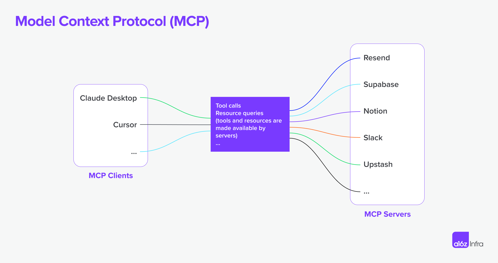
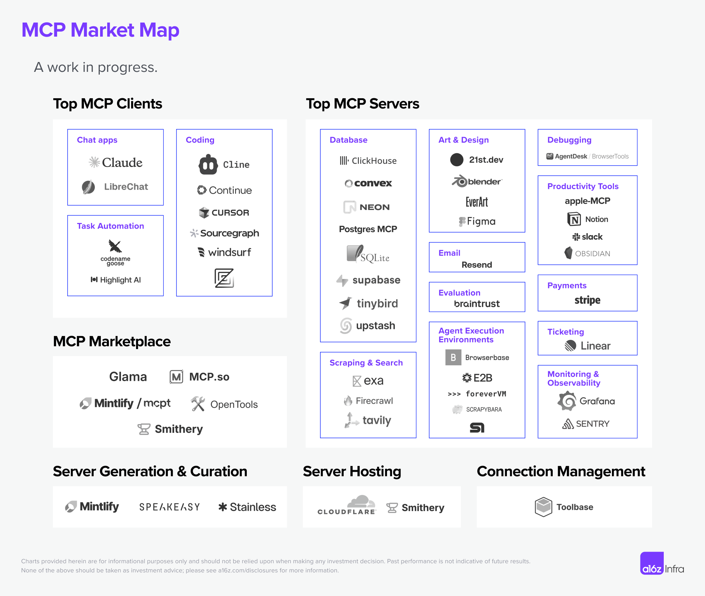

## 3.1. Bereitstellung von Tools für KI-Agenten (LLM's) mittels MCP

### 3.1.1. Was ist MCP?

Das **Model Context Protocol (MCP)** ist ein offener Standard, der von Anthropic entwickelt wurde, um eine einheitliche Schnittstelle zwischen KI-Modellen (insbesondere Large Language Models, LLMs) und externen Werkzeugen, Daten und Diensten zu schaffen. Man kann es sich als eine Art "universellen Übersetzer" vorstellen, der es KI-Agenten ermöglicht, über ihre Trainingsdaten hinaus auf die reale Welt zuzugreifen und mit ihr zu interagieren.

MCP wurde Ende 2024 von Anthropic als Open-Source-Protokoll veröffentlicht und hat sich seitdem zu einem wichtigen Standard für die Entwicklung von KI-Agenten entwickelt. Es löst das grundlegende Problem, dass LLMs in ihrem Wissen auf die Daten beschränkt sind, mit denen sie trainiert wurden. MCP ermöglicht es ihnen, dynamisch auf externe Informationen und Fähigkeiten zuzugreifen.

**Inspiration durch das Language Server Protocol (LSP):**

MCP ist vom [Language Server Protocol (LSP)](https://microsoft.github.io/language-server-protocol/) inspiriert, das die Kommunikation zwischen Code-Editoren und Sprachservern standardisiert hat. Ähnlich wie LSP die Entwicklung von Editor-Erweiterungen vereinfacht hat, zielt MCP darauf ab, die Integration von externen Tools in KI-Anwendungen zu standardisieren und zu vereinfachen.

**Aufbau und Funktionsweise:**

MCP basiert auf einer Client-Server-Architektur:

- **MCP-Client:** Eine KI-Anwendung, die auf externe Werkzeuge zugreifen muss. Beispiele hierfür sind KI-Assistenten in IDEs wie VS Code (Copilot), Cursor oder die Claude Desktop App.
- **MCP-Server:** Ein Programm, das ein oder mehrere "Tools" (Funktionalitäten) über eine standardisierte Schnittstelle bereitstellt. Ein Server kann beispielsweise den Zugriff auf ein Dateisystem, eine Datenbank, eine API oder ein anderes System kapseln.
- **MCP-Host:** Die Anwendung, mit der der Benutzer interagiert (z.B. der Code-Editor), die als Brücke zwischen Benutzer und KI fungiert.

Die Kernidee ist, die starre und aufwändige Integration von externen Quellen durch eine dynamische und flexible Lösung zu ersetzen. Anstatt für jede neue Datenquelle oder jedes Tool eine benutzerdefinierte Logik zu implementieren, können KI-Agenten verfügbare MCP-Server zur Laufzeit automatisch erkennen (Discovery) und deren Funktionalitäten nutzen. Dies reduziert die Komplexität von einem "N×M"-Problem (jeder Agent braucht eine Integration für jedes Tool) zu einem "N+M"-Problem (jeder Agent und jedes Tool spricht dieselbe "Sprache").



Das folgende Diagramm illustriert, wie ein MCP-Client mit verschiedenen MCP-Servern interagiert, um eine E-Mail zu senden:


**Quellen:**

- [What Is MCP, and Why Is Everyone – Suddenly!– Talking About It?](https://huggingface.co/blog/Kseniase/mcp)
- [A Deep Dive Into MCP and the Future of AI Tooling](https://a16z.com/a-deep-dive-into-mcp-and-the-future-of-ai-tooling/)
- [Build Your First Local MCP Server: A Guide for AI Developers](https://www.arsturn.com/blog/build-your-first-local-mcp-server-a-guide-for-ai-developers)
- [Model Context Protocol (MCP) - PDF](https://www.jfokus.se/aifokus25-preso/MCP-for-LLM-Agents-Infrastructure-APIs-and-Data-Services.pdf)

### 3.1.2. Einsatz von MCP-Server in der KI-gestützten SW-Entwicklung

MCP-Server sind die Brücke zwischen der abstrakten Welt eines KI-Modells und den konkreten Werkzeugen eines Entwicklers. Sie verwandeln KI-Assistenten von reinen Code-Vervollständigungs-Tools in proaktive Teammitglieder, die komplexe Aufgaben im gesamten Softwareentwicklungszyklus übernehmen können. Die Vielfalt der verfügbaren Server wächst stetig und wird oft in Community-Listen wie dem **"awesome-mcp-servers"**-Repository auf GitHub kuratiert, was die dynamische Natur dieses Ökosystems unterstreicht.

**Nützliche MCP-Server in der Softwareentwicklung:**

- **GitHub MCP:** Ermöglicht der KI, direkt mit GitHub-Repositories zu interagieren. Anstatt manuelle Befehle auszuführen, kann der Agent autonom Issues analysieren, relevante Code-Stellen vorschlagen, Pull Requests erstellen und sogar auf Kommentare in Code-Reviews reagieren. Dies automatisiert Routineaufgaben und beschleunigt den Workflow erheblich.
- **Playwright MCP:** Statten die KI mit Fähigkeiten zur Browser-Automatisierung aus. Dies geht über einfaches Testen hinaus. Der Agent kann damit End-to-End-Tests für komplexe Benutzerabläufe erstellen, visuelle Regressionstests durchführen oder dynamische Webseiten für die Datengewinnung (Scraping) analysieren, um beispielsweise Testdaten zu generieren.
- **Datenbank-MCPs (z.B. Supabase, Postgres, MongoDB):** Geben der KI direkten Lese- und Schreibzugriff auf Datenbanken. Ein Entwickler kann in natürlicher Sprache eine Anforderung formulieren, wie z.B. "Finde alle Benutzer mit mehr als 10 Bestellungen und exportiere sie als CSV". Der Agent kann das Datenbankschema untersuchen, die entsprechende SQL-Abfrage formulieren, ausführen und das Ergebnis bereitstellen, ohne dass der Entwickler die IDE verlassen muss.
- **Digma MCP:** Verbindet die KI mit Echtzeit-Observability-Daten aus der laufenden Anwendung. Anstatt sich durch Logs und Metriken zu wühlen, kann der Agent proaktiv auf Performance-Engpässe, "N+1"-Query-Probleme oder Laufzeitfehler hinweisen. Bei einem Code-Review kann er warnen, wenn eine Änderung eine bekannte Performance-Schwachstelle beeinträchtigt.
- **Desktop Commander MCP:** Bietet der KI einen sicheren, lokalen Zugriff auf das Terminal des Entwicklers. Dies ist besonders mächtig für Aufgaben, die das lokale System betreffen, wie das Ausführen von Build-Skripten, das Durchsuchen von Log-Dateien oder das Verwalten von Abhängigkeiten. Die Ausführung erfolgt in einer Sandbox, um die Sicherheit zu gewährleisten.
- **Memory Bank / Knowledge Graph MCP:** Dienen als Langzeitgedächtnis für die KI. Sie ermöglichen es dem Agenten, den Kontext über viele Interaktionen hinweg zu speichern und zu verstehen. Dies ist entscheidend für das Verständnis komplexer Codebasen, die Einarbeitung in neue Projekte oder die konsistente Anwendung von Architekturvorgaben, da es die Begrenzungen des Kontextfensters von LLMs überwindet.



***
*Quellen:*

- [13+ Popular MCP servers for developers to unlock AI actions](https://www.dronahq.com/popular-mcp-servers/)
- [GitHub: awesome-mcp-servers](https://github.com/punkpeye/awesome-mcp-servers)
***

### 3.1.3. Konfiguration und Integration von MCP-Servern in KI-gestützten IDEs

Die wahre Stärke von MCP entfaltet sich durch die nahtlose Integration in moderne, KI-gestützte Entwicklungsumgebungen wie **VS Code**, **Cursor** oder dedizierte Clients wie die **Claude Desktop App**. Insbesondere VS Code hat sich als führende Plattform für die MCP-Integration etabliert und bietet Entwicklern flexible und leistungsstarke Konfigurationsmöglichkeiten.

#### Konfigurationsarten

MCP-Server können auf verschiedene Weisen bereitgestellt und angesprochen werden, je nach Anwendungsfall und Sicherheitsanforderungen:

1. **Cloud-basiert (Remote):** Der MCP-Server wird von einem Drittanbieter gehostet und über eine URL (HTTP/SSE) angesprochen.
   - **Vorteile:** Einfache Einrichtung, keine lokale Installation erforderlich.
   - **Nachteile:** Erfordert eine stabile Internetverbindung, potenziell höhere Latenz und Sicherheitsbedenken bei der Übertragung sensibler Daten.

2. **Lokal:** Der MCP-Server läuft als lokaler Prozess direkt auf dem Rechner des Entwicklers. Die Kommunikation mit dem KI-Client (z.B. dem Copilot-Agenten in VS Code) erfolgt meist über Standard-Input/Output (`stdio`).
   - **Vorteile:** Hohe Geschwindigkeit, geringe Latenz, Offline-Fähigkeit und erhöhte Sicherheit, da keine Daten das lokale System verlassen.
   - **Nachteile:** Erfordert die lokale Installation und Verwaltung der Server-Abhängigkeiten.

3. **Docker-Container:** Der MCP-Server wird in einem isolierten Docker-Container ausgeführt. Dies ist der empfohlene Ansatz für die produktive Nutzung.
   - **Vorteile:** Stabile, reproduzierbare und sichere Laufzeitumgebung. Abhängigkeiten sind gekapselt, und die KI hat keinen direkten Zugriff auf das Host-System, was die Angriffsfläche minimiert.
   - **Nachteile:** Erfordert eine Docker-Installation und grundlegende Kenntnisse in der Container-Verwaltung.

#### Konfiguration in VS Code

VS Code bietet eine hierarchische Konfigurationslogik, die es ermöglicht, MCP-Server sehr gezielt für verschiedene Kontexte zu definieren. Die Konfiguration erfolgt in JSON-Dateien.

- **Workspace-Konfiguration (`.vscode/mcp.json`):** Die Server sind spezifisch für ein bestimmtes Projekt definiert. Dies ist der ideale Ansatz für Teams, da die Konfiguration direkt im Repository versioniert und geteilt werden kann. So wird sichergestellt, dass alle Teammitglieder Zugriff auf dieselben projektspezifischen Tools haben.
- **User-Konfiguration (`mcp.json` im Benutzerprofil):** Die hier definierten Server stehen global in allen Workspaces zur Verfügung. Dies eignet sich hervorragend für persönliche, häufig genutzte Werkzeuge wie einen universellen GitHub- oder Terminal-Agenten.
- **Dev-Container-Konfiguration (`devcontainer.json`):** Die Server werden als Teil einer containerisierten Entwicklungsumgebung definiert. Sie werden automatisch gestartet und sind verfügbar, sobald der Entwickler den Dev-Container öffnet. Dies ist die fortschrittlichste Methode, um eine konsistente und reproduzierbare Entwicklungsumgebung für das gesamte Team zu schaffen.

Die Konfiguration in der `mcp.json`-Datei bietet zudem "Lenses" – direkte Aktions-Links im Editor, um Server zu starten, zu stoppen oder zu debuggen, was die Verwaltung erheblich vereinfacht.


***
*Quellen:*

- [Use MCP servers in VS Code](https://code.visualstudio.com/docs/copilot/customization/mcp-servers)
- [How to build and deliver an MCP server for production (Docker)](https://www.docker.com/blog/build-to-prod-mcp-servers-with-docker/)

***

### 3.1.4. Verwendung von MCP-Server in VSCode

Nach der Konfiguration können die von den MCP-Servern bereitgestellten Tools im "Agent-Modus" des Copilot-Chats genutzt werden.

#### Lokale Konfiguration von MCP-Servern

Eine typische lokale Konfiguration in der `mcp.json` für einen Server, der über `npx` gestartet wird, sieht so aus:

```json
{
  "servers": {
    "memory": {
      "command": "npx",
      "args": ["-y", "@modelcontextprotocol/server-memory"]
    }
  }
}
```

Hier wird der Server mit dem Namen "memory" durch den Befehl `npx` mit den entsprechenden Argumenten gestartet.

**Sichere Verwaltung von sensiblen Daten mit Input-Variablen:**

Um zu vermeiden, dass sensible Daten wie API-Schlüssel direkt in die Konfigurationsdatei geschrieben werden, bietet MCP die Möglichkeit, **Input-Variablen** zu definieren. Diese Variablen dienen als Platzhalter, deren Werte beim ersten Start eines Servers abgefragt und sicher gespeichert werden.

Ein Beispiel für die Konfiguration eines GitHub-Servers, der einen persönlichen Zugriffstoken (PAT) benötigt:

```json
{
  "servers": {
    "github": {
      "command": "npx",
      "args": ["-y", "@modelcontextprotocol/server-github"],
      "env": {
        "GITHUB_TOKEN": "${input:github-pat}"
      }
    }
  },
  "inputs": [
    {
      "id": "github-pat",
      "type": "promptString",
      "description": "Please enter your GitHub Personal Access Token",
      "password": true
    }
  ]
}
```

**Erklärung:**

- Im `inputs`-Array wird eine Variable mit der `id` "github-pat" definiert.
- `type: "promptString"` sorgt dafür, dass der Benutzer zur Eingabe aufgefordert wird.
- `description` ist der Text, der dem Benutzer in der Eingabeaufforderung angezeigt wird.
- `password: true` sorgt dafür, dass die Eingabe verdeckt wird.
- Im `servers`-Abschnitt wird der Wert der Variable über `env` als Umgebungsvariable `GITHUB_TOKEN` an den Serverprozess übergeben. Die Referenzierung erfolgt mit der Syntax `${input:github-pat}`.

Beim ersten Start des "github"-Servers fordert VS Code den Benutzer auf, den Token einzugeben, und speichert ihn sicher für zukünftige Sitzungen.

#### Aktivieren/Deaktivieren von Servern und Tools

- Im Chat-Fenster kann im **Agent-Modus** über den **"Tools"**-Button eine Liste aller verfügbaren Tools angezeigt werden.
- Hier können Entwickler gezielt einzelne Tools oder ganze Server für die aktuelle Anfrage aktivieren oder deaktivieren. Dies ist wichtig, da die Anzahl der gleichzeitig nutzbaren Tools oft begrenzt ist (z.B. auf 128).
- Alternativ können Tools direkt im Prompt mit dem `#`-Symbol referenziert werden (z.B. `#file.read`).


#### Definition der verwendbaren (MCP) Tools in Custom Chatmodes

VS Code ermöglicht die Erstellung von **benutzerdefinierten Chat-Modi** (`.chatmode.md`-Dateien), um den Chat für spezifische Aufgaben zu optimieren. In diesen Dateien kann genau festgelegt werden, welche Tools der KI zur Verfügung stehen sollen.

Im YAML-Frontmatter einer `.chatmode.md`-Datei wird über die `tools`-Eigenschaft eine Liste der erlaubten Tools oder Tool-Sets definiert:

```text
---
description: "Generiert einen Implementierungsplan für neue Features."
tools: ['codebase', 'fetch', 'githubRepo', 'search']
model: Claude Sonnet 4
---
# Anweisungen für den Planungsmodus
Du bist im Planungsmodus. Deine Aufgabe ist es, einen Implementierungsplan zu erstellen.
Führe keine Code-Änderungen durch, sondern erstelle nur den Plan.
...
```

Auf diese Weise wird sichergestellt, dass die KI im "Planungsmodus" beispielsweise nur lesende Tools verwendet und keine schreibenden Aktionen wie `#file.write` ausführt. Dies verbindet die Mächtigkeit von MCP mit der gezielten Steuerung des KI-Verhaltens.

***
*Quellen:*

- [Use MCP servers in VS Code](https://code.visualstudio.com/docs/copilot/customization/mcp-servers)
- [Use chat modes in VS Code](https://code.visualstudio.com/docs/copilot/customization/custom-chat-modes)

***