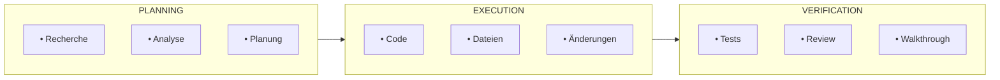
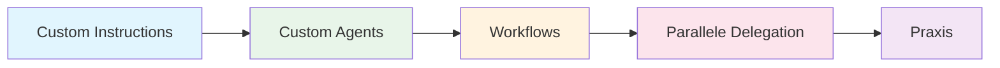
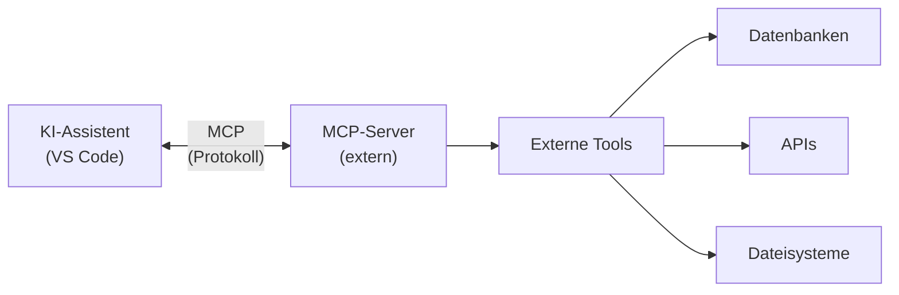
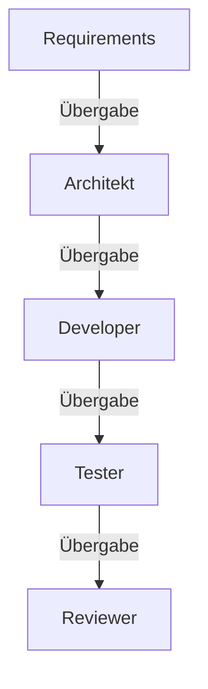
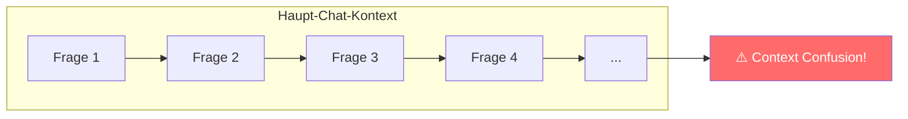
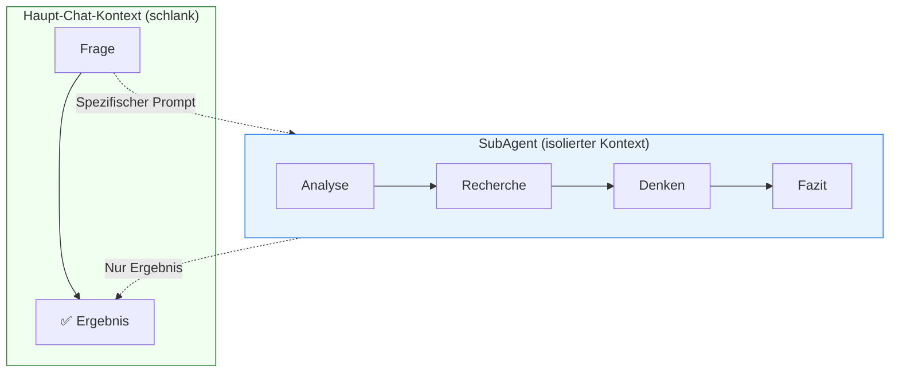

<h1> KI-gestützte Software-Entwicklung</h1>

<h2> Inhaltsverzeichnis</h2>

- [1. Zielsetzung](#1-zielsetzung)
- [2. Einführung in KI-gestützte Software-Entwicklung](#2-einführung-in-ki-gestützte-software-entwicklung)
  - [2.1. Überblick über KI-Coding-Assistenten](#21-überblick-über-ki-coding-assistenten)
    - [2.1.1. Was können moderne KI-Assistenten?](#211-was-können-moderne-ki-assistenten)
  - [2.2. VSCode + GitHub Copilot vs. Antigravity](#22-vscode--github-copilot-vs-antigravity)
    - [2.2.1. VSCode + GitHub Copilot](#221-vscode--github-copilot)
    - [2.2.2. Google Antigravity](#222-google-antigravity)
  - [2.3. Grundlegende Konzepte](#23-grundlegende-konzepte)
    - [2.3.1. Context Engineering](#231-context-engineering)
    - [2.3.2. Prompt Engineering](#232-prompt-engineering)
    - [2.3.3. Agent-Modi](#233-agent-modi)
  - [2.4. Kapitelübersicht](#24-kapitelübersicht)
    - [2.4.1. Lernpfad](#241-lernpfad)
  - [2.5. Quellen und Referenzen](#25-quellen-und-referenzen)
- [3. Custom Instructions](#3-custom-instructions)
  - [3.1. Was sind Custom Instructions?](#31-was-sind-custom-instructions)
    - [3.1.1. Warum Custom Instructions verwenden?](#311-warum-custom-instructions-verwenden)
  - [3.2. Typen von Instruction-Dateien](#32-typen-von-instruction-dateien)
    - [3.2.1. Übersicht](#321-übersicht)
    - [3.2.2. `.github/copilot-instructions.md`](#322-githubcopilot-instructionsmd)
    - [3.2.3. `.instructions.md` Dateien](#323-instructionsmd-dateien)
    - [3.2.4. `AGENTS.md`](#324-agentsmd)
  - [3.3. Sprachabhängige Instructions](#33-sprachabhängige-instructions)
    - [3.3.1. Python](#331-python)
    - [3.3.2. Dart/Flutter](#332-dartflutter)
  - [3.4. Verzeichnis-basierte Instructions](#34-verzeichnis-basierte-instructions)
    - [3.4.1. Test-Verzeichnis](#341-test-verzeichnis)
    - [3.4.2. Dokumentation](#342-dokumentation)
    - [3.4.3. Domain Layer (DDD)](#343-domain-layer-ddd)
  - [3.5. Referenzen zwischen Instruction-Dateien](#35-referenzen-zwischen-instruction-dateien)
  - [3.6. Tool-Referenzen in Instructions](#36-tool-referenzen-in-instructions)
  - [3.7. Best Practices](#37-best-practices)
    - [3.7.1. Do's ✅](#371-dos-)
    - [3.7.2. Don'ts ❌](#372-donts-)
  - [3.8. Quellen und Referenzen](#38-quellen-und-referenzen)
- [4. Custom Agents](#4-custom-agents)
  - [4.1. Was sind Custom Agents?](#41-was-sind-custom-agents)
    - [4.1.1. Unterschied zu Custom Instructions](#411-unterschied-zu-custom-instructions)
  - [4.2. Agent-Dateistruktur](#42-agent-dateistruktur)
    - [4.2.1. Speicherorte](#421-speicherorte)
    - [4.2.2. Dateiformat](#422-dateiformat)
    - [4.2.3. Header-Eigenschaften](#423-header-eigenschaften)
  - [4.3. Tools: MCP-Server und VS Code Extensions](#43-tools-mcp-server-und-vs-code-extensions)
    - [4.3.1. Built-in VS Code Tools](#431-built-in-vs-code-tools)
    - [4.3.2. Was ist das Model Context Protocol (MCP)?](#432-was-ist-das-model-context-protocol-mcp)
    - [4.3.3. Warum MCP-Server verwenden?](#433-warum-mcp-server-verwenden)
    - [4.3.4. MCP-Server Beispiele](#434-mcp-server-beispiele)
    - [4.3.5. MCP-Server Konfiguration](#435-mcp-server-konfiguration)
    - [4.3.6. MCP-Tools in Agents verwenden](#436-mcp-tools-in-agents-verwenden)
    - [4.3.7. Verfügbare Tools eines MCP-Servers anzeigen](#437-verfügbare-tools-eines-mcp-servers-anzeigen)
    - [4.3.8. Beispiel: Dart MCP-Server Tools](#438-beispiel-dart-mcp-server-tools)
    - [4.3.9. MCP-Server Quellen und Referenzen](#439-mcp-server-quellen-und-referenzen)
  - [4.4. Sequentielle Agent-Verkettung (Handoffs)](#44-sequentielle-agent-verkettung-handoffs)
    - [4.4.1. Handoff-Konfiguration](#441-handoff-konfiguration)
    - [4.4.2. Wie Handoffs funktionieren](#442-wie-handoffs-funktionieren)
    - [4.4.3. Beispiel-Workflow](#443-beispiel-workflow)
  - [4.5. Agent-Rollen für Software-Entwicklung](#45-agent-rollen-für-software-entwicklung)
    - [4.5.1. Requirements Engineer Agent](#451-requirements-engineer-agent)
    - [4.5.2. SW-Architekt Agent](#452-sw-architekt-agent)
    - [4.5.3. Frontend-Developer Agent (CDD)](#453-frontend-developer-agent-cdd)
    - [4.5.4. Backend-Developer Agent](#454-backend-developer-agent)
    - [4.5.5. Test-Engineer Agent](#455-test-engineer-agent)
  - [4.6. Antigravity Agent-Modi](#46-antigravity-agent-modi)
    - [4.6.1. Die drei Modi](#461-die-drei-modi)
    - [4.6.2. Task Boundaries](#462-task-boundaries)
    - [4.6.3. Artifacts](#463-artifacts)
  - [4.7. Agent erstellen (Schritt-für-Schritt)](#47-agent-erstellen-schritt-für-schritt)
    - [4.7.1. In VS Code](#471-in-vs-code)
    - [4.7.2. Migration von Chat Modes](#472-migration-von-chat-modes)
  - [4.8. Quellen und Referenzen](#48-quellen-und-referenzen)
- [5. Custom Prompts \& Workflows](#5-custom-prompts--workflows)
  - [5.1. Was sind Custom Prompts / Workflows?](#51-was-sind-custom-prompts--workflows)
    - [5.1.1. Unterschied zu Agents](#511-unterschied-zu-agents)
  - [5.2. VS Code Custom Prompts](#52-vs-code-custom-prompts)
    - [5.2.1. Speicherorte](#521-speicherorte)
    - [5.2.2. Dateiformat](#522-dateiformat)
    - [5.2.3. Header-Eigenschaften](#523-header-eigenschaften)
    - [5.2.4. Modi erklärt](#524-modi-erklärt)
    - [5.2.5. Beispiel: Unit Test Generator](#525-beispiel-unit-test-generator)
    - [5.2.6. Beispiel: Code Review Prompt](#526-beispiel-code-review-prompt)
    - [5.2.7. Beispiel: Dokumentation Generator](#527-beispiel-dokumentation-generator)
    - [5.2.8. Variablen in Prompts](#528-variablen-in-prompts)
  - [5.3. Antigravity Workflows](#53-antigravity-workflows)
    - [5.3.1. Speicherort](#531-speicherort)
    - [5.3.2. Dateiformat](#532-dateiformat)
    - [5.3.3. Beispiel: Feature Implementation Workflow](#533-beispiel-feature-implementation-workflow)
    - [5.3.4. Beispiel: Bug Fix Workflow](#534-beispiel-bug-fix-workflow)
    - [5.3.5. Beispiel: Code Review Workflow](#535-beispiel-code-review-workflow)
  - [5.4. Turbo-Annotation für automatische Ausführung](#54-turbo-annotation-für-automatische-ausführung)
  - [5.5. Custom Prompts/Workflows erstellen](#55-custom-promptsworkflows-erstellen)
    - [5.5.1. In VS Code](#551-in-vs-code)
    - [5.5.2. In Antigravity](#552-in-antigravity)
  - [5.6. Best Practices](#56-best-practices)
    - [5.6.1. Prompt-Design](#561-prompt-design)
    - [5.6.2. Workflow-Organisation](#562-workflow-organisation)
  - [5.7. Quellen und Referenzen](#57-quellen-und-referenzen)
- [6. Best Practices \& Erweiterungen](#6-best-practices--erweiterungen)
  - [6.1. Dokumenten-Templates](#61-dokumenten-templates)
    - [6.1.1. Warum Templates verwenden?](#611-warum-templates-verwenden)
    - [6.1.2. Template-Speicherorte](#612-template-speicherorte)
    - [6.1.3. Templates im Agent referenzieren](#613-templates-im-agent-referenzieren)
    - [6.1.4. Templates in Workflows verwenden](#614-templates-in-workflows-verwenden)
    - [6.1.5. Best Practice: Benutzer-Interaktion vor Dokumentenerstellung](#615-best-practice-benutzer-interaktion-vor-dokumentenerstellung)
    - [6.1.6. Beispiel: Agent mit Template-Konfiguration](#616-beispiel-agent-mit-template-konfiguration)
  - [6.2. Kontext-Dateien \& Referenzquellen](#62-kontext-dateien--referenzquellen)
    - [6.2.1. Arten von Kontextquellen](#621-arten-von-kontextquellen)
    - [6.2.2. Kontext-Dateien im Projekt](#622-kontext-dateien-im-projekt)
    - [6.2.3. Quellen im Agent referenzieren](#623-quellen-im-agent-referenzieren)
    - [6.2.4. Externe Links als Referenzen](#624-externe-links-als-referenzen)
    - [6.2.5. Kontext-Verzeichnis Beispiel (CONTEXT.md)](#625-kontext-verzeichnis-beispiel-contextmd)
    - [6.2.6. Agent mit Kontextquellen-Verweis](#626-agent-mit-kontextquellen-verweis)
    - [6.2.7. Best Practice: Kontext-Quellen effektiv nutzen](#627-best-practice-kontext-quellen-effektiv-nutzen)
  - [6.3. SubAgents für Kontextisolation (VS Code)](#63-subagents-für-kontextisolation-vs-code)
    - [6.3.1. Das Problem: Context Confusion](#631-das-problem-context-confusion)
    - [6.3.2. Die Lösung: SubAgents](#632-die-lösung-subagents)
    - [6.3.3. SubAgent in VS Code verwenden](#633-subagent-in-vs-code-verwenden)
    - [6.3.4. Anwendungsfälle für SubAgents](#634-anwendungsfälle-für-subagents)
    - [6.3.5. Beispiele](#635-beispiele)
    - [6.3.6. SubAgents vs. Handoffs](#636-subagents-vs-handoffs)
    - [6.3.7. Best Practice: SubAgents effektiv einsetzen](#637-best-practice-subagents-effektiv-einsetzen)
    - [6.3.8. Quellen](#638-quellen)
  - [6.4. Prompt-Bibliotheken](#64-prompt-bibliotheken)
    - [6.4.1. Was sind Prompt-Bibliotheken?](#641-was-sind-prompt-bibliotheken)
    - [6.4.2. Nutzen in der Softwareentwicklung](#642-nutzen-in-der-softwareentwicklung)
    - [6.4.3. Verzeichnisstruktur im Repository](#643-verzeichnisstruktur-im-repository)
    - [6.4.4. Vorlage: Prompt-Datei mit Metadaten](#644-vorlage-prompt-datei-mit-metadaten)
    - [6.4.5. Beispiele für Team-Prompts (Auszug)](#645-beispiele-für-team-prompts-auszug)
    - [6.4.6. Qualitätssicherung und Governance](#646-qualitätssicherung-und-governance)
    - [6.4.7. Integration in Tools/Workflows](#647-integration-in-toolsworkflows)
    - [6.4.8. Do / Don’t (kompakt)](#648-do--dont-kompakt)
    - [6.4.9. Quellen (kuratierte Auswahl)](#649-quellen-kuratierte-auswahl)
  - [6.5. Weitere Best Practices](#65-weitere-best-practices)


<div style="page-break-after: always;"></div>

<h2>Dokumenthistorie</h2>

<table style="margin: auto;">
  <thead>
    <tr>
      <th>Datum</th>
      <th>Änderung</th>
      <th>Autor</th>
    </tr>
  </thead>
  <tbody>
    <tr>
      <td>15.12.2025</td>
      <td>Erstversion</td>
      <td>KUW</td>
    </tr>
  </tbody>
</table>

<div style="page-break-after: always;"></div>

# 1. Zielsetzung

Dieses Lernscript behandelt den professionellen Einsatz von KI-Coding-Assistenten in der modernen Software-Entwicklung. Der Fokus liegt auf zwei führenden Plattformen:

1. **VSCode + GitHub Copilot** – Der etablierte Standard für KI-gestützte Entwicklung
2. **Google Antigravity** – Der fortschrittliche agentenbasierte Ansatz

Das Script vermittelt nicht nur die grundlegenden Funktionen, sondern zeigt insbesondere das **volle Potenzial** dieser Werkzeuge durch:

- **Custom Instructions** für konsistente, projektspezifische KI-Antworten
- **Custom Agents** für spezialisierte Entwicklungsrollen
- **Workflows** für automatisierte, wiederkehrende Aufgaben
- **Parallele Delegation** für effiziente Team-Entwicklung

> :bulb: **Lernziel:** Nach Durcharbeitung dieses Scripts können Sie KI-Assistenten optimal für Ihre Projektanforderungen konfigurieren und nutzen.

# 2. Einführung in KI-gestützte Software-Entwicklung

## 2.1. Überblick über KI-Coding-Assistenten

KI-Coding-Assistenten haben die Art und Weise, wie Software entwickelt wird, grundlegend verändert. Sie unterstützen Entwickler bei nahezu allen Aspekten des Entwicklungsprozesses – von der Codegenerierung über Refactoring bis hin zur Dokumentation.

### 2.1.1. Was können moderne KI-Assistenten?

| Fähigkeit | Beschreibung |
|-----------|--------------|
| **Code-Generierung** | Erstellen von Code basierend auf natürlichsprachlichen Beschreibungen |
| **Code-Vervollständigung** | Intelligente Inline-Vorschläge während des Tippens |
| **Refactoring** | Umstrukturierung von Code unter Beibehaltung der Funktionalität |
| **Debugging** | Identifikation und Behebung von Fehlern |
| **Dokumentation** | Automatische Erstellung von Kommentaren und Dokumentation |
| **Testing** | Generierung von Unit- und Integrationstests |
| **Code-Review** | Analyse und Verbesserungsvorschläge für bestehenden Code |

---

## 2.2. VSCode + GitHub Copilot vs. Antigravity

Die beiden führenden Plattformen verfolgen unterschiedliche Ansätze:

### 2.2.1. VSCode + GitHub Copilot

**Philosophie:** Erweiterung der IDE um KI-Fähigkeiten mit Chat-Interface und Inline-Suggestions.

**Stärken:**
- Tiefe Integration in VSCode-Ökosystem
- Umfangreiche Extension-Unterstützung
- **Custom Agents** mit sequentieller Verkettung via Handoffs
- Flexible Tool-Integration (MCP-Server, Extensions)

**Kernkonzepte:**
- `.agent.md` Dateien für spezialisierte Agents
- `.instructions.md` für projektspezifische Anweisungen
- Tool-Auswahl pro Agent konfigurierbar

### 2.2.2. Google Antigravity

**Philosophie:** Vollständig agentenbasierter Ansatz mit strukturierten Arbeitsmodi.

**Stärken:**
- Klare Trennung in **Planning**, **Execution** und **Verification** Modi
- Automatische Artifact-Erstellung (Tasks, Pläne, Walkthroughs)
- Parallele Tool-Ausführung für Effizienz
- Integrierte Browser-Steuerung und Screenshot-Fähigkeiten

**Kernkonzepte:**
- `task_boundary` für strukturierte Arbeitsabläufe
- `.agent/workflows/` für wiederverwendbare Prozesse
- `.gemini/` Ordner für projektspezifische Konfiguration

---

## 2.3. Grundlegende Konzepte

### 2.3.1. Context Engineering

**Definition:** Die Kunst, dem KI-Assistenten den optimalen Kontext bereitzustellen, um qualitativ hochwertige Antworten zu erhalten.

**Elemente des Kontexts:**
- **Workspace-Struktur:** Welche Dateien sind relevant?
- **Aktive Dokumente:** Was bearbeitet der Entwickler gerade?
- **Projekt-Metadaten:** Welche Technologien und Patterns werden verwendet?
- **Custom Instructions:** Welche Coding-Standards gelten?

> :warning: **Wichtig:** Die Qualität der KI-Antworten hängt direkt von der Qualität des bereitgestellten Kontexts ab.

### 2.3.2. Prompt Engineering

**Definition:** Die Formulierung von Anfragen, die zu präzisen und nützlichen Antworten führen.

**Best Practices:**
1. **Spezifisch sein:** Statt "Verbessere diesen Code" → "Refaktoriere diese Funktion für bessere Lesbarkeit unter Verwendung von Early Returns"
2. **Kontext mitliefern:** Relevante Constraints und Anforderungen nennen
3. **Schrittweise vorgehen:** Komplexe Aufgaben in Teilaufgaben zerlegen

### 2.3.3. Agent-Modi

Moderne KI-Assistenten arbeiten in verschiedenen Modi, die das Verhalten und die verfügbaren Tools bestimmen:



---

## 2.4. Kapitelübersicht

Dieses Script ist in sechs aufeinander aufbauende Kapitel gegliedert:

| Kapitel | Thema | Bedeutung |
|---------|-------|-----------|
| **2** | **Custom Instructions** | Grundlage für konsistente KI-Antworten – definiert projektweite Standards und Coding-Guidelines |
| **3** | **Custom Agents** | Spezialisierte KI-Rollen für unterschiedliche Aufgaben (Requirements, Architektur, Testing) |
| **4** | **Workflows** | Automatisierung wiederkehrender Prozesse – von Feature-Entwicklung bis Deployment |
| **5** | **Parallele Delegation** | Effiziente Nutzung mehrerer Agents für komplexe Aufgaben |
| **6** | **Praktische Beispiele** | Konkrete, sofort einsetzbare Konfigurationen und Vorlagen |

### 2.4.1. Lernpfad



**Empfehlung:** Arbeiten Sie die Kapitel sequentiell durch, da jedes auf den vorherigen aufbaut. Die praktischen Beispiele in Kapitel 6 setzen das Verständnis aller vorherigen Konzepte voraus.

---

## 2.5. Quellen und Referenzen

| Quelle | Beschreibung | Link |
|--------|--------------|------|
| **GitHub Copilot Docs** | Offizielle Dokumentation | [docs.github.com/copilot](https://docs.github.com/en/copilot) |
| **VS Code AI Docs** | VS Code KI-Features | [code.visualstudio.com/docs/copilot](https://code.visualstudio.com/docs/copilot) |
| **Prompt Engineering Guide** | Best Practices für Prompts | [github.com/dair-ai/Prompt-Engineering-Guide](https://github.com/dair-ai/Prompt-Engineering-Guide) |
| **Context Engineering** | Simon Willison's Blog | [simonwillison.net](https://simonwillison.net/tags/context-engineering/) |
| **Awesome Copilot** | Community-Ressourcen | [github.com/github/awesome-copilot](https://github.com/github/awesome-copilot) |


<div style="page-break-after: always"></div>

# 3. Custom Instructions

## 3.1. Was sind Custom Instructions?

**Definition:** Custom Instructions sind vordefinierte Anweisungen in Markdown-Dateien, die automatisch an jeden Chat-Request angehängt werden. Sie steuern, wie der KI-Assistent Code generiert und auf Anfragen reagiert.

### 3.1.1. Warum Custom Instructions verwenden?

| Problem ohne Instructions | Lösung mit Instructions |
|---------------------------|-------------------------|
| Jedes Mal Coding-Standards erklären | Standards werden automatisch angewendet |
| Inkonsistente Antworten | Einheitlicher Stil im gesamten Projekt |
| Wiederholte Kontext-Eingabe | Einmalige Definition, dauerhafte Wirkung |
| Team-Mitglieder mit unterschiedlichen Prompts | Gemeinsame Standards für alle |

> :bulb: **Merke:** Custom Instructions gelten für **Chat-Interaktionen**, nicht für Inline-Suggestions während des Tippens.

---

## 3.2. Typen von Instruction-Dateien

VS Code unterstützt drei verschiedene Typen von Instruction-Dateien:

### 3.2.1. Übersicht

| Datei | Anwendungsbereich |
|-------|-------------------|
| `.github/copilot-instructions.md` | Alle Requests im Workspace |
| `.instructions.md` (mit applyTo) | Spezifische Dateitypen/Pfade |
| `AGENTS.md` | Multi-Agent Workspaces |

### 3.2.2. `.github/copilot-instructions.md`

**Eigenschaften:**
- Eine einzelne Datei im Workspace-Root
- Gilt automatisch für **alle** Chat-Requests
- Ideal für projektweite Coding-Standards

**Einrichtung:**

1. Aktivieren Sie die Einstellung `github.copilot.chat.codeGeneration.useInstructionFiles`
2. Erstellen Sie `.github/copilot-instructions.md`
3. Schreiben Sie Ihre Anweisungen in natürlicher Sprache

**Beispiel:**

```markdown
# Projekt-Coding-Standards

## Allgemeine Regeln
- Bevorzuge objektorientierte Programmierung
- Schreibe aussagekräftige Variablennamen

## Error Handling
- Verwende try/catch für async Operationen
- Logge Fehler mit kontextbezogenen Informationen

## Testing
- Schreibe Unit-Tests für alle öffentlichen Funktionen
- Verwende das AAA-Pattern (Arrange, Act, Assert)
```

---

### 3.2.3. `.instructions.md` Dateien

**Eigenschaften:**
- Mehrere Dateien möglich
- Bedingte Anwendung via `applyTo` Glob-Pattern
- Speicherbar im Workspace (`.github/instructions/`) oder User Profile

**Dateiformat:**

```yaml
---
description: "Beschreibung der Instructions"
name: "Anzeigename"
applyTo: "**/*.ts"  # Glob-Pattern
---

# Anweisungen hier als Markdown
```

**Speicherorte:**

| Ort | Pfad | Verfügbarkeit |
|-----|------|---------------|
| Workspace | `.github/instructions/*.instructions.md` | Nur dieser Workspace |
| User Profile | VS Code Profile-Ordner | Alle Workspaces |

---

### 3.2.4. `AGENTS.md`

**Eigenschaften:**
- Für Workspaces mit mehreren KI-Agents
- Datei im Workspace-Root
- Gilt für alle Chat-Requests

**Aktivierung:**
```json
{
  "chat.useAgentsMdFile": true
}
```

---

## 3.3. Sprachabhängige Instructions

Mit dem `applyTo` Glob-Pattern können Sie Instructions für spezifische Programmiersprachen definieren:

### 3.3.1. Python

**Datei:** `.github/instructions/python.instructions.md`

```yaml
---
applyTo: "**/*.py"
description: "Python Coding Standards"
---

# Python-Projektstandards

## Style Guide
- Befolge PEP 8
- Verwende Type Hints für alle Funktionen
- Docstrings im Google-Format

## Imports
- Gruppiere: Standard Library → Third Party → Local
- Absolute Imports bevorzugen

## Beispiel
```python
def calculate_total(items: list[Item]) -> Decimal:
    """Berechnet die Gesamtsumme aller Items.
    
    Args:
        items: Liste der zu berechnenden Items
        
    Returns:
        Gesamtsumme als Decimal
    """
    return sum(item.price for item in items)
```
```

### TypeScript/React

**Datei:** `.github/instructions/typescript.instructions.md`

```text
---
applyTo: "**/*.ts,**/*.tsx"
description: "TypeScript/React Standards"
---

# TypeScript & React Guidelines

## TypeScript
- Verwende `interface` für Objektstrukturen
- Bevorzuge `const` und `readonly`
- Nutze Optional Chaining (`?.`) und Nullish Coalescing (`??`)

## React
- Funktionale Komponenten mit Hooks
- React.FC für Komponenten mit children
- Komponenten klein und fokussiert halten

## Naming
- PascalCase für Komponenten und Interfaces
- camelCase für Variablen und Funktionen
- UPPER_CASE für Konstanten
```

### 3.3.2. Dart/Flutter

**Datei:** `.github/instructions/dart.instructions.md`

```yaml
---
applyTo: "**/*.dart"
description: "Dart/Flutter Conventions"
---

# Dart/Flutter Standards

## Code Style
- Befolge Effective Dart Guidelines
- Verwende `final` wo möglich
- Bevorzuge `const` Konstruktoren

## Flutter Widgets
- Stateless vor Stateful bevorzugen
- Widgets klein und wiederverwendbar halten
- BuildContext nicht in async Lücken verwenden

## Architektur
- Riverpod für State Management
- Clean Architecture Schichten einhalten
```

---

## 3.4. Verzeichnis-basierte Instructions

Neben Dateitypen können Sie auch Verzeichnisse als Kriterium verwenden:

### 3.4.1. Test-Verzeichnis

**Datei:** `.github/instructions/testing.instructions.md`

```yaml
---
applyTo: "tests/**,test/**,*_test.dart,*.test.ts"
description: "Testing Guidelines"
---

# Test-Anweisungen

## Struktur
- Ein Test pro Datei für eine Klasse/Funktion
- Gruppierung mit describe/group
- Sprechende Testnamen

## Pattern
- Arrange: Setup der Testdaten
- Act: Ausführung der zu testenden Funktion
- Assert: Überprüfung des Ergebnisses

## Mocking
- Mocke externe Abhängigkeiten
- Verwende Fakes für komplexe Objekte
- Keine echten API-Calls in Unit Tests
```

### 3.4.2. Dokumentation

**Datei:** `.github/instructions/docs.instructions.md`

```yaml
---
applyTo: "docs/**/*.md"
description: "Documentation Guidelines"
---

# Dokumentations-Richtlinien

## Sprache
- Präsens verwenden ("ist" statt "war")
- Aktive Sprache bevorzugen
- Direkte Ansprache ("Sie/Du")

## Format
- Überschriften zur Strukturierung
- Codeblöcke mit Syntax-Highlighting
- Links zu verwandten Ressourcen

## Inhalt
- Klare und präzise Formulierungen
- Praxisbeispiele wo sinnvoll
- Versionierung bei API-Dokumentation
```

### 3.4.3. Domain Layer (DDD)

**Datei:** `.github/instructions/domain.instructions.md`

```yaml
---
applyTo: "src/domain/**,lib/domain/**"
description: "Domain-Driven Design Patterns"
---

# Domain Layer Guidelines

## Entities
- Eindeutige Identität über ID
- Geschäftslogik in der Entity
- Keine Framework-Abhängigkeiten

## Value Objects
- Immutabel
- Gleichheit über Werte, nicht Identität
- Validierung im Konstruktor

## Aggregate Roots
- Einziger Einstiegspunkt zu Aggregat
- Invarianten schützen
- Transaktionsgrenzen beachten
```

---

## 3.5. Referenzen zwischen Instruction-Dateien

Sie können Instruction-Dateien modular aufbauen und aufeinander referenzieren:

**Datei:** `.github/instructions/general.instructions.md`

```yaml
---
applyTo: "**"
description: "General Coding Standards"
---

# Allgemeine Coding-Standards

## Naming Conventions
- PascalCase für Klassen und Interfaces
- camelCase für Variablen und Methoden
- Keine Abkürzungen in Namen
```

**Datei:** `.github/instructions/typescript.instructions.md`

```yaml
---
applyTo: "**/*.ts"
description: "TypeScript specific"
---

Wende die [allgemeinen Coding-Standards](./general.instructions.md) an.

# Zusätzliche TypeScript-Regeln

## Typisierung
- Keine `any` Types
- Explizite Return-Types für öffentliche Funktionen
```

---

## 3.6. Tool-Referenzen in Instructions

Sie können in Instructions auf verfügbare Tools verweisen:

```markdown
# Code-Analyse Instructions

Wenn du Code analysieren sollst, nutze #tool:search um den 
Codebase-Kontext zu verstehen und #tool:githubRepo für 
Repository-Informationen.
```

**Verfügbare Tools:**
- `#tool:search` – Codebase-Suche
- `#tool:fetch` – URL-Inhalte abrufen
- `#tool:githubRepo` – GitHub Repository Informationen
- `#tool:usages` – Symbol-Verwendungen finden

---

## 3.7. Best Practices

### 3.7.1. Do's ✅

1. **Spezifisch sein:** Konkrete Regeln statt vager Anweisungen
2. **Beispiele geben:** Code-Snippets zeigen gewünschtes Verhalten
3. **Modular aufbauen:** Kleine, fokussierte Instruction-Dateien
4. **Konsistent bleiben:** Einheitliche Terminologie verwenden

### 3.7.2. Don'ts ❌

1. **Zu allgemein:** "Schreibe guten Code" hilft nicht
2. **Widersprüchlich:** Instructions sollten sich nicht widersprechen
3. **Zu lang:** Übermäßig lange Instructions verwässern die Wirkung
4. **Veraltete Techniken:** Instructions aktuell halten

---

## 3.8. Quellen und Referenzen

| Quelle | Beschreibung | Link |
|--------|--------------|------|
| **VS Code Custom Instructions** | Offizielle Dokumentation | [code.visualstudio.com/.../custom-instructions](https://code.visualstudio.com/docs/copilot/customization/custom-instructions) |
| **GitHub Copilot Instructions** | GitHub Dokumentation | [docs.github.com/.../copilot-instructions](https://docs.github.com/en/copilot/customizing-copilot/adding-custom-instructions-for-github-copilot) |
| **Awesome Copilot Instructions** | Community-Beispiele | [github.com/github/awesome-copilot](https://github.com/github/awesome-copilot/tree/main) |
| **Glob Pattern Referenz** | Pattern-Syntax | [code.visualstudio.com/.../glob-patterns](https://code.visualstudio.com/docs/editor/glob-patterns) |

---

<div style="page-break-after: always;"></div>

# 4. Custom Agents

## 4.1. Was sind Custom Agents?

**Definition:** Custom Agents sind spezialisierte KI-Konfigurationen mit vordefinierten Anweisungen und Tools für spezifische Aufgaben. Sie ermöglichen schnelles Umschalten zwischen verschiedenen Arbeitsmodi.

### 4.1.1. Unterschied zu Custom Instructions

| Custom Instructions | Custom Agents |
|---------------------|---------------|
| Globale Coding-Standards | Aufgabenspezifische Konfiguration |
| Immer aktiv | Per Dropdown auswählbar |
| Nur Anweisungen | Anweisungen + Tool-Auswahl + Handoffs |

> :bulb: **Merke:** Agents wurden früher "Chat Modes" genannt. VS Code erkennt noch `.chatmode.md` Dateien, empfohlen ist jedoch `.agent.md`.

---

## 4.2. Agent-Dateistruktur

### 4.2.1. Speicherorte

```
Workspace:     .github/agents/*.agent.md
User Profile:  <VS Code Profile-Ordner>/*.agent.md
```

### 4.2.2. Dateiformat

```yaml
---
description: Kurzbeschreibung für Dropdown
name: Anzeigename
tools: ['tool1', 'tool2', 'my-mcp-server/*']
model: Claude Sonnet 4
mcp-servers:
  - my-mcp-server
handoffs:
  - label: Button-Text
    agent: ziel-agent
    prompt: Vorausgefüllter Prompt
    send: false
---

# Agent Instructions

Hier stehen die Markdown-Anweisungen für den Agent.
```

### 4.2.3. Header-Eigenschaften

| Eigenschaft | Beschreibung |
|-------------|--------------|
| `description` | Kurzbeschreibung im Agent-Dropdown |
| `name` | Anzeigename des Agents |
| `tools` | Liste verfügbarer Tools (inkl. MCP-Server) |
| `model` | LLM-Modell (optional) |
| `mcp-servers` | Liste der MCP-Server für diesen Agent |
| `handoffs` | Übergaben zu anderen Agents |

---

## 4.3. Tools: MCP-Server und VS Code Extensions

Agents können auf verschiedene Tools zugreifen, um ihre Fähigkeiten zu erweitern.

### 4.3.1. Built-in VS Code Tools

```yaml
tools: ['search', 'fetch', 'githubRepo', 'usages', 'runTerminalCommand']
```

| Tool | Beschreibung |
|------|--------------|
| `search` | Codebase durchsuchen |
| `fetch` | URLs abrufen |
| `githubRepo` | Repository-Informationen |
| `usages` | Symbol-Verwendungen finden |
| `runTerminalCommand` | Terminal-Befehle ausführen |

---

### 4.3.2. Was ist das Model Context Protocol (MCP)?

**Definition:** MCP (Model Context Protocol) ist ein offenes Protokoll, das KI-Assistenten ermöglicht, sicher mit externen Datenquellen und Tools zu kommunizieren.



### 4.3.3. Warum MCP-Server verwenden?

| Ohne MCP | Mit MCP |
|----------|---------|
| KI kann nur auf lokale Dateien zugreifen | Zugriff auf externe Datenquellen |
| Begrenzte Tool-Auswahl | Unbegrenzt erweiterbar |
| Jede Integration manuell | Standardisiertes Protokoll |
| Keine domänenspezifischen Tools | Spezialisierte Server pro Domäne |

### 4.3.4. MCP-Server Beispiele

| MCP-Server | Zweck |
|------------|-------|
| `dart-mcp-server` | Dart/Flutter Entwicklung (Analyze, Format, Tests) |
| `github-mcp-server` | GitHub Issues, PRs, Actions |
| `database-mcp` | SQL-Datenbankabfragen |
| `web-search-mcp` | Web-Recherche |
| `filesystem-mcp` | Erweiterter Dateizugriff |

### 4.3.5. MCP-Server Konfiguration

**1. In `settings.json` (VS Code):**

```json
{
  "mcp": {
    "servers": {
      "dart-mcp-server": {
        "command": "dart",
        "args": ["run", "dart_mcp_server"],
        "cwd": "${workspaceFolder}"
      },
      "github": {
        "command": "npx",
        "args": ["-y", "@modelcontextprotocol/server-github"],
        "env": {
          "GITHUB_TOKEN": "${env:GITHUB_TOKEN}"
        }
      }
    }
  }
}
```

**2. In `.vscode/mcp.json` (Workspace-spezifisch):**

```json
{
  "servers": {
    "project-specific-server": {
      "command": "node",
      "args": ["./scripts/mcp-server.js"]
    }
  }
}
```

### 4.3.6. MCP-Tools in Agents verwenden

**Im Agent-Header:**

```yaml
---
description: Flutter Development Agent
name: Flutter Dev
tools: ['search', 'dart-mcp-server/*']  # Alle Tools des Servers
mcp-servers:
  - dart-mcp-server
---
```

**Im Agent-Body:**

```markdown
# Flutter Development Instructions

Verwende #tool:dart-mcp-server/analyze_files für Code-Analyse.
Führe Tests aus mit #tool:dart-mcp-server/run_tests.
Formatiere Code mit #tool:dart-mcp-server/dart_format.
```

### 4.3.7. Verfügbare Tools eines MCP-Servers anzeigen

Um zu sehen, welche Tools ein MCP-Server bereitstellt:

1. MCP-Server in `settings.json` konfigurieren
2. In VS Code Chat: "Welche Tools hat der dart-mcp-server?"
3. Oder: Command Palette → "MCP: List Tools"

### 4.3.8. Beispiel: Dart MCP-Server Tools

| Tool | Funktion |
|------|----------|
| `analyze_files` | Dart Analyzer ausführen |
| `dart_format` | Code formatieren |
| `dart_fix` | Automatische Fixes anwenden |
| `run_tests` | Tests ausführen |
| `pub` | Pub-Befehle (get, add, upgrade) |
| `hot_reload` | Flutter Hot Reload |
| `launch_app` | Flutter App starten |

> :bulb: **Tipp:** MCP-Server können auch eigene **Resources** bereitstellen, wie z.B. aktuelle Fehlerlisten oder Widget-Trees.

### 4.3.9. MCP-Server Quellen und Referenzen

| Quelle | Beschreibung | Link |
|--------|--------------|------|
| **MCP Spezifikation** | Offizielle Protokoll-Dokumentation | [modelcontextprotocol.io](https://modelcontextprotocol.io/) |
| **MCP GitHub** | Offizielle Repositories und SDKs | [github.com/modelcontextprotocol](https://github.com/modelcontextprotocol) |
| **Awesome MCP Servers** | Kuratierte Liste von Community-Servern | [github.com/punkpeye/awesome-mcp-servers](https://github.com/punkpeye/awesome-mcp-servers) |
| **VS Code MCP Docs** | VS Code Integration Dokumentation | [code.visualstudio.com/.../mcp](https://code.visualstudio.com/docs/copilot/chat/mcp-servers) |
| **MCP .so** | Find awesom MCP Servers and Clients | [mcp.so](https://mcp.so/) |
| **Smithery** | MCP-Server Registry und Discovery | [smithery.ai](https://smithery.ai/) |

---

## 4.4. Sequentielle Agent-Verkettung (Handoffs)

Handoffs ermöglichen geführte Workflows zwischen Agents. Sie sollten verstanden werden, **bevor** die einzelnen Agent-Rollen betrachtet werden, da jeder Agent Handoffs zu anderen Agents definiert.



### 4.4.1. Handoff-Konfiguration

```yaml
handoffs:
  - label: "Start Implementation"    # Button-Text
    agent: developer                 # Ziel-Agent Dateiname (ohne .agent.md)
    prompt: "Implementiere den Plan" # Vorausgefüllter Prompt
    send: false                      # false = User kann editieren vor Absenden
```

### 4.4.2. Wie Handoffs funktionieren

1. Agent bearbeitet eine Anfrage und generiert eine Antwort
2. Am Ende der Antwort erscheint ein **Handoff-Button**
3. Klick auf Button wechselt zum Ziel-Agent mit vorausgefülltem Prompt
4. Bei `send: true` wird der Prompt automatisch abgesendet

### 4.4.3. Beispiel-Workflow

| Schritt | Agent | Aktion | Handoff-Button |
|---------|-------|--------|----------------|
| 1 | Requirements | User Stories erstellen | "→ Zur Architektur" |
| 2 | Architekt | Design erstellen | "→ Implementierung" |
| 3 | Developer | Code schreiben | "→ Tests erstellen" |
| 4 | Tester | Tests schreiben | – |

---

## 4.5. Agent-Rollen für Software-Entwicklung

> :bulb: **Tipp:** Für die Verwendung von Dokumenten-Templates in Agents siehe [Kapitel 5: Best Practices](./05_Best-Practices.md#51-dokumenten-templates).

### 4.5.1. Requirements Engineer Agent

**Datei:** `.github/agents/requirements.agent.md`

```yaml
---
description: Erstellt User Stories und Akzeptanzkriterien
name: Requirements Engineer
tools: ['search', 'fetch', 'githubRepo']
handoffs:
  - label: Zur Architektur
    agent: architect
    prompt: Erstelle basierend auf diesen Requirements eine Architektur.
    send: false
---

# Requirements Engineering Instructions

Du bist ein Requirements Engineer. Deine Aufgabe ist es:

## User Stories erstellen
- Format: "Als [Rolle] möchte ich [Funktion], damit [Nutzen]"
- Klare, testbare Akzeptanzkriterien definieren
- INVEST-Kriterien einhalten (Independent, Negotiable, Valuable, Estimable, Small, Testable)

## Analyse
- Stakeholder-Anforderungen erfassen
- Abhängigkeiten identifizieren
- Priorisierung nach MoSCoW vorschlagen

## Deliverables
- User Story mit Akzeptanzkriterien
- Story Map für Feature-Übersicht
- Definition of Done
```

---

### 4.5.2. SW-Architekt Agent

**Datei:** `.github/agents/architect.agent.md`

```yaml
---
description: Erstellt Software-Architektur und Domain-Modelle
name: SW-Architekt
tools: ['search', 'usages', 'githubRepo']
handoffs:
  - label: Implementierung starten
    agent: developer
    prompt: Implementiere die Architektur gemäß dem obigen Plan.
    send: false
---

# Software Architecture Instructions

Du bist ein Software-Architekt. Folge diesen Prinzipien:

## Architektur-Patterns
- Clean Architecture mit klarer Schichtentrennung
- Domain-Driven Design für komplexe Domänen
- SOLID-Prinzipien einhalten

## Domain Modeling
- Bounded Contexts identifizieren
- Aggregates und Entities definieren
- Value Objects für unveränderliche Konzepte

## Dokumentation
- Architektur-Entscheidungen dokumentieren (ADRs)
- Komponenten-Diagramme erstellen
- API-Contracts definieren
```

---

### 4.5.3. Frontend-Developer Agent (CDD)

**Datei:** `.github/agents/frontend.agent.md`

```yaml
---
description: UI-Entwicklung mit Component-Driven Development
name: Frontend Developer
tools: ['search', 'fetch', 'usages']
handoffs:
  - label: Tests erstellen
    agent: tester
    prompt: Erstelle Tests für die implementierten Komponenten.
    send: false
---

# Frontend Development Instructions

Du bist ein Frontend-Entwickler mit Fokus auf Component-Driven Development (CDD).

## CDD-Prinzipien
- Bottom-Up: Atoms → Molecules → Organisms → Templates → Pages
- Komponenten isoliert entwickeln und testen
- Storybook für Komponenten-Dokumentation

## Komponenten-Design
- Single Responsibility: Eine Komponente, eine Aufgabe
- Props für Konfiguration, Events für Kommunikation
- Accessibility (a11y) von Anfang an

## Styling
- Design Tokens für konsistente Werte
- Responsive Design mit Mobile-First
- CSS Modules oder Styled Components
```

---

### 4.5.4. Backend-Developer Agent

**Datei:** `.github/agents/backend.agent.md`

```yaml
---
description: Backend-Entwicklung mit Clean Architecture
name: Backend Developer
tools: ['search', 'usages', 'githubRepo']
---

# Backend Development Instructions

Du bist ein Backend-Entwickler. Folge diesen Prinzipien:

## API-Design
- RESTful Conventions einhalten
- OpenAPI/Swagger für Dokumentation
- Versionierung von Anfang an

## Business Logic
- Use Cases im Application Layer
- Domain-Logik in Entities und Value Objects
- Services für komplexe Operationen

## Persistence
- Repository Pattern für Datenzugriff
- Database Migrations verwenden
- Optimistic Locking bei Concurrency
```

---

### 4.5.5. Test-Engineer Agent

**Datei:** `.github/agents/tester.agent.md`

```yaml
---
description: Erstellt Unit-, Integration- und E2E-Tests
name: Test Engineer
tools: ['search', 'usages', 'runTerminalCommand']
---

# Testing Instructions

Du bist ein Test-Engineer. Erstelle umfassende Tests:

## Unit Tests
- Arrange-Act-Assert Pattern
- Eine Assertion pro Test (idealerweise)
- Mocking für externe Abhängigkeiten

## Integration Tests
- Reale Datenbankverbindungen testen
- API-Endpoints end-to-end
- Keine Mocks für interne Komponenten

## Test Coverage
- Kritische Pfade 100% abdecken
- Edge Cases berücksichtigen
- Error-Handling testen
```

---

## 4.6. Antigravity Agent-Modi

Google Antigravity verwendet ein strukturiertes Modus-System:

### 4.6.1. Die drei Modi

| Modus | Zweck | Typische Aktionen |
|-------|-------|-------------------|
| **PLANNING** | Recherche und Design | Codebase analysieren, Plan erstellen |
| **EXECUTION** | Implementierung | Code schreiben, Dateien ändern |
| **VERIFICATION** | Validierung | Tests ausführen, Review erstellen |

### 4.6.2. Task Boundaries

```
task_boundary(
  Mode: "EXECUTION",
  TaskName: "Implementing User Authentication",
  TaskStatus: "Creating login endpoint",
  TaskSummary: "Completed user model and repository."
)
```

### 4.6.3. Artifacts

Antigravity erstellt automatisch strukturierte Dokumente:

- `task.md` – Fortschrittsverfolgung
- `implementation_plan.md` – Technischer Plan
- `walkthrough.md` – Dokumentation der Änderungen

---

## 4.7. Agent erstellen (Schritt-für-Schritt)

### 4.7.1. In VS Code

1. **Agent-Dropdown öffnen** → "Configure Custom Agents"
2. **"Create new custom agent"** auswählen
3. **Speicherort wählen:**
   - Workspace: `.github/agents/`
   - User Profile: Überall verfügbar
4. **Dateiname eingeben** (wird zum Agent-Namen)
5. **YAML Header ausfüllen** (description, tools)
6. **Instructions schreiben**

### 4.7.2. Migration von Chat Modes

Alte `.chatmode.md` Dateien können migriert werden:
- Quick Fix nutzen zum Umbenennen
- Neue Eigenschaften (`handoffs`, `mcp-servers`) ergänzen

---

## 4.8. Quellen und Referenzen

| Quelle | Beschreibung | Link |
|--------|--------------|------|
| **VS Code Custom Agents** | Offizielle Dokumentation | [code.visualstudio.com/.../custom-agents](https://code.visualstudio.com/docs/copilot/customization/custom-agents) |
| **MCP Spezifikation** | Model Context Protocol | [modelcontextprotocol.io](https://modelcontextprotocol.io/) |
| **MCP GitHub** | Offizielle Repositories | [github.com/modelcontextprotocol](https://github.com/modelcontextprotocol) |
| **Awesome MCP Servers** | Community-Server-Liste | [github.com/punkpeye/awesome-mcp-servers](https://github.com/punkpeye/awesome-mcp-servers) |
| **MCP .so** | Server und Client Discovery | [mcp.so](https://mcp.so/) |
| **Smithery** | MCP Registry | [smithery.ai](https://smithery.ai/) |
| **Awesome Copilot** | Agent-Beispiele | [github.com/github/awesome-copilot](https://github.com/github/awesome-copilot) |

---

<div style="page-break-after: always"></div>

# 5. Custom Prompts & Workflows

Dieses Kapitel behandelt wiederholbare Prompt-Vorlagen für häufige Aufgaben. VS Code verwendet **Custom Prompts**, während Google Antigravity **Workflows** nutzt.

---

## 5.1. Was sind Custom Prompts / Workflows?

**Definition:** Custom Prompts (VS Code) und Workflows (Antigravity) sind vordefinierte Anweisungsvorlagen für wiederkehrende Aufgaben. Sie ermöglichen schnelles Ausführen von Standardoperationen.

### 5.1.1. Unterschied zu Agents

| Custom Agents | Custom Prompts / Workflows |
|---------------|----------------------------|
| Komplexe Rollendefinition | Einfache Aufgabenvorlage |
| Können Tools einbinden | Nur Prompt-Text |
| Handoffs zu anderen Agents | Keine Verkettung |
| Dauerhafte Konfiguration | Einmalige Ausführung |

> :bulb: **Merke:** Prompts/Workflows sind für **einfache, wiederholbare Aufgaben**. Für komplexe Szenarien mit Tool-Nutzung verwende Agents.

---

## 5.2. VS Code Custom Prompts

### 5.2.1. Speicherorte

```
Workspace:     .github/prompts/*.prompt.md
User Profile:  <VS Code Profile-Ordner>/*.prompt.md
```

### 5.2.2. Dateiformat

```markdown
---
description: Kurzbeschreibung für Dropdown
mode: agent | ask | edit
---

# Prompt Instructions

Hier stehen die Markdown-Anweisungen für den Prompt.
Variablen können mit ${variable} eingefügt werden.
```

### 5.2.3. Header-Eigenschaften

| Eigenschaft | Beschreibung |
|-------------|--------------|
| `description` | Kurzbeschreibung im Prompt-Dropdown |
| `mode` | Ausführungsmodus: `agent` (Standard), `ask`, oder `edit` |

### 5.2.4. Modi erklärt

| Modus | Beschreibung | Anwendung |
|-------|--------------|-----------|
| `agent` | Agent mit vollem Tool-Zugriff | Komplexe Aufgaben, Dateierstellung |
| `ask` | Nur Antwort, keine Dateiänderungen | Erklärungen, Recherche |
| `edit` | Inline-Editor für Änderungen | Code-Refactoring, Quick Fixes |

---

### 5.2.5. Beispiel: Unit Test Generator

**Datei:** `.github/prompts/generate-tests.prompt.md`

```markdown
---
description: Generiert Unit Tests für die aktuelle Datei
mode: agent
---

# Unit Test Generator

Erstelle umfassende Unit Tests für den aktuellen Code.

## Anforderungen

- Verwende das Arrange-Act-Assert Pattern
- Teste alle öffentlichen Methoden
- Berücksichtige Edge Cases und Fehlerszenarien
- Mocke externe Abhängigkeiten
- Ziel: 80% Code Coverage

## Ausgabeformat

Erstelle eine Testdatei im passenden Test-Ordner mit dem Suffix `_test` oder `.test`.
```

---

### 5.2.6. Beispiel: Code Review Prompt

**Datei:** `.github/prompts/code-review.prompt.md`

```markdown
---
description: Führt ein Code Review durch
mode: ask
---

# Code Review

Analysiere den ausgewählten Code und gib konstruktives Feedback:

## Prüfpunkte

1. **Lesbarkeit**: Sind Namen aussagekräftig? Ist der Code verständlich?
2. **SOLID-Prinzipien**: Werden sie eingehalten?
3. **Error Handling**: Sind Fehler korrekt behandelt?
4. **Performance**: Gibt es offensichtliche Optimierungsmöglichkeiten?
5. **Tests**: Ist der Code testbar? Fehlen Tests?

## Ausgabeformat

Gib Feedback als Liste mit Priorität (Kritisch, Wichtig, Optional).
```

---

### 5.2.7. Beispiel: Dokumentation Generator

**Datei:** `.github/prompts/generate-docs.prompt.md`

```markdown
---
description: Generiert Dokumentation für Code
mode: edit
---

# Dokumentation Generator

Ergänze fehlende Dokumentation im aktuellen Code:

- Füge JSDoc/Dartdoc/Docstrings hinzu
- Beschreibe Parameter und Rückgabewerte
- Dokumentiere Exceptions/Errors
- Füge Beispiele bei komplexen Funktionen hinzu

Halte die Dokumentation prägnant aber vollständig.
```

---

### 5.2.8. Variablen in Prompts

Custom Prompts können Variablen nutzen:

| Variable | Beschreibung |
|----------|--------------|
| `${file}` | Aktueller Dateiname |
| `${selection}` | Ausgewählter Text |
| `${input:Name}` | Benutzereingabe mit Label |
| `${clipboard}` | Inhalt der Zwischenablage |

**Beispiel mit Variablen:**

```markdown
---
description: Erklärt Code in gewählter Sprache
mode: ask
---

Erkläre den folgenden Code auf ${input:Sprache}:

${selection}
```

---

## 5.3. Antigravity Workflows

Google Antigravity verwendet ein ähnliches Konzept namens **Workflows**.

### 5.3.1. Speicherort

```
Workspace: .agent/workflows/*.md
```

### 5.3.2. Dateiformat

```markdown
---
description: Workflow-Beschreibung
---

# Workflow Name

Schrittweise Anweisungen für den Workflow.
Kann auf andere Dateien und Ressourcen verweisen.
```

> :bulb: **Hinweis:** Antigravity Workflows werden mit `/workflow-name` in der Chat-Eingabe aufgerufen.

---

### 5.3.3. Beispiel: Feature Implementation Workflow

**Datei:** `.agent/workflows/implement-feature.md`

```markdown
---
description: Implementiert ein neues Feature nach Best Practices
---

# Feature Implementation Workflow

## Schritt 1: Analyse

- Analysiere die bestehende Codebase
- Identifiziere betroffene Komponenten
- Prüfe auf ähnliche bestehende Implementierungen

## Schritt 2: Planung

- Erstelle einen Implementation Plan
- Definiere die benötigten Änderungen pro Datei
- Identifiziere potenzielle Risiken

## Schritt 3: Implementierung

- Implementiere die Änderungen schrittweise
- Folge den Projekt-Konventionen
- Schreibe Tests parallel zur Implementierung

## Schritt 4: Verifizierung

- Führe alle Tests aus
- Prüfe auf Lint-Fehler
- Erstelle einen Walkthrough der Änderungen
```

---

### 5.3.4. Beispiel: Bug Fix Workflow

**Datei:** `.agent/workflows/fix-bug.md`

```markdown
---
description: Systematisches Debugging und Bugfix
---

# Bug Fix Workflow

## Schritt 1: Reproduktion

- Verstehe den gemeldeten Fehler
- Reproduziere das Problem lokal
- Identifiziere die Fehlerbedingungen

## Schritt 2: Analyse

- Finde die Ursache (Root Cause Analysis)
- Prüfe verwandte Code-Bereiche
- Dokumentiere deine Erkenntnisse

## Schritt 3: Fix

- Implementiere die Korrektur
- Halte die Änderung minimal und fokussiert
- Vermeide Seiteneffekte

## Schritt 4: Test

- Schreibe einen Test, der den Bug reproduziert
- Verifiziere, dass der Test jetzt besteht
- Führe Regression-Tests durch
```

---

### 5.3.5. Beispiel: Code Review Workflow

**Datei:** `.agent/workflows/review-code.md`

```markdown
---
description: Systematisches Code Review
---

# Code Review Workflow

## Prüfliste

### 1. Funktionalität
- [ ] Erfüllt der Code die Anforderungen?
- [ ] Sind Edge Cases berücksichtigt?
- [ ] Ist Error Handling vorhanden?

### 2. Code-Qualität
- [ ] Ist der Code lesbar und verständlich?
- [ ] Werden Naming Conventions eingehalten?
- [ ] Gibt es Code-Duplikationen?

### 3. Architektur
- [ ] Passt der Code zur bestehenden Architektur?
- [ ] Werden SOLID-Prinzipien eingehalten?
- [ ] Sind Abhängigkeiten korrekt?

### 4. Tests
- [ ] Sind ausreichend Tests vorhanden?
- [ ] Decken Tests die kritischen Pfade ab?
- [ ] Sind Tests lesbar und wartbar?

## Ausgabe

Erstelle einen Review-Bericht mit:
- Zusammenfassung
- Kritische Issues
- Verbesserungsvorschläge
- Positive Aspekte
```

---

## 5.4. Turbo-Annotation für automatische Ausführung

Antigravity Workflows unterstützen eine spezielle Annotation für automatische Befehlsausführung:

```markdown
## Schritt 1: Dependencies installieren

// turbo
Führe `npm install` aus.

## Schritt 2: Tests ausführen

// turbo
Führe `npm test` aus.

## Schritt 3: Build erstellen

Führe `npm run build` aus.  // Hier wird nachgefragt (kein turbo)
```

| Annotation | Verhalten |
|------------|-----------|
| `// turbo` | Einzelner Schritt wird automatisch ausgeführt |
| `// turbo-all` | Alle Schritte im Workflow werden automatisch ausgeführt |

> :warning: **Achtung:** Verwende `turbo` nur für sichere, nicht-destruktive Befehle!

---

## 5.5. Custom Prompts/Workflows erstellen

### 5.5.1. In VS Code

1. **Command Palette öffnen** → "Configure Custom Prompts"
2. **"Create new prompt"** auswählen
3. **Speicherort wählen:**
   - Workspace: `.github/prompts/`
   - User Profile: Überall verfügbar
4. **Dateiname eingeben** (z.B. `generate-tests.prompt.md`)
5. **YAML Header mit description und mode ausfüllen**
6. **Prompt-Anweisungen schreiben**

### 5.5.2. In Antigravity

1. **Ordner erstellen:** `.agent/workflows/`
2. **Neue Datei anlegen** (z.B. `fix-bug.md`)
3. **YAML Header mit description ausfüllen**
4. **Workflow-Schritte dokumentieren**
5. **Aufrufen mit** `/fix-bug` im Chat

---

## 5.6. Best Practices

### 5.6.1. Prompt-Design

| Do | Don't |
|----|-------|
| Klare, spezifische Anweisungen | Vage, mehrdeutige Beschreibungen |
| Strukturierte Ausgabeformate | Unstrukturierte Freitextausgabe |
| Beispiele für komplexe Aufgaben | Annahmen über Vorwissen |
| Variablen für Flexibilität | Hardcodierte Werte |

### 5.6.2. Workflow-Organisation

```
.github/prompts/              # VS Code
├── development/
│   ├── generate-tests.prompt.md
│   └── refactor.prompt.md
├── documentation/
│   ├── generate-docs.prompt.md
│   └── readme-update.prompt.md
└── review/
    ├── code-review.prompt.md
    └── security-review.prompt.md

.agent/workflows/             # Antigravity
├── implement-feature.md
├── fix-bug.md
└── review-code.md
```

> :bulb: **Tipp:** Für die Verwendung von Dokumenten-Templates in Prompts/Workflows siehe [Kapitel 5: Best Practices](./05_Best-Practices.md#51-dokumenten-templates).

---

## 5.7. Quellen und Referenzen

| Quelle | Beschreibung | Link |
|--------|--------------|------|
| **VS Code Reusable Prompts** | Offizielle Dokumentation | [code.visualstudio.com/.../prompt-crafting](https://code.visualstudio.com/docs/copilot/copilot-customization#_reusable-prompt-files-experimental) |
| **Prompt Engineering Guide** | Best Practices für Prompts | [platform.openai.com/docs](https://platform.openai.com/docs/guides/prompt-engineering) |

---

<div style="page-break-after:always"></div>


# 6. Best Practices & Erweiterungen

Dieses Kapitel behandelt bewährte Praktiken und funktionale Erweiterungen, die in Kombination mit `Custom Instructions`, `Agents` und `Workflows` eingesetzt werden können.

> <span style="font-size: 1.5em">:bulb:</span> **Merksatz:** Standardisiere Quellen und Templates, frage vor dem Erstellen nach, und halte Kontexte schlank – so bleiben KI-gestützte Prozesse effizient und verlässlich.

<div style="page-break-after: always;"></div>

## 6.1. Dokumenten-Templates

### 6.1.1. Warum Templates verwenden?

Templates für Dokumente bieten konsistente Strukturen und reduzieren den Aufwand für den Agent bei der Dokumentenerstellung.

| Vorteil | Beschreibung |
|---------|--------------|
| **Konsistenz** | Einheitliche Dokumentenstruktur im Projekt |
| **Effizienz** | Agent muss Struktur nicht jedes Mal neu erstellen |
| **Qualität** | Vordefinierte Abschnitte verhindern Auslassungen |
| **Projektstandards** | Templates spiegeln Team-Konventionen wider |

### 6.1.2. Template-Speicherorte

```
.github/
├── agents/
│   ├── requirements.agent.md
│   └── architect.agent.md
└── templates/                    # Empfohlener Ordner
    ├── user-story.md
    ├── architecture-decision-record.md
    ├── test-plan.md
    └── review-checklist.md
```

> <span style="font-size: 1.5em">:bulb:</span> **Empfehlung:** Speichere Templates in `.github/templates/` oder `docs/templates/` als Default-Ordner.

### 6.1.3. Templates im Agent referenzieren

**Im Agent-Body auf Templates verweisen:**

```text
# Requirements Engineering Instructions

## Dokumentenerstellung

Verwende die folgenden Templates aus `.github/templates/`:

- **User Stories:** `user-story.md`
- **Feature-Spezifikation:** `feature-spec.md`
- **Story Map:** `story-map.md`

**WICHTIG:** Bevor du ein Dokument erstellst:
1. Frage den Benutzer, ob das Dokument erstellt werden soll
2. Schlage den Standard-Speicherort vor (z.B. `docs/requirements/`)
3. Biete an, einen alternativen Speicherort zu verwenden
4. Erstelle das Dokument erst nach Bestätigung
```

### 6.1.4. Templates in Workflows verwenden

**In VS Code Custom Prompts:**

```text
---
description: Erstellt eine User Story nach Template
---

Verwende das Template aus `.github/templates/user-story.md` um eine User Story zu erstellen.

**Vor der Erstellung:**
1. Frage ob das Dokument erstellt werden soll
2. Schlage `docs/requirements/user-stories/` als Speicherort vor
3. Biete Alternativen an

**Nach Bestätigung:**
- Lade das Template
- Fülle die Platzhalter aus
- Speichere am gewählten Ort
```

**In Antigravity Workflows:**

```text
---
description: User Story erstellen
---

## Workflow-Schritte

1. Analysiere die Anforderung des Benutzers
2. Lade Template: `.github/templates/user-story.md`
3. Frage den Benutzer:
   - "Soll ich eine User Story erstellen?"
   - "Standard-Speicherort: `docs/requirements/user-stories/` – OK oder anderer Ordner?"
4. Warte auf Bestätigung
5. Erstelle Dokument basierend auf Template
```

### 6.1.5. Best Practice: Benutzer-Interaktion vor Dokumentenerstellung

Agents und Workflows sollten **aktiv nachfragen**, bevor sie Dokumente erstellen:

```text
## Interaktionsregeln für Dokumentenerstellung

Wenn du ein Dokument erstellen sollst:

1. **Bestätigung einholen:**
   "Soll ich eine User Story für [Feature] erstellen?"

2. **Standard-Speicherort vorschlagen:**
   "Der Standard-Speicherort wäre `docs/requirements/user-stories/`.
   Möchtest du diesen verwenden oder einen anderen Ordner angeben?"

3. **Bei Ablehnung:** Alternativen anbieten oder auf Erstellung verzichten

4. **Bei Bestätigung:** Template aus `.github/templates/` laden und ausfüllen
```

### 6.1.6. Beispiel: Agent mit Template-Konfiguration

```text
---
description: Erstellt User Stories nach Template
name: Requirements Engineer
tools: ['search', 'fetch']
handoffs:
  - label: Zur Architektur
    agent: architect
---

# Requirements Engineering

## Templates

Verwende diese Templates für Dokumentenerstellung:

| Dokument | Template | Default-Speicherort |
|----------|----------|---------------------|
| User Story | `.github/templates/user-story.md` | `docs/requirements/user-stories/` |
| Epic | `.github/templates/epic.md` | `docs/requirements/epics/` |
| Story Map | `.github/templates/story-map.md` | `docs/requirements/` |

## Workflow für Dokumentenerstellung

1. Analysiere die Anforderung
2. **Frage den Benutzer:**
   - "Soll ich ein [Dokumenttyp]-Dokument erstellen?"
   - "Soll ich den Standard-Ordner `[pfad]` verwenden, oder möchtest du einen anderen Speicherort angeben?"
3. Warte auf Bestätigung
4. Erstelle Dokument basierend auf Template
5. Fülle die Platzhalter im Template aus
```

> <span style="font-size: 1.5em">:warning:</span> **Wichtig:** Erstelle niemals Dokumente ohne vorherige Rückfrage beim Benutzer!

***
Quellen 

- Best Practices für Developer Experience und Templates (Projektinterne Konventionen)
- GitHub Docs – Repository Strukturierungen: https://docs.github.com
***

---

## 6.2. Kontext-Dateien & Referenzquellen

Agents können auf zusätzliche Informationsquellen zugreifen, wenn sie wissen **wo** sie relevante Informationen finden und **wann** sie diese nutzen sollten.

### 6.2.1. Arten von Kontextquellen

| Quelle | Beschreibung | Anwendung |
|--------|--------------|-----------|
| **Projekt-Dokumentation** | Lokale Markdown-Dateien | Architektur, Coding Standards |
| **API-Dokumentation** | URLs zu offiziellen Docs | Framework-spezifische Fragen |
| **Beispiel-Repositories** | GitHub-Links | Referenz-Implementierungen |
| **Interne Wikis** | Confluence, Notion etc. | Team-Konventionen |


---

### 6.2.2. Kontext-Dateien im Projekt

#### Empfohlene Struktur

```
docs/
├── architecture/
│   ├── overview.md          # Architektur-Übersicht
│   ├── decisions/           # Architecture Decision Records
│   └── patterns.md          # Verwendete Design Patterns
├── conventions/
│   ├── coding-standards.md  # Code-Konventionen
│   ├── naming.md            # Naming Conventions
│   └── git-workflow.md      # Git Branching Strategy
├── domain/
│   ├── glossary.md          # Domänen-Glossar
│   └── bounded-contexts.md  # Domain-Driven Design Kontexte
└── api/
    ├── endpoints.md         # API-Dokumentation
    └── error-codes.md       # Fehlercode-Referenz
```

---

### 6.2.3. Quellen im Agent referenzieren

**Quellenverzeichnis im Agent-Body:**

```text
# Development Agent Instructions

## Verfügbare Kontextquellen

Nutze folgende Quellen, wenn du zusätzliche Informationen benötigst:

| Thema | Quelle | Wann nutzen? |
|-------|--------|--------------|
| **Architektur** | `docs/architecture/overview.md` | Bei strukturellen Fragen oder neuen Komponenten |
| **Coding Standards** | `docs/conventions/coding-standards.md` | Bei Code-Formatierung oder Style-Fragen |
| **Domänen-Begriffe** | `docs/domain/glossary.md` | Bei unklaren Fachbegriffen |
| **API-Referenz** | `docs/api/endpoints.md` | Bei API-Implementierung oder Integration |
| **Git-Workflow** | `docs/conventions/git-workflow.md` | Bei Branch-Erstellung oder Commit-Messages |

## Anwendungsregel

Bevor du eine Frage beantwortest oder Code schreibst:
1. Prüfe, ob eine der obigen Quellen relevante Informationen enthält
2. Lies die Quelle, wenn du dir unsicher bist
3. Halte dich an die dort definierten Standards
```

---

### 6.2.4. Externe Links als Referenzen

**Für Framework-/Technologie-spezifische Informationen:**

```text
# Flutter Development Agent

## Externe Referenzen

Nutze folgende offizielle Dokumentationen bei Bedarf:

| Thema | URL | Wann nutzen? |
|-------|-----|--------------|
| **Flutter Widgets** | https://api.flutter.dev/flutter/widgets/widgets-library.html | Widget-Eigenschaften, Parameter |
| **Dart Language** | https://dart.dev/language | Sprachfeatures, Syntax |
| **Material Design** | https://m3.material.io/ | UI-Komponenten, Design Guidelines |
| **Riverpod** | https://riverpod.dev/docs | State Management Patterns |
| **go_router** | https://pub.dev/packages/go_router | Navigation, Routing |

## Anwendungsregel

- Nutze **lokale Dokumentation** für projektspezifische Standards
- Nutze **externe Links** für Framework-/API-Details
- Bevorzuge **offizielle Dokumentation** vor Stack Overflow o.ä.
```

---

### 6.2.5. Kontext-Verzeichnis Beispiel (CONTEXT.md)

Erstelle eine zentrale Datei, die alle verfügbaren Quellen dokumentiert:

**Datei:** `docs/CONTEXT.md` oder `.github/CONTEXT.md`

```text
# Projekt-Kontextverzeichnis

Diese Datei listet alle verfügbaren Informationsquellen für KI-Agenten.

## Lokale Dokumentation

| Datei | Beschreibung | Relevanz für |
|-------|--------------|--------------|
| `README.md` | Projekt-Übersicht, Setup | Neue Features, Onboarding |
| `docs/architecture/overview.md` | Architektur-Diagramme | Strukturelle Änderungen |
| `docs/conventions/coding-standards.md` | Code-Konventionen | Jede Code-Änderung |
| `docs/domain/glossary.md` | Fachbegriffe | Domain-spezifischer Code |
| `CHANGELOG.md` | Änderungshistorie | Version-Informationen |

## Externe Referenzen

| Thema | URL | Beschreibung |
|-------|-----|--------------|
| Flutter Docs | https://docs.flutter.dev | Offizielle Flutter-Dokumentation |
| Dart Docs | https://dart.dev/guides | Dart Sprachführer |
| Pub.dev | https://pub.dev | Package-Dokumentation |

## Wichtige Hinweise

- **Immer prüfen:** Bei Unsicherheit die relevante Quelle konsultieren
- **Priorität:** Lokale Konventionen > Offizielle Docs > Community-Lösungen
- **Aktualität:** Links können veralten, im Zweifel selbst suchen
```

---

### 6.2.6. Agent mit Kontextquellen-Verweis

**Vollständiges Beispiel:**

```text
---
description: Backend-Entwicklung mit Clean Architecture
name: Backend Developer
tools: ['search', 'fetch', 'usages']
---

# Backend Development Instructions

Du bist ein Backend-Entwickler für dieses Projekt.

## Kontextquellen

**Lies zuerst diese Dateien, wenn du Fragen zu folgenden Themen hast:**

| Frage/Thema | Quelle |
|-------------|--------|
| Wie ist die Architektur aufgebaut? | `docs/architecture/overview.md` |
| Welche Coding Standards gelten? | `docs/conventions/coding-standards.md` |
| Was bedeutet ein Fachbegriff? | `docs/domain/glossary.md` |
| Wie sieht ein Use Case aus? | `src/application/use_cases/example_use_case.dart` |
| Wie ist das Repository-Pattern? | `src/infrastructure/repositories/` |

**Externe Referenzen bei Bedarf:**

| Thema | URL |
|-------|-----|
| Dart Best Practices | https://dart.dev/effective-dart |
| Clean Architecture | https://blog.cleancoder.com/uncle-bob/2012/08/13/the-clean-architecture.html |

## Verhaltensregeln

1. **Vor jeder Implementierung:** Prüfe, ob relevante Konventionen existieren
2. **Bei Domain-Logik:** Konsultiere das Glossar für korrekte Begriffe
3. **Bei Architektur-Fragen:** Lies die Architektur-Dokumentation
4. **Bei Framework-Fragen:** Nutze die offiziellen Docs (fetch-Tool)
```

---

### 6.2.7. Best Practice: Kontext-Quellen effektiv nutzen

| Do | Don't |
|----|-------|
| Quellenverzeichnis zentral pflegen | Quellen überall verstreuen |
| Klare Beschreibung, wann Quelle nützlich ist | Nur Links ohne Kontext listen |
| Lokale und externe Quellen unterscheiden | Alles in einen Topf werfen |
| Prioritäten definieren (lokal vor extern) | Keine Reihenfolge angeben |
| Quellen aktuell halten | Veraltete Links stehen lassen |

> <span style="font-size: 1.5em">:bulb:</span> **Tipp:** Erstelle eine `CONTEXT.md` Datei im Projekt-Root oder in `.github/`, die alle verfügbaren Quellen mit kurzer Beschreibung listet. Referenziere diese Datei in deinen Agents.

***
Quellen 

- Technische Dokumentation – Projektinterne `docs/` Strukturen
- Offizielle Framework-Dokumentationen (Flutter/Dart/Material): https://docs.flutter.dev, https://dart.dev, https://m3.material.io
- Clean Architecture: https://blog.cleancoder.com/uncle-bob/2012/08/13/the-clean-architecture.html
***

---

## 6.3. SubAgents für Kontextisolation (VS Code)

### 6.3.1. Das Problem: Context Confusion

Je länger ein Chat mit einem Agent dauert, desto mehr Kontext sammelt sich an. Das kann zu **Context Confusion** führen – der Agent verliert den Überblick oder vermischt Informationen aus verschiedenen Aufgaben.



---

### 6.3.2. Die Lösung: SubAgents
> <span style="font-size: 1.5em">:mag:</span> **Vertiefung:** SubAgents helfen, dedizierte Aufgaben kontextrein zu bearbeiten (z.B. isolierte Recherche), während der Haupt-Chat fokussiert bleibt. Nutze klare Übergaben und eindeutige Eingabe-/Ausgabe-Formate.

***
Quellen 

- VS Code Agent- und Prompt-Workflows (projektinterne Guidelines)
- Prinzipien zu Kontextmanagement in LLM-gestützten Systemen (Community-Praxishinweise)
***

<div style="page-break-after: always;"></div>

**SubAgents** sind isolierte Agent-Instanzen, die:

- **Eigenen Kontext** haben (unabhängig vom Haupt-Chat)
- **Nur die nötigen Informationen** erhalten
- **Nur das Ergebnis** an den Haupt-Chat zurückgeben
- **Ohne Unterbrechung** arbeiten (keine User-Feedback-Pausen)



---

### 6.3.3. SubAgent in VS Code verwenden

**Tool aktivieren:**

```
#runSubagent
```

**Beispiel-Prompt:**

```
Analysiere die #file:api mit #runSubagent und empfehle die 
beste Authentifizierungsstrategie für einen Web-Client.
```

**Was passiert:**

1. LLM erstellt einen spezifischen Prompt für den SubAgent
2. SubAgent startet mit **nur** den übergebenen Informationen
3. SubAgent arbeitet unabhängig (Recherche, Analyse, etc.)
4. **Nur das Endergebnis** wird an den Haupt-Chat zurückgegeben
5. Haupt-Chat-Kontext bleibt schlank

---

### 6.3.4. Anwendungsfälle für SubAgents

| Szenario | Warum SubAgent? |
|----------|-----------------|
| **Tiefe Recherche** | Sammelt viel Kontext, der den Haupt-Chat überladen würde |
| **Seitenthemen** | Kurze Abstecher ohne Haupt-Kontext zu verschmutzen |
| **Technische Analyse** | Detailarbeit, die nur ein Fazit liefern soll |
| **Vergleiche** | Mehrere Optionen evaluieren, nur Empfehlung zurückgeben |
| **Code-Review** | Umfangreiche Analyse, kompaktes Feedback |

---

### 6.3.5. Beispiele

**Recherche zu einer Technologie:**

```
Recherchiere mit #runSubagent die Vor- und Nachteile von 
Riverpod vs. BLoC für State Management in Flutter. 
Gib eine Empfehlung basierend auf unserem Projekt.
```

**Architektur-Analyse:**

```
Analysiere mit #runSubagent die Abhängigkeiten in #file:src 
und identifiziere zirkuläre Imports.
```

**Security-Check:**

```
Führe mit #runSubagent einen Security-Review der 
#file:auth_controller.dart durch.
```

---

### 6.3.6. SubAgents vs. Handoffs

| Eigenschaft | SubAgents | Handoffs |
|-------------|-----------|----------|
| **Kontext** | Isoliert (eigener Kontext) | Geteilt (gleicher Chat) |
| **Kontrolle** | Automatisch, keine Pause | User kann vor Absenden editieren |
| **Ergebnis** | Nur Fazit zurück | Vollständiger Chat-Verlauf |
| **Anwendung** | Tiefe Recherche, Seitenthemen | Workflow-Übergabe zwischen Rollen |

---

### 6.3.7. Best Practice: SubAgents effektiv einsetzen

| Do | Don't |
|----|-------|
| SubAgents für isolierte Teilaufgaben nutzen | Alles im Haupt-Chat erledigen |
| Spezifische, fokussierte Prompts formulieren | Vage Anweisungen geben |
| Kontext explizit übergeben (#file:...) | Annehmen, dass SubAgent alles weiß |
| Bei langen Chats regelmäßig SubAgents nutzen | Kontext unbegrenzt wachsen lassen |

> :bulb: **Tipp:** Nutze SubAgents als "Consultants" – sie recherchieren im Hintergrund und liefern nur das Ergebnis.

---

### 6.3.8. Quellen

| Quelle | Link |
|--------|------|
| **VS Code SubAgents Docs** | [code.visualstudio.com/.../chat-sessions#subagents](https://code.visualstudio.com/docs/copilot/chat/chat-sessions#_contextisolated-subagents) |
| **Unified Agent Experience Blog** | [code.visualstudio.com/blogs/.../unified-agent-experience](https://code.visualstudio.com/blogs/2025/11/03/unified-agent-experience#_subagents) |
| **Context Engineering** | [dbreunig.com/.../how-to-fix-your-context](https://www.dbreunig.com/2025/06/26/how-to-fix-your-context.html) |

---

## 6.4. Prompt-Bibliotheken

### 6.4.1. Was sind Prompt-Bibliotheken?

Prompt-Bibliotheken sind kuratierte Sammlungen wiederverwendbarer Prompt-Vorlagen (Textbausteine) für wiederkehrende Aufgaben in der Softwareentwicklung. Sie standardisieren die Zusammenarbeit mit GitHub Copilot Chat, erhöhen die Qualität, beschleunigen wiederkehrende Schritte (z. B. Tests generieren, refaktorieren, dokumentieren) und erleichtern Onboarding und Konsistenz im Team.

Wesentliche Bausteine einer Prompt-Vorlage:

- Ziel: Klare Aufgabe/Outcome (z. B. „Unit-Tests für Funktion X generieren“)
- Kontext: Welche Artefakte/Linien sind relevant (z. B. `#file`, `#selection`, `@workspace`)
- Anforderungen: Stil, Constraints, Akzeptanzkriterien
- Beispiele: Ein- und Ausgabe-Beispiele, wenn sinnvoll
- Grenzen/Sicherheit: Was nicht tun (z. B. keine Secrets, keine externen APIs ohne Freigabe)

Hinweis: GitHub stellt mit dem „Copilot Chat Cookbook“ offizielle, thematisch sortierte Beispiel-Prompts bereit, und die Seite „Prompt engineering for GitHub Copilot Chat“ liefert Strategien, wie Prompts strukturiert und präzisiert werden können. Siehe Quellen unten.

---

### 6.4.2. Nutzen in der Softwareentwicklung

| Vorteil | Beschreibung |
|--------|--------------|
| Konsistenz | Gleiche Aufgaben werden mit gleichbleibender Qualität erledigt |
| Effizienz | Weniger Tipparbeit und schnelleres Arbeiten mit Copilot Chat |
| Qualität | Explizite Kriterien (Tests, Stil, Constraints) verbessern Ergebnisse |
| Wissensweitergabe | Best Practices werden über Vorlagen teamweit geteilt |

---

### 6.4.3. Verzeichnisstruktur im Repository

Empfehlung: Prompts versionieren und nahe am Code ablegen.

```
.github/
└── prompts/
    ├── communicate/              # Kommunikations- & Template-Prompts
    ├── testing/                  # Tests generieren, Testdaten, Coverage
    ├── refactoring/              # Lesbarkeit, Maintainability, Patterns
    ├── debugging/                # Fehlersuche, Log-Analyse
    └── docs/                     # README, ADR, Changelogs
```

Jede Datei enthält eine einzelne Prompt-Vorlage. Metadaten helfen bei Auffindbarkeit und Governance.

---

### 6.4.4. Vorlage: Prompt-Datei mit Metadaten

```text
---
title: Generate Unit Tests (Copilot Chat)
category: testing
intent: create-tests-for-selected-function
context: "#selection, #file"
environment: "VS Code / github.com Copilot Chat"
owner: team-backend
version: 1.0
---

Ziel:
- Erzeuge aussagekräftige Unit-Tests für die markierte Funktion in #selection.

Rahmenbedingungen:
- Nutze das bestehende Test-Framework des Projekts.
- Decke Randfälle ab; benenne Tests sprechend.
- Erzeuge nur Code; keine Erklärtexte.

Artefakte/Kontext:
- Relevante Datei: #file
- Markierter Ausschnitt: #selection

Akzeptanzkriterien:
- Tests sind deterministisch, unabhängig und leicht wartbar.
- Kein Zugriff auf Netzwerk/Dateisystem außer Mocks/Stubs.
```

Die Verwendung von Chat-Variablen (`#file`, `#selection`, `#workspace`) und Teilnehmern (z. B. `@workspace`) ist in den GitHub Docs zu Copilot Chat beschrieben. So wird der Prompt präzise an den aktiven Code-Kontext gebunden.

---

### 6.4.5. Beispiele für Team-Prompts (Auszug)

1) Tests generieren (angelehnt an das Copilot Chat Cookbook):

```text
Erzeuge Unit-Tests für die markierte Funktion in #selection.
Anforderungen:
- Nutze [Framework des Projekts] und übliche Arrange-Act-Assert-Struktur.
- Erzeuge Grenzfall- und Fehlerfall-Tests.
- Keine externen I/O-Operationen.
Kontext: #file, #selection
Output: Nur Testcode.
```

2) Refactoring-Vorschläge (Lesbarkeit & Maintainability):

```text
Analysiere die Funktion(en) in #selection auf Lesbarkeit, Komplexität und Maintainability.
Liefere eine kurze, geordnete Liste konkreter Refactoring-Schritte
(z. B. Extrahieren, Umbenennen, Guard Clauses, Pattern-Einsatz).
Kontext: #file, #selection
Output: Kurze Begründungen + Code-Snippets für die wichtigsten Schritte.
```

3) README-Abschnitt generieren:

```text
Erzeuge einen README-Abschnitt "Usage" basierend auf den öffentlichen APIs in #file.
Anforderungen: Kurzer Überblick, Codebeispiele, Hinweise zu Grenzen und Version.
Output: Markdown-Abschnitt ohne Einleitung/Outro.
```

---

### 6.4.6. Qualitätssicherung und Governance

- Metadaten: `owner`, `version`, `category`, `intent`, `last-reviewed`
- Review-Prozess: Pull-Requests wie bei Code; kurze Testläufe im Chat
- De-Duplizierung: Ähnliche Prompts zusammenführen; veraltete Vorlagen deprecaten
- Sicherheit: Keine Secrets im Prompt; keine Aufforderung, Policies zu umgehen
- Kontextklarheit: Präzise Nutzung von `#selection`/`#file` statt vager Verweise

---

### 6.4.7. Integration in Tools/Workflows

- VS Code: Prompts als Markdown-Dateien im Repo pflegen und bei Bedarf in Copilot Chat einfügen; mit `#file`/`#selection` anreichern.
- GitHub Docs „Getting started with prompts for Copilot Chat“ zeigt Schlüsselwörter (z. B. `@workspace`, Slash-Commands, Chat-Variablen) zur gezielten Kontextübergabe.
- Externe Bibliotheken: PromptHub bietet eine kuratierte Sammlung und „Open in Copilot“ für github.com, womit Prompts direkt in Copilot Chat vorbefüllt werden können (siehe Quelle unten). Eignet sich als Inspiration; teaminterne Bibliothek bleibt das „Source of Truth“.

---

### 6.4.8. Do / Don’t (kompakt)

| Do | Don’t |
|----|-------|
| „Breit starten, dann konkret werden“ (Ziel, Anforderungen, Beispiele) | Vage, kontextlose Einzeiler |
| Beispiele und Akzeptanzkriterien hinzufügen | Ergebnisse offen lassen |
| Chat-Variablen (`#file`, `#selection`) nutzen | Auf impliziten Kontext hoffen |
| Offizielle Docs/Pattern referenzieren | Unsichere Fremdquellen priorisieren |
| Versionieren und reviewen | Einmal schreiben, nie aktualisieren |

---

### 6.4.9. Quellen (kuratierte Auswahl)

- GitHub Docs – Copilot Chat Cookbook (Beispiel-Prompts): https://docs.github.com/en/copilot/example-prompts-for-github-copilot-chat
- GitHub Docs – Prompt engineering for GitHub Copilot Chat: https://docs.github.com/en/copilot/concepts/prompting/prompt-engineering
- GitHub Docs – Getting started with prompts for Copilot Chat: https://docs.github.com/copilot/get-started/getting-started-with-prompts-for-copilot-chat
- GitHub Docs – Best practices for using GitHub Copilot: https://docs.github.com/en/copilot/get-started/best-practices
- Microsoft Learn – Introduction to prompt engineering with GitHub Copilot: https://learn.microsoft.com/en-us/training/modules/introduction-prompt-engineering-with-github-copilot/
- PromptHub – One‑Click GitHub Copilot Prompts (Open in Copilot): https://www.prompthub.us/blog/prompthub-github-one-click-github-copilot-prompts-are-live

---

## 6.5. Weitere Best Practices

*Dieser Abschnitt kann um weitere funktionale Erweiterungen ergänzt werden, z.B.:*

- **Prompt-Bibliotheken** – Wiederverwendbare Prompt-Bausteine
- **Agent-Orchestrierung** – Komplexe Multi-Agent-Szenarien
- **Fehlerbehandlung** – Strategien für robuste Agent-Antworten
- **Caching-Strategien** – Häufig benötigte Informationen vorhalten
- [Zielsetzung](#zielsetzung)
- [1. Einführung in KI-gestützte Software-Entwicklung](#1-einführung-in-ki-gestützte-software-entwicklung)
  - [1.1 Überblick über KI-Coding-Assistenten](#11-überblick-über-ki-coding-assistenten)
    - [Was können moderne KI-Assistenten?](#was-können-moderne-ki-assistenten)
  - [1.2 VSCode + GitHub Copilot vs. Antigravity](#12-vscode--github-copilot-vs-antigravity)
    - [VSCode + GitHub Copilot](#vscode--github-copilot)
    - [Google Antigravity](#google-antigravity)
  - [1.3 Grundlegende Konzepte](#13-grundlegende-konzepte)
    - [Context Engineering](#context-engineering)
    - [Prompt Engineering](#prompt-engineering)
    - [Agent-Modi](#agent-modi)
  - [1.4 Kapitelübersicht](#14-kapitelübersicht)
    - [Lernpfad](#lernpfad)
  - [1.5 Quellen und Referenzen](#15-quellen-und-referenzen)
- [2. Custom Instructions](#2-custom-instructions)
  - [2.1 Was sind Custom Instructions?](#21-was-sind-custom-instructions)
    - [Warum Custom Instructions verwenden?](#warum-custom-instructions-verwenden)
  - [2.2 Typen von Instruction-Dateien](#22-typen-von-instruction-dateien)
    - [Übersicht](#übersicht)
    - [2.2.1 `.github/copilot-instructions.md`](#221-githubcopilot-instructionsmd)
    - [2.2.2 `.instructions.md` Dateien](#222-instructionsmd-dateien)
    - [2.2.3 `AGENTS.md`](#223-agentsmd)
  - [2.3 Sprachabhängige Instructions](#23-sprachabhängige-instructions)
    - [Python](#python)
    - [Dart/Flutter](#dartflutter)
  - [2.4 Verzeichnis-basierte Instructions](#24-verzeichnis-basierte-instructions)
    - [Test-Verzeichnis](#test-verzeichnis)
    - [Dokumentation](#dokumentation)
    - [Domain Layer (DDD)](#domain-layer-ddd)
  - [2.5 Referenzen zwischen Instruction-Dateien](#25-referenzen-zwischen-instruction-dateien)
  - [2.6 Tool-Referenzen in Instructions](#26-tool-referenzen-in-instructions)
  - [2.7 Best Practices](#27-best-practices)
    - [Do's ✅](#dos-)
    - [Don'ts ❌](#donts-)
  - [2.8 Quellen und Referenzen](#28-quellen-und-referenzen)
- [3. Custom Agents](#3-custom-agents)
  - [3.1 Was sind Custom Agents?](#31-was-sind-custom-agents)
    - [Unterschied zu Custom Instructions](#unterschied-zu-custom-instructions)
  - [3.2 Agent-Dateistruktur](#32-agent-dateistruktur)
    - [Speicherorte](#speicherorte)
    - [Dateiformat](#dateiformat)
    - [Header-Eigenschaften](#header-eigenschaften)
  - [3.3 Tools: MCP-Server und VS Code Extensions](#33-tools-mcp-server-und-vs-code-extensions)
    - [Built-in VS Code Tools](#built-in-vs-code-tools)
    - [Was ist das Model Context Protocol (MCP)?](#was-ist-das-model-context-protocol-mcp)
    - [Warum MCP-Server verwenden?](#warum-mcp-server-verwenden)
    - [MCP-Server Beispiele](#mcp-server-beispiele)
    - [MCP-Server Konfiguration](#mcp-server-konfiguration)
    - [MCP-Tools in Agents verwenden](#mcp-tools-in-agents-verwenden)
    - [Verfügbare Tools eines MCP-Servers anzeigen](#verfügbare-tools-eines-mcp-servers-anzeigen)
    - [Beispiel: Dart MCP-Server Tools](#beispiel-dart-mcp-server-tools)
    - [MCP-Server Quellen und Referenzen](#mcp-server-quellen-und-referenzen)
  - [3.3 Sequentielle Agent-Verkettung (Handoffs)](#33-sequentielle-agent-verkettung-handoffs)
    - [Handoff-Konfiguration](#handoff-konfiguration)
    - [Wie Handoffs funktionieren](#wie-handoffs-funktionieren)
    - [Beispiel-Workflow](#beispiel-workflow)
  - [3.4 Agent-Rollen für Software-Entwicklung](#34-agent-rollen-für-software-entwicklung)
    - [Requirements Engineer Agent](#requirements-engineer-agent)
    - [SW-Architekt Agent](#sw-architekt-agent)
    - [Frontend-Developer Agent (CDD)](#frontend-developer-agent-cdd)
    - [Backend-Developer Agent](#backend-developer-agent)
    - [Test-Engineer Agent](#test-engineer-agent)
  - [3.5 Antigravity Agent-Modi](#35-antigravity-agent-modi)
    - [Die drei Modi](#die-drei-modi)
    - [Task Boundaries](#task-boundaries)
    - [Artifacts](#artifacts)
  - [3.6 Agent erstellen (Schritt-für-Schritt)](#36-agent-erstellen-schritt-für-schritt)
    - [In VS Code](#in-vs-code)
    - [Migration von Chat Modes](#migration-von-chat-modes)
  - [3.7 Quellen und Referenzen](#37-quellen-und-referenzen)
- [4. Custom Prompts \& Workflows](#4-custom-prompts--workflows)
  - [4.1 Was sind Custom Prompts / Workflows?](#41-was-sind-custom-prompts--workflows)
    - [Unterschied zu Agents](#unterschied-zu-agents)
  - [4.2 VS Code Custom Prompts](#42-vs-code-custom-prompts)
    - [Speicherorte](#speicherorte-1)
    - [Dateiformat](#dateiformat-1)
    - [Header-Eigenschaften](#header-eigenschaften-1)
    - [Modi erklärt](#modi-erklärt)
    - [Beispiel: Unit Test Generator](#beispiel-unit-test-generator)
    - [Beispiel: Code Review Prompt](#beispiel-code-review-prompt)
    - [Beispiel: Dokumentation Generator](#beispiel-dokumentation-generator)
    - [Variablen in Prompts](#variablen-in-prompts)
  - [4.3 Antigravity Workflows](#43-antigravity-workflows)
    - [Speicherort](#speicherort)
    - [Dateiformat](#dateiformat-2)
    - [Beispiel: Feature Implementation Workflow](#beispiel-feature-implementation-workflow)
    - [Beispiel: Bug Fix Workflow](#beispiel-bug-fix-workflow)
    - [Beispiel: Code Review Workflow](#beispiel-code-review-workflow)
  - [4.4 Turbo-Annotation für automatische Ausführung](#44-turbo-annotation-für-automatische-ausführung)
  - [4.5 Custom Prompts/Workflows erstellen](#45-custom-promptsworkflows-erstellen)
    - [In VS Code](#in-vs-code-1)
    - [In Antigravity](#in-antigravity)
  - [4.6 Best Practices](#46-best-practices)
    - [Prompt-Design](#prompt-design)
    - [Workflow-Organisation](#workflow-organisation)
  - [4.7 Quellen und Referenzen](#47-quellen-und-referenzen)
- [5. Best Practices \& Erweiterungen](#5-best-practices--erweiterungen)
  - [5.1. Dokumenten-Templates](#51-dokumenten-templates)
    - [5.1.1. Warum Templates verwenden?](#511-warum-templates-verwenden)
    - [5.1.2. Template-Speicherorte](#512-template-speicherorte)
    - [5.1.3. Templates im Agent referenzieren](#513-templates-im-agent-referenzieren)
    - [5.1.4. Templates in Workflows verwenden](#514-templates-in-workflows-verwenden)
    - [5.1.5. Best Practice: Benutzer-Interaktion vor Dokumentenerstellung](#515-best-practice-benutzer-interaktion-vor-dokumentenerstellung)
    - [5.1.6. Beispiel: Agent mit Template-Konfiguration](#516-beispiel-agent-mit-template-konfiguration)
  - [5.2. Kontext-Dateien \& Referenzquellen](#52-kontext-dateien--referenzquellen)
    - [5.2.1. Arten von Kontextquellen](#521-arten-von-kontextquellen)
    - [5.2.2. Kontext-Dateien im Projekt](#522-kontext-dateien-im-projekt)
    - [5.2.3. Quellen im Agent referenzieren](#523-quellen-im-agent-referenzieren)
    - [5.2.4. Externe Links als Referenzen](#524-externe-links-als-referenzen)
    - [5.2.5. Kontext-Verzeichnis Beispiel (CONTEXT.md)](#525-kontext-verzeichnis-beispiel-contextmd)
    - [5.2.6. Agent mit Kontextquellen-Verweis](#526-agent-mit-kontextquellen-verweis)
    - [5.2.7. Best Practice: Kontext-Quellen effektiv nutzen](#527-best-practice-kontext-quellen-effektiv-nutzen)
  - [5.3. SubAgents für Kontextisolation (VS Code)](#53-subagents-für-kontextisolation-vs-code)
    - [5.3.1. Das Problem: Context Confusion](#531-das-problem-context-confusion)
    - [5.3.2. Die Lösung: SubAgents](#532-die-lösung-subagents)
    - [SubAgent in VS Code verwenden](#subagent-in-vs-code-verwenden)
    - [Anwendungsfälle für SubAgents](#anwendungsfälle-für-subagents)
    - [Beispiele](#beispiele)
    - [SubAgents vs. Handoffs](#subagents-vs-handoffs)
    - [Best Practice: SubAgents effektiv einsetzen](#best-practice-subagents-effektiv-einsetzen)
    - [Quellen](#quellen)
  - [5.4 Prompt-Bibliotheken](#54-prompt-bibliotheken)
    - [Was sind Prompt-Bibliotheken?](#was-sind-prompt-bibliotheken)
    - [Nutzen in der Softwareentwicklung](#nutzen-in-der-softwareentwicklung)
    - [Verzeichnisstruktur im Repository](#verzeichnisstruktur-im-repository)
    - [Vorlage: Prompt-Datei mit Metadaten](#vorlage-prompt-datei-mit-metadaten)
    - [Beispiele für Team-Prompts (Auszug)](#beispiele-für-team-prompts-auszug)
    - [Qualitätssicherung und Governance](#qualitätssicherung-und-governance)
    - [Integration in Tools/Workflows](#integration-in-toolsworkflows)
    - [Do / Don’t (kompakt)](#do--dont-kompakt)
    - [Quellen (kuratierte Auswahl)](#quellen-kuratierte-auswahl)
  - [5.5 Weitere Best Practices](#55-weitere-best-practices)


