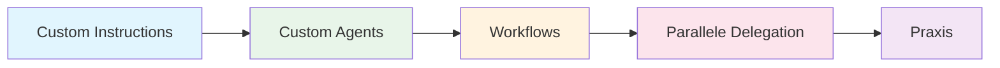

# Einführung in KI-gestützte Software-Entwicklung

## Überblick über KI-Coding-Assistenten

KI-Coding-Assistenten haben die Art und Weise, wie Software entwickelt wird, grundlegend verändert. Sie unterstützen Entwickler bei nahezu allen Aspekten des Entwicklungsprozesses – von der Codegenerierung über Refactoring bis hin zur Dokumentation.

### Was können moderne KI-Assistenten?

| Fähigkeit | Beschreibung |
|-----------|--------------|
| **Code-Generierung** | Erstellen von Code basierend auf natürlichsprachlichen Beschreibungen |
| **Code-Vervollständigung** | Intelligente Inline-Vorschläge während des Tippens |
| **Refactoring** | Umstrukturierung von Code unter Beibehaltung der Funktionalität |
| **Debugging** | Identifikation und Behebung von Fehlern |
| **Dokumentation** | Automatische Erstellung von Kommentaren und Dokumentation |
| **Testing** | Generierung von Unit- und Integrationstests |
| **Code-Review** | Analyse und Verbesserungsvorschläge für bestehenden Code |

---

## VSCode + GitHub Copilot vs. Antigravity

Die beiden führenden Plattformen verfolgen unterschiedliche Ansätze:

### VSCode + GitHub Copilot

**Philosophie:** Erweiterung der IDE um KI-Fähigkeiten mit Chat-Interface und Inline-Suggestions.

**Stärken:**
- Tiefe Integration in VSCode-Ökosystem
- Umfangreiche Extension-Unterstützung
- **Custom Agents** mit sequentieller Verkettung via Handoffs
- Flexible Tool-Integration (MCP-Server, Extensions)

**Kernkonzepte:**
- `.agent.md` Dateien für spezialisierte Agents
- `.instructions.md` für projektspezifische Anweisungen
- Tool-Auswahl pro Agent konfigurierbar

### Google Antigravity

**Philosophie:** Vollständig agentenbasierter Ansatz mit strukturierten Arbeitsmodi.

**Stärken:**
- Klare Trennung in **Planning**, **Execution** und **Verification** Modi
- Automatische Artifact-Erstellung (Tasks, Pläne, Walkthroughs)
- Parallele Tool-Ausführung für Effizienz
- Integrierte Browser-Steuerung und Screenshot-Fähigkeiten

**Kernkonzepte:**
- `task_boundary` für strukturierte Arbeitsabläufe
- `.agent/workflows/` für wiederverwendbare Prozesse
- `.gemini/` Ordner für projektspezifische Konfiguration

---

## Grundlegende Konzepte

### Context Engineering

**Definition:** Die Kunst, dem KI-Assistenten den optimalen Kontext bereitzustellen, um qualitativ hochwertige Antworten zu erhalten.

**Elemente des Kontexts:**
- **Workspace-Struktur:** Welche Dateien sind relevant?
- **Aktive Dokumente:** Was bearbeitet der Entwickler gerade?
- **Projekt-Metadaten:** Welche Technologien und Patterns werden verwendet?
- **Custom Instructions:** Welche Coding-Standards gelten?

> :warning: **Wichtig:** Die Qualität der KI-Antworten hängt direkt von der Qualität des bereitgestellten Kontexts ab.

### Prompt Engineering

**Definition:** Die Formulierung von Anfragen, die zu präzisen und nützlichen Antworten führen.

**Best Practices:**
1. **Spezifisch sein:** Statt "Verbessere diesen Code" → "Refaktoriere diese Funktion für bessere Lesbarkeit unter Verwendung von Early Returns"
2. **Kontext mitliefern:** Relevante Constraints und Anforderungen nennen
3. **Schrittweise vorgehen:** Komplexe Aufgaben in Teilaufgaben zerlegen

### Agent-Modi

Moderne KI-Assistenten arbeiten in verschiedenen Modi, die das Verhalten und die verfügbaren Tools bestimmen:

```
┌─────────────┐    ┌─────────────┐    ┌──────────────┐
│   PLANNING  │ → │  EXECUTION  │ → │ VERIFICATION │
│             │    │             │    │              │
│ • Recherche │    │ • Code      │    │ • Tests      │
│ • Analyse   │    │ • Dateien   │    │ • Review     │
│ • Planung   │    │ • Änderungen│    │ • Walkthrough│
└─────────────┘    └─────────────┘    └──────────────┘
```

---

## Kapitelübersicht

Dieses Script ist in sechs aufeinander aufbauende Kapitel gegliedert:

| Kapitel | Thema | Bedeutung |
|---------|-------|-----------|
| **2** | **Custom Instructions** | Grundlage für konsistente KI-Antworten – definiert projektweite Standards und Coding-Guidelines |
| **3** | **Custom Agents** | Spezialisierte KI-Rollen für unterschiedliche Aufgaben (Requirements, Architektur, Testing) |
| **4** | **Workflows** | Automatisierung wiederkehrender Prozesse – von Feature-Entwicklung bis Deployment |
| **5** | **Parallele Delegation** | Effiziente Nutzung mehrerer Agents für komplexe Aufgaben |
| **6** | **Praktische Beispiele** | Konkrete, sofort einsetzbare Konfigurationen und Vorlagen |

### Lernpfad



**Empfehlung:** Arbeiten Sie die Kapitel sequentiell durch, da jedes auf den vorherigen aufbaut. Die praktischen Beispiele in Kapitel 6 setzen das Verständnis aller vorherigen Konzepte voraus.

---

## Quellen und Referenzen

| Quelle | Beschreibung | Link |
|--------|--------------|------|
| **GitHub Copilot Docs** | Offizielle Dokumentation | [docs.github.com/copilot](https://docs.github.com/en/copilot) |
| **VS Code AI Docs** | VS Code KI-Features | [code.visualstudio.com/docs/copilot](https://code.visualstudio.com/docs/copilot) |
| **Prompt Engineering Guide** | Best Practices für Prompts | [github.com/dair-ai/Prompt-Engineering-Guide](https://github.com/dair-ai/Prompt-Engineering-Guide) |
| **Context Engineering** | Simon Willison's Blog | [simonwillison.net](https://simonwillison.net/tags/context-engineering/) |
| **Awesome Copilot** | Community-Ressourcen | [github.com/github/awesome-copilot](https://github.com/github/awesome-copilot) |

---

> :arrow_right: **Weiter zu:** [Kapitel 2: Custom Instructions](./02_Custom-Instructions.md)

