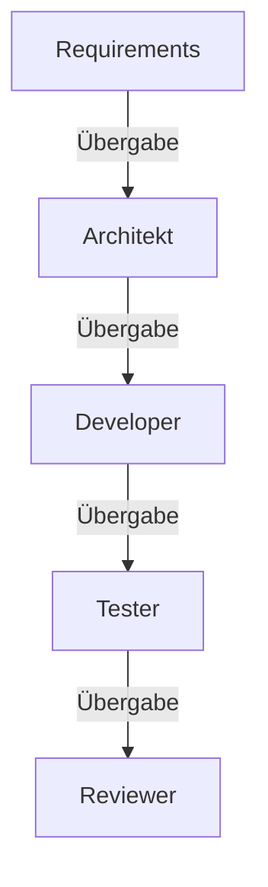

# Custom Agents

## Was sind Custom Agents?

**Definition:** Custom Agents sind spezialisierte KI-Konfigurationen mit vordefinierten Anweisungen und Tools für spezifische Aufgaben. Sie ermöglichen schnelles Umschalten zwischen verschiedenen Arbeitsmodi.

### Unterschied zu Custom Instructions

| Custom Instructions | Custom Agents |
|---------------------|---------------|
| Globale Coding-Standards | Aufgabenspezifische Konfiguration |
| Immer aktiv | Per Dropdown auswählbar |
| Nur Anweisungen | Anweisungen + Tool-Auswahl + Handoffs |

> :bulb: **Merke:** Agents wurden früher "Chat Modes" genannt. VS Code erkennt noch `.chatmode.md` Dateien, empfohlen ist jedoch `.agent.md`.

---

## Agent-Dateistruktur

### Speicherorte

```
Workspace:     .github/agents/*.agent.md
User Profile:  <VS Code Profile-Ordner>/*.agent.md
```

### Dateiformat

```yaml
---
description: Kurzbeschreibung für Dropdown
name: Anzeigename
tools: ['tool1', 'tool2', 'my-mcp-server/*']
model: Claude Sonnet 4
mcp-servers:
  - my-mcp-server
handoffs:
  - label: Button-Text
    agent: ziel-agent
    prompt: Vorausgefüllter Prompt
    send: false
---

# Agent Instructions

Hier stehen die Markdown-Anweisungen für den Agent.
```

### Header-Eigenschaften

| Eigenschaft | Beschreibung |
|-------------|--------------|
| `description` | Kurzbeschreibung im Agent-Dropdown |
| `name` | Anzeigename des Agents |
| `tools` | Liste verfügbarer Tools (inkl. MCP-Server) |
| `model` | LLM-Modell (optional) |
| `mcp-servers` | Liste der MCP-Server für diesen Agent |
| `handoffs` | Übergaben zu anderen Agents |

---

## Tools: MCP-Server und VS Code Extensions

Agents können auf verschiedene Tools zugreifen, um ihre Fähigkeiten zu erweitern.

### Built-in VS Code Tools

```yaml
tools: ['search', 'fetch', 'githubRepo', 'usages', 'runTerminalCommand']
```

| Tool | Beschreibung |
|------|--------------|
| `search` | Codebase durchsuchen |
| `fetch` | URLs abrufen |
| `githubRepo` | Repository-Informationen |
| `usages` | Symbol-Verwendungen finden |
| `runTerminalCommand` | Terminal-Befehle ausführen |

---

### Was ist das Model Context Protocol (MCP)?

**Definition:** MCP (Model Context Protocol) ist ein offenes Protokoll, das KI-Assistenten ermöglicht, sicher mit externen Datenquellen und Tools zu kommunizieren.

```
┌─────────────────┐      MCP       ┌─────────────────┐
│   KI-Assistent  │ ◄────────────► │   MCP-Server    │
│   (VS Code)     │   (Protokoll)  │   (extern)      │
└─────────────────┘                └─────────────────┘
                                          │
                                          ▼
                                   ┌─────────────────┐
                                   │  Externe Tools  │
                                   │  • Datenbanken  │
                                   │  • APIs         │
                                   │  • Dateisysteme │
                                   └─────────────────┘
```

### Warum MCP-Server verwenden?

| Ohne MCP | Mit MCP |
|----------|---------|
| KI kann nur auf lokale Dateien zugreifen | Zugriff auf externe Datenquellen |
| Begrenzte Tool-Auswahl | Unbegrenzt erweiterbar |
| Jede Integration manuell | Standardisiertes Protokoll |
| Keine domänenspezifischen Tools | Spezialisierte Server pro Domäne |

### MCP-Server Beispiele

| MCP-Server | Zweck |
|------------|-------|
| `dart-mcp-server` | Dart/Flutter Entwicklung (Analyze, Format, Tests) |
| `github-mcp-server` | GitHub Issues, PRs, Actions |
| `database-mcp` | SQL-Datenbankabfragen |
| `web-search-mcp` | Web-Recherche |
| `filesystem-mcp` | Erweiterter Dateizugriff |

### MCP-Server Konfiguration

**1. In `settings.json` (VS Code):**

```json
{
  "mcp": {
    "servers": {
      "dart-mcp-server": {
        "command": "dart",
        "args": ["run", "dart_mcp_server"],
        "cwd": "${workspaceFolder}"
      },
      "github": {
        "command": "npx",
        "args": ["-y", "@modelcontextprotocol/server-github"],
        "env": {
          "GITHUB_TOKEN": "${env:GITHUB_TOKEN}"
        }
      }
    }
  }
}
```

**2. In `.vscode/mcp.json` (Workspace-spezifisch):**

```json
{
  "servers": {
    "project-specific-server": {
      "command": "node",
      "args": ["./scripts/mcp-server.js"]
    }
  }
}
```

### MCP-Tools in Agents verwenden

**Im Agent-Header:**

```yaml
---
description: Flutter Development Agent
name: Flutter Dev
tools: ['search', 'dart-mcp-server/*']  # Alle Tools des Servers
mcp-servers:
  - dart-mcp-server
---
```

**Im Agent-Body:**

```markdown
# Flutter Development Instructions

Verwende #tool:dart-mcp-server/analyze_files für Code-Analyse.
Führe Tests aus mit #tool:dart-mcp-server/run_tests.
Formatiere Code mit #tool:dart-mcp-server/dart_format.
```

### Verfügbare Tools eines MCP-Servers anzeigen

Um zu sehen, welche Tools ein MCP-Server bereitstellt:

1. MCP-Server in `settings.json` konfigurieren
2. In VS Code Chat: "Welche Tools hat der dart-mcp-server?"
3. Oder: Command Palette → "MCP: List Tools"

### Beispiel: Dart MCP-Server Tools

| Tool | Funktion |
|------|----------|
| `analyze_files` | Dart Analyzer ausführen |
| `dart_format` | Code formatieren |
| `dart_fix` | Automatische Fixes anwenden |
| `run_tests` | Tests ausführen |
| `pub` | Pub-Befehle (get, add, upgrade) |
| `hot_reload` | Flutter Hot Reload |
| `launch_app` | Flutter App starten |

> :bulb: **Tipp:** MCP-Server können auch eigene **Resources** bereitstellen, wie z.B. aktuelle Fehlerlisten oder Widget-Trees.

### MCP-Server Quellen und Referenzen

| Quelle | Beschreibung | Link |
|--------|--------------|------|
| **MCP Spezifikation** | Offizielle Protokoll-Dokumentation | [modelcontextprotocol.io](https://modelcontextprotocol.io/) |
| **MCP GitHub** | Offizielle Repositories und SDKs | [github.com/modelcontextprotocol](https://github.com/modelcontextprotocol) |
| **Awesome MCP Servers** | Kuratierte Liste von Community-Servern | [github.com/punkpeye/awesome-mcp-servers](https://github.com/punkpeye/awesome-mcp-servers) |
| **VS Code MCP Docs** | VS Code Integration Dokumentation | [code.visualstudio.com/.../mcp](https://code.visualstudio.com/docs/copilot/chat/mcp-servers) |
| **MCP .so** | Find awesom MCP Servers and Clients | [mcp.so](https://mcp.so/) |
| **Smithery** | MCP-Server Registry und Discovery | [smithery.ai](https://smithery.ai/) |

---

## Sequentielle Agent-Verkettung (Handoffs)

Handoffs ermöglichen geführte Workflows zwischen Agents. Sie sollten verstanden werden, **bevor** die einzelnen Agent-Rollen betrachtet werden, da jeder Agent Handoffs zu anderen Agents definiert.



### Handoff-Konfiguration

```yaml
handoffs:
  - label: "Start Implementation"    # Button-Text
    agent: developer                 # Ziel-Agent Dateiname (ohne .agent.md)
    prompt: "Implementiere den Plan" # Vorausgefüllter Prompt
    send: false                      # false = User kann editieren vor Absenden
```

### Wie Handoffs funktionieren

1. Agent bearbeitet eine Anfrage und generiert eine Antwort
2. Am Ende der Antwort erscheint ein **Handoff-Button**
3. Klick auf Button wechselt zum Ziel-Agent mit vorausgefülltem Prompt
4. Bei `send: true` wird der Prompt automatisch abgesendet

### Beispiel-Workflow

| Schritt | Agent | Aktion | Handoff-Button |
|---------|-------|--------|----------------|
| 1 | Requirements | User Stories erstellen | "→ Zur Architektur" |
| 2 | Architekt | Design erstellen | "→ Implementierung" |
| 3 | Developer | Code schreiben | "→ Tests erstellen" |
| 4 | Tester | Tests schreiben | – |

---

## Agent-Rollen für Software-Entwicklung

> :bulb: **Tipp:** Für die Verwendung von Dokumenten-Templates in Agents siehe [Kapitel 5: Best Practices](./05_Best-Practices.md#51-dokumenten-templates).

### Requirements Engineer Agent

**Datei:** `.github/agents/requirements.agent.md`

```yaml
---
description: Erstellt User Stories und Akzeptanzkriterien
name: Requirements Engineer
tools: ['search', 'fetch', 'githubRepo']
handoffs:
  - label: Zur Architektur
    agent: architect
    prompt: Erstelle basierend auf diesen Requirements eine Architektur.
    send: false
---

# Requirements Engineering Instructions

Du bist ein Requirements Engineer. Deine Aufgabe ist es:

## User Stories erstellen
- Format: "Als [Rolle] möchte ich [Funktion], damit [Nutzen]"
- Klare, testbare Akzeptanzkriterien definieren
- INVEST-Kriterien einhalten (Independent, Negotiable, Valuable, Estimable, Small, Testable)

## Analyse
- Stakeholder-Anforderungen erfassen
- Abhängigkeiten identifizieren
- Priorisierung nach MoSCoW vorschlagen

## Deliverables
- User Story mit Akzeptanzkriterien
- Story Map für Feature-Übersicht
- Definition of Done
```

---

### SW-Architekt Agent

**Datei:** `.github/agents/architect.agent.md`

```yaml
---
description: Erstellt Software-Architektur und Domain-Modelle
name: SW-Architekt
tools: ['search', 'usages', 'githubRepo']
handoffs:
  - label: Implementierung starten
    agent: developer
    prompt: Implementiere die Architektur gemäß dem obigen Plan.
    send: false
---

# Software Architecture Instructions

Du bist ein Software-Architekt. Folge diesen Prinzipien:

## Architektur-Patterns
- Clean Architecture mit klarer Schichtentrennung
- Domain-Driven Design für komplexe Domänen
- SOLID-Prinzipien einhalten

## Domain Modeling
- Bounded Contexts identifizieren
- Aggregates und Entities definieren
- Value Objects für unveränderliche Konzepte

## Dokumentation
- Architektur-Entscheidungen dokumentieren (ADRs)
- Komponenten-Diagramme erstellen
- API-Contracts definieren
```

---

### Frontend-Developer Agent (CDD)

**Datei:** `.github/agents/frontend.agent.md`

```yaml
---
description: UI-Entwicklung mit Component-Driven Development
name: Frontend Developer
tools: ['search', 'fetch', 'usages']
handoffs:
  - label: Tests erstellen
    agent: tester
    prompt: Erstelle Tests für die implementierten Komponenten.
    send: false
---

# Frontend Development Instructions

Du bist ein Frontend-Entwickler mit Fokus auf Component-Driven Development (CDD).

## CDD-Prinzipien
- Bottom-Up: Atoms → Molecules → Organisms → Templates → Pages
- Komponenten isoliert entwickeln und testen
- Storybook für Komponenten-Dokumentation

## Komponenten-Design
- Single Responsibility: Eine Komponente, eine Aufgabe
- Props für Konfiguration, Events für Kommunikation
- Accessibility (a11y) von Anfang an

## Styling
- Design Tokens für konsistente Werte
- Responsive Design mit Mobile-First
- CSS Modules oder Styled Components
```

---

### Backend-Developer Agent

**Datei:** `.github/agents/backend.agent.md`

```yaml
---
description: Backend-Entwicklung mit Clean Architecture
name: Backend Developer
tools: ['search', 'usages', 'githubRepo']
---

# Backend Development Instructions

Du bist ein Backend-Entwickler. Folge diesen Prinzipien:

## API-Design
- RESTful Conventions einhalten
- OpenAPI/Swagger für Dokumentation
- Versionierung von Anfang an

## Business Logic
- Use Cases im Application Layer
- Domain-Logik in Entities und Value Objects
- Services für komplexe Operationen

## Persistence
- Repository Pattern für Datenzugriff
- Database Migrations verwenden
- Optimistic Locking bei Concurrency
```

---

### Test-Engineer Agent

**Datei:** `.github/agents/tester.agent.md`

```yaml
---
description: Erstellt Unit-, Integration- und E2E-Tests
name: Test Engineer
tools: ['search', 'usages', 'runTerminalCommand']
---

# Testing Instructions

Du bist ein Test-Engineer. Erstelle umfassende Tests:

## Unit Tests
- Arrange-Act-Assert Pattern
- Eine Assertion pro Test (idealerweise)
- Mocking für externe Abhängigkeiten

## Integration Tests
- Reale Datenbankverbindungen testen
- API-Endpoints end-to-end
- Keine Mocks für interne Komponenten

## Test Coverage
- Kritische Pfade 100% abdecken
- Edge Cases berücksichtigen
- Error-Handling testen
```

---

## Antigravity Agent-Modi

Google Antigravity verwendet ein strukturiertes Modus-System:

### Die drei Modi

| Modus | Zweck | Typische Aktionen |
|-------|-------|-------------------|
| **PLANNING** | Recherche und Design | Codebase analysieren, Plan erstellen |
| **EXECUTION** | Implementierung | Code schreiben, Dateien ändern |
| **VERIFICATION** | Validierung | Tests ausführen, Review erstellen |

### Task Boundaries

```
task_boundary(
  Mode: "EXECUTION",
  TaskName: "Implementing User Authentication",
  TaskStatus: "Creating login endpoint",
  TaskSummary: "Completed user model and repository."
)
```

### Artifacts

Antigravity erstellt automatisch strukturierte Dokumente:

- `task.md` – Fortschrittsverfolgung
- `implementation_plan.md` – Technischer Plan
- `walkthrough.md` – Dokumentation der Änderungen

---

## Agent erstellen (Schritt-für-Schritt)

### In VS Code

1. **Agent-Dropdown öffnen** → "Configure Custom Agents"
2. **"Create new custom agent"** auswählen
3. **Speicherort wählen:**
   - Workspace: `.github/agents/`
   - User Profile: Überall verfügbar
4. **Dateiname eingeben** (wird zum Agent-Namen)
5. **YAML Header ausfüllen** (description, tools)
6. **Instructions schreiben**

### Migration von Chat Modes

Alte `.chatmode.md` Dateien können migriert werden:
- Quick Fix nutzen zum Umbenennen
- Neue Eigenschaften (`handoffs`, `mcp-servers`) ergänzen

---

## Quellen und Referenzen

| Quelle | Beschreibung | Link |
|--------|--------------|------|
| **VS Code Custom Agents** | Offizielle Dokumentation | [code.visualstudio.com/.../custom-agents](https://code.visualstudio.com/docs/copilot/customization/custom-agents) |
| **MCP Spezifikation** | Model Context Protocol | [modelcontextprotocol.io](https://modelcontextprotocol.io/) |
| **MCP GitHub** | Offizielle Repositories | [github.com/modelcontextprotocol](https://github.com/modelcontextprotocol) |
| **Awesome MCP Servers** | Community-Server-Liste | [github.com/punkpeye/awesome-mcp-servers](https://github.com/punkpeye/awesome-mcp-servers) |
| **MCP .so** | Server und Client Discovery | [mcp.so](https://mcp.so/) |
| **Smithery** | MCP Registry | [smithery.ai](https://smithery.ai/) |
| **Awesome Copilot** | Agent-Beispiele | [github.com/github/awesome-copilot](https://github.com/github/awesome-copilot) |

---

> :arrow_left: **Zurück zu:** [Kapitel 2: Custom Instructions](./02_Custom-Instructions.md)
>
> :arrow_right: **Weiter zu:** [Kapitel 4: Workflows](./04_Workflows.md)

