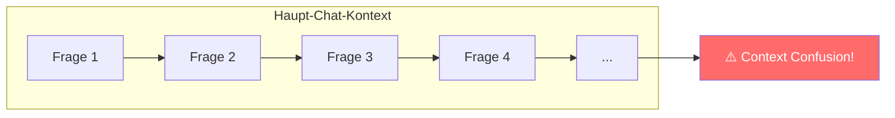
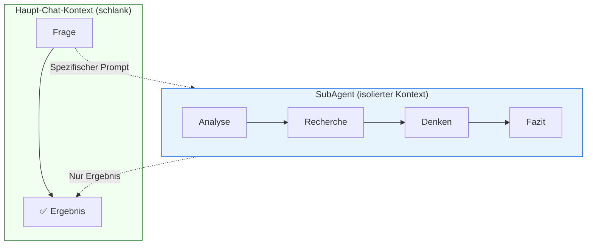

# Best Practices & Erweiterungen

Dieses Kapitel behandelt bewährte Praktiken und funktionale Erweiterungen, die in Kombination mit `Custom Instructions`, `Agents` und `Workflows` eingesetzt werden können.

> <span style="font-size: 1.5em">:bulb:</span> **Merksatz:** Standardisiere Quellen und Templates, frage vor dem Erstellen nach, und halte Kontexte schlank – so bleiben KI-gestützte Prozesse effizient und verlässlich.

<div style="page-break-after: always;"></div>

## Dokumenten-Templates

### Warum Templates verwenden?

Templates für Dokumente bieten konsistente Strukturen und reduzieren den Aufwand für den Agent bei der Dokumentenerstellung.

| Vorteil | Beschreibung |
|---------|--------------|
| **Konsistenz** | Einheitliche Dokumentenstruktur im Projekt |
| **Effizienz** | Agent muss Struktur nicht jedes Mal neu erstellen |
| **Qualität** | Vordefinierte Abschnitte verhindern Auslassungen |
| **Projektstandards** | Templates spiegeln Team-Konventionen wider |

### Template-Speicherorte

```
.github/
├── agents/
│   ├── requirements.agent.md
│   └── architect.agent.md
└── templates/                    # Empfohlener Ordner
    ├── user-story.md
    ├── architecture-decision-record.md
    ├── test-plan.md
    └── review-checklist.md
```

> <span style="font-size: 1.5em">:bulb:</span> **Empfehlung:** Speichere Templates in `.github/templates/` oder `docs/templates/` als Default-Ordner.

### Templates im Agent referenzieren

**Im Agent-Body auf Templates verweisen:**

```text
# Requirements Engineering Instructions

## Dokumentenerstellung

Verwende die folgenden Templates aus `.github/templates/`:

- **User Stories:** `user-story.md`
- **Feature-Spezifikation:** `feature-spec.md`
- **Story Map:** `story-map.md`

**WICHTIG:** Bevor du ein Dokument erstellst:
1. Frage den Benutzer, ob das Dokument erstellt werden soll
2. Schlage den Standard-Speicherort vor (z.B. `docs/requirements/`)
3. Biete an, einen alternativen Speicherort zu verwenden
4. Erstelle das Dokument erst nach Bestätigung
```

### Templates in Workflows verwenden

**In VS Code Custom Prompts:**

```text
---
description: Erstellt eine User Story nach Template
---

Verwende das Template aus `.github/templates/user-story.md` um eine User Story zu erstellen.

**Vor der Erstellung:**
1. Frage ob das Dokument erstellt werden soll
2. Schlage `docs/requirements/user-stories/` als Speicherort vor
3. Biete Alternativen an

**Nach Bestätigung:**
- Lade das Template
- Fülle die Platzhalter aus
- Speichere am gewählten Ort
```

**In Antigravity Workflows:**

```text
---
description: User Story erstellen
---

## Workflow-Schritte

1. Analysiere die Anforderung des Benutzers
2. Lade Template: `.github/templates/user-story.md`
3. Frage den Benutzer:
   - "Soll ich eine User Story erstellen?"
   - "Standard-Speicherort: `docs/requirements/user-stories/` – OK oder anderer Ordner?"
4. Warte auf Bestätigung
5. Erstelle Dokument basierend auf Template
```

### Best Practice: Benutzer-Interaktion vor Dokumentenerstellung

Agents und Workflows sollten **aktiv nachfragen**, bevor sie Dokumente erstellen:

```text
## Interaktionsregeln für Dokumentenerstellung

Wenn du ein Dokument erstellen sollst:

1. **Bestätigung einholen:**
   "Soll ich eine User Story für [Feature] erstellen?"

2. **Standard-Speicherort vorschlagen:**
   "Der Standard-Speicherort wäre `docs/requirements/user-stories/`.
   Möchtest du diesen verwenden oder einen anderen Ordner angeben?"

3. **Bei Ablehnung:** Alternativen anbieten oder auf Erstellung verzichten

4. **Bei Bestätigung:** Template aus `.github/templates/` laden und ausfüllen
```

### Beispiel: Agent mit Template-Konfiguration

```text
---
description: Erstellt User Stories nach Template
name: Requirements Engineer
tools: ['search', 'fetch']
handoffs:
  - label: Zur Architektur
    agent: architect
---

# Requirements Engineering

## Templates

Verwende diese Templates für Dokumentenerstellung:

| Dokument | Template | Default-Speicherort |
|----------|----------|---------------------|
| User Story | `.github/templates/user-story.md` | `docs/requirements/user-stories/` |
| Epic | `.github/templates/epic.md` | `docs/requirements/epics/` |
| Story Map | `.github/templates/story-map.md` | `docs/requirements/` |

## Workflow für Dokumentenerstellung

1. Analysiere die Anforderung
2. **Frage den Benutzer:**
   - "Soll ich ein [Dokumenttyp]-Dokument erstellen?"
   - "Soll ich den Standard-Ordner `[pfad]` verwenden, oder möchtest du einen anderen Speicherort angeben?"
3. Warte auf Bestätigung
4. Erstelle Dokument basierend auf Template
5. Fülle die Platzhalter im Template aus
```

> <span style="font-size: 1.5em">:warning:</span> **Wichtig:** Erstelle niemals Dokumente ohne vorherige Rückfrage beim Benutzer!

***
Quellen 

- Best Practices für Developer Experience und Templates (Projektinterne Konventionen)
- GitHub Docs – Repository Strukturierungen: https://docs.github.com
***

---

## Kontext-Dateien & Referenzquellen

Agents können auf zusätzliche Informationsquellen zugreifen, wenn sie wissen **wo** sie relevante Informationen finden und **wann** sie diese nutzen sollten.

### Arten von Kontextquellen

| Quelle | Beschreibung | Anwendung |
|--------|--------------|-----------|
| **Projekt-Dokumentation** | Lokale Markdown-Dateien | Architektur, Coding Standards |
| **API-Dokumentation** | URLs zu offiziellen Docs | Framework-spezifische Fragen |
| **Beispiel-Repositories** | GitHub-Links | Referenz-Implementierungen |
| **Interne Wikis** | Confluence, Notion etc. | Team-Konventionen |


---

### Kontext-Dateien im Projekt

#### Empfohlene Struktur

```
docs/
├── architecture/
│   ├── overview.md          # Architektur-Übersicht
│   ├── decisions/           # Architecture Decision Records
│   └── patterns.md          # Verwendete Design Patterns
├── conventions/
│   ├── coding-standards.md  # Code-Konventionen
│   ├── naming.md            # Naming Conventions
│   └── git-workflow.md      # Git Branching Strategy
├── domain/
│   ├── glossary.md          # Domänen-Glossar
│   └── bounded-contexts.md  # Domain-Driven Design Kontexte
└── api/
    ├── endpoints.md         # API-Dokumentation
    └── error-codes.md       # Fehlercode-Referenz
```

---

### Quellen im Agent referenzieren

**Quellenverzeichnis im Agent-Body:**

```text
# Development Agent Instructions

## Verfügbare Kontextquellen

Nutze folgende Quellen, wenn du zusätzliche Informationen benötigst:

| Thema | Quelle | Wann nutzen? |
|-------|--------|--------------|
| **Architektur** | `docs/architecture/overview.md` | Bei strukturellen Fragen oder neuen Komponenten |
| **Coding Standards** | `docs/conventions/coding-standards.md` | Bei Code-Formatierung oder Style-Fragen |
| **Domänen-Begriffe** | `docs/domain/glossary.md` | Bei unklaren Fachbegriffen |
| **API-Referenz** | `docs/api/endpoints.md` | Bei API-Implementierung oder Integration |
| **Git-Workflow** | `docs/conventions/git-workflow.md` | Bei Branch-Erstellung oder Commit-Messages |

## Anwendungsregel

Bevor du eine Frage beantwortest oder Code schreibst:
1. Prüfe, ob eine der obigen Quellen relevante Informationen enthält
2. Lies die Quelle, wenn du dir unsicher bist
3. Halte dich an die dort definierten Standards
```

---

### Externe Links als Referenzen

**Für Framework-/Technologie-spezifische Informationen:**

```text
# Flutter Development Agent

## Externe Referenzen

Nutze folgende offizielle Dokumentationen bei Bedarf:

| Thema | URL | Wann nutzen? |
|-------|-----|--------------|
| **Flutter Widgets** | https://api.flutter.dev/flutter/widgets/widgets-library.html | Widget-Eigenschaften, Parameter |
| **Dart Language** | https://dart.dev/language | Sprachfeatures, Syntax |
| **Material Design** | https://m3.material.io/ | UI-Komponenten, Design Guidelines |
| **Riverpod** | https://riverpod.dev/docs | State Management Patterns |
| **go_router** | https://pub.dev/packages/go_router | Navigation, Routing |

## Anwendungsregel

- Nutze **lokale Dokumentation** für projektspezifische Standards
- Nutze **externe Links** für Framework-/API-Details
- Bevorzuge **offizielle Dokumentation** vor Stack Overflow o.ä.
```

---

### Kontext-Verzeichnis Beispiel (CONTEXT.md)

Erstelle eine zentrale Datei, die alle verfügbaren Quellen dokumentiert:

**Datei:** `docs/CONTEXT.md` oder `.github/CONTEXT.md`

```text
# Projekt-Kontextverzeichnis

Diese Datei listet alle verfügbaren Informationsquellen für KI-Agenten.

## Lokale Dokumentation

| Datei | Beschreibung | Relevanz für |
|-------|--------------|--------------|
| `README.md` | Projekt-Übersicht, Setup | Neue Features, Onboarding |
| `docs/architecture/overview.md` | Architektur-Diagramme | Strukturelle Änderungen |
| `docs/conventions/coding-standards.md` | Code-Konventionen | Jede Code-Änderung |
| `docs/domain/glossary.md` | Fachbegriffe | Domain-spezifischer Code |
| `CHANGELOG.md` | Änderungshistorie | Version-Informationen |

## Externe Referenzen

| Thema | URL | Beschreibung |
|-------|-----|--------------|
| Flutter Docs | https://docs.flutter.dev | Offizielle Flutter-Dokumentation |
| Dart Docs | https://dart.dev/guides | Dart Sprachführer |
| Pub.dev | https://pub.dev | Package-Dokumentation |

## Wichtige Hinweise

- **Immer prüfen:** Bei Unsicherheit die relevante Quelle konsultieren
- **Priorität:** Lokale Konventionen > Offizielle Docs > Community-Lösungen
- **Aktualität:** Links können veralten, im Zweifel selbst suchen
```

---

### Agent mit Kontextquellen-Verweis

**Vollständiges Beispiel:**

```text
---
description: Backend-Entwicklung mit Clean Architecture
name: Backend Developer
tools: ['search', 'fetch', 'usages']
---

# Backend Development Instructions

Du bist ein Backend-Entwickler für dieses Projekt.

## Kontextquellen

**Lies zuerst diese Dateien, wenn du Fragen zu folgenden Themen hast:**

| Frage/Thema | Quelle |
|-------------|--------|
| Wie ist die Architektur aufgebaut? | `docs/architecture/overview.md` |
| Welche Coding Standards gelten? | `docs/conventions/coding-standards.md` |
| Was bedeutet ein Fachbegriff? | `docs/domain/glossary.md` |
| Wie sieht ein Use Case aus? | `src/application/use_cases/example_use_case.dart` |
| Wie ist das Repository-Pattern? | `src/infrastructure/repositories/` |

**Externe Referenzen bei Bedarf:**

| Thema | URL |
|-------|-----|
| Dart Best Practices | https://dart.dev/effective-dart |
| Clean Architecture | https://blog.cleancoder.com/uncle-bob/2012/08/13/the-clean-architecture.html |

## Verhaltensregeln

1. **Vor jeder Implementierung:** Prüfe, ob relevante Konventionen existieren
2. **Bei Domain-Logik:** Konsultiere das Glossar für korrekte Begriffe
3. **Bei Architektur-Fragen:** Lies die Architektur-Dokumentation
4. **Bei Framework-Fragen:** Nutze die offiziellen Docs (fetch-Tool)
```

---

### Best Practice: Kontext-Quellen effektiv nutzen

| Do | Don't |
|----|-------|
| Quellenverzeichnis zentral pflegen | Quellen überall verstreuen |
| Klare Beschreibung, wann Quelle nützlich ist | Nur Links ohne Kontext listen |
| Lokale und externe Quellen unterscheiden | Alles in einen Topf werfen |
| Prioritäten definieren (lokal vor extern) | Keine Reihenfolge angeben |
| Quellen aktuell halten | Veraltete Links stehen lassen |

> <span style="font-size: 1.5em">:bulb:</span> **Tipp:** Erstelle eine `CONTEXT.md` Datei im Projekt-Root oder in `.github/`, die alle verfügbaren Quellen mit kurzer Beschreibung listet. Referenziere diese Datei in deinen Agents.

***
Quellen 

- Technische Dokumentation – Projektinterne `docs/` Strukturen
- Offizielle Framework-Dokumentationen (Flutter/Dart/Material): https://docs.flutter.dev, https://dart.dev, https://m3.material.io
- Clean Architecture: https://blog.cleancoder.com/uncle-bob/2012/08/13/the-clean-architecture.html
***

---

## SubAgents für Kontextisolation (VS Code)

### Das Problem: Context Confusion

Je länger ein Chat mit einem Agent dauert, desto mehr Kontext sammelt sich an. Das kann zu **Context Confusion** führen – der Agent verliert den Überblick oder vermischt Informationen aus verschiedenen Aufgaben.



---

### Die Lösung: SubAgents
> <span style="font-size: 1.5em">:mag:</span> **Vertiefung:** SubAgents helfen, dedizierte Aufgaben kontextrein zu bearbeiten (z.B. isolierte Recherche), während der Haupt-Chat fokussiert bleibt. Nutze klare Übergaben und eindeutige Eingabe-/Ausgabe-Formate.

***
Quellen 

- VS Code Agent- und Prompt-Workflows (projektinterne Guidelines)
- Prinzipien zu Kontextmanagement in LLM-gestützten Systemen (Community-Praxishinweise)
***

<div style="page-break-after: always;"></div>

**SubAgents** sind isolierte Agent-Instanzen, die:

- **Eigenen Kontext** haben (unabhängig vom Haupt-Chat)
- **Nur die nötigen Informationen** erhalten
- **Nur das Ergebnis** an den Haupt-Chat zurückgeben
- **Ohne Unterbrechung** arbeiten (keine User-Feedback-Pausen)



---

### SubAgent in VS Code verwenden

**Tool aktivieren:**

```
#runSubagent
```

**Beispiel-Prompt:**

```
Analysiere die #file:api mit #runSubagent und empfehle die 
beste Authentifizierungsstrategie für einen Web-Client.
```

**Was passiert:**

1. LLM erstellt einen spezifischen Prompt für den SubAgent
2. SubAgent startet mit **nur** den übergebenen Informationen
3. SubAgent arbeitet unabhängig (Recherche, Analyse, etc.)
4. **Nur das Endergebnis** wird an den Haupt-Chat zurückgegeben
5. Haupt-Chat-Kontext bleibt schlank

---

### Anwendungsfälle für SubAgents

| Szenario | Warum SubAgent? |
|----------|-----------------|
| **Tiefe Recherche** | Sammelt viel Kontext, der den Haupt-Chat überladen würde |
| **Seitenthemen** | Kurze Abstecher ohne Haupt-Kontext zu verschmutzen |
| **Technische Analyse** | Detailarbeit, die nur ein Fazit liefern soll |
| **Vergleiche** | Mehrere Optionen evaluieren, nur Empfehlung zurückgeben |
| **Code-Review** | Umfangreiche Analyse, kompaktes Feedback |

---

### Beispiele

**Recherche zu einer Technologie:**

```
Recherchiere mit #runSubagent die Vor- und Nachteile von 
Riverpod vs. BLoC für State Management in Flutter. 
Gib eine Empfehlung basierend auf unserem Projekt.
```

**Architektur-Analyse:**

```
Analysiere mit #runSubagent die Abhängigkeiten in #file:src 
und identifiziere zirkuläre Imports.
```

**Security-Check:**

```
Führe mit #runSubagent einen Security-Review der 
#file:auth_controller.dart durch.
```

---

### SubAgents vs. Handoffs

| Eigenschaft | SubAgents | Handoffs |
|-------------|-----------|----------|
| **Kontext** | Isoliert (eigener Kontext) | Geteilt (gleicher Chat) |
| **Kontrolle** | Automatisch, keine Pause | User kann vor Absenden editieren |
| **Ergebnis** | Nur Fazit zurück | Vollständiger Chat-Verlauf |
| **Anwendung** | Tiefe Recherche, Seitenthemen | Workflow-Übergabe zwischen Rollen |

---

### Best Practice: SubAgents effektiv einsetzen

| Do | Don't |
|----|-------|
| SubAgents für isolierte Teilaufgaben nutzen | Alles im Haupt-Chat erledigen |
| Spezifische, fokussierte Prompts formulieren | Vage Anweisungen geben |
| Kontext explizit übergeben (#file:...) | Annehmen, dass SubAgent alles weiß |
| Bei langen Chats regelmäßig SubAgents nutzen | Kontext unbegrenzt wachsen lassen |

> :bulb: **Tipp:** Nutze SubAgents als "Consultants" – sie recherchieren im Hintergrund und liefern nur das Ergebnis.

---

### Quellen

| Quelle | Link |
|--------|------|
| **VS Code SubAgents Docs** | [code.visualstudio.com/.../chat-sessions#subagents](https://code.visualstudio.com/docs/copilot/chat/chat-sessions#_contextisolated-subagents) |
| **Unified Agent Experience Blog** | [code.visualstudio.com/blogs/.../unified-agent-experience](https://code.visualstudio.com/blogs/2025/11/03/unified-agent-experience#_subagents) |
| **Context Engineering** | [dbreunig.com/.../how-to-fix-your-context](https://www.dbreunig.com/2025/06/26/how-to-fix-your-context.html) |

---

## Prompt-Bibliotheken

### Was sind Prompt-Bibliotheken?

Prompt-Bibliotheken sind kuratierte Sammlungen wiederverwendbarer Prompt-Vorlagen (Textbausteine) für wiederkehrende Aufgaben in der Softwareentwicklung. Sie standardisieren die Zusammenarbeit mit GitHub Copilot Chat, erhöhen die Qualität, beschleunigen wiederkehrende Schritte (z. B. Tests generieren, refaktorieren, dokumentieren) und erleichtern Onboarding und Konsistenz im Team.

Wesentliche Bausteine einer Prompt-Vorlage:

- Ziel: Klare Aufgabe/Outcome (z. B. „Unit-Tests für Funktion X generieren“)
- Kontext: Welche Artefakte/Linien sind relevant (z. B. `#file`, `#selection`, `@workspace`)
- Anforderungen: Stil, Constraints, Akzeptanzkriterien
- Beispiele: Ein- und Ausgabe-Beispiele, wenn sinnvoll
- Grenzen/Sicherheit: Was nicht tun (z. B. keine Secrets, keine externen APIs ohne Freigabe)

Hinweis: GitHub stellt mit dem „Copilot Chat Cookbook“ offizielle, thematisch sortierte Beispiel-Prompts bereit, und die Seite „Prompt engineering for GitHub Copilot Chat“ liefert Strategien, wie Prompts strukturiert und präzisiert werden können. Siehe Quellen unten.

---

### Nutzen in der Softwareentwicklung

| Vorteil | Beschreibung |
|--------|--------------|
| Konsistenz | Gleiche Aufgaben werden mit gleichbleibender Qualität erledigt |
| Effizienz | Weniger Tipparbeit und schnelleres Arbeiten mit Copilot Chat |
| Qualität | Explizite Kriterien (Tests, Stil, Constraints) verbessern Ergebnisse |
| Wissensweitergabe | Best Practices werden über Vorlagen teamweit geteilt |

---

### Verzeichnisstruktur im Repository

Empfehlung: Prompts versionieren und nahe am Code ablegen.

```
.github/
└── prompts/
    ├── communicate/              # Kommunikations- & Template-Prompts
    ├── testing/                  # Tests generieren, Testdaten, Coverage
    ├── refactoring/              # Lesbarkeit, Maintainability, Patterns
    ├── debugging/                # Fehlersuche, Log-Analyse
    └── docs/                     # README, ADR, Changelogs
```

Jede Datei enthält eine einzelne Prompt-Vorlage. Metadaten helfen bei Auffindbarkeit und Governance.

---

### Vorlage: Prompt-Datei mit Metadaten

```text
---
title: Generate Unit Tests (Copilot Chat)
category: testing
intent: create-tests-for-selected-function
context: "#selection, #file"
environment: "VS Code / github.com Copilot Chat"
owner: team-backend
version: 1.0
---

Ziel:
- Erzeuge aussagekräftige Unit-Tests für die markierte Funktion in #selection.

Rahmenbedingungen:
- Nutze das bestehende Test-Framework des Projekts.
- Decke Randfälle ab; benenne Tests sprechend.
- Erzeuge nur Code; keine Erklärtexte.

Artefakte/Kontext:
- Relevante Datei: #file
- Markierter Ausschnitt: #selection

Akzeptanzkriterien:
- Tests sind deterministisch, unabhängig und leicht wartbar.
- Kein Zugriff auf Netzwerk/Dateisystem außer Mocks/Stubs.
```

Die Verwendung von Chat-Variablen (`#file`, `#selection`, `#workspace`) und Teilnehmern (z. B. `@workspace`) ist in den GitHub Docs zu Copilot Chat beschrieben. So wird der Prompt präzise an den aktiven Code-Kontext gebunden.

---

### Beispiele für Team-Prompts (Auszug)

1) Tests generieren (angelehnt an das Copilot Chat Cookbook):

```text
Erzeuge Unit-Tests für die markierte Funktion in #selection.
Anforderungen:
- Nutze [Framework des Projekts] und übliche Arrange-Act-Assert-Struktur.
- Erzeuge Grenzfall- und Fehlerfall-Tests.
- Keine externen I/O-Operationen.
Kontext: #file, #selection
Output: Nur Testcode.
```

2) Refactoring-Vorschläge (Lesbarkeit & Maintainability):

```text
Analysiere die Funktion(en) in #selection auf Lesbarkeit, Komplexität und Maintainability.
Liefere eine kurze, geordnete Liste konkreter Refactoring-Schritte
(z. B. Extrahieren, Umbenennen, Guard Clauses, Pattern-Einsatz).
Kontext: #file, #selection
Output: Kurze Begründungen + Code-Snippets für die wichtigsten Schritte.
```

3) README-Abschnitt generieren:

```text
Erzeuge einen README-Abschnitt "Usage" basierend auf den öffentlichen APIs in #file.
Anforderungen: Kurzer Überblick, Codebeispiele, Hinweise zu Grenzen und Version.
Output: Markdown-Abschnitt ohne Einleitung/Outro.
```

---

### Qualitätssicherung und Governance

- Metadaten: `owner`, `version`, `category`, `intent`, `last-reviewed`
- Review-Prozess: Pull-Requests wie bei Code; kurze Testläufe im Chat
- De-Duplizierung: Ähnliche Prompts zusammenführen; veraltete Vorlagen deprecaten
- Sicherheit: Keine Secrets im Prompt; keine Aufforderung, Policies zu umgehen
- Kontextklarheit: Präzise Nutzung von `#selection`/`#file` statt vager Verweise

---

### Integration in Tools/Workflows

- VS Code: Prompts als Markdown-Dateien im Repo pflegen und bei Bedarf in Copilot Chat einfügen; mit `#file`/`#selection` anreichern.
- GitHub Docs „Getting started with prompts for Copilot Chat“ zeigt Schlüsselwörter (z. B. `@workspace`, Slash-Commands, Chat-Variablen) zur gezielten Kontextübergabe.
- Externe Bibliotheken: PromptHub bietet eine kuratierte Sammlung und „Open in Copilot“ für github.com, womit Prompts direkt in Copilot Chat vorbefüllt werden können (siehe Quelle unten). Eignet sich als Inspiration; teaminterne Bibliothek bleibt das „Source of Truth“.

---

### Do / Don’t (kompakt)

| Do | Don’t |
|----|-------|
| „Breit starten, dann konkret werden“ (Ziel, Anforderungen, Beispiele) | Vage, kontextlose Einzeiler |
| Beispiele und Akzeptanzkriterien hinzufügen | Ergebnisse offen lassen |
| Chat-Variablen (`#file`, `#selection`) nutzen | Auf impliziten Kontext hoffen |
| Offizielle Docs/Pattern referenzieren | Unsichere Fremdquellen priorisieren |
| Versionieren und reviewen | Einmal schreiben, nie aktualisieren |

---

### Quellen (kuratierte Auswahl)

- GitHub Docs – Copilot Chat Cookbook (Beispiel-Prompts): https://docs.github.com/en/copilot/example-prompts-for-github-copilot-chat
- GitHub Docs – Prompt engineering for GitHub Copilot Chat: https://docs.github.com/en/copilot/concepts/prompting/prompt-engineering
- GitHub Docs – Getting started with prompts for Copilot Chat: https://docs.github.com/copilot/get-started/getting-started-with-prompts-for-copilot-chat
- GitHub Docs – Best practices for using GitHub Copilot: https://docs.github.com/en/copilot/get-started/best-practices
- Microsoft Learn – Introduction to prompt engineering with GitHub Copilot: https://learn.microsoft.com/en-us/training/modules/introduction-prompt-engineering-with-github-copilot/
- PromptHub – One‑Click GitHub Copilot Prompts (Open in Copilot): https://www.prompthub.us/blog/prompthub-github-one-click-github-copilot-prompts-are-live

---

## Weitere Best Practices

*Dieser Abschnitt kann um weitere funktionale Erweiterungen ergänzt werden, z.B.:*

- **Prompt-Bibliotheken** – Wiederverwendbare Prompt-Bausteine
- **Agent-Orchestrierung** – Komplexe Multi-Agent-Szenarien
- **Fehlerbehandlung** – Strategien für robuste Agent-Antworten
- **Caching-Strategien** – Häufig benötigte Informationen vorhalten

---

> :arrow_left: **Zurück zu:** [Kapitel 4: Workflows](./04_Workflows.md)
>
> :arrow_right: **Weiter zu:** [Kapitel 6: Parallele Delegation](./06_Parallele-Delegation.md)
