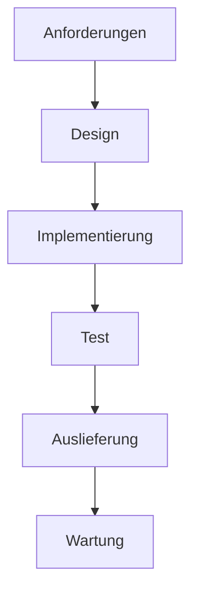

# 1. Systemkonzeption

## 1.1. Softwarentwicklung allgemein

### 1.1.1. Definition und Ziel der Softwareentwicklung

Stellen Sie sich vor, Sie möchten ein Haus bauen: Sie brauchen eine Vorstellung vom Ergebnis, einen Bauplan, Materialien und ein Team. Ähnlich ist es bei der Softwareentwicklung – nur dass das „Haus“ ein digitales Produkt ist.

#### Definition

**Softwareentwicklung** bezeichnet den systematischen Prozess, bei dem aus Anforderungen und Ideen funktionsfähige Softwarelösungen entstehen. Sie umfasst Planung, Entwurf, Implementierung, Test und Wartung.

#### Ziel der Softwareentwicklung

Das Hauptziel ist, ein Produkt zu schaffen, das die Bedürfnisse der Nutzer erfüllt, zuverlässig funktioniert und wartbar bleibt. Dabei sind Qualität, Effizienz und Anpassungsfähigkeit entscheidend.

> :mag: **Vertiefung:** Moderne Softwareentwicklung integriert Methoden wie agile Prozesse, automatisierte Tests und KI-gestützte Tools, um schneller und flexibler auf Anforderungen zu reagieren.

#### Komponenten

- **Anforderungsanalyse:** Was soll die Software leisten?
- **Entwurf:** Wie wird die Lösung strukturiert?
- **Implementierung:** Wie wird die Lösung technisch umgesetzt?
- **Test:** Funktioniert die Lösung wie gewünscht?
- **Wartung:** Wie bleibt die Lösung aktuell und fehlerfrei?

#### Beispiel

Ein Team entwickelt eine App zur Terminverwaltung. Es beginnt mit der Analyse der Nutzerbedürfnisse, erstellt ein Design, programmiert die Funktionen, testet die App und veröffentlicht Updates.

#### Anwendungsfälle

- Entwicklung von Apps, Webanwendungen, Embedded-Systemen
- Automatisierung von Geschäftsprozessen
- Digitalisierung von Dienstleistungen

***

Quellen

- [Software Engineering – Wikipedia](https://de.wikipedia.org/wiki/Softwaretechnik)
***

### 1.1.2. Unterschiede zwischen kleinen und großen SW-Projekten

Die Unterscheidung zwischen kleinen und großen Softwareprojekten ist ein zentrales Thema der Systemkonzeption. Sie betrifft Teamgröße, Komplexität, Organisation und die eingesetzten Methoden – und wird durch den Einsatz von Künstlicher Intelligenz (KI) zunehmend neu definiert.

#### Klassische Unterschiede

| Kriterium                     | Kleine Softwareprojekte                | Große Softwareprojekte                        |
|-------------------------------|----------------------------------------|-----------------------------------------------|
| **Teamgröße**                 | 1–5 Personen                          | 10–100+ Personen (mehrere Teams)              |
| **Projektumfang**             | Wenige Module, überschaubar            | Komplexe Systeme, viele Komponenten           |
| **Dauer**                     | Tage bis wenige Monate                 | Monate bis Jahre                              |
| **Komplexität**               | Gering, wenige Abhängigkeiten          | Hoch, viele Abhängigkeiten, Teilsysteme       |
| **Kommunikation**             | Direkt, informell                      | Strukturiert, mit Rollen und Prozessen        |
| **Dokumentation**             | Minimal, oft im Code                   | Umfangreich, Pflichtenhefte, UML, QA-Berichte |
| **Prozessmodell**             | Ad hoc, Rapid Prototyping              | Scrum, V-Modell, Wasserfall, hybride Modelle  |
| **Test & Qualitätssicherung** | Manuell, einfach automatisiert         | Automatisiert, CI/CD, QA-Teams                |
| **Risikomanagement**          | Kaum notwendig                         | Zwingend erforderlich                         |

#### Einfluss von KI auf die Projektlandschaft

Der Einsatz von KI-Tools wie GitHub Copilot, ChatGPT oder automatisierten Testgeneratoren verschiebt die Grenzen:

- **Kleine Projekte** profitieren von Produktivitätsschub, automatisierter Dokumentation und schnellen Prototypen. Einzelpersonen können heute Code auf Enterprise-Niveau erzeugen.
- **Große Projekte** werden effizienter, da KI Routineaufgaben, Testgenerierung und Code-Reviews übernimmt. Die Komplexität bleibt jedoch bestehen – klare Strukturen und menschliche Kontrolle sind weiterhin nötig.

> :mag: **Vertiefung:** KI ersetzt nicht die Architekturplanung oder das Systemverständnis. Sie ist ein Werkzeug, das neue Kompetenzen im Umgang mit generiertem Code und ethischen Fragen erfordert.

#### Vergleich: Früher vs. Heute (mit KI)

| Dimension                            | Früher                      | Heute (mit KI)                                                             |
|--------------------------------------|-----------------------------|----------------------------------------------------------------------------|
| **Leistungsfähigkeit kleiner Teams** | begrenzt                    | stark gestiegen durch KI-Assistenten                                       |
| **Notwendigkeit großer Teams**       | hoch bei komplexen Systemen | etwas geringer – KI unterstützt Routinearbeiten                            |
| **Wert von Architektur & Planung**   | zentral                     | weiterhin zentral (KI kann keine Systemarchitektur „verstehen“)            |
| **Testing-Aufwand**                  | hoch, manuell               | automatisiert durch KI-generierte Tests                                    |
| **Dokumentation**                    | zeitaufwändig               | KI kann automatisch Entwürfe und technische Doku erstellen                 |
| **Fehleranfälligkeit**               | menschlich bedingt          | KI kann Fehler erkennen, aber auch neue einführen                          |
| **Rollen im Projekt**                | Entwicklerzentriert         | neue Rollen: „Prompt Engineer“, „KI-Reviewer“, „Ethik-/Compliance-Analyst“ |

#### Didaktisches Fazit

> :bulb: **Merksatz:** KI macht kleine Projekte professioneller und große Projekte effizienter – aber Struktur, Qualitätssicherung und menschliche Verantwortung bleiben entscheidend.

KI ist kein Ersatz für Projektmanagement, Architektur oder Teamkommunikation, sondern ein Werkzeug zur Automatisierung und Unterstützung.

### 1.1.3. Fehlerquellen in klassischen und KI-gestützten Softwareprojekten

Fehler sind ein unvermeidbarer Bestandteil jedes Softwareprojekts – egal ob klein oder groß, klassisch oder KI-gestützt. Sie entstehen durch menschliche Faktoren, komplexe Anforderungen und neue Technologien. Das Verständnis typischer Fehlerquellen und deren Wandel durch KI ist entscheidend, um Projekte erfolgreich und zukunftssicher zu gestalten.

Im Folgenden findest du eine Übersicht typischer Fehler in klassischen Softwareprojekten und deren moderne Varianten im KI-Zeitalter:

#### Klassische Fehlerquellen

| Kategorie                             | Typische Fehler                                   | Erklärung / Auswirkung                                                                         |
| ------------------------------------- | ------------------------------------------------- | ---------------------------------------------------------------------------------------------- |
| **Anforderungsanalyse**               | ❌ Unklare oder sich widersprechende Anforderungen | Fehlende oder unpräzise Anforderungen führen zu Fehlentwicklungen („Building the wrong thing“) |
|                                       | ❌ Fehlende Einbindung der Stakeholder             | Nutzerbedürfnisse werden nicht berücksichtigt, Akzeptanzprobleme                               |
| **Planung & Architektur**             | ❌ Fehlende Gesamtarchitektur / Big Picture        | System wächst unkontrolliert – „Spaghetti-Code“                                                |
|                                       | ❌ Unrealistische Zeitplanung                      | Projektverzögerungen, Qualitätsverlust                                                         |
| **Implementierung**                   | ❌ Fehlende Codekonventionen                       | Schwer wartbarer Code, fehlende Lesbarkeit                                                     |
|                                       | ❌ „Copy-Paste-Programming“                        | Fehler werden multipliziert, keine Wiederverwendung                                            |
| **Testing & Qualitätssicherung**      | ❌ Zu spätes oder unzureichendes Testen            | Fehler werden erst spät erkannt, hohe Kosten                                                   |
|                                       | ❌ Fehlende Testautomatisierung                    | Manuelle Tests zu aufwändig, Regressionen bleiben unentdeckt                                   |
| **Kommunikation & Projektmanagement** | ❌ Fehlende Abstimmung zwischen Teams              | Doppelte Arbeit, Integrationsprobleme                                                          |
|                                       | ❌ Kein Risikomanagement                           | Überraschungen in späten Phasen                                                                |
| **Dokumentation & Übergabe**          | ❌ Keine oder veraltete Dokumentation              | Wissen geht verloren, Wartung erschwert                                                        |
|                                       | ❌ Keine Nachvollziehbarkeit von Änderungen        | Fehlerquellen schwer identifizierbar                                                           |

> :bulb: **Kernaussage:** Die meisten Fehler in klassischen Projekten entstehen nicht durch Technik, sondern durch Kommunikation, Planung und fehlende Qualitätssicherung.

#### Moderne Fehlerquellen durch KI

Der Einsatz von KI verändert die Fehlerlandschaft: Einige klassische Fehler werden reduziert, aber neue technische und ethische Risiken entstehen.

| Kategorie                        | Typische Fehler                                        | Erklärung / Auswirkung                                                                             |
| -------------------------------- | ------------------------------------------------------ | -------------------------------------------------------------------------------------------------- |
| **Anforderungsanalyse mit KI**   | ⚠️ Zu großes Vertrauen in KI-generierte Anforderungen  | KI kann Missverständnisse in natürlichsprachigen Anforderungen verstärken                          |
|                                  | ⚠️ Fehlende Validierung von KI-Vorschlägen             | Ungeprüfte Übernahme führt zu falschen Systemzielen                                                |
| **Architektur & Design**         | ⚠️ Fehlendes Architekturverständnis                    | KI kann Code, aber keine übergreifenden Architekturentscheidungen treffen                          |
|                                  | ⚠️ Überoptimierung einzelner Module                    | KI-Code löst Teilprobleme gut, aber ohne Gesamtsicht (z. B. Performance- oder Sicherheitsprobleme) |
| **Implementierung**              | ⚠️ „Blindes Vertrauen“ in KI-Code                      | Entwickler übernehmen Vorschläge ohne Prüfung – mögliche Sicherheitslücken oder Lizenzverstöße     |
|                                  | ⚠️ Urheberrechtsverletzungen durch KI-generierten Code | KI kann Code aus Trainingsdaten reproduzieren – unklare Lizenzsituation                            |
| **Testing & Qualitätssicherung** | ⚠️ Fehlendes Testverständnis                           | KI generiert Tests, aber ohne logische Testabdeckung                                               |
|                                  | ⚠️ Keine Überwachung der Testqualität                  | KI-Tests decken nur Standardfälle ab, nicht Randfälle                                              |
| **Daten & Modelle**              | ⚠️ Schlechte oder verzerrte Trainingsdaten             | KI-Vorschläge können diskriminierende oder fehlerhafte Logiken enthalten                           |
|                                  | ⚠️ Fehlende Reproduzierbarkeit                         | KI-Ausgaben können sich bei gleichen Eingaben ändern (stochastisches Verhalten)                    |
| **Team & Kommunikation**         | ⚠️ Reduzierte Kommunikation im Team                    | Entwickler verlassen sich auf KI statt auf kollegiale Code-Reviews                                 |
|                                  | ⚠️ Kompetenzverlust („KI macht das schon“)             | Entwickler verlieren Fachwissen, wenn sie KI blind vertrauen                                       |
| **Ethik & Sicherheit**           | ⚠️ Fehlende Nachvollziehbarkeit („Black Box Code“)     | Schwer nachvollziehbar, warum KI bestimmte Entscheidungen trifft                                   |
|                                  | ⚠️ Datenschutzprobleme bei Cloud-KI                    | Projektcode wird an externe Server übermittelt – DSGVO-Risiko                                      |

> :bulb: **Kernaussage:** KI reduziert Routinefehler, aber erzeugt neue Risiken in Bezug auf Vertrauen, Verantwortung und Transparenz.

##### Vergleich: klassische vs. KI-unterstützte Fehler

| Bereich            | Klassische Entwicklung                            | KI-unterstützte Entwicklung                                |
| ------------------ | ------------------------------------------------- | ---------------------------------------------------------- |
| **Fehlerursache**  | Menschliche Unachtsamkeit, Kommunikationsprobleme | Fehlende Kontrolle oder Verständnis über KI-Ergebnisse     |
| **Schwerpunkt**    | Planung & Testfehler                              | Validierung & ethische Risiken                             |
| **Typischer Satz** | „Wir haben zu spät getestet.“                     | „Wir haben der KI zu sehr vertraut.“                       |
| **Gegenmaßnahme**  | Prozessdisziplin, Review-Kultur                   | KI-Governance, Validierungsprozesse, menschliche Kontrolle |
| **Lernbedarf**     | Projektorganisation                               | Datenkompetenz & kritisches Denken                         |

##### Fazit

> :bulb:  **In der klassischen Softwareentwicklung** liegen Fehler meist in Kommunikation, Planung und fehlender Qualitätssicherung.
> 
> **In der modernen, KI-gestützten Entwicklung** entstehen Fehler durch mangelnde Kontrolle und unkritische Nutzung von KI-generierten Ergebnissen.

### 1.1.4. Methoden der Softwareentwicklung

Die Wahl der richtigen Methode ist entscheidend für den Erfolg eines Softwareprojekts. Sie beeinflusst Planung, Durchführung und Kommunikation im Team. In diesem Kapitel werden grundlegende Methoden der Softwareentwicklung vorgestellt und verglichen.

#### 1.2.1 Sequentielle vs. agile Methoden

Die Entwicklung von Software kann auf unterschiedliche Arten organisiert werden. Zwei grundlegende Ansätze sind das sequentielle und das agile Vorgehen. Während beim sequentiellen Modell die einzelnen Phasen klar voneinander getrennt und nacheinander abgearbeitet werden, setzt das agile Modell auf Flexibilität, kontinuierliche Anpassung und enge Zusammenarbeit mit dem Kunden.

#### Definitionen

- **Sequentielle Methoden** (z. B. Wasserfallmodell): Der Entwicklungsprozess ist in klar abgegrenzte Phasen unterteilt, die nacheinander durchlaufen werden. Jede Phase muss abgeschlossen sein, bevor die nächste beginnt.
- **Agile Methoden** (z. B. Scrum, Kanban): Die Entwicklung erfolgt iterativ und inkrementell. Anforderungen und Lösungen entstehen durch Zusammenarbeit in selbstorganisierten Teams. Anpassungen sind jederzeit möglich.

#### Zweck und Einsatzgebiete

- **Sequentiell:** Geeignet für Projekte mit stabilen Anforderungen, klaren Zielen und wenig Änderungsbedarf (z. B. sicherheitskritische Systeme, Bauwesen).
- **Agil:** Ideal für Projekte mit sich ändernden Anforderungen, hoher Innovationsrate und engem Kundenkontakt (z. B. Webanwendungen, Startups).

#### Komponenten

- **Sequentiell:** Phasen wie Analyse, Design, Implementierung, Test, Wartung.
- **Agil:** Sprints, Backlog, regelmäßige Meetings, kontinuierliches Feedback.

#### Vergleichstabelle

| Merkmal                | Sequentielle Methode         | Agile Methode                |
|------------------------|-----------------------------|------------------------------|
| Ablauf                 | Linear, festgelegt          | Iterativ, flexibel           |
| Änderungsmanagement    | Aufwendig, selten           | Einfach, jederzeit möglich   |
| Dokumentation          | Umfangreich, vorab          | Schlank, fortlaufend         |
| Teamstruktur           | Hierarchisch                | Selbstorganisiert            |
| Kundenbeteiligung      | Am Anfang, selten           | Kontinuierlich, eng          |
| Risiko                 | Spät erkennbar              | Früh erkennbar               |

#### Beispiel

Ein Unternehmen entwickelt eine Software für die Verwaltung von Kundendaten. Im Wasserfallmodell werden alle Anforderungen zu Beginn festgelegt und das Produkt wird nach Monaten ausgeliefert. Im agilen Ansatz wird alle zwei Wochen ein funktionsfähiges Teilprodukt präsentiert und gemeinsam mit dem Kunden weiterentwickelt.

> :mag: **Vertiefung:** Moderne Projekte kombinieren oft beide Ansätze („hybride Modelle“), um Stabilität und Flexibilität zu vereinen.

> :bulb: **Merksatz:** Sequentielle Methoden sind wie das Befahren einer festgelegten Route mit klaren Etappen, während agile Methoden eher einer Reise mit vielen Zwischenstopps und der Möglichkeit zur spontanen Kursänderung gleichen – das Ziel bleibt, aber der Weg passt sich flexibel den Gegebenheiten an.

#### 1.2.2 Prozessmodelle und Vorgehensweisen

Die Wahl des passenden Prozessmodells ist ein zentraler Erfolgsfaktor in der Softwareentwicklung. Prozessmodelle strukturieren den Ablauf eines Projekts und helfen, Risiken zu minimieren, Qualität zu sichern und die Zusammenarbeit im Team zu organisieren.

##### Was ist ein Prozessmodell?

Ein Prozessmodell beschreibt die einzelnen Schritte und deren Reihenfolge, die bei der Entwicklung von Software durchlaufen werden. Es legt fest, wie Anforderungen aufgenommen, umgesetzt, getestet und ausgeliefert werden.

##### Zweck

- Strukturierung des Entwicklungsablaufs
- Transparenz und Nachvollziehbarkeit
- Unterstützung bei Planung, Steuerung und Kontrolle
- Anpassung an Projekttyp, Teamgröße und Kundenanforderungen

##### Wichtige Prozessmodelle im Überblick

| Modell           | Charakteristik                        | Einsatzgebiet                        |
|------------------|--------------------------------------|--------------------------------------|
| **Wasserfall**   | Strikt sequenziell, Phasen nacheinander | Klare Anforderungen, wenig Änderungen |
| **V-Modell**     | Verknüpft Entwicklung und Test        | Qualitätssicherung, Behördenprojekte |
| **Spiralmodell** | Iterativ, risikoorientiert            | Komplexe, risikobehaftete Projekte   |
| **Scrum**        | Agil, inkrementell, Sprints           | Flexible, dynamische Projekte        |
| **Kanban**       | Agil, kontinuierlicher Fluss          | Wartung, Support, kleine Teams       |

##### Visualisierung

*Beispiel: Wasserfallmodell – Phasen laufen nacheinander ab.*

##### Auswahlkriterien für das passende Modell

- Stabilität der Anforderungen
- Projektgröße und Komplexität
- Teamstruktur und Erfahrung
- Kundenbeteiligung und Änderungsbedarf
- Risiko und Qualitätsanforderungen

> :bulb: **Merksatz:** Es gibt kein „bestes“ Prozessmodell – die Wahl hängt immer von den Projektzielen, Rahmenbedingungen und Teampräferenzen ab.

#### 1.2.3 Auswahl geeigneter Modelle für unterschiedliche Projekttypen

Die Wahl des passenden Prozessmodells hängt von vielen Faktoren ab. Es gibt kein universelles Modell, das für alle Projekte optimal ist. Stattdessen sollte das Modell an die spezifischen Anforderungen, Rahmenbedingungen und Ziele des Projekts angepasst werden.

##### Entscheidungskriterien

| Kriterium                | Sequentielle Modelle (z. B. Wasserfall) | Agile Modelle (z. B. Scrum, Kanban) |
|--------------------------|-----------------------------------------|-------------------------------------|
| Anforderungen            | Klar, stabil                            | Häufige Änderungen                  |
| Projektgröße/Komplexität | Groß, komplex                           | Klein bis mittel, überschaubar      |
| Teamstruktur/Erfahrung   | Hierarchisch, weniger agil               | Selbstorganisiert, erfahren         |
| Kundenbeteiligung        | Gering, am Anfang                       | Hoch, kontinuierlich                |
| Risiko/Qualität          | Hoch, strenge Vorgaben                   | Flexibel, schnelle Anpassung        |

##### Praxisbeispiele

| Projekttyp / Beispiel                                 | Empfohlenes Modell           | Begründung                                         |
|------------------------------------------------------|------------------------------|----------------------------------------------------|
| Start-up entwickelt innovative App                    | Scrum, Kanban                | Schnelle Releases, flexible Anforderungen          |
| Software für eine Behörde                            | V-Modell, Wasserfall         | Klare Vorgaben, hohe Dokumentationspflicht         |
| Wartung/Weiterentwicklung eines bestehenden Systems   | Kanban                       | Kontinuierlicher Fluss, wechselnde Aufgaben        |
| Großes Industrieprojekt mit vielen Teams              | Spiralmodell, hybride Ansätze| Komplexe Architektur, viele Schnittstellen         |

> :bulb: **Merksatz:** Das beste Prozessmodell ist das, das zu den Anforderungen, dem Team und den Zielen des Projekts passt – Flexibilität und Anpassungsfähigkeit sind oft wichtiger als dogmatische Modelltreue.

### 1.3 Phasenmodelle und Entwicklungszyklen

#### 1.3.1 Phasen des Softwareentwicklungszyklus

Die Entwicklung von Software erfolgt in klar definierten Phasen, die den gesamten Lebenszyklus eines Softwareprodukts abbilden. Jede Phase hat spezifische Aufgaben und Ziele, die aufeinander aufbauen und den Projekterfolg sichern.

> :mag: **Vertiefung:** Die klassische Einteilung in Phasen hilft, den Überblick zu behalten und Risiken frühzeitig zu erkennen. Moderne Ansätze wie DevOps oder KI-gestützte Entwicklung ergänzen diese Phasen durch Automatisierung und kontinuierliche Verbesserung.

##### Übersicht der Phasen

| Phase                | Ziel / Aufgabe                                 | Ergebnis / Output                |
|----------------------|------------------------------------------------|----------------------------------|
| **Anforderungsanalyse** | Klärung, was die Software leisten soll         | Lasten-/Pflichtenheft, User Stories |
| **Entwurf (Design)**    | Strukturierung der Lösung, Architekturplanung  | Architekturdiagramme, Design-Dokumente |
| **Implementierung**     | Technische Umsetzung, Programmierung           | Quellcode, Module                |
| **Test**                | Überprüfung der Funktionalität und Qualität   | Testberichte, Fehlerlisten        |
| **Auslieferung**        | Bereitstellung für Nutzer/Kunden              | Installationspakete, Releases     |
| **Wartung**             | Fehlerbehebung, Anpassung, Weiterentwicklung  | Updates, Patches, neue Features   |

##### Besonderheiten: KI-unterstützter Einsatz im Entwicklungsprozess

KI-Tools wie Copilot, ChatGPT oder automatisierte Testsysteme unterstützen heute alle Phasen der Softwareentwicklung. Sie helfen, Routineaufgaben zu automatisieren, Fehler frühzeitig zu erkennen und die Produktivität zu steigern – ersetzen aber nicht die menschliche Kontrolle und das Architekturverständnis.

| Phase                | Typische KI-Unterstützung                          | Nutzen / Grenzen                       |
|----------------------|----------------------------------------------------|----------------------------------------|
| **Anforderungsanalyse** | Automatische Generierung von User Stories, Analyse von Anforderungen aus Texten | Schnellere Dokumentation, aber Validierung nötig |
| **Entwurf (Design)**    | Vorschläge für Architektur, Code-Templates, Diagramm-Generierung                | Effizienzsteigerung, aber keine Systemübersicht |
| **Implementierung**     | Code-Vervollständigung, Fehlererkennung, Refactoring-Vorschläge                 | Produktivität, aber Kontrolle und Review nötig |
| **Test**                | Generierung von Testfällen, automatisierte Testausführung                       | Schnellere Tests, aber logische Abdeckung prüfen |
| **Auslieferung**        | Automatisierte Build- und Deployment-Prozesse                                    | Weniger Fehler, aber Monitoring bleibt wichtig |
| **Wartung**             | Vorschläge für Bugfixes, automatische Dokumentation                              | Schnelle Updates, aber Kontextwissen erforderlich |

> :bulb: **Merksatz:** KI-Tools sind wie digitale Assistenten, die den Entwicklungsprozess beschleunigen und erleichtern – aber die Verantwortung für Architektur, Qualität und Ethik bleibt beim Menschen.

#### 1.3.2 Lasten-/Pflichtenheft und deren Bedeutung in agilen vs. sequentiellen Vorgehensweisen

Das Lasten- und Pflichtenheft sind zentrale Dokumente in der klassischen Softwareentwicklung. Sie dienen der präzisen Beschreibung von Anforderungen und der verbindlichen Festlegung von Umsetzungskriterien. In agilen Projekten werden diese Aufgaben anders gelöst – mit flexiblen, fortlaufend aktualisierten Artefakten.

##### Definitionen
- **Lastenheft:** Enthält die Anforderungen und Wünsche des Auftraggebers – das „Was“ soll erreicht werden?
- **Pflichtenheft:** Beschreibt die konkrete Umsetzung durch den Auftragnehmer – das „Wie“ wird die Lösung realisiert?

##### Bedeutung und Unterschiede
| Merkmal                | Sequentiell (klassisch)                | Agil (z. B. Scrum, Kanban)           |
|------------------------|----------------------------------------|--------------------------------------|
| **Lastenheft**         | Detailliert, zu Projektbeginn, verbindlich | User Stories, Product Backlog, flexibel |
| **Pflichtenheft**      | Ausführlich, vor Umsetzung, Vertragsgrundlage | Sprint-Planung, technische Tasks, laufend angepasst |
| **Änderungen**         | Aufwendig, oft formale Prozesse        | Jederzeit möglich, inkrementell      |
| **Dokumentation**      | Umfangreich, statisch                  | Schlank, dynamisch                   |
| **Kundenbeteiligung**  | Am Anfang, selten                      | Kontinuierlich, eng                  |

##### Typische Inhalte von Lasten- und Pflichtenheft

| Abschnitt                | Lastenheft (Was?)                                   | Pflichtenheft (Wie?)                                 |
|--------------------------|-----------------------------------------------------|------------------------------------------------------|
| **Zielsetzung**          | Projektziele, Nutzen für den Auftraggeber           | Umsetzung der Ziele, Lösungsansatz                   |
| **Ausgangssituation**    | Ist-Zustand, Problemstellung                       | Technische und organisatorische Rahmenbedingungen     |
| **Funktionale Anforderungen** | Beschreibung der gewünschten Funktionen              | Detaillierte Spezifikation, technische Umsetzung      |
| **Nicht-funktionale Anforderungen** | Qualitätsanforderungen, z. B. Sicherheit, Performance | Konkrete Maßnahmen zur Erfüllung dieser Anforderungen |
| **Randbedingungen**      | Budget, Zeit, gesetzliche Vorgaben                 | Berücksichtigung der Randbedingungen im Lösungsdesign |
| **Schnittstellen**       | Erwartete Schnittstellen zu anderen Systemen        | Technische Beschreibung der Schnittstellen            |
| **Abnahmekriterien**     | Kriterien für die erfolgreiche Projektabnahme       | Test- und Prüfverfahren zur Abnahme                   |
| **Dokumentation**        | Anforderungen an die Projektdokumentation           | Struktur und Umfang der technischen Dokumentation     |

> :mag: **Vertiefung:** In der Praxis werden Lasten- und Pflichtenheft oft gemeinsam erarbeitet, um Missverständnisse zu vermeiden und eine klare Basis für die Zusammenarbeit zu schaffen.

##### Praxisbeispiel
- **Sequentiell:** Ein Unternehmen schreibt ein Lastenheft für eine neue Verwaltungssoftware. Das Pflichtenheft wird vom Entwicklungsteam erstellt und bildet die Basis für die Umsetzung und spätere Abnahme.
- **Agil:** Die Anforderungen werden als User Stories im Product Backlog gepflegt. Die Umsetzung erfolgt in Sprints, das Team passt die Stories und Tasks laufend an neue Erkenntnisse und Kundenfeedback an.

> :bulb: **Merksatz:** Das Lasten- und Pflichtenheft sind in klassischen Projekten wie ein detaillierter Bauplan – in agilen Projekten wird der Plan laufend gemeinsam mit dem Kunden weiterentwickelt und bleibt flexibel.

***

Quellen

