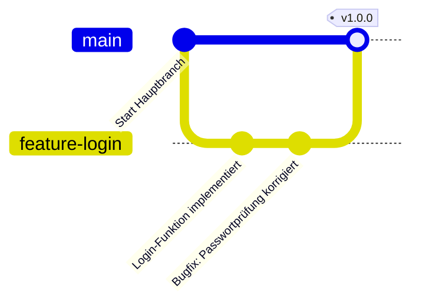
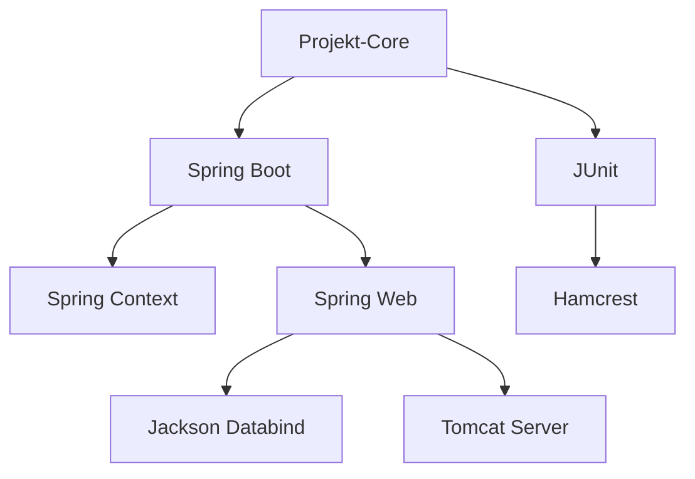
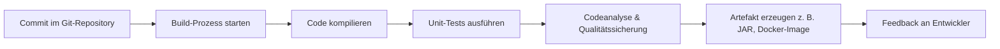
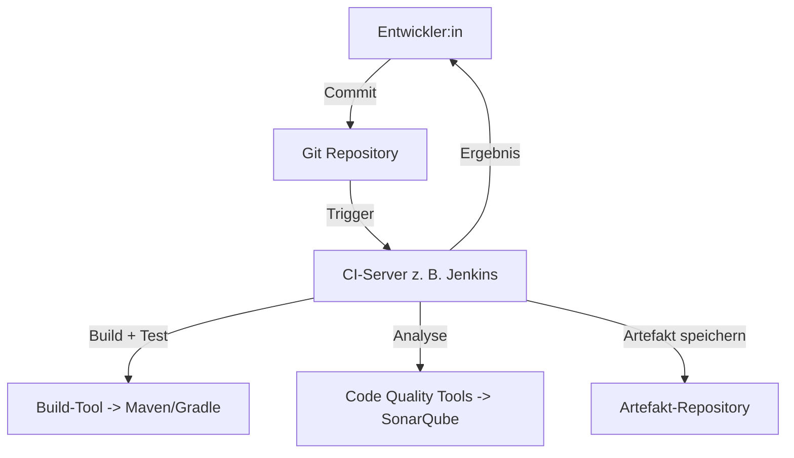
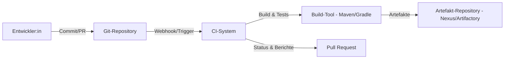

# Entwicklungsumgebung und Tools

Stellen Sie sich vor, Sie bauen ein komplexes Gebäude: Ohne die richtigen Werkzeuge, Pläne und eine koordinierte Zusammenarbeit im Team wäre das Projekt zum Scheitern verurteilt. Genauso verhält es sich in der Softwareentwicklung – die Wahl und der gezielte Einsatz von Entwicklungsumgebungen und Tools sind entscheidend für den Erfolg moderner Softwareprojekte.

In diesem Kapitel lernen Sie die wichtigsten Werkzeuge und Methoden kennen, die den Entwicklungsprozess effizient, sicher und nachvollziehbar machen. Dazu gehören Versionsverwaltungssysteme wie Git, Build- und Dependency-Management-Tools, Continuous Integration (CI) sowie bewährte Workflows für die Zusammenarbeit im Team. Sie erfahren, wie diese Tools ineinandergreifen, typische Fehler vermeiden helfen und die Qualität der Software nachhaltig sichern.

> <span style="font-size: 1.5em">:mag:</span> **Vertiefung:**
Die richtige Kombination aus Tools und Prozessen ermöglicht nicht nur eine reibungslose Entwicklung, sondern auch eine schnelle Anpassung an neue Anforderungen und eine kontinuierliche Verbesserung der Software.

***
Quellen

- [Git SCM Documentation](https://git-scm.com/doc)
- [Continuous Integration – Martin Fowler](https://martinfowler.com/articles/continuousIntegration.html)
- [Apache Maven](https://maven.apache.org/)
***

### Versionsverwaltung mit Git

**Git** ist ein **verteiltes Versionsverwaltungssystem (VCS – Version Control System)**, das zur Nachverfolgung von Änderungen an Dateien – insbesondere Quellcode – dient.
Es wurde 2005 von **Linus Torvalds** (dem Entwickler des Linux-Kernels) entwickelt und ist heute der **Standard in der Softwareentwicklung**.

**🔧 Hauptzweck:**

* Nachverfolgung aller Änderungen an Dateien
* Zusammenarbeit mehrerer Entwickler:innen
* Wiederherstellen früherer Zustände
* Paralleles Arbeiten an verschiedenen Funktionen

#### Repositories

Das Repository stellt das Fundament der Versionsverwaltung dar. Ein **Repository** (kurz: *Repo*) ist das **zentrale Projektarchiv**, in dem Git alle Versionen und Metadaten eines Projekts speichert.

**📦 Arten von Repositories:**

| Typ                    | Beschreibung                                                                  | Beispiel                                |
| ---------------------- | ----------------------------------------------------------------------------- | --------------------------------------- |
| **Lokales Repository** | Auf dem eigenen Rechner gespeichert. Enthält vollständige Versionsgeschichte. | `.git`-Ordner im Projektverzeichnis     |
| **Remote Repository**  | Zentrale Version des Projekts auf einem Server (z. B. GitHub, GitLab).        | `https://github.com/Schule/Projekt.git` |


**⚙️ Grundstruktur des Git-Repostroy**

Ein Git-Repository besteht aus:

* **Arbeitsverzeichnis (Working Directory)** → enthält aktuelle Dateien
* **Staging Area (Index)** → Bereich, in dem Änderungen vorbereitet werden
* **Repository (.git)** → speichert alle Commits und Metadaten dauerhaft

```
Working Directory → Staging Area → Repository
```

### 💡 Beispiel:

```bash
git init                 # Neues lokales Repository erstellen
git remote add origin https://github.com/schule/projekt.git  # Remote-Repo hinzufügen
```

---

#### 🧱 `Commit` – Versionierung der Änderungen

Ein **Commit** ist eine **gespeicherte Momentaufnahme (Snapshot)** des Projekts zu einem bestimmten Zeitpunkt.
Jeder Commit enthält:

* den Autor
* das Datum
* eine eindeutige **Commit-ID (Hash)**
* eine **Commit-Nachricht**
* die Änderungen (Delta) zum vorherigen Zustand

**🔄 Commit-Workflow:**

1. Änderungen im Arbeitsverzeichnis durchführen
2. Mit `git add` zur Staging Area hinzufügen
3. Mit `git commit` dauerhaft speichern

```bash
git add main.java
git commit -m "Implementiere Login-Funktion"
```

**🧩 Beispielhafter Commit-Verlauf:**

| Commit-ID | Beschreibung                       | Datum      | Autor |
| --------- | ---------------------------------- | ---------- | ----- |
| a1b2c3d   | Projektinitialisierung             | 12.10.2025 | Anna  |
| d4e5f6g   | Login-Funktion implementiert       | 13.10.2025 | Max   |
| h7i8j9k   | Bugfix: Passwortprüfung korrigiert | 14.10.2025 | Max   |


> <span style="font-size: 1.5em">:bulb:</span>Jeder Commit ist ein „Speicherpunkt“ in der Projektgeschichte – man kann jederzeit darauf zurückspringen oder vergleichen.

#### 🌿 `Branch` – paralleler Entwicklungsstrang

Ein **Branch (Zweig)** ist eine **unabhängige Entwicklungslinie** innerhalb des Repositories.
Mit Branches kann man neue Funktionen entwickeln, ohne den Hauptcode (meist **main** oder **master**) zu gefährden.

**⚙️ Typischer Ablauf:**

1. Neuer Branch für eine Funktion erstellen
2. Änderungen durchführen
3. Branch testen
4. Änderungen wieder in den Hauptzweig **mergen**

```bash
git branch feature-login      # Neuen Branch erstellen
git checkout feature-login    # In den Branch wechseln
# ... Entwicklung ...
git checkout main             # Zurück zum Hauptbranch
git merge feature-login       # Änderungen übernehmen
```

**📊 Beispielhafte Struktur:**

```
main
 ├── feature-login
 ├── feature-database
 └── bugfix-session
```

> <span style="font-size: 1.5em">:bulb:</span>Branches erlauben **parallele Arbeit**, **Experimentieren** und **kontrollierte Integration** neuer Features.

---

#### 🏷️ `Tag` – markierte Version (z. B. Release)

Ein **Tag** ist eine **feste Markierung** auf einem bestimmten Commit – oft für **wichtige Versionen** wie Releases (z. B. `v1.0.0`).
Tags verändern sich **nicht** und dienen als **Referenzpunkte** in der Versionshistorie.

**⚙️ Beispiel:**

```bash
git tag -a v1.0.0 -m "Erste stabile Version"
git push origin v1.0.0
```

**📦 Verwendung:**

* Markierung von **Release-Ständen** (z. B. für Deployment oder Archivierung)
* Wiederherstellung einer bestimmten Version (`git checkout v1.0.0`)

> <span style="font-size: 1.5em">:bulb:</span>Tags sind „Lesezeichen“ im Projektverlauf – sie helfen, wichtige Versionen leicht wiederzufinden.

#### 🔗 Zusammenspiel von Repository, Commits, Branches und Tags

Im folgenden wird ein typischer Ablauf skizziert:

1. Entwickler erstellt Branch „feature-login“
2. Erstellt mehrere Commits (z.B. login-Funktion implementiert, Bugfix: Passwortprüfung korrigiert)
3. Merge mit Hauptbranch
4. Version wird als `v1.0.0` getaggt

➡️ So entsteht eine **nachvollziehbare, reproduzierbare Entwicklungs-Historie**.




*Das Diagramm zeigt, wie ein Feature-Branch entsteht, mehrere Commits gemacht werden, und nach dem Merge ein Tag für die Version gesetzt wird.*


#### 🧠 Typische Fehler und Best Practices

| Typische Fehler                            | Bessere Praxis                                    |
| ------------------------------------------ | ------------------------------------------------- |
| Alles in einem Commit speichern            | Kleine, logisch zusammenhängende Commits          |
| Ohne Branch direkt auf `main` entwickeln   | Immer Feature-Branches verwenden                  |
| Leere oder unverständliche Commit-Messages | Klare, beschreibende Nachrichten                  |
| Keine Tags setzen                          | Wichtige Versionen taggen (`v1.0.0`, `v1.1.0`, …) |


## Build- & Dependency Management

### 2.1.1 Begriff und Bedeutung von Build- und Dependency Management

Stellen Sie sich vor, Sie möchten ein komplexes Gericht kochen: Sie benötigen die richtigen Zutaten (Abhängigkeiten) und ein Rezept, das die einzelnen Schritte (Build-Prozess) beschreibt. In der Softwareentwicklung übernehmen Build- und Dependency-Management-Tools genau diese Aufgaben – sie sorgen dafür, dass alle benötigten Komponenten vorhanden sind und das Projekt korrekt zusammengesetzt wird.

**Definition:**  
 - `Build-Management` bezeichnet den automatisierten Prozess, bei dem Quellcode, Ressourcen und Abhängigkeiten zu einer lauffähigen Software zusammengeführt werden. 
 - `Dependency Management` sorgt dafür, dass alle externen Bibliotheken und Module in der richtigen Version verfügbar sind.

**Zweck:**  
- Automatisierung der Erstellung von Softwarepaketen
- Sicherstellung, dass alle benötigten Bibliotheken und Tools vorhanden sind
- Vermeidung von Versionskonflikten und manuellen Fehlern
- Erleichterung der Zusammenarbeit im Team

**Komponenten:**  
- **Build-Tool:** Führt die einzelnen Schritte des Build-Prozesses aus (z. B. Kompilieren, Testen, Paketieren)
- **Dependency-Manager:** Verwalten externe Bibliotheken und deren Versionen (z. B. Maven, Gradle, npm)
- **Konfigurationsdateien:** Beschreiben, welche Abhängigkeiten und Build-Schritte benötigt werden (z. B. `pom.xml`, `build.gradle`, `package.json`)

> <span style="font-size: 1.5em">:bulb:</span> **Merksatz:**  
> Build- und Dependency-Management sind das „Rezeptbuch“ und die „Einkaufsliste“ der Softwareentwicklung – sie sorgen für einen reibungslosen Ablauf und die richtige Zusammensetzung aller Teile.

***
Quellen


***

### 2.1.2 Tools: Ant, Maven, Gradle

Die Automatisierung des Build-Prozesses ist eine zentrale Aufgabe in modernen Softwareprojekten. Sie ermöglicht reproduzierbare Ergebnisse, reduziert manuelle Fehler und beschleunigt die Entwicklung. Drei Werkzeuge haben sich dabei besonders etabliert: **Apache Ant**, **Apache Maven** und **Gradle**.
Alle drei dienen dem gleichen Ziel – der Steuerung des Build- und Dependency-Managements – unterscheiden sich aber deutlich in Funktionsweise, Philosophie und Einsatzszenarien.

#### 🧱 **Apache Ant – Das klassische Build-Tool**

**Ant** (Another Neat Tool) war eines der ersten weit verbreiteten Build-Werkzeuge für Java-Projekte.
Es basiert auf **XML-Skripten**, in denen die einzelnen Schritte des Build-Prozesses explizit beschrieben werden – vergleichbar mit einem **Skript, das jeden Befehl einzeln vorgibt**.

**Funktionalität:**

* Aufgabenbasiert: Der Build besteht aus *Targets* (z. B. `compile`, `jar`, `test`)
* Keine Standardstruktur: Entwickler müssen alle Pfade, Ziele und Abhängigkeiten manuell angeben
* Erweiterbar durch eigene Tasks oder externe Bibliotheken

**Verwendungsbereich:**

* Kleinere bis mittlere Projekte mit klar definierten Abläufen
* Legacy-Systeme oder Umgebungen mit spezifischen Build-Schritten

**Besonderheiten:**

* Hohe Flexibilität, aber auch viel Konfigurationsaufwand
* Keine native Dependency-Verwaltung (oft in Kombination mit Ivy verwendet)

> <span style="font-size: 1.5em">:bulb:</span> **Merksatz:** Ant ist wie ein manuelles Kochrezept – präzise, aber jede Zutat und jeder Schritt müssen einzeln angegeben werden.

---

#### ⚙️ **Apache Maven – Standardisierung und Wiederverwendbarkeit**

**Maven** wurde als Antwort auf die Komplexität von Ant entwickelt und führte den Ansatz des **„Convention over Configuration“** ein.
Statt alle Schritte manuell zu beschreiben, nutzt Maven **vordefinierte Projektstrukturen und Lebenszyklen**.

**Funktionalität:**

* Standardisierter Build-Lifecycle (`compile`, `test`, `package`, `install`, `deploy`)
* Zentrale Konfigurationsdatei `pom.xml` (Project Object Model)
* Integriertes **Dependency Management** über zentrale Repositories (z. B. Maven Central)
* Plugin-basiertes System zur Erweiterung

**Verwendungsbereich:**

* Mittelgroße bis große Projekte mit mehreren Modulen
* Unternehmen mit standardisierten Build-Prozessen und klaren Release-Strukturen

**Besonderheiten:**

* Stark konventionsgetrieben – funktioniert „out of the box“, wenn man sich an Standards hält
* Weniger flexibel bei untypischen Projektstrukturen
* Sehr gute Integration in CI/CD-Umgebungen

> <span style="font-size: 1.5em">:bulb:</span> **Merksatz:** Maven ist wie ein Baukastensystem – wer sich an die Regeln hält, erhält schnell ein funktionierendes, wartbares Ergebnis.

---

#### 🚀 **Gradle – Modern, performant und flexibel**

**Gradle** kombiniert die Stärken von Ant (Flexibilität) und Maven (Konventionen) und gilt heute als **modernster Standard** für Build- und Dependency-Management – insbesondere im **Java-, Android- und Kotlin-Umfeld**.

**Funktionalität:**

* Build-Skripte in **Groovy oder Kotlin DSL** statt XML
* Inkrementelle Builds und Caching für hohe Performance
* Unterstützung mehrerer Sprachen (Java, C++, Python etc.)
* Kompatibel zu Maven-Repositories und Ant-Tasks

**Verwendungsbereich:**

* Große, modulare oder mehrsprachige Projekte
* Android-Entwicklung (Standard-Build-System von Android Studio)

**Besonderheiten:**

* Sehr flexibel und erweiterbar
* Schnell durch inkrementelle Builds und parallele Ausführung
* Steilere Lernkurve durch DSL und mächtige Konfigurationsmöglichkeiten

> <span style="font-size: 1.5em">:bulb:</span> **Merksatz:** Gradle vereint Freiheit und Geschwindigkeit – es bietet die Kontrolle von Ant und die Automatisierung von Maven in einem modernen Gewand.

---

#### 🔍 **Vergleichstabelle**

| Merkmal                   | **Ant**                         | **Maven**                  | **Gradle**                                 |
| ------------------------- | ------------------------------- | -------------------------- | ------------------------------------------ |
| **Build-Definition**      | XML-Skripte (imperativ)         | XML (deklarativ, POM)      | Groovy/Kotlin DSL (deklarativ + flexibel)  |
| **Dependency Management** | Kein integriertes (nur mit Ivy) | Integriert (Maven Central) | Integriert (kompatibel mit Maven Repos)    |
| **Projektstruktur**       | Beliebig                        | Standardisiert             | Standardisiert, aber anpassbar             |
| **Leistung**              | Langsam bei großen Projekten    | Solide, aber statisch      | Schnell durch inkrementelles Caching       |
| **Erweiterbarkeit**       | Eigene Tasks                    | Plugins                    | Plugins + DSL                              |
| **Typischer Einsatz**     | Alte/Legacy-Projekte            | Unternehmensprojekte       | Moderne, komplexe Projekte (z. B. Android) |
| **Lernaufwand**           | Hoch (viel Konfiguration)       | Mittel                     | Mittel bis hoch (DSL)                      |

---

#### 🧩 Fazit

Alle drei Tools erfüllen denselben Zweck – **automatisiertes Bauen und Verwalten von Softwareprojekten** – unterscheiden sich aber in Philosophie und Anwendung:

* **Ant** steht für maximale Kontrolle und manuelle Konfiguration.
* **Maven** bringt Ordnung und Wiederverwendbarkeit durch klare Konventionen.
* **Gradle** bietet die modernste, performante und flexible Lösung für heterogene Projekte.

> <span style="font-size: 1.5em">:mag:</span> **Vertiefung:**
> In modernen CI/CD-Pipelines wird Gradle zunehmend zum Standard, während Maven in Enterprise-Projekten dominiert und Ant vor allem zur Integration älterer Systeme eingesetzt wird.

---

**Quellen**

* [Apache Ant Project](https://ant.apache.org/)
* [Apache Maven Project](https://maven.apache.org/)
* [Gradle Build Tool Documentation](https://docs.gradle.org/)
* [Android Developers: Configure your build](https://developer.android.com/studio/build)

---

Perfekt ✅ — das ist eine sehr gute Kombination. Dann formuliere ich den Abschnitt so, dass er:

* **didaktisch** erklärt, *was* ein Dependency Graph ist und *warum* er wichtig ist,
* **praktisch** zeigt, *wie* man ihn mit realen Tools (z. B. Maven / Gradle) erzeugt und interpretiert,
* und mit einem **grafischen Beispiel (Mermaid-Diagramm)** illustriert, wie Abhängigkeiten strukturiert sind.

---

### 2.1.3 Dependency Graph – Abhängigkeiten sichtbar machen

In modernen Softwareprojekten besteht eine Anwendung selten nur aus eigenem Code. Sie greift auf unzählige externe Bibliotheken zurück – Frameworks, Logging-Systeme, Datenbanktreiber oder Testtools. Diese wiederum bringen **eigene Abhängigkeiten** mit, wodurch ein komplexes Netz entsteht: den **Dependency Graph**.

#### 🧩 Was ist ein Dependency Graph?

Ein **Dependency Graph** (Abhängigkeitsgraph) stellt die **Beziehungen zwischen Modulen und Bibliotheken** in einem Projekt **visuell oder hierarchisch** dar.
Jede Kante zeigt, dass ein Modul ein anderes benötigt, um lauffähig zu sein.

**Beispielhafte Darstellung:**



*Dieses Diagramm zeigt den typischen Aufbau eines Java-Projekts mit Spring Boot. Man erkennt, wie sich zentrale Abhängigkeiten (z. B. `spring-boot-starter-web`) in weitere Unterabhängigkeiten verzweigen.*

> <span style="font-size: 1.5em">:bulb:</span> **Merksatz:**
> Der Dependency Graph ist die „Landkarte“ eines Softwareprojekts – er zeigt, wovon das System abhängt und welche Komponenten indirekt eingebunden werden.

---

#### ⚙️ Wozu dient ein Dependency Graph?

| Zweck                  | Beschreibung                                                                                           |
| ---------------------- | ------------------------------------------------------------------------------------------------------ |
| **Transparenz**        | Zeigt, welche Bibliotheken direkt und indirekt verwendet werden.                                       |
| **Fehleranalyse**      | Hilft, Konflikte („Dependency Hell“) zu erkennen – etwa doppelte oder inkompatible Versionen.          |
| **Sicherheitsprüfung** | Identifiziert veraltete oder unsichere Abhängigkeiten.                                                 |
| **Optimierung**        | Erkennt unnötige oder doppelt eingebundene Bibliotheken, die den Build verlangsamen.                   |
| **CI-Integration**     | Wird in CI/CD-Pipelines genutzt, um Builds automatisch auf Sicherheits- oder Lizenzprobleme zu prüfen. |

---

#### 🧠 Aufbau und Interpretation

Ein Dependency Graph unterscheidet typischerweise zwischen:

* **Direkten Abhängigkeiten** – explizit im Projekt definiert (z. B. in `pom.xml` oder `build.gradle`)
* **Transitive Abhängigkeiten** – indirekt über andere Bibliotheken eingebunden

**Beispiel:**
Ein Projekt hängt direkt von *Spring Boot* ab → Spring Boot benötigt *Spring Core* → Spring Core benötigt *Commons Logging*.
Das bedeutet: *Commons Logging* ist eine **transitive Abhängigkeit**.

---

#### 🧰 Praktische Erstellung mit gängigen Tools

| Tool       | Befehl / Methode           | Beschreibung                                                         |
| ---------- | -------------------------- | -------------------------------------------------------------------- |
| **Maven**  | `mvn dependency:tree`      | Zeigt alle direkten und transitiven Abhängigkeiten in Baumform.      |
| **Gradle** | `gradle dependencies`      | Listet Abhängigkeiten je Konfiguration (compile, runtime, test) auf. |
| **Ant**    | Mit Ivy (`ant ivy:report`) | Generiert HTML-Berichte über Abhängigkeiten.                         |

**Beispiel (Maven-Ausgabe):**

```
[INFO] --- maven-dependency-plugin:3.3.0:tree ---
com.example:projekt-core:jar:1.0.0
+- org.springframework.boot:spring-boot-starter-web:jar:3.2.0:compile
|  +- org.springframework.boot:spring-boot-starter-json:jar:3.2.0:compile
|  |  \- com.fasterxml.jackson.core:jackson-databind:jar:2.15.0:compile
+- org.junit.jupiter:junit-jupiter-api:jar:5.9.3:test
```

> <span style="font-size: 1.5em">:mag:</span> **Vertiefung:**
> In Continuous-Integration-Umgebungen (z. B. Jenkins, GitHub Actions) kann dieser Befehl automatisiert ausgeführt werden, um Änderungen an der Abhängigkeitsstruktur zu prüfen und Sicherheits-Alerts auszugeben.

---

#### 🚦 Typische Probleme und Best Practices

| Problem                     | Ursache                                | Lösung                                                                 |
| --------------------------- | -------------------------------------- | ---------------------------------------------------------------------- |
| **Dependency Hell**         | Mehrere Versionen derselben Bibliothek | Versionskonflikte explizit in `pom.xml` oder `build.gradle` definieren |
| **Sicherheitslücken**       | Veraltete Abhängigkeiten               | Automatisierte Prüfung (z. B. `OWASP Dependency Check`, `Snyk`)        |
| **Zu viele Abhängigkeiten** | Unnötige Bibliotheken eingebunden      | Refactoring: Nur tatsächlich benötigte Module deklarieren              |
| **Fehlende Transparenz**    | Keine regelmäßige Analyse              | CI-Job einrichten, der bei Änderungen Dependency-Bericht generiert     |

---

#### 🧭 Fazit

Ein klarer Überblick über Projektabhängigkeiten ist essenziell für **Stabilität, Sicherheit und Wartbarkeit**.
Der Dependency Graph hilft Entwickler:innen, Risiken frühzeitig zu erkennen und die Qualität des Builds zu sichern.

> <span style="font-size: 1.5em">:bulb:</span> **Merksatz:**
> Wer seine Abhängigkeiten kennt, kontrolliert sein Projekt – nicht umgekehrt.

---

**Quellen**

* [Maven Dependency Plugin](https://maven.apache.org/plugins/maven-dependency-plugin/)
* [Gradle Dependencies Task](https://docs.gradle.org/current/userguide/viewing_debugging_dependencies.html)
* [OWASP Dependency Check](https://owasp.org/www-project-dependency-check/)
* [Apache Ivy](https://ant.apache.org/ivy/)

---

## Continuous Integration (CI)

In modernen Softwareprojekten ist es entscheidend, Codeänderungen regelmäßig, automatisiert und überprüfbar zu integrieren. Genau das ermöglicht **Continuous Integration (CI)**: ein Prozess, der sicherstellt, dass neue Codeversionen nahtlos in das bestehende System eingebunden werden – **frühzeitig, automatisch und fehlerresistent**.

### Begriff und Konzept

**Continuous Integration (CI)** bezeichnet eine **praktische und methodische Vorgehensweise** in der Softwareentwicklung, bei der Codeänderungen **kontinuierlich** (mehrmals täglich) in ein zentrales Repository integriert und automatisch getestet werden.

**Ziel:**

* Früherkennung von Integrationsproblemen
* Sicherstellung der Softwarequalität
* Schnelle Rückmeldung (Feedback) an Entwickler:innen

**Prinzipien:**

1. Gemeinsamer Code-Bestand (zentrales Repository, z. B. GitHub, GitLab)
2. Häufige Commits – kleine Änderungen statt seltener, großer Updates
3. Automatisierte Builds und Tests nach jeder Integration
4. Sofortiges Feedback bei Fehlern
5. Reproduzierbare, überprüfbare Artefakte (z. B. Pakete, Container)

> <span style="font-size: 1.5em">:bulb:</span> **Merksatz:**
> CI erkennt Fehler dort, wo sie entstehen – direkt nach jeder Codeänderung.


### Funktionsweise einer CI-Pipeline

Eine **CI-Pipeline** ist eine automatisierte Abfolge von Schritten, die bei jeder Änderung im Repository ausgeführt wird.



**Typische Pipeline-Schritte:**

1. **Trigger:** Ein neuer Commit oder Pull Request startet den Prozess
2. **Build:** Quellcode wird kompiliert, Abhängigkeiten werden geladen
3. **Test:** Automatisierte Tests prüfen Funktionalität und Stabilität
4. **Analyse:** Codequalität, Sicherheitsprüfungen, Stilregeln
5. **Deploy (optional):** Bereitstellung in Test- oder Produktionsumgebung
6. **Feedback:** Ergebnis wird dem Entwickler-Team gemeldet

> <span style="font-size: 1.5em">:mag:</span> **Vertiefung:**
> CI ist die Basis für *Continuous Delivery (CD)* und *Continuous Deployment* – die Prozesse, die nach erfolgreichem Build die Software automatisch bereitstellen.

---

### Aufbau einer CI-Umgebung

Eine typische CI-Umgebung besteht aus mehreren Komponenten:

| Komponente                    | Aufgabe                                                                                            |
| ----------------------------- | -------------------------------------------------------------------------------------------------- |
| **Versionsverwaltungssystem** | Zentraler Speicherort des Quellcodes (z. B. Git, GitHub, GitLab)                                   |
| **Build-Server / CI-Server**  | Führt Builds und Tests automatisch aus (z. B. Jenkins, GitHub Actions, GitLab CI, Azure Pipelines) |
| **Build-Tools**               | Kompilieren den Code und verwalten Abhängigkeiten (z. B. Maven, Gradle, npm)                       |
| **Test-Frameworks**           | Prüfen Funktionalität (z. B. JUnit, Jest, PyTest)                                                  |
| **Artefakt-Repository**       | Speichert erzeugte Pakete für spätere Deployments (z. B. Nexus, Artifactory)                       |

**Beispielhafte Architektur:**



### Integration in Entwicklungsprozesse

**Continuous Integration** wirkt am effektivsten, wenn sie mit anderen Praktiken kombiniert wird:

| Methode                              | Beziehung zu CI                                | Nutzen                                        |
| ------------------------------------ | ---------------------------------------------- | --------------------------------------------- |
| **Git-Workflows**                    | CI wird bei jedem Commit oder Merge ausgeführt | Frühzeitige Fehlererkennung                   |
| **Build-Management (Maven, Gradle)** | Automatisierte Builds und Tests                | Reproduzierbare Artefakte                     |
| **Code Review / Pull Requests**      | CI liefert objektive Qualitätsdaten            | Schnellere und fundiertere Entscheidungen     |
| **Continuous Delivery (CD)**         | Baut auf CI auf                                | Automatisierte Bereitstellung stabiler Builds |

> <span style="font-size: 1.5em">:mag:</span> **Vertiefung:**
> CI ist kein isoliertes Tool, sondern ein zentraler Bestandteil moderner *DevOps*-Kultur – sie verbindet Entwicklung, Qualitätssicherung und Betrieb.

---

### 3.6 Vorteile und Herausforderungen

| Vorteile                          | Herausforderungen                                 |
| --------------------------------- | ------------------------------------------------- |
| Früherkennung von Fehlern         | Aufwendige Erstkonfiguration                      |
| Automatisierte Qualitätssicherung | Infrastruktur muss gepflegt werden                |
| Schnelleres Feedback              | Fehlalarme bei schlecht konfigurierten Tests      |
| Verbesserte Teamkommunikation     | Erfordert Disziplin und standardisierte Workflows |

> <span style="font-size: 1.5em">:bulb:</span> **Kernaussage:**
> Der Nutzen von CI steigt mit der Qualität der Tests und der Konsequenz, mit der das Team den Prozess lebt.

---

### 3.7 Fazit

Continuous Integration ist heute **unverzichtbar** für professionelle Softwareentwicklung.
Sie schafft Transparenz, Zuverlässigkeit und Geschwindigkeit – Grundpfeiler für agile und DevOps-orientierte Teams.

> <span style="font-size: 1.5em">:bulb:</span> **Merksatz:**
> CI ist nicht nur eine technische Lösung, sondern eine Kultur der Zusammenarbeit – kleine Schritte, kontinuierlich geprüft, kontinuierlich verbessert.

---

**Quellen**

* [Martin Fowler – Continuous Integration](https://martinfowler.com/articles/continuousIntegration.html)
* [Jenkins Documentation](https://www.jenkins.io/doc/)
* [GitHub Actions Documentation](https://docs.github.com/en/actions)
* [Atlassian: CI/CD-Guide](https://www.atlassian.com/continuous-delivery/continuous-integration)

---


## Entwicklungs-Workflows

Ein Entwicklungs-Workflow beschreibt, **wie** Codeänderungen vom lokalen Rechner der Entwickler:innen **über Versionsverwaltung, Build- & Testschritte bis zur Ablage von Artefakten** fließen — idealerweise **automatisiert, reproduzierbar und transparent**. In diesem Kapitel zeigen wir den **Zusammenhang von Git, Build-System und CI**, anschließend zwei **konkrete Umsetzungen** (GitHub Actions & Jenkins) und einen **direkten Vergleich**.

> <span style="font-size: 1.5em">:bulb:</span> **Merksatz:**
> Ein guter Workflow ist klar, automatisiert und messbar — und lässt sich sowohl lokal als auch im CI-Server identisch ausführen.

### Zusammenspiel: Git ↔ Build ↔ CI



**Ablauf in Kürze**

1. **Commit/PR:** Änderungen werden in einem Branch gepusht und als Pull Request bereitgestellt.
2. **CI-Trigger:** CI startet automatisch (z. B. auf PR-Events).
3. **Build/Test:** Build-Tool (Maven/Gradle) kompiliert, testet und analysiert.
4. **Artefakt:** Optional entstehen Pakete/Docker-Images, die ins Artefakt-Repo geladen werden.
5. **Feedback:** Status (✅/❌), Testergebnisse, Metriken (z. B. Codequalität) erscheinen im PR.

> <span style="font-size: 1.5em">:mag:</span> **Vertiefung:**
> Gleiche Kommandos lokal und im CI (z. B. `mvn clean verify`) vermeiden „works on my machine“-Effekte.

### Workflow mit GitHub Actions (Cloud-basiert, repo-integriert)

**Ziel:** Bei jedem Push/PR wird gebaut, getestet und optional ein Release-Artefakt erzeugt.

**Voraussetzungen**

* Code liegt auf GitHub.
* Datei `.github/workflows/ci.yml`.
* Secrets (falls Artefakt-Repo/Registry genutzt wird).

**Beispiel: Java/Maven**

```yaml
name: CI (Maven)

on:
  push:
    branches: [ main ]
  pull_request:
    branches: [ main ]

jobs:
  build-test:
    runs-on: ubuntu-latest

    steps:
      - name: Checkout
        uses: actions/checkout@v4

      - name: Set up JDK 21
        uses: actions/setup-java@v4
        with:
          distribution: 'temurin'
          java-version: '21'
          cache: 'maven'

      - name: Build & Test
        run: mvn -B clean verify

      - name: Upload Surefire Reports (Tests)
        if: always()
        uses: actions/upload-artifact@v4
        with:
          name: surefire-reports
          path: target/surefire-reports/

  package:
    needs: build-test
    runs-on: ubuntu-latest
    if: github.event_name == 'push' && github.ref == 'refs/heads/main'

    steps:
      - uses: actions/checkout@v4
      - uses: actions/setup-java@v4
        with:
          distribution: 'temurin'
          java-version: '21'
          cache: 'maven'
      - name: Package
        run: mvn -B -DskipTests package
      - name: Publish artifact
        uses: actions/upload-artifact@v4
        with:
          name: app-jar
          path: target/*.jar
```

**Was passiert hier?**

* Trigger auf `push`/`pull_request` nach `main`.
* **Job 1:** baut & testet; Testberichte werden als Artefakt beigefügt.
* **Job 2:** paketiert nur auf `main`-Push (Release-ähnlicher Build).

> <span style="font-size: 1.5em">:warning:</span> **Achtung:**
> Bei Multi-Module-Projekten auf korrekte Arbeitsverzeichnisse/Paths und Caching achten, um Laufzeiten niedrig zu halten.

### Workflow mit Jenkins (selbst gehostet, hochgradig erweiterbar)

**Ziel:** Gleicher Pipeline-Ablauf on-prem oder in der eigenen Infrastruktur.

**Voraussetzungen**

* Jenkins mit nötigen Plugins (Git, Pipeline, ggf. JDK- und Maven-Tool-Installer).
* Jenkins-Credentials (z. B. für Artefakt-Repos).
* Multibranch-Pipeline oder klassischer Pipeline-Job.

**Beispiel: declarative `Jenkinsfile` (Java/Maven)**

```groovy
pipeline {
  agent any

  tools {
    jdk 'jdk-21'
    maven 'maven-3.9'
  }

  options {
    skipDefaultCheckout(true)
    timestamps()
  }

  triggers { pollSCM('* * * * *') } // oder GitHub/GitLab Webhook

  stages {
    stage('Checkout') {
      steps {
        checkout scm
      }
    }

    stage('Build & Test') {
      steps {
        sh 'mvn -B clean verify'
      }
      post {
        always {
          junit 'target/surefire-reports/*.xml'
        }
      }
    }

    stage('Package (main only)') {
      when {
        expression { return env.BRANCH_NAME == 'main' }
      }
      steps {
        sh 'mvn -B -DskipTests package'
        archiveArtifacts artifacts: 'target/*.jar', fingerprint: true
      }
    }
  }

  post {
    success { echo 'Build erfolgreich.' }
    failure { echo 'Build fehlgeschlagen.' }
  }
}
```

**Was passiert hier?**

* Jenkins zieht den Code und führt **identische Maven-Kommandos** wie lokal aus.
* Testresultate werden per `junit` veröffentlicht, Artefakte archiviert.
* Die `when`-Klausel stellt sicher: Paketierung nur auf dem Default-Branch.

> <span style="font-size: 1.5em">:mag:</span> **Vertiefung:**
> Für PR-Prüfungen bieten sich **Multibranch Pipelines** an; Jenkins entdeckt Branches/PRs automatisch und erstellt passende Jobs.

### Branching-Strategie & Regeln (für beide Systeme)

* **Feature-Branches** von `main`/`develop`.
* **Pull Requests** verpflichtend mit:

  * grünem CI-Status,
  * Code-Review (mind. 1 Approval),
  * Status-Checks (z. B. Lint, Security Scan).
* **Release-Tags** (`v1.2.3`) triggern **Release-Pipelines** (Signieren, Upload, Changelog).

> <span style="font-size: 1.5em">:bulb:</span> **Merksatz:**
> Technik folgt Regeln: Ohne saubere Branching- und Merge-Policies verpufft der Nutzen einer guten CI/CD.

### GitHub Actions vs. Jenkins – Vor-/Nachteile im Überblick

| Kriterium                   | **GitHub Actions**                                 | **Jenkins**                                                |
| --------------------------- | -------------------------------------------------- | ---------------------------------------------------------- |
| **Betriebsmodell**          | SaaS (Cloud), eng in GitHub integriert             | Selbst gehostet (on-prem/Cloud), volle Kontrolle           |
| **Inbetriebnahme**          | Sehr schnell, YAML im Repo                         | Installation, Pflege, Backup nötig                         |
| **Skalierung**              | GitHub-Runner (gehostet oder selbst-gehostet)      | Frei skalierbar über eigene Agent-Knoten                   |
| **Ökosystem/Integrationen** | Marketplace-Actions, ideal für GitHub              | Riesige Plugin-Landschaft, viele SCM/Tools                 |
| **Sicherheit/Compliance**   | GitHub-Sicherheitsfeatures, einfache Secrets       | Feingranular, aber Eigenverantwortung (Hardening, Updates) |
| **Kostentransparenz**       | Minutenkontingente/Tarife                          | Infrastrukturkosten + Maintenance                          |
| **Vendor-Lock-in**          | Höher (GitHub-Ökosystem)                           | Gering (offen, portabel)                                   |
| **Komplexität**             | Niedrig bis mittel                                 | Mittel bis hoch (insb. bei großen Setups)                  |
| **Typische Einsatzfälle**   | Unterricht, kleine bis mittlere Teams, Open Source | Enterprise, gemischte SCM-Landschaften, strikte Compliance |

**Kurzfazit**

* **GitHub Actions**: schnell startklar, ideal für Teams in GitHub – „batteries included“.
* **Jenkins**: maximale Flexibilität/Souveränität — sinnvoll, wenn Infrastruktur- und Compliance-Kontrolle wichtig sind.

### Best Practices (für beide Welten)

* **Ein Kommando, überall:** z. B. `mvn clean verify` oder `gradle build` lokal & im CI identisch.
* **Schnelle Pipelines:** Caching (z. B. Maven/Gradle Cache), parallele Jobs, selektive Trigger.
* **Qualität früh prüfen:** Unit-/Integrationstests, Linting, Security Scans (z. B. OWASP Dependency-Check).
* **Artefakte versionieren:** SemVer + Release-Tags; Artefakt-Repo nutzen.
* **„Fail fast“ & klare Feedback-Schleifen:** PR-Checks obligatorisch, aussagekräftige Logs/Reports.
* **Secrets sauber verwalten:** GitHub Secrets / Jenkins Credentials, Principle of Least Privilege.


### Fazit

Beide Ansätze — **GitHub Actions** und **Jenkins** — liefern robuste CI-Workflows. Die Entscheidung hängt von **Betriebsform, Compliance-Anforderungen, Teamgröße und bestehender Tool-Landschaft** ab. Wichtig ist weniger das Tool als die **Konsistenz der Regeln und die Qualität der Tests**.

> <span style="font-size: 1.5em">:bulb:</span> **Kernaussage:**
> Wählt das System, das eurem Kontext entspricht — aber sorgt dafür, dass Builds, Tests und Reviews **standardisiert** und **automatisiert** sind.


