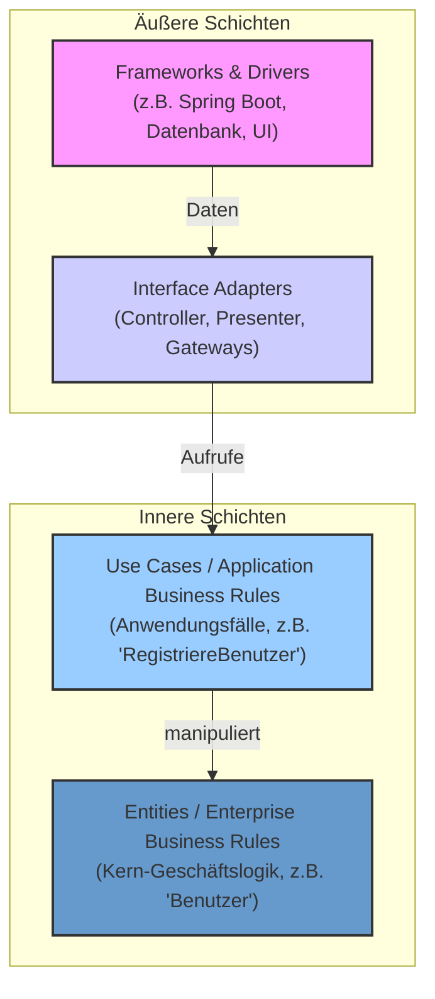

# 2.1. Clean Architecture: Ein Bauplan für wartbare Software

Stellen Sie sich vor, Sie bauen ein Auto. Würden Sie den Motor direkt mit der Karosserie verschweißen? Sicher nicht. Sie würden den Motor auf einem Chassis montieren, die Karosserie daraufsetzen und die Elektronik als separates System installieren. Jede Komponente hat ihren Platz und ihre Aufgabe. Genau dieses Prinzip der **Trennung von Verantwortlichkeiten** verfolgt die Clean Architecture in der Softwareentwicklung.

## 2.1.1. Das "Warum": Probleme von ungeordnetem Code

Haben Sie schon einmal versucht, eine kleine Änderung in einem Projekt vorzunehmen, und plötzlich funktionierten fünf andere, scheinbar unabhängige Dinge nicht mehr? Das ist ein typisches Symptom von **"Spaghetti-Code"** – einem Code-Knäuel, in dem alles mit allem verwoben ist.

> <span style="font-size: 1.5em">:warning:</span> **Achtung: Die Gefahren von Spaghetti-Code**
> *   **Hohe Fehleranfälligkeit:** Eine Änderung an einer Stelle führt zu unerwarteten Fehlern an anderer Stelle (Dominoeffekt).
> *   **Schlechte Wartbarkeit:** Fehler zu finden und zu beheben, wird zu einer langwierigen Detektivarbeit.
> *   **Geringe Flexibilität:** Der Austausch einer Technologie (z.B. eine Datenbank) ist fast unmöglich, da der Code eng mit ihr verknüpft ist.
> *   **Schwierige Testbarkeit:** Einzelne Logik-Teile können nicht isoliert getestet werden, was automatisierte Tests erschwert.
> *   **Langsamer Entwicklungsfortschritt:** Neue Features zu implementieren, dauert immer länger, weil das System immer komplexer und unübersichtlicher wird.

Eine saubere Architektur ist die **Versicherung** gegen diese Probleme. Sie ist eine Investition am Anfang, die sich über die gesamte Lebensdauer des Projekts um ein Vielfaches auszahlt.

## 2.1.2. Die Kernidee: Trennung der Verantwortlichkeiten

Die Clean Architecture, populär gemacht von Robert C. Martin ("Uncle Bob"), organisiert den Code in konzentrischen Schichten, ähnlich einer Zwiebel. Jede Schicht hat eine klar definierte Aufgabe und ist von den anderen entkoppelt.



> <span style="font-size: 1.5em">:mag:</span> **Die Schichten im Detail:**
> 1.  **`Entities` (Der Kern):** Dies ist das Herz Ihrer Anwendung. Hier leben die allgemeinen Geschäftsregeln und -objekte (z.B. ein `User` mit seinen Eigenschaften und Methoden, die immer gelten, egal ob die App im Web oder auf dem Handy läuft). Diese Schicht ist komplett unabhängig von allem anderen.
> 2.  **`Use Cases` (Die Anwendungslogik):** Diese Schicht orchestriert die `Entities`, um spezifische Anwendungsfälle abzubilden (z.B. `RegistriereNeuenBenutzer`, `BerechneBestellsumme`). Sie enthält die Anwendungs-spezifische Geschäftslogik.
> 3.  **`Interface Adapters` (Die Übersetzer):** Diese Schicht ist für die Konvertierung von Daten zuständig. Sie nimmt Daten von den äußeren Schichten (z.B. einem Web-Request) entgegen und bereitet sie für die `Use Cases` auf. Umgekehrt formatiert sie die Ergebnisse aus den inneren Schichten für die Anzeige in der UI. `Controller`, `Presenter` und `Gateways` (Repositories) leben hier.
> 4.  **`Frameworks & Drivers` (Die Außenwelt):** Hier befindet sich alles, was extern ist: die Datenbank, das Web-Framework (wie Spring Boot), das UI-Framework (wie Flutter oder React), etc. Diese Schicht ist am "unwichtigsten", da sie austauschbar sein sollte.

## 2.1.3. Die Abhängigkeitsregel

**Das wichtigste Prinzip der Clean Architecture lautet: Abhängigkeiten zeigen immer nur nach innen.**

Das bedeutet:
*   Die `Use Cases` wissen von den `Entities`, aber die `Entities` wissen nichts von den `Use Cases`.
*   Die `Interface Adapters` wissen von den `Use Cases`, aber die `Use Cases` wissen nichts von den `Interface Adapters`.

> <span style="font-size: 1.5em">:bulb:</span> **Merksatz:** Eine innere Schicht darf niemals den Namen einer Klasse, einer Funktion oder einer Variable aus einer äußeren Schicht erwähnen.

**Wie funktioniert das in der Praxis?** Durch das **Dependency-Inversion-Prinzip** und **Interfaces**, die in der Clean Architecture als **Ports** bezeichnet werden. Die Anwendungslogik (`Use Cases`) definiert, welche "Anschlüsse" sie benötigt, ohne die konkrete Technologie dahinter zu kennen.

Man unterscheidet zwei Arten von Ports:

1.  **Driving Ports (oder Primary Ports):**
    *   **Zweck:** Sie sind die API des Anwendungskerns. Sie definieren, wie die Außenwelt (z.B. ein Web-Controller) mit der Anwendungslogik interagiert.
    *   **Beispiel:** Ein `RegistriereBenutzerUseCase`-Interface.
        *   **Wer definiert es?** Der Anwendungskern (`Use Cases`-Schicht).
        *   **Wer implementiert es?** Der Anwendungskern selbst (z.B. in einer Klasse `RegistriereBenutzerUseCaseImpl`).
        *   **Wer ruft es auf?** Eine äußere Schicht, z.B. der `BenutzerController`, der den Request vom Web-Frontend entgegennimmt. Der Controller "treibt" (`drives`) die Anwendungslogik an.

2.  **Driven Ports (oder Secondary Ports):**
    *   **Zweck:** Sie definieren die Anforderungen des Anwendungskerns an externe Dienste wie Datenbanken, E-Mail-Services oder andere APIs.
    *   **Beispiel:** Ein `BenutzerRepository`-Interface für die Persistenz.
        *   **Wer definiert es?** Der Anwendungskern (`Use Cases`-Schicht), weil er festlegt, welche Datenoperationen er *benötigt* (z.B. `save(user)`, `findById(id)`).
        *   **Wer implementiert es?** Eine äußere Schicht, z.B. eine Klasse `PostgresBenutzerRepository` in der `Infrastructure`-Schicht.
        *   **Wer ruft es auf?** Der Anwendungskern. Er wird von der Implementierung in der äußeren Schicht "getrieben" (`is driven by`).

Durch diesen Mechanismus (Dependency Injection) wird zur Laufzeit die konkrete Implementierung (`PostgresBenutzerRepository`) in den Anwendungskern "injiziert", der aber nur gegen das von ihm definierte Interface (`BenutzerRepository`) arbeitet. So bleibt der Kern vollständig von der Datenbanktechnologie entkoppelt.

## 2.1.4. Praktische Umsetzung im Projekt (Beispiel Spring Boot)

Für unser Spring Boot Backend schlagen wir eine Ordnerstruktur vor, die diese Schichten widerspiegelt. Dies schafft von Anfang an Klarheit und hilft, die Architekturregeln einzuhalten.

```
com.example.projekt
└──
 ├── application // Use Cases & Entities
 │   ├──
 │   ├── usecase // Anwendungsfälle
 │   │   └── benutzer // Feature-bezogen
 │   │       ├── RegistriereBenutzerUseCase.java
 │   │       └── ...
 │   ├──
 │   ├── domain // Entities
 │   │   ├── model
 │   │   │   └── Benutzer.java
 │   │   └── port // Interfaces für die äußeren Schichten
 │   │       └── BenutzerRepository.java
 │   
 └── infrastructure // Interface Adapters & Frameworks
     ├──
     ├── web // Controller (Interface Adapter)
     │   └── benutzer
     │       └── BenutzerController.java
     ├──
     ├── persistence // Gateways (Interface Adapter)
     │   └── postgres
     │       ├── PostgresBenutzerRepository.java
     │       └── ...
     └──
     └── config // Konfiguration (Frameworks & Drivers)
         └── DependencyInjectionConfig.java
```

> <span style="font-size: 1.5em">:mag:</span> **Struktur erklärt:**
> *   **`application`**: Enthält den stabilen Kern der Anwendung (`domain`) und die Anwendungslogik (`usecase`). Dieser Teil sollte sich selten ändern.
> *   **`infrastructure`**: Enthält die "flüchtigen" Teile, die sich oft ändern oder von externen Faktoren abhängen, wie die Web-Schnittstelle (`web`) oder die Datenbankanbindung (`persistence`).

Diese Struktur ist nicht in Stein gemeißelt, aber sie bietet einen exzellenten Ausgangspunkt, um die Prinzipien der Clean Architecture von Beginn an konsequent umzusetzen.
